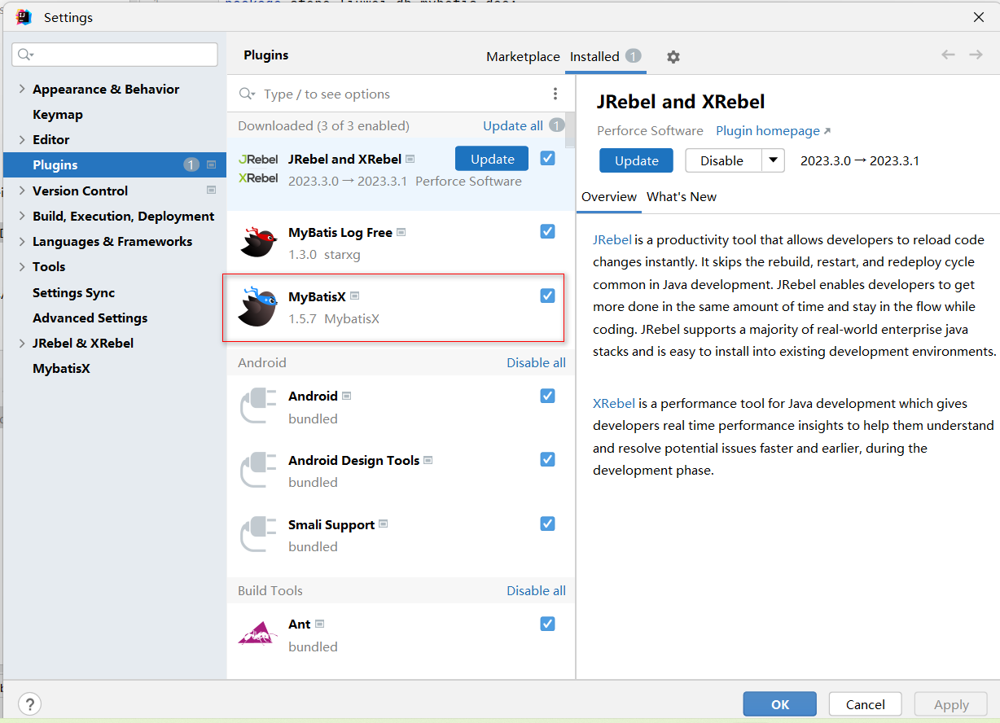
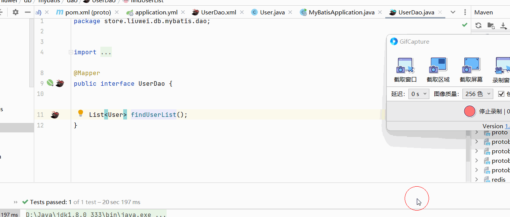
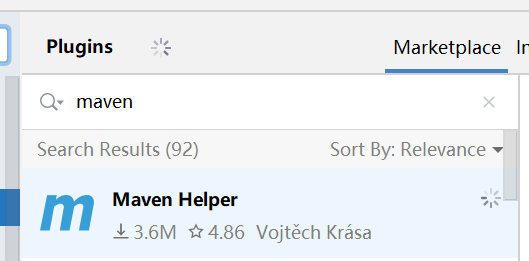
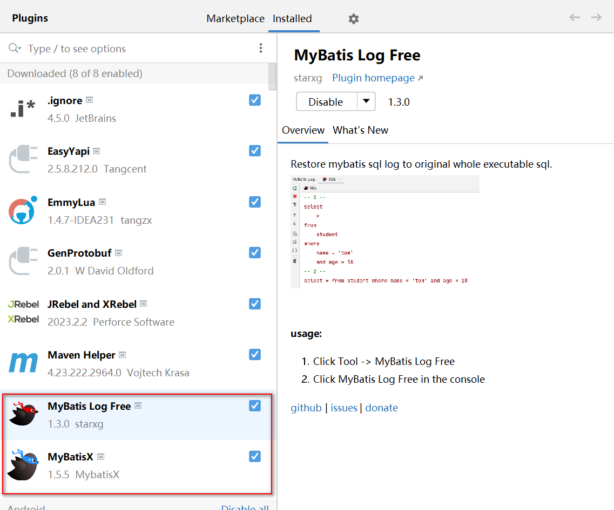

资料来源：

[这款 IDEA 插件太好用了，堪称日志管理神器！](https://mp.weixin.qq.com/s/pfa5mJmAETJoxwdxIqBpXA)

[Idea热加载插件JRebel激活及使用教程](https://blog.csdn.net/qq_42263280/article/details/128888312)

## idea插件

### mybatis 接口和xml 关联



使用效果



### mybatis 日志


Installed安装之后重启，点击上方的Tools就能看到


### JRebel

在 Java 开发领域，热部署一直是一个难以解决的问题，目前的 Java 虚拟机只能实现方法体的修改热部署，例如使用devtool来实现热部署，但是在功能上它也有所限制，如果新增方法或者修改方法参数后，热部署是不生效的。因此对于整个类的结构修改，仍然需要重启虚拟机，对类重新加载才能完成更新操作。对于某些大型的应用来说，每次的重启都需要花费大量的时间成本。

因此，在这里为大家带来一款Idea集成的热加载插件-JRbel。但是这个插件是需要收费的，故在这里为大家带来激活使用的详细教程，手把手教学一波。亲测可用！

#### Jrbel插件下载
首先在Idea中找到setting->plugins，在MarketPlace中搜索该插件。


点击“应用”后，按要求重启一下Idea，使下载的Jrebel插件生效。

这个时候在Idea主界面侧边栏上就有Jrebel的安装指南出现了。


然后我们根据Jrebel的安装指南进行安装即可。

#### 激活Jrebel

安装第一步就需要对Jrebel进行激活，这里笔者推荐第一种激活方式。


然后我们需要配置license server地址，这里我们通过一个JrebelBrainsLicenseServerforJava的激活jar包来实现，通过将jar包放在服务器上运行，然后就可以通过我们自己的服务器来作为license server地址了

下载地址：

```
下载:https://jinlilu.lanzoum.com/iHMG110q1p8h 密码:6g3h
```


打开后是这样的，等着就行不要关掉


如果放在服务器上，特别是腾讯云，阿里云之类的，记得开放服务器防火墙，安全组策略以及Linux系统防火墙上的1008端口。没有服务器也不要紧，用自己电脑也可。只不过不能一直把jar包运行着。

在线生成一个GUID

https://www.guidgen.com/

http://www.ofmonkey.com/transfer/guid

复制出来 填到地址后面


比如

```
http://localhost:8888/0f1e21ef-c04a-4091-95d9-a27d46537744
```


但是到这还没完，虽然现在 Jrebel就能正常使用了，但很多人往往用不到几天就提示激活失败, 无法使用了，甚至jar包结束运行后激活就失败了。原因在于Jrebel激活之后默认是联网使用的 , 在该模式下 , Jrebel会一直联网监测激活信息。所以要调为离线使用的，操作方法就是进入Jrebel设置中点击Work offile 按钮即可。使其变为离线模式即可。


**激活成功！**


这样激活就算彻底完成了。

但是这时候仅仅这点配置，功能还是不能正常使用的。还需要我们在Idea中设置自动编译。

配置自动编译
找到setting->build,Excution->Compiler,并勾选Build project automatically。


然后找到setting->Advanced Setting，勾选Compiler中的

Allow auto-make to start even if developed application is currently running

这里笔者是基于idea2022版本配置的，基本上配置完成就可以了。


#### 本地热部署使用

配置完Jrebel后，如果在本地使用，可以通过Idea界面左下角的Jrenel面板对自己的项目进行设置即可。


左侧的图标对应的本地热部署，右侧的对应远程热部署。

> 勾选成功后项目或者模块中的src/resource目录下回生成一个rebel.xml文件

主启动类，和运行栏也会出现Jrebel运行的图标。


如果发现启动后部分更新效果并没有，也可尝试在启动类上配置一下更新资源的配置。


都配置好了以后，可以先试一下，第一次运行要重新编译，打包，执行。如果不生效可以重启一次idea, 一般来讲重启后都可以生效。

#### 使用效果

修改代码中的内容，自动加载


### maven help

1、File→Settings→Plugins，输入maven helper，本地没搜到，就可以点击Search in repositories（或直接点击Browse repositories进入搜索），搜到Maven Helper后选择Install进行安装即可，安装后需重启IDEA。



**使用方法：**

1、安装完后，pom文件下方就会出现Dependency Analyzer面板。可以查看依赖冲突，也可以搜索相关依赖，进入后效果如下：


### mybatis



`Mybatis Log Free` 可以把日志中的打印的sql日志，合并输出