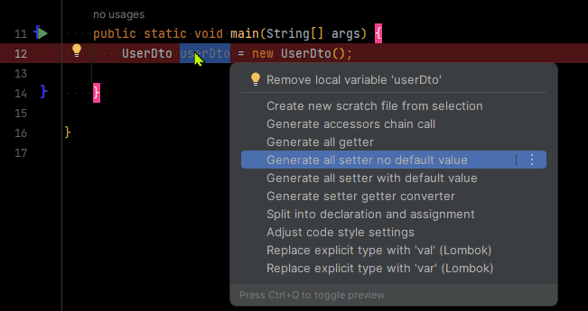
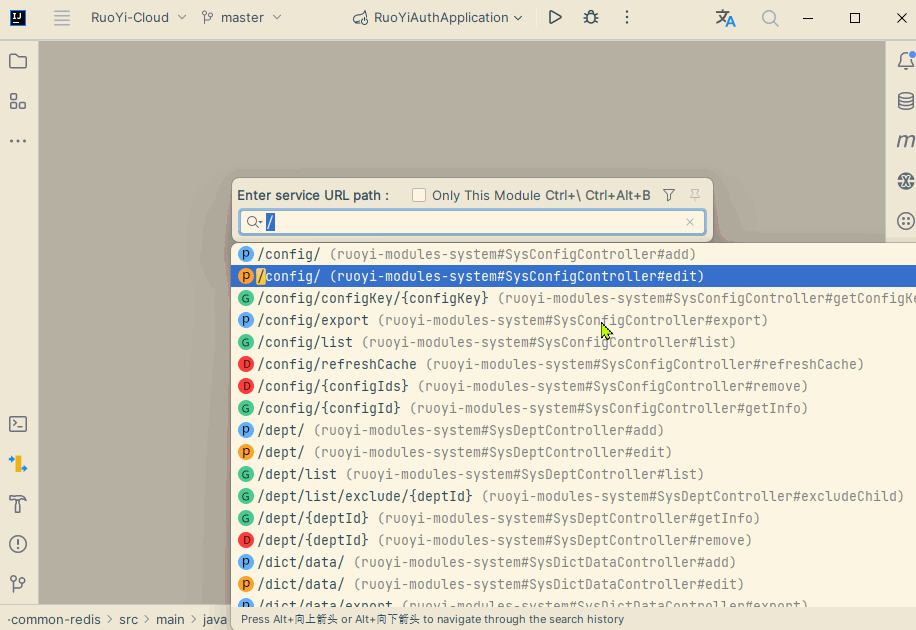

资料来源：<br/>
[这款 IDEA 插件太好用了，堪称日志管理神器！](https://mp.weixin.qq.com/s/pfa5mJmAETJoxwdxIqBpXA)<br/>
[Idea热加载插件JRebel激活及使用教程](https://blog.csdn.net/qq_42263280/article/details/128888312)<br/>
[IntelliJ IDEA好用插件推荐之（一）：Grep Console](https://blog.csdn.net/xutong_123/article/details/128311026)<br/>
[IDEA 插件推荐](https://blog.csdn.net/objectness/article/details/129246104)

## idea插件

### mybatis 接口和xml 关联


使用效果


### mybatis 日志


Installed安装之后重启，点击上方的Tools就能看到


### JRebel

在 Java 开发领域，热部署一直是一个难以解决的问题，目前的 Java 虚拟机只能实现方法体的修改热部署，例如使用devtool来实现热部署，但是在功能上它也有所限制，如果新增方法或者修改方法参数后，热部署是不生效的。因此对于整个类的结构修改，仍然需要重启虚拟机，对类重新加载才能完成更新操作。对于某些大型的应用来说，每次的重启都需要花费大量的时间成本。

因此，在这里为大家带来一款Idea集成的热加载插件-JRbel。但是这个插件是需要收费的，故在这里为大家带来激活使用的详细教程，手把手教学一波。亲测可用！

#### Jrbel插件下载
首先在Idea中找到setting->plugins，在MarketPlace中搜索该插件。


点击“应用”后，按要求重启一下Idea，使下载的Jrebel插件生效。

这个时候在Idea主界面侧边栏上就有Jrebel的安装指南出现了。


然后我们根据Jrebel的安装指南进行安装即可。

#### 激活Jrebel

安装第一步就需要对Jrebel进行激活，这里笔者推荐第一种激活方式。


然后我们需要配置license server地址，这里我们通过一个JrebelBrainsLicenseServerforJava的激活jar包来实现，通过将jar包放在服务器上运行，然后就可以通过我们自己的服务器来作为license server地址了

下载地址：

```
下载:https://jinlilu.lanzoum.com/iHMG110q1p8h 密码:6g3h
```


打开后是这样的，等着就行不要关掉


如果放在服务器上，特别是腾讯云，阿里云之类的，记得开放服务器防火墙，安全组策略以及Linux系统防火墙上的1008端口。没有服务器也不要紧，用自己电脑也可。只不过不能一直把jar包运行着。

在线生成一个GUID

https://www.guidgen.com/

http://www.ofmonkey.com/transfer/guid

复制出来 填到地址后面


比如

```
http://localhost:8888/0f1e21ef-c04a-4091-95d9-a27d46537744
```


但是到这还没完，虽然现在 Jrebel就能正常使用了，但很多人往往用不到几天就提示激活失败, 无法使用了，甚至jar包结束运行后激活就失败了。原因在于Jrebel激活之后默认是联网使用的 , 在该模式下 , Jrebel会一直联网监测激活信息。所以要调为离线使用的，操作方法就是进入Jrebel设置中点击Work offile 按钮即可。使其变为离线模式即可。


**激活成功！**


这样激活就算彻底完成了。

但是这时候仅仅这点配置，功能还是不能正常使用的。还需要我们在Idea中设置自动编译。

配置自动编译
找到setting->build,Excution->Compiler,并勾选Build project automatically。


然后找到setting->Advanced Setting，勾选Compiler中的

Allow auto-make to start even if developed application is currently running

这里笔者是基于idea2022版本配置的，基本上配置完成就可以了。


#### 本地热部署使用

配置完Jrebel后，如果在本地使用，可以通过Idea界面左下角的Jrenel面板对自己的项目进行设置即可。


左侧的图标对应的本地热部署，右侧的对应远程热部署。

> 勾选成功后项目或者模块中的src/resource目录下回生成一个rebel.xml文件

主启动类，和运行栏也会出现Jrebel运行的图标。


如果发现启动后部分更新效果并没有，也可尝试在启动类上配置一下更新资源的配置。


都配置好了以后，可以先试一下，第一次运行要重新编译，打包，执行。如果不生效可以重启一次idea, 一般来讲重启后都可以生效。

#### 使用效果

修改代码中的内容，自动加载


#### JRebel启动慢

更新新版JRebel后，启动卡住无法正常启动项目
Disconnected from the target VM, address: ‘127.0.0.1:58166’, transport: ‘socket’

解决方式
降低版本： 降到什么版本自行测试；
修改idea配置： 根据插件官网回复，问题是由IntelliJ的默认配置的变化引起的，暂时可通过以下配置进行处理：
1/ Open Settings 2/ Open “Languages and Frameworks” 3/ Select “Reactive Streams” 4/ Within the “Debugger” section, chose “None”


###  在线激活 （推荐）

资料来源：[Jrebel 最新的 2024.3.0 激活方法](https://blog.csdn.net/qq251708339/article/details/134105044)

#### 问题:

- 用新不用旧，老版的插件连最新的springboot3 都不支持
- 激活服务器提示： Ls client not configured

#### 解决方法:

- 1. 访问： https://www.jpy.wang/page/jrebel.html


2.在jrebel激活的时候填写相应的地址


### maven help

1、File→Settings→Plugins，输入maven helper，本地没搜到，就可以点击Search in repositories（或直接点击Browse repositories进入搜索），搜到Maven Helper后选择Install进行安装即可，安装后需重启IDEA。


**使用方法：**

1、安装完后，pom文件下方就会出现Dependency Analyzer面板。可以查看依赖冲突，也可以搜索相关依赖，进入后效果如下：


### mybatis


`Mybatis Log Free` 可以把日志中的打印的sql日志，合并输出

### MybatisLogFormat

在使用idea开发的过程中，查询语句会遇到以下sql


```tex
Creating a new SqlSession
SqlSession [org.apache.ibatis.session.defaults.DefaultSqlSession@648639f1] was not registered for synchronization because synchronization is not active
JDBC Connection [com.alibaba.druid.proxy.jdbc.ConnectionProxyImpl@fbc1de9] will not be managed by Spring
==>  Preparing: SELECT id,name,province_code FROM t_province WHERE (province_code = ? AND name = ?) limit 1
==> Parameters: 110000(String), 北京市(String)
<==    Columns: id, name, province_code
<==        Row: 1, 北京市, 110000
<==      Total: 1
Closing non transactional SqlSession [org.apache.ibatis.session.defaults.DefaultSqlSession@648639f1]
```

此时如果想得到完成的sql,就需要将上面的带占位符的sql拷贝出来，

```sql
SELECT id,name,province_code FROM t_province WHERE (province_code = ? AND name = ?) limit 1

```

然后再去找到Parameters那一段。

Parameters: 110000(String), 北京市(String)

将sql中的？依次替换Parameters中的实参，就能得到完整的sql了，看似这个很简单，但是如果sql中参数很多，这个时候再用这种方法就很容易出错了。

下面介绍下idea的插件，在
Settings/Plugins/Marketplace中输入 MybatisLogFormat，然后选择安装，下图是我安装过的。


下载安装好重启后，选择sql语句和Parameters参数对应的行，然后右键点击
MybatisLogFormat2Clipboard。


此时一条美化后的sql就可以直接执行了，格式如下


用了这个插件后，如果需要把sql拿出来到客户端执行分析，效率就大大提升了。

### 日志插件


**方法一：settings->Other Settings->Grep Console，在右边窗口中自定义你想要的效果**


**方法二：启动项目后在日志输出控制台右击，再点击Open Grep Console Settings进入** 


 **方法三：点击IDEA Tools -> Grep Console，点击 Grep Console进入**


设置完成后，你可以通过代码日志输出测试一下效果

**下面例子我通过设置warn/error的背景色，使得输出更直观：**


```java
public class GrepConsole {
 
    public static void main(String[] args) {
        Logger logger = LoggerFactory.getLogger(GrepConsole.class);
        logger.info("*****info*****");
        logger.warn("*****warn*****");
        logger.error("*****error*****");
    }
}
```


通过增加Grep条件，过滤你想要的日志：


###  CodeGlance

再也不用疯狂拖拽到底去找一遍啦，多不方便呀，使用此插件可以查看缩略图一样，快速切换到自己需要去的地方~


### GenerateAllSetter（快速生成对象所有set方法）



### GsonFormatPlus：json转实体

Alt + ins(*Ins*ert)或者Alt + S打开窗口粘贴需要转换成实体的json字符串


### Json Prase（JSON数据格式化工具）

安装之后在IDEA右侧工具栏会生成"Json Parser"快捷方式，点击即可调出工具窗口，将JSON数据输入上方框内点击"Parse"即可进行格式化，比用在线工具网站方便。


### GitToolBox（跟踪每行代码的提交修改记录）


### RestfulToolkitX（找到controller+快捷请求接口）

新版本的idea可能用不了，作者因该不维护了，网上有人基于这个插件开发了新的插件可以搜索RestfulTool 快捷键 Ctrl + Alt + /

根据url找对应action方法，根据url跳转，Ctrl + \或者Ctrl+Alt+N即可快速定位接口位置，比用IDEA的全局搜索效率高。




### HighlightBracketPair(括号匹配高亮显示)

括号匹配高亮显示，你鼠标所在代码所处的括号会标亮，可以方便我们再复杂、繁多的代码结构中清晰的查看到当前所在的代码层级，十分有用。


## 提交自动生成

