资料来源：<br/>
[显示git修改过的文件列表](https://blog.csdn.net/qq_39595769/article/details/123022114)<br/>
[IDEA 2020.1一些简单的面板、菜单栏介绍](https://blog.csdn.net/weixin_44542781/article/details/116559686)<br/>
[如何解决IDEA控制台Tomcat日志输出中文乱码的问题](https://blog.csdn.net/xutong_123/article/details/124347363)

## idea显示git

### 方法一

可以进入Settings/[Preferences](https://so.csdn.net/so/search?q=Preferences&spm=1001.2101.3001.7020)/Version Control/Commit将Use non-modal commit interface取消勾选


)

结果如下，Local Changes标签页又回来了～

)

我这边还暂时不想改，就这样用，以后不方便的时候再改。

 也可以直接找出来

### 方法二

)

我的在左边的[导航条](https://so.csdn.net/so/search?q=导航条&spm=1001.2101.3001.7020)中，就先这样用着不方便的时候再改

)

### 设置编码集合

)

### 设置外观

)


### 修改代码提示配置

)

### 修改背景颜色


自动导入jar

)

需要勾选中这两个

### 自动导入jar

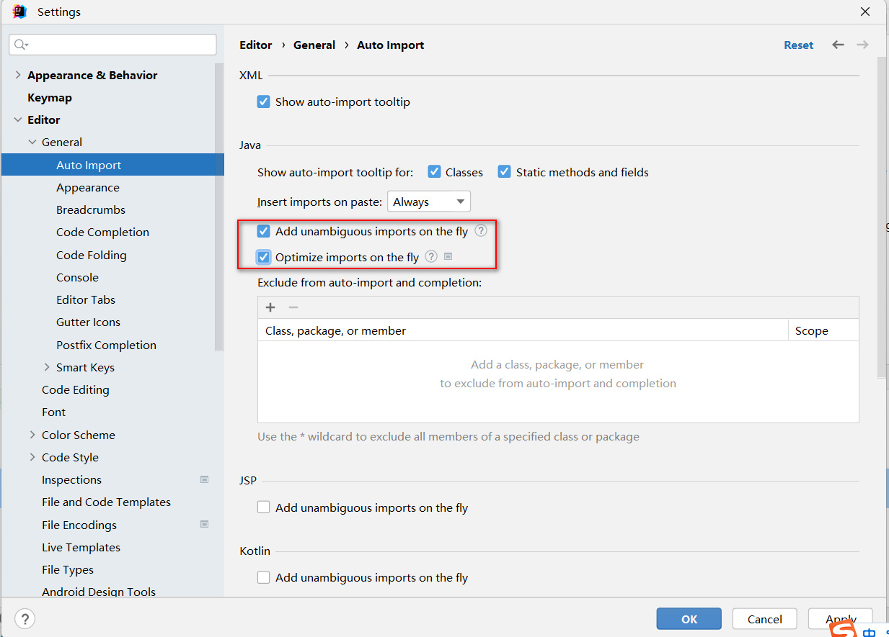

勾选这两个，可以自动导入jar包

## idea视图

我分享是关于IDEA一些简单的面板、菜单栏介绍，我们下载安装的IDEA打开使用都是英文，这对于我们来说没那么方便，IDEA他在发布的2020.1版本，官方开始支持中文，但是它没有汉化完毕，汉化后的Maven配置选项是有问题的，所以并不推荐大家使用，我就给大家分享一些简单的面板和菜单栏介绍。
一、面板说明
IDEA面板的全貌如下图


（图中右侧工具框有点小失误，有两个Maven构建，这里是不小心打错，第二个是Ant构建）
二、菜单栏
下面会简单介绍下一些常用的部分菜单使用，。
(1)、File文件


Tool Windows：一些工具窗口


Appearance：外观
Toolbar：工具栏（显示/关闭）


Tool Window Bars：工具按钮（IDEA左右和底部的工具框）显示/关闭
Status Bar：IDEA右下角的状态栏


### 修改代码提示配置

把配置修改成任意匹配，这样开发效率更高

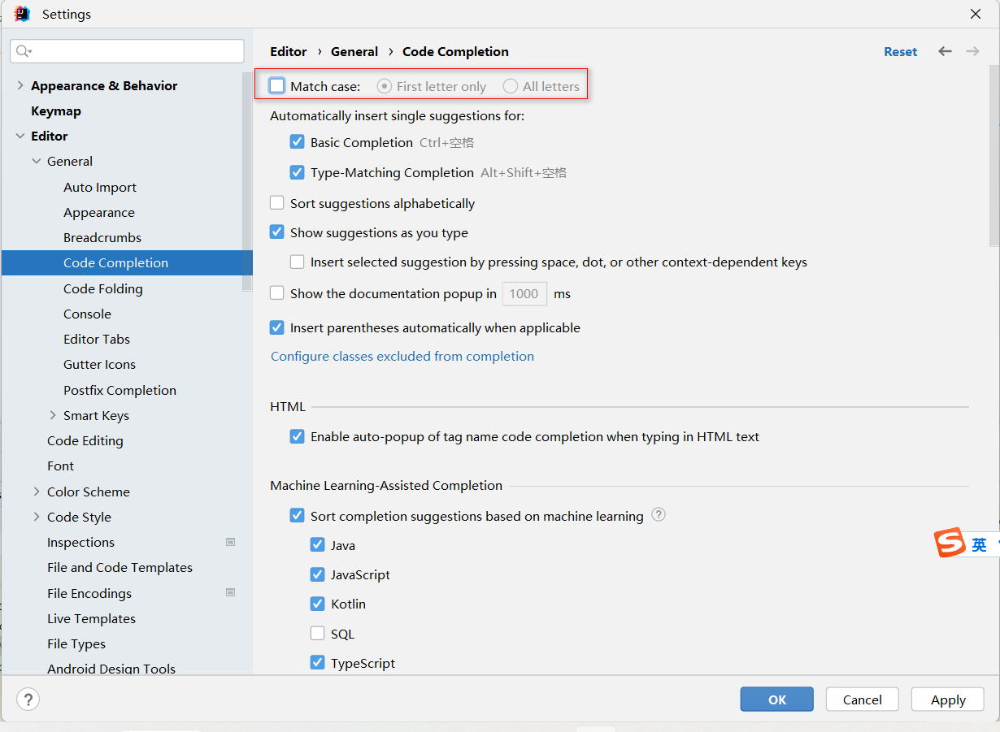

### 中文乱码问题

工作中有些项目需要我们自己本地部署tomcat，经常会遇到在控制台输出中文乱码的问题，

如下所示：

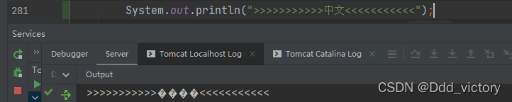

看了很多文档都过于繁琐，还不能解决实际问题。主要原因是没抓到问题的重点。

**解决办法如下：**

只需要在Tomact服务配置的启动参数加入

````java
-Dfile.encoding=UTF-8
````

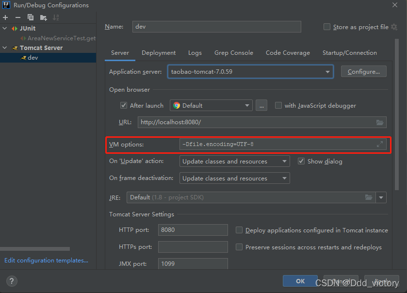

重新启动服务，测试结果如下，已经正常显示中文了：

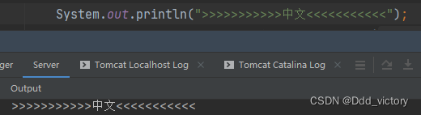


### Idea多行显示

显示效果

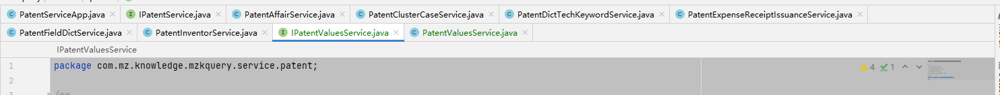

选择多行显示

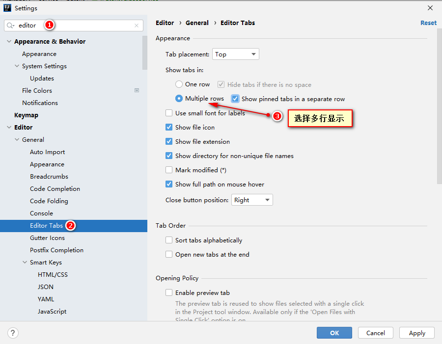


## idea 卡顿

> 现在越来越多的人投入了 `IntellIJ Idea` 的怀抱, 它给我们的日常开发带来了诸多便利, 但是由于对它的不熟悉, 导致很多时候需要某些设置却不知道怎么去哪里设置, 比如, 在我们导入大项目时, `IntellIJ Idea` 向我们抛出了一个 `OutOfMemoryError` 内存不足, 我们应该怎么设置呢?

##### 1. 打开内存显示

- 打开 **设置Settings**
- 选择 `Appearance & Behavior` 下的 `Appearance`
- 找到 `Windows Options`
- 选中里面的 `Show memory indicator`
- 点击 `OK`
- 内存使用情况会展示在 `IDEA` 的右下角
- `IDEA` 的默认最大内存为 **750M**

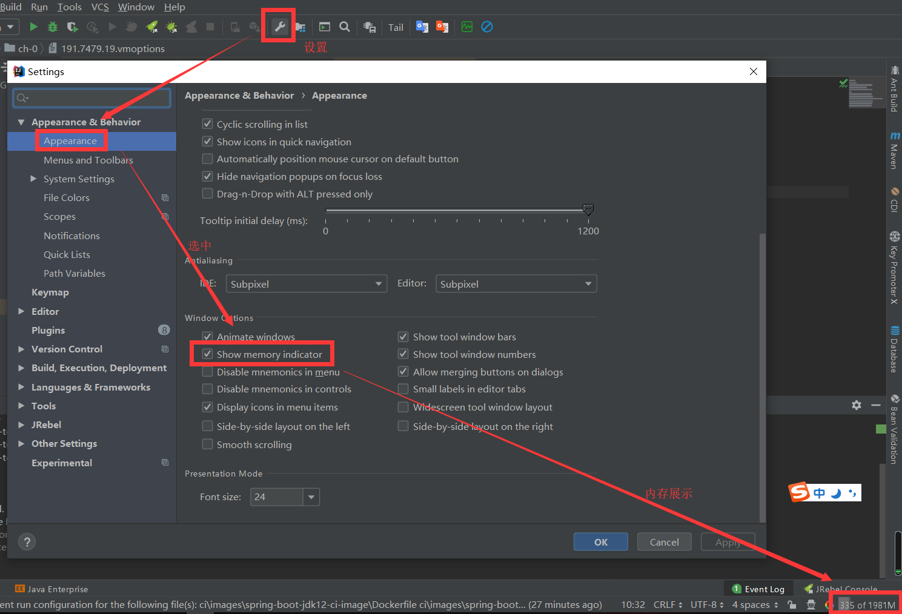

##### 2. 在`IDEA`中设置内存

- 选择 **Help**
- 选择 `Diagnostic`
- 选择 `Change memory settings`

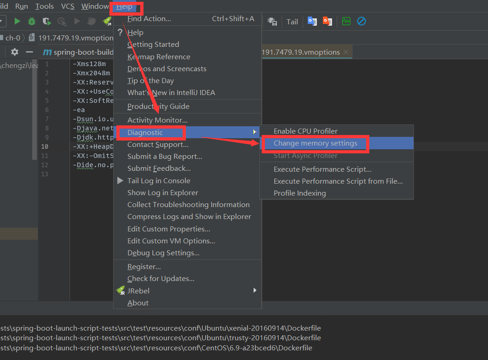

- 在弹出的设置框中 **修改** 内存大小, 默认750M
- 下面有显示此设置所在配置文件和路径,当前内存值,根据情况酌情修改
- 配置文件一般都在 `IntellIJ Idea`安装目录下`bin/idea.vmoptions`
- 根据`eclipse`设置的经验这个内存并不是设置的越大越好
- 有时间的可以自己测试一下告诉大家多少最合适.
- 我的机器是24G的,设置1024M和2048M都没有问题

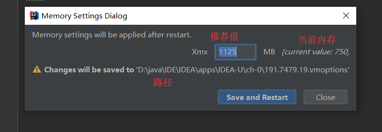

##### 3. 在`IDEA`中打开内存的设置文件

- 你也可以在配置文件里面修改内存大小
- 选择 **Help**
- 选择 `Edit Custom VM Options...` 会打开配置文件

````
-Xms128m
-Xmx750m  # 设置最大内存
-XX:ReservedCodeCacheSize=240m
-XX:+UseConcMarkSweepGC
-XX:SoftRefLRUPolicyMSPerMB=50
-ea
-Dsun.io.useCanonCaches=false
-Djava.net.preferIPv4Stack=true
-Djdk.http.auth.tunneling.disabledSchemes=""
-XX:+HeapDumpOnOutOfMemoryError
-XX:-OmitStackTraceInFastThrow
-Dide.no.platform.update=true
````

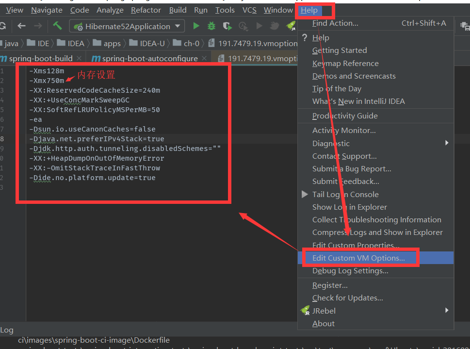

##### 4. `JetBrains ToolBox` 中安装 `IntellIJ Idea`配置文件位置

> `JetBrains ToolBox`是一个软件盒子, 我们可以从里面直接安装`IntellIJ Idea`, 还能进行更新.
> 在`JetBrains ToolBox` 中安装 `IntellIJ Idea`内存配置的文件有两个位置:
>
> > 一个是`IntellIJ Idea`安装目录下`bin/idea.vmoptions`, 这个配置文件修改是不起作用的
>
> > 另一个配置文件在`IntellIJ Idea`的安装目录同级目录下,`IntellIJ Idea`的安装目录名称为版本号命名,配置文件为 `191.7479.19.vmoptions`