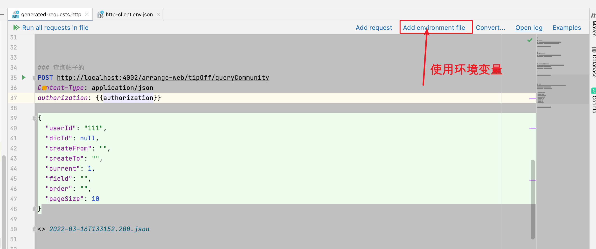

## httpClient

资料来源

[官网](https://www.jetbrains.com/help/idea/http-client-in-product-code-editor.html)

[Idea自带http测试功能真香](https://blog.csdn.net/heshuncheng/article/details/107709913)

### 简介

在工作中接触的大多数项目都采用前后端分离方式，常用postman免费版来进行api接口测试。

> postman缺点：<br/>
> 1.无法保存测试脚本到文件，不方便前端查看。<br/>
> 2.需要下载单独安装包安装到系统中。<br/>

使用举例


## 简单使用

### 发送get请求

~~~~
### GET request with a header
GET https://httpbin.org/ip
Accept: application/json

### GET request with parameter
GET https://httpbin.org/get?show_env=1
Accept: application/json

### GET request with environment variables
GET {{host}}/get?show_env={{show_env}}
Accept: application/json

### GET request with disabled redirects
# @no-redirect
GET http://httpbin.org/status/301

### GET request with dynamic variables
GET http://httpbin.org/anything?id={{$uuid}}&ts={{$timestamp}}
~~~~

### 发送POST请求

````
### Send POST request with json body
POST https://httpbin.org/post
Content-Type: application/json

{
  "id": 999,
  "value": "content"
}

### Send POST request with body as parameters
POST https://httpbin.org/post
Content-Type: application/x-www-form-urlencoded

id=999&value=content

### Send a form with the text and file fields
POST https://httpbin.org/post
Content-Type: multipart/form-data; boundary=WebAppBoundary

--WebAppBoundary
Content-Disposition: form-data; name="element-name"
Content-Type: text/plain

Name
--WebAppBoundary
Content-Disposition: form-data; name="data"; filename="data.json"
Content-Type: application/json

< ./request-form-data.json
--WebAppBoundary--

### Send request with dynamic variables in request's body
POST https://httpbin.org/post
Content-Type: application/json

{
  "id": {{$uuid}},
  "price": {{$randomInt}},
  "ts": {{$timestamp}},
  "value": "content"
}

````

### 认证请求

~~~~
### Basic authorization.
GET https://httpbin.org/basic-auth/user/passwd
Authorization: Basic user passwd

### Basic authorization with variables.
GET https://httpbin.org/basic-auth/user/passwd
Authorization: Basic {{username}} {{password}}

### Digest authorization.
GET https://httpbin.org/digest-auth/realm/user/passwd
Authorization: Digest user passwd

### Digest authorization with variables.
GET https://httpbin.org/digest-auth/realm/user/passwd
Authorization: Digest {{username}} {{password}}

### Authorization by token, part 1. Retrieve and save token.
POST https://httpbin.org/post
Content-Type: application/json

{
  "token": "my-secret-token"
}

> 

### Authorization by token, part 2. Use token to authorize.
GET https://httpbin.org/headers
Authorization: Bearer {{auth_token}}

~~~~

### 测试响应

```
### Successful test: check response status is 200
GET https://httpbin.org/status/200

> 

### Failed test: check response status is 200
GET https://httpbin.org/status/404

> 

### Check response status and content-type
GET https://httpbin.org/get

> 

### Check response body
GET https://httpbin.org/get

> 
```

## 实际使用

### 添加环境变量

通过选择添加环境后，生一个http-client.env.json文件，可以配置环境变量



我自己配置的local环境

```
{
  "local": {
    "server": "localhost:4002",
    "authorization": "06f2165baa7047b9bd8a272f0f3c927d"
  }
}
```

### 测试举例

