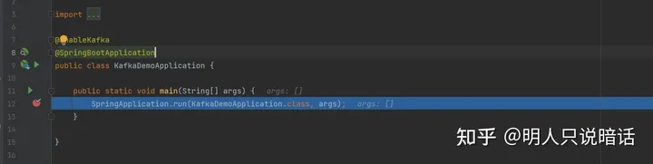
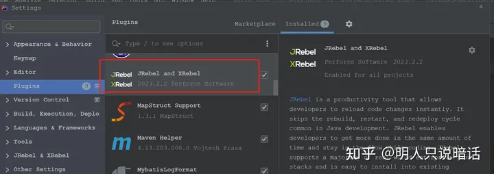
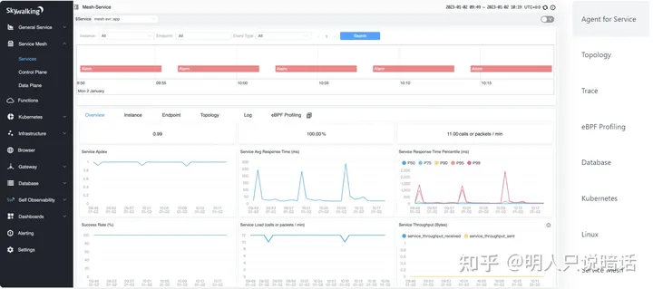
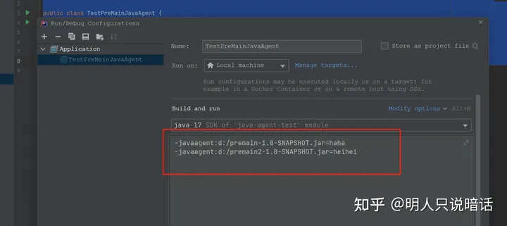
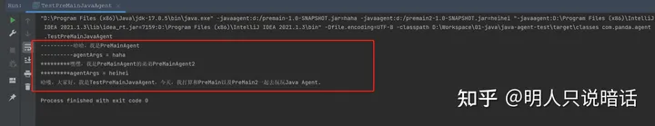
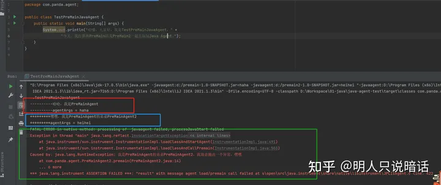
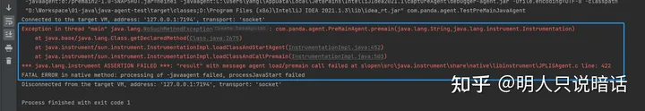
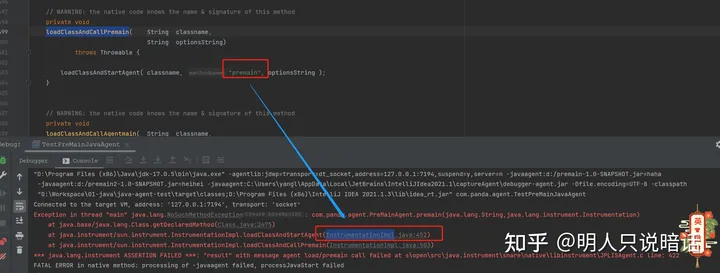
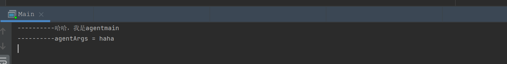
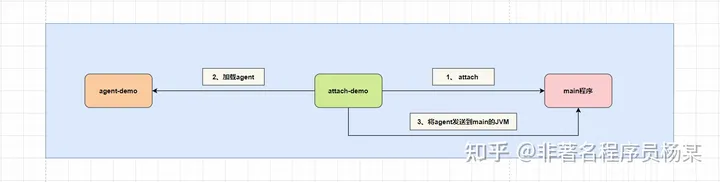

资料来源：<br/>
[一文讲透Java Agent是什么玩意？能干啥？怎么用？](https://zhuanlan.zhihu.com/p/636603910)


## 一文讲透Java Agent是什么玩意？

本文比较枯燥，谨慎阅读。

公司打算搭建一个分布式链路追踪系统，经过一段时间的调研和技术选型，最终确定以Skywalking为主搭建分布式链路追踪系统，用于监测公司内各个应用的运行情况。

Skywalking是一个开源的可观测平台，其采用Java Agent（字节码技术，也称为Java代理、Java探针），主要用于收集、分析、聚合和可视化来自应用服务的数据，实现对应用的观察和监控。

本着知其然知其所以然的原则，先了解一下Java Agent技术机制。

###  Java Agent 产生的背景
使用IDEA进行DEBUG（本地和远程），应该是每个开发人员必备且经常使用的技能。

我们可以在DEBUG时调试应用，在JVM进程运行期间获取应用运行的JVM信息、变量信息等等。哪怕需要正在生产环境运行期间的JVM中的数据，也可以通过JDK自带的Jmap、Jstack等工具获取。

JVM的设计人员很聪明，在JVM设计之初，他们就考虑了虚拟机状态监控、DEBUG、线程和内存分析等功能。

在JDK1.5之前，JVM规范定义了JVMPI（Java Virtual Machine Profiler Interface）语义，JVMPI提供了一批JVM分析接口。

>  JVMPI 可以监控就JVM发生的各种事件，比如，JVM创建、关闭、Java类被加载、创建对象或GC回收等37种事件。

除了JVMPI ，JVM规范还定义了JVMDI（**Java Virtual Machine Debug Interface**）语义，JVMDI提供了一批JVM调试接口。

JDK 1.5及之后的版本将JVMPI和JVMDI合二为一，形成了一套JVM语义——JVMTI（JVMTM Tool Interface），包括JVM 分析接口和JVM调试接口。

JVMTI 是开发和监控工具使用的编程接口，它提供了一种方法，用于检查状态和控制在Java 虚拟机（VM）中运行的应用程序的执行。

JVMTI旨在为需要访问VM状态的所有工具提供VM接口，包括但不限于：评测、调试、监视、线程分析和覆盖率分析工具。

[有兴趣的朋友可以参考官方文档：](https://docs.oracle.com/en/java/javase/20/docs/specs/jvmti.html)

说了这么多云里雾里，也不知道说的到底啥意思。

简单来说，JVMTI是一套JVM制定的规范，在不同的JVM中实现方式也不一定都一样。JVMTI提供的是Native API调用方式（即大家更熟知的JNI调用方式）。

JVMTI接口用C/C++语言来暴露Native API，并最终以动态链路库的形式被JVM加载并运行。

在Java Agent 问世之前，苦逼的开发人员只能通过JVMTI的Native API调用方式完成代码的动态侵入，非常的繁琐、不友好，而且门槛有点高。

因此，在JDK1.5版本以后，JVM提供了Java Agent技术来解决上述痛点。

### Java Agent 是什么玩意
在JDK 1.5之后，JVM提供了探针接口（Instrumentation接口），便于开发人员基于Instrumentation接口编写Java Agent。

但是，Instrumentation接口底层依然依赖JVMTI语义的Native API，相当于给用户封装了一下，降低了使用成本。

在JDK 1.6及之后的版本，JVM又提供了Attach接口，便于开发人员使用Attach接口实现Java Agent。和Instrumentation接口一样，Attach接口底层也依赖JVMTI语义的Native API。

简而言之，Java Agent可以理解为是一种特殊的Java程序，是Instrumentation接口的客户端。

与普通Java程序通过main方法启动不同，Java Agent并不是一个可以单独启动的程序，它必须依附在一个Java应用程序（JVM）上，与主程序运行在同一个JVM进程中，通过Instrumentation 接口与JVM进行交互。

Java Agent提供了一种在加载字节码时对字节码进行修改的能力，有两种执行方式：

**一、在应用运行之前，通过premain()方法来实现「在应用启动时侵入并代理应用」，这种方式是利用Instrumentation接口实现的；**

**二、在应用运行之后，通过Attach API和agentmain()方法来实现「在应用启动后的某一个运行阶段中侵入并代理应用」，这种方式是利用Attach接口实现的。**

下面介绍通过`Instrumentation`接口和`premain()`方法，以及通过`Attach`接口和`agentmain()`方法使用`Java Agent`的方法。

基于 `Instrumentation `接口和`premain()`方法实现`Java Agent`
通过JVM参数`「-javaagent:*.jar」`启动应用。

应用在启动时，会优先加载`Java Agent`，并执行`premain()`方法，这时部分的类都还没有被加载。

此时，可以实现对新加载的类进行字节码修改，但如果`premain()`方法执行失败或者抛出异常，则`JVM`会被终止，这太蛋疼了。

基于` Attach` 接口和`agentmain()`方法实现`Java Agent`
通过JVM参数`「-javaagent:*.jar」`启动应用之后，可以通过`Java JVM` 的`Attach`接口加载`Java Agent`。

`Attach` 接口其实是`JVM`进程之间的沟通桥梁，底层通过Socket进行通信，JVM A可以发送指令给`JVM B`，`JVM B`在收到指令之后执行相应的逻辑。

比如，在命令行中经常使用的`Jstack、Jcmd、Jps`等，都是基于这种机制实现的。

`Java Agent`的使用场景
`Java Agent`有着广泛的使用场景，下面列出几个常见的应用场景。


### 调试代码

上面说过通过IDE（Intellij Idea和Eclipse）调试代码示程序员必备技能之一，通过IDEA调试代码就是基于Java Agent技术实现的。



### 热部署

所谓热部署，是指在应用运行时在线升级软件，而不需要重启应用。

这样非常的方便，尤其是在我们调试功能时，突然发现一个小BUG，随手改动之后，通过热部署工具，不需要重启应用就可以使得刚修改的代码实时生效。

这大大节约我们启动应用的时间。

热部署能够帮助开发者减少频繁编译重启应用的次数，节省碎片化的时间。

常见的热部署工具有Intellij Idea的HotSwap和Jrebel。



### 在线诊断

当线上环境出现问题时，我们需要尽早定位到问题，修复问题，以减轻损失。

但是，线上环境不是我们想停就停的，借助热部署工具，我们可以在不修改应用代码的情况下，对业务问题进行诊断，包括查看方法调用的出入参、异常，监测方法执行耗时，类加载信息等，大大提升线上问题排查效率。

`Arthas`就是一款非常优秀的Java在线诊断工具。


### 性能分析

应用的性能分析也是日常工作必不可少的一环，平时可以预防问题，一旦出现问题，可以通过性能分析工具判断是否是性能出现问题。

TProfiler就是一款优秀的性能分析工具， 可以在生产环境长期使用的性能分析工具。

它同时支持剖析和采样两种方式，记录方法执行的时间和次数，生成方法热点 对象创建热点 线程状态分析等数据，为查找系统性能瓶颈提供数据支持。

`TProfiler` 采用`Java Agent`技术，在` JVM `启动时把时间采集程序注入到字节码中，整个过程无需修改应用源码，非常的方便。

### APM

应用性能监控（Application Performance Management ，APM）是应用性能管理平台，基于实时的多语言应用探针全量采集技术，为用户提供分布式应用性能分析和故障自检能力。

无需修改代码，只需安装探针，即可全方位保障业务系统的稳定性和可用性。

应用性能监控可以协助用户在复杂的业务系统快速定位性能问题，降低 MTTR（平均故障恢复时间），实时了解并追踪应用性能情况，提升用户体验。

很多优秀应用程序性能监测产品如Pinpoint、Skywalking、Zipkin等，都是基于Java Agent实现的。



理论知识就介绍到这里，下面上才艺，写个小DEMO介绍如何使用Java Agent。

## 如何使用Java Agent

### 代码示例
- 基于 Instrumentation 接口和premain()方法实现 Java Agent

首先，我们搭建一个非常简单的Maven项目（premain），然后写一个简单的premain形式的agent，代码如下。

POM如下。

```xml
<?xml version="1.0" encoding="UTF-8"?>
<project xmlns="http://maven.apache.org/POM/4.0.0"
         xmlns:xsi="http://www.w3.org/2001/XMLSchema-instance"
         xsi:schemaLocation="http://maven.apache.org/POM/4.0.0 http://maven.apache.org/xsd/maven-4.0.0.xsd">
    <modelVersion>4.0.0</modelVersion>

    <groupId>org.panda</groupId>
    <artifactId>premain</artifactId>
    <version>1.0-SNAPSHOT</version>

    <properties>
        <maven.compiler.source>17</maven.compiler.source>
        <maven.compiler.target>17</maven.compiler.target>
    </properties>

    <build>
        <plugins>
            <plugin>
                <groupId>org.apache.maven.plugins</groupId>
                <artifactId>maven-jar-plugin</artifactId>
                <version>3.1.0</version>
                <configuration>
                    <archive>
                        <manifest>
                            <addClasspath>true</addClasspath>
                        </manifest>
                        <manifestEntries>
                            <Premain-Class>com.panda.agent.PreMainAgent</Premain-Class>
                            <Can-Redefine-Classes>true</Can-Redefine-Classes>
                            <Can-Retransform-Classes>true</Can-Retransform-Classes>
                            <Can-Set-Native-Method-Prefix>true</Can-Set-Native-Method-Prefix>
                        </manifestEntries>
                    </archive>
                </configuration>
            </plugin>
        </plugins>
    </build>
</project>
```

POM里除了打包配置没有其他特殊配置。

简单介绍一下`manifestEntries`属性里的几个子属性。

> <Premain-Class>：指定包含`premain`方法的类，需要配置为类的全路径名，必须配置。
>
> <Can-Redefine-Classes>：是否可以重新定义class，默认为false，可选配置。
>
> <Can-Retransform-Classes>：是否可以重新转换class，实现字节码替换，默认为false，可选配置。
>
> <Can-Set-Native-Method-Prefix>：是否可以设置Native方法的前缀，默认为false，可选配置。


```java
package com.panda.agent;


import java.lang.instrument.Instrumentation;

public class PreMainAgent {
    /**
     * 注意方法名必须是premain
     */
    public static void premain(String agentArgs, Instrumentation inst) {
        System.out.println("----------哈哈，我是PreMainAgent");
        System.out.println("----------agentArgs = " + agentArgs);
    }
}
```

premain方法如上所示。

简单的打印出来传递给agent的参数。

然后，我们再依葫芦画瓢，再写一个agent，方法和上面一样，不再赘述。

POM如下。

```xml
<?xml version="1.0" encoding="UTF-8"?>
<project xmlns="http://maven.apache.org/POM/4.0.0"
         xmlns:xsi="http://www.w3.org/2001/XMLSchema-instance"
         xsi:schemaLocation="http://maven.apache.org/POM/4.0.0 http://maven.apache.org/xsd/maven-4.0.0.xsd">
    <modelVersion>4.0.0</modelVersion>

    <groupId>org.panda</groupId>
    <artifactId>premain2</artifactId>
    <version>1.0-SNAPSHOT</version>

    <properties>
        <maven.compiler.source>17</maven.compiler.source>
        <maven.compiler.target>17</maven.compiler.target>
    </properties>
    <build>
        <plugins>
            <plugin>
                <groupId>org.apache.maven.plugins</groupId>
                <artifactId>maven-jar-plugin</artifactId>
                <version>3.1.0</version>
                <configuration>
                    <archive>
                        <manifest>
                            <addClasspath>true</addClasspath>
                        </manifest>
                        <manifestEntries>
                            <Premain-Class>com.panda.agent.PreMainAgent2</Premain-Class>
                            <Can-Redefine-Classes>true</Can-Redefine-Classes>
                            <Can-Retransform-Classes>true</Can-Retransform-Classes>
                            <Can-Set-Native-Method-Prefix>true</Can-Set-Native-Method-Prefix>
                        </manifestEntries>
                    </archive>
                </configuration>
            </plugin>
        </plugins>
    </build>
</project>
```

代理类如下。

```java
package com.panda.agent;


import java.lang.instrument.Instrumentation;
import java.util.Arrays;

public class PreMainAgent2 {
    /**
     * 注意方法名必须是premain
     */
    public static void premain(String agentArgs, Instrumentation inst) {
        System.out.println("*********嘿嘿，我是PreMainAgent的弟弟PreMainAgent2");
        System.out.println("*********agentArgs = " + agentArgs);
    }
}
```

以上两个agent写好之后，打成jar包，放到D盘。

下面写主程序（java-agent-test），也是一个非常简单的Maven项目。

POM如下。

```xml
<?xml version="1.0" encoding="UTF-8"?>
<project xmlns="http://maven.apache.org/POM/4.0.0"
         xmlns:xsi="http://www.w3.org/2001/XMLSchema-instance"
         xsi:schemaLocation="http://maven.apache.org/POM/4.0.0 http://maven.apache.org/xsd/maven-4.0.0.xsd">
    <modelVersion>4.0.0</modelVersion>

    <groupId>org.panda</groupId>
    <artifactId>java-agent-test</artifactId>
    <version>1.0-SNAPSHOT</version>

    <properties>
        <maven.compiler.source>17</maven.compiler.source>
        <maven.compiler.target>17</maven.compiler.target>
    </properties>

</project>
```

入口类如下。

```java
package com.panda.agent;

public class TestPreMainJavaAgent {
    public static void main(String[] args) {
        System.out.println("哈喽，大家好，我是TestPreMainJavaAgent，" +
                "今天，我打算和PreMain以及PreMain2一起去玩玩Java Agent.");
    }
}
```

在启动主程序之前，先配置两个JVM参数




主程序可以指定的agent的数量是没有任何限制的，但是会根据指定的先后顺序依次执行各个agent的逻辑。

下面启动主程序，控制台输出如下。



是不是很简单？

比我们想象的要简单多了，但是简单未必是好事，premain agent的模式有一个致命缺陷——**一旦agent抛出异常，会导致主程序的启动失败**。

下面我们修改premain2的agent逻辑，故意抛出一个异常，如下。

```java
package com.panda.agent;


import java.lang.instrument.Instrumentation;
import java.util.Arrays;

public class PreMainAgent2 {
    /**
     * 注意方法名必须是premain
     */
    public static void premain(String agentArgs, Instrumentation inst) {
        System.out.println("*********嘿嘿，我是PreMainAgent的弟弟PreMainAgent2");
        System.out.println("*********agentArgs = " + agentArgs);
        throw new RuntimeException("我是PreMainAgent的弟弟PreMainAgent2，我故意抛出一个异常，嘿嘿");
    }
}
```

打包完成后，再次运行主程序，结果如下图。



如上图所示。

红框中是agent 1 打印的信息，蓝色框中是agent 2 打印的信息，绿色框中是agent 2 抛出的异常信息，下面并没有主程序应该打印的信息，说明主程序根据本有启动。

### 注意事项

agent的方法名必须是premain，否则报错如下



原因是sun.instrument.InstrumentationImpl类的loadClassAndCallPremain方法指定方法名必须是premain，如下图。



为了解决premain模式的缺陷，在JDK 1.6 引入了agentmain模式，下面演示其用法。

另外，premain方法只允许以下两种定义方式：

```java
public static void premain(String agentArgs)

public static void premain(String agentArgs, Instrumentation inst)
```

当以上两种方式都存在时，带有Instrumentation参数的方法的优先级更高，会被JVM优先加载。

### 代码示例

- 基于 Attach 接口和agentmain()方法实现 Java Agent

我们需要创建三个项目：

>agent-demo项目：就是一个代理。
>
>attach-demo项目：和premain模式不同的是，attach模式不能通过添加启动参数的方式来连接agent和主程序，低版本的JDK需要单独引入tools.jar包，借助`com.sun.tools.attach`包下的`VirtualMachine`工具类。
>
>如果是高版本的JDK不需要引入单独引入tools.jar包。

main项目：agent-demo项目需要代理的程序。

> agent-demo项目的核心代码如下

agentmain方法核心逻辑如下。

```java
package com.panda.agent;

import java.lang.instrument.Instrumentation;

public class AgentMain {
    public static void agentmain(String agentArgs, Instrumentation inst) {
        System.out.println("----------哈哈，我是agentmain");
        System.out.println("----------agentArgs = " + agentArgs);
    }
}
```

POM依赖如下。

```xml
<?xml version="1.0" encoding="UTF-8"?>
<project xmlns="http://maven.apache.org/POM/4.0.0"
         xmlns:xsi="http://www.w3.org/2001/XMLSchema-instance"
         xsi:schemaLocation="http://maven.apache.org/POM/4.0.0 http://maven.apache.org/xsd/maven-4.0.0.xsd">
    <modelVersion>4.0.0</modelVersion>

    <groupId>org.panda</groupId>
    <artifactId>agent-demo</artifactId>
    <version>1.0-SNAPSHOT</version>

    <properties>
        <maven.compiler.source>17</maven.compiler.source>
        <maven.compiler.target>17</maven.compiler.target>
    </properties>

    <build>
        <plugins>
            <plugin>
                <groupId>org.apache.maven.plugins</groupId>
                <artifactId>maven-jar-plugin</artifactId>
                <version>3.1.0</version>
                <configuration>
                    <archive>
                        <manifest>
                            <addClasspath>true</addClasspath>
                        </manifest>
                        <manifestEntries>
                            <Agent-Class>com.panda.agent.AgentMain</Agent-Class>
                            <Can-Redefine-Classes>true</Can-Redefine-Classes>
                            <Can-Retransform-Classes>true</Can-Retransform-Classes>
                        </manifestEntries>
                    </archive>
                </configuration>
            </plugin>
        </plugins>
    </build>

</project>
```

将该项目打包备用。

> main项目的核心代码如下

```java
import java.io.IOException;

public class Main {
    public static void main(String[] args) throws IOException {
        System.in.read();
    }
}
```

只有一个main方法，通过System.in.read()保持项目启动后一直运行。

> attach-demo项目的核心代码如下

AttachMain类代码如下。

```java
package com.panda.attach;

import com.sun.tools.attach.VirtualMachine;

public class AttachMain {
    public static void main(String[] args) {
        try {
            VirtualMachine vm = VirtualMachine.attach("22640");
            vm.loadAgent("D:/agent-demo-1.0-SNAPSHOT.jar", "哈哈");
        } catch (Exception e) {
            e.printStackTrace();
        }
    }
}
```

注意，22640指的是main项目启动后的JVM进程的PID。

获取到VirtualMachine实例后，可以通过loadAgent方法可以实现注入agent代理类的操作，该方法的第一个参数是agent的jar路径，第二个参数是传给agnet的参数。

运行AttachMain的main方法，main项目的控制台信息如下图。



下图是三个项目之间的关系。



### 注意事项

attach模式的attachmain方法只允许以下两种定义方式：

```java
public static void agentmain(String agentArgs)

public static void agentmain(String agentArgs, Instrumentation inst)
```

当以上两种方式都存在时，带有Instrumentation参数的方法的优先级更高，会被JVM优先加载。