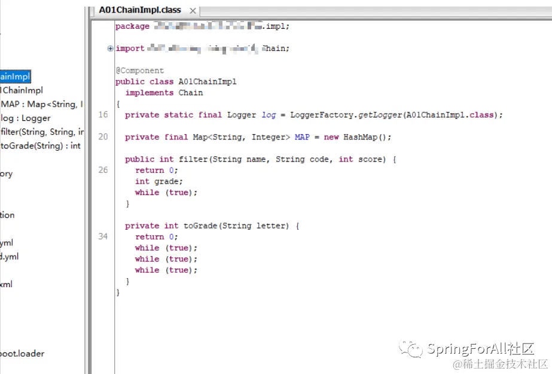
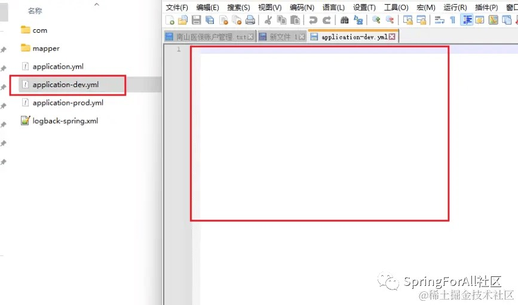

资料来源：<br/>
[Spring Boot项目Jar包加密，防止反编译](https://mp.weixin.qq.com/s/HWO0263J3p097Odr63s9zA)

- 备注：<br/>
没有进行测试


## Spring Boot项目Jar包加密

## 场景介绍

最近项目要求部署到其他公司的服务器上，但是又不想将源码泄露出去。要求对正式环境的启动包进行安全性处理，防止客户直接通过反编译工具将代码反编译出来。

## 方案

> 第一种方案使用代码混淆

采用proguard-maven-plugin插件

在单模块中此方案还算简单，但是现在项目一般都是多模块，一个模块依赖多个公共模块。那么使用此方案就比较麻烦，配置复杂，文档难懂，各模块之间的调用在是否混淆时极其容易出错。

> 第二种方案使用代码加密

采用classfinal-maven-plugin插件

此方案比对上面的方案来说，就简单了许多。直接配置一个插件就可以实现源码的安全性保护。并且可以对yml、properties配置文件以及lib目录下的maven依赖进行加密处理。若想指定机器启动，支持绑定机器，项目加密后只能在特定机器运行。

## 项目操作

只需要在启动类的pom.xml文件中加如下插件即可，需要注意的是，改插件时要放到spring-boot-maven-plugin插件后面，否则不起作用。

```xml
 <build>
        <plugins>
            <plugin>
                <groupId>org.springframework.boot</groupId>
                <artifactId>spring-boot-maven-plugin</artifactId>
            </plugin>
            <plugin>
                <!--
                    1. 加密后,方法体被清空,保留方法参数、注解等信息.主要兼容swagger文档注解扫描
                    2. 方法体被清空后,反编译只能看到方法名和注解,看不到方法体的具体内容
                    3. 加密后的项目需要设置javaagent来启动,启动过程中解密class,完全内存解密,不留下任何解密后的文件
                    4. 启动加密后的jar,生成xxx-encrypted.jar,这个就是加密后的jar文件,加密后不可直接执行
                    5. 无密码启动方式,java -javaagent:xxx-encrypted.jar -jar xxx-encrypted.jar
                    6. 有密码启动方式,java -javaagent:xxx-encrypted.jar='-pwd= 密码' -jar xxx-encrypted.jar
                -->
                <groupId>net.roseboy</groupId>
                <artifactId>classfinal-maven-plugin</artifactId>
                <version>1.2.1</version>
                <configuration>
                    <password>#</password><!-- #表示启动时不需要密码,事实上对于代码混淆来说,这个密码没什么用,它只是一个启动密码 -->
                    <excludes>org.spring</excludes>
                    <packages>${groupId}</packages><!-- 加密的包名,多个包用逗号分开 -->
                    <cfgfiles>application.yml,application-dev.yml</cfgfiles><!-- 加密的配置文件,多个包用逗号分开 -->
                    <libjars>hutool-all.jar</libjars> <!-- jar包lib下面要加密的jar依赖文件,多个包用逗号分开 -->
                    <code>xxxx</code> <!-- 指定机器启动,机器码 -->
                </configuration>
                <executions>
                    <execution>
                        <phase>package</phase>
                        <goals>
                            <goal>classFinal</goal>
                        </goals>
                    </execution>
                </executions>
            </plugin>
        </plugins>
    </build>
```

## 启动方式

> 无密码启动

```
java -javaagent:xxx-encrypted.jar -jar xxx-encrypted.jar
```


> 有密码启动

```
java -javaagent:xxx-encrypted.jar=’-pwd=密码’ -jar xxx-encrypted.jar
```

## 反编译效果

启动包加密之后，方法体被清空,保留方法参数、注解等信息.主要兼容swagger文档注解扫描

反编译只能看到方法名和注解,看不到方法体的具体内容

启动过程中解密class,完全内存解密,不留下任何解密后的文件




yml配置文件留下空白



## 绑定机器启动

下载到classfinal-fatjar-1.2.1.jar依赖，在当前依赖下cmd执行`java -jar classfinal-fatjar-1.2.1.jar -C`命令，会自动生成一串机器码


将此生成好的机器码，放到maven插件中的code里面即可。这样，打包好的项目只能在生成机器码的机器运行，其他机器则启动不了项目。