资料来源：<br/>
[Java集合复习](https://blog.csdn.net/weixin_53142722/article/details/125590988?spm=1001.2014.3001.5502)


### 1.ArrayList

**目标：掌握ArrayList 的扩容机制，掌握迭代器的Iterator 的 fail-fast，fail-safe 机制。**

#### ArrayList的扩容(调用add进行数据的添加)

注意：使用arraylist的无参构造创建出来的数组的默认容量是0，这里不是10. 看源码：

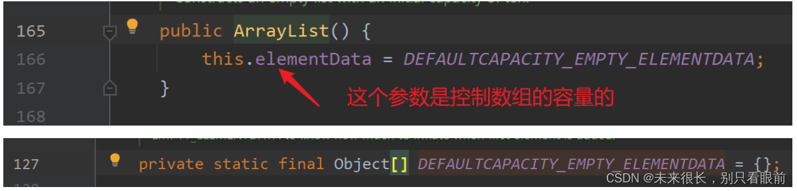

使用无参构造来创建list集合的时候，传给list集合的容量大小是一个空的数组。

如果是使用有参构造来创建这个list集合的话：你给多少的整数，它就创建多大的集合。

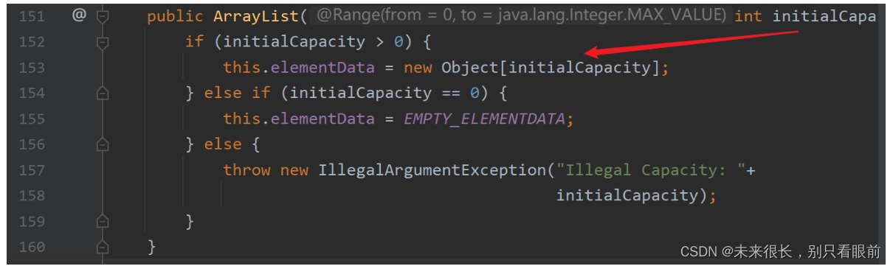

 如果你是使用集合的无参构造函数来创建集合（使用无参构造创建出来的集合的容量默认为0），当你往刚刚创建的集合中存放元素的时候，会发现集合的容量不够，**此时会触发集合的第一次扩容**，此时会创建一个长度为10 的新的数组，然后把刚刚这个元素添加到这个新数组的索引0的位置。然后会用新的数组替换这个旧的数组。

当集合中已经存放了10个元素，然后此时想要再往集合中添加元素，这个时候会触发**第二次扩容**（扩容大小为上一次集合大小的1.5倍），此时集合的大小变为15。这个过程新的数组也会代替这个旧的数组，这个旧的数组没有被引用，最后是会被垃圾回收机制给回收掉。

如果此时继续往这个集合中添加数据，当集合中的数据已经达到了15，并且准备添加第十六个元素的时候，此时会继续触发扩容机制，那么此时扩容后的集合的大小为多么呢？ 我们刚刚说的扩容1.5倍其实是不准确的，集合扩容的大小的计算实际是使用的**位移运算**来确定的。 15 >> 1 我们可以理解为正数的右移一位**相当于**除2，15向右移1位实际是为7，然后加上之前的容量15，所以此时扩容后 集合的大小变为了 22

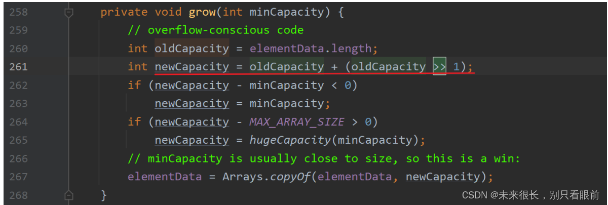

#### ArrayList的扩容(调用addAll进行数据的添加)

我们**调用无参来创建集合**的话，这个集合的默认大小也是0，不同的是在调用这个addAll方法的时候，**如果第一次添加的数据的个数小于10**，那么第一次扩容后集合的大小依旧是10.

如果第一次添加的数据个数大于10 ，比如第一次添加的元素的个数为11，那么集合的第一次扩容会把集合的大小扩容到多少嘞？ 实际上是 11 。这是因为集合**在调用addAll添加元素的时候触发的扩容机制**和之前的有点不同，**第一次**扩容的大小**：在扩容后的容量中 和 添加在集合中元素的个数 中取一个较大值 。**

如果第一次扩容后集合中有10个元素，那么再往这个集合中添加6个元素，那么此次扩容后集合的容量是多少？

因为第一次扩容把集合的容量扩容到10了，理论上来讲扩容后的容量通过位移运算后，我们可以知道这个容量是15，但是此时集合中要添加6个元素，15明显不够用，**所以就会选择集合中元素的个数作为该次扩容的集合容量。** 所以扩容后的集合容量大小为16。

**调用addAll触发的扩容机制：是在 下一次扩容的大小 中和 实际的元素个数之间 选择较大的值来作为下次扩容后的集合容量。**

总结：

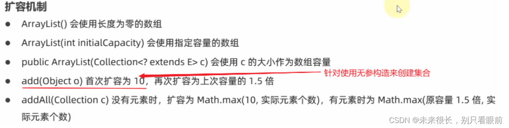

### 2.迭代器的fail-fast、fail-safe 机制

fail-fast：一旦发现遍历的同时有其他人来修改这个集合的数据，则立马抛出异常。

fail-safe：发现遍历的同时其他人来修改这个集合，应当能有应对策略，例如牺牲一致性来让整个遍历运行完成。

#### fail-fast

**arrayList**中采用的就是fail-fast机制。

创建一个student类用来进行测试：

```java
package test;
public class Student {
    private String name;
 
    public Student() {
    }
 
    public Student(String name) {
        this.name = name;
    }
 
    public String getName() {
        return name;
    }
 
    public void setName(String name) {
        this.name = name;
    }
 
    @Override
    public String toString() {
        return "Student{" +
                "name='" + name + '\'' +
                '}';
    }
}
```

 编写测试类：

```java
/**
 * @author LJM
 * @create 2022/7/3
 */
public class ArrayListTest {
    public static void main(String[] args) {
        failFast();
    }
 
    public static void failFast(){
        ArrayList<Student> list = new ArrayList();
        list.add(new Student("A"));
        list.add(new Student("B"));
        list.add(new Student("C"));
        list.add(new Student("D"));
 
        for (Student student : list) {
            System.out.println(student);
        }
 
        System.out.println(list);
    }
 
}
```

在单线程执行上面的代码是不会出现问题的，所以我们要模拟在多线程的情况下，这个遍历会不会出问题！

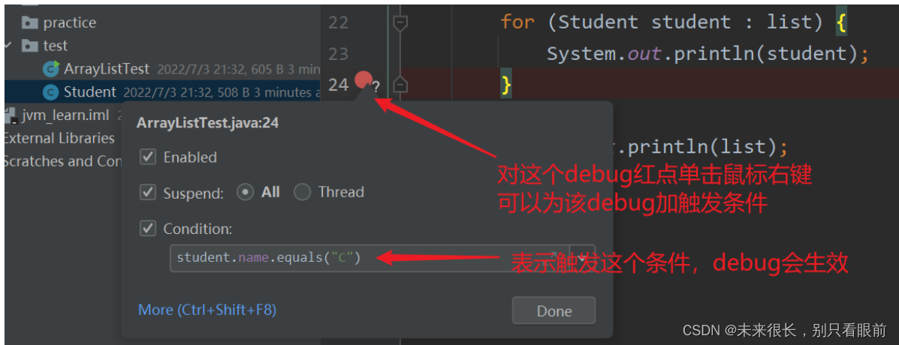

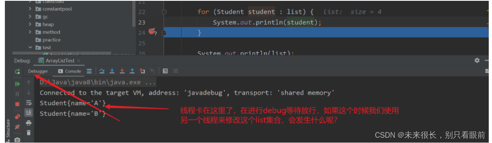

 使用其他线程修改list的数据：

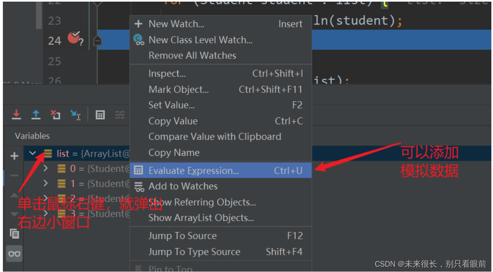

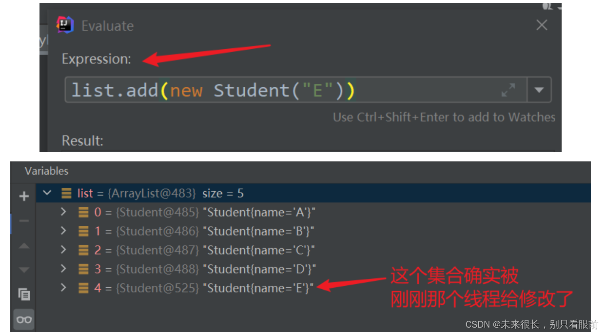

 ArrayList遇到自己在遍历的同时有其他线程来修改自己集合的数据，是会报错的，不过并不是在当前次进行报错，而是在下一轮的遍历中会抛出异常。

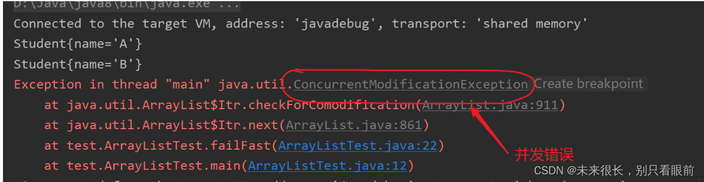

**所以我们可以知道 ArrayList集合是 fail-fast的机制。**

**fail-fast机制的实现原理：**

在使用这个增强for循环时间上还是使用到了集合的迭代器，把debug加在for循环的开始，然后我们来看看这个代码是怎么走的；

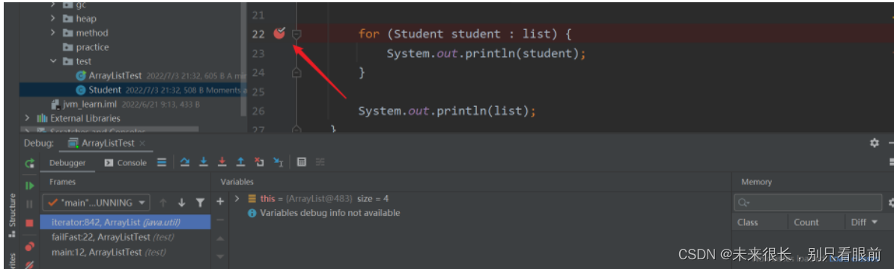

 1、先创建了一个迭代器对象，之后的循环都是调用这个迭代器来进行遍历的。

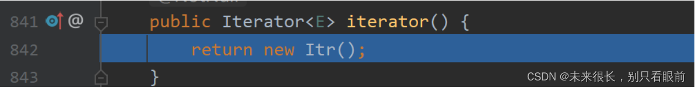

 2、通过调用迭代器的构造方法来进行对迭代器进行初始化。 这个迭代器的初始化过程中会有一个非常重要的变量expectedModCount，这个变量的作用是记录这个list集合被修改了多少次。


3.检查modCount

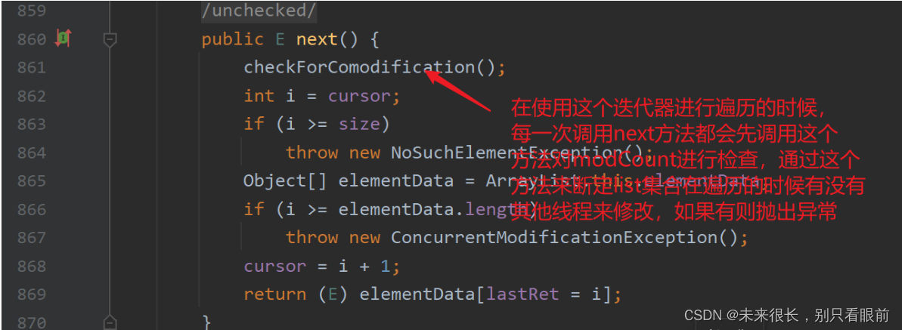

#### fail-safe

CopyOnWriteArrayList实现的是 fail-safe.

在对CopyOnWriteArrayList数组进行遍历的时候，创建的迭代器是 COWIteracter迭代器了，当我们使用这个迭代器对CopyOnWriteArrayList集合对象进行遍历的时候，实际上在对久的数组进行变量，如果这个时候来了一个线程对CopyOnWriteArrayList集合中的数据进行增加，实际上迭代器遍历的集合依旧是之前没有被其他线程添加元素的集合，其他线程对CopyOnWriteArrayList集合进行元素的添加的时候，实际上是会复制一个新的数组，然后把刚刚添加的元素加在这个新数组的最后一位。 ----> **所以这个是遍历的时候使用的是旧数组，添加的时候使用的是新服装店数组，在遍历完成后这个旧数组就没用了。**
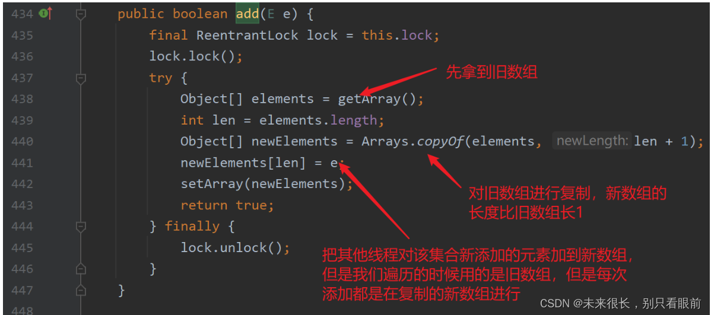

#### 总结

ArrayList是fail-fast的典型代表，遍历的同时不能进行修改，如果修改则会尽快失败。

CopyOnWriteArrayList是fail-safe的典型代表，遍历的同时可以修改，**原理是如果新旧数组实现读写分离。**

### 3.linkedList

目标：掌握 ArrayList 与 LinkedList 的比较。

ArrayList ：

- 基于数组，需要连续内存。

- 随机访问快，因为可以根据下标来进行访问。
- **尾部插入和尾部删除的性能可以**，但其他部分的插入，删除都会移动数据，因此性能比较低。
- **可以利用CPU缓存，局部性原理**。 （因为这个arrayList的底层是数组，**数组的内存空间是连续的**，所以可以利用到CPU缓存中的局部性原理，增加了读取的效率）

LinkedList ：

- 基于双向链表实现，无需连续的内存。
- 随机访问慢，因为要沿着链表进行遍历。
- **头尾**插入删除性能比较高。 在中间部分插入数据的时间要高于arrayList。
- 占用内存多。（因为LinkedList 里面有节点对象，节点类中又有指针，所以总体来讲存放同样多的数据，LinkedList 会占用更多的内存）

**其实总体来说，arrayList的平均性能是要高于LinkedList 的**，所以在工作中一般是使用arrayList多，除非是在某些的特定场景比如需要进行头插，那么使用LinkedList 可能会更快。

### 4.HashMap

- 先来看看面试官最喜欢问的一个题，hashMap的底层数据结构是什么？1.7与1.8有何不同？

  ① 1.7是基于数组 + 链表实现，1.8基于数组 + 链表|红黑树（链表和红黑书可以进行转换）

- 为什么要使用红黑树，为何不一上来就进行树化，树化的阈值为啥会是8？什么时候回进行树化？红黑树什么时候回退化成链表？

我们先来进行学习，后面会回答这个问题。

我们来看看hashmap在调用put方法的时候回发生什么：

put简单来说就是把key-value的键值对存入这个hash表中，那在把这个键值对存入hash表的过程，起主要作用的是这个key，这个key就决定了将来这个键值对在hahs表的位置。那么这个key是如何计算的？

先调用要存入对象的hashcode()方法，然后就可以拿到一个原始的hash值，然后再通过对原始hash进行二次计算得到的二次hash，然后这个二次hash值与当前这个hash表的(容量capacity-1）进行一个求模运算，就可以得到一个值，这个值就是桶的下标（就是元素在数组的下标位置）。之所以这样设计是为以后的快速查询做铺垫。


当然也可能会出现这种情况：不同的对象经过上面的hash运算，得到的**数组的下标的值是一样的**。这个时候**链表**就可以排上用场了。 但是这种链表的情况也会出现一种极端的情况，就是**如果这个链表太长了**，那么对于该数组下标位置的**查询效率又会变成了O(n)**。  那么如何避免这种O(n) 查询效率低出现：

①减短这个链表的长度（比如对数组进行扩容，但是这里有一种特殊情况就是如果你的原始hash值一样那么不管你扩容多少次它们的数组下标值还是一样的） 。

②链表长度达到一定值后进行树化，使用红黑树来提高查询效率。

#### 什么时候会发生扩容？

- 当hashmap中的元素个数超过 **当前数组容量 \* 负载因子**(默认为0.75)，就会进行数组扩容。默认情况下数组大小为16，那么当hashmap中的元素个数超过16*0.75 = 12 ，就会对当前数组进行扩容。（**扩容是在添加新元素后才进行扩容判断的**）
- 当链表的长度大于8，并且当前数组的容量**小于64**（如果数组容量大于等于64那么就触发树化机制了）

#### 树化的条件？

```java
 if (tab == null || (n = tab.length) < MIN_TREEIFY_CAPACITY)
        	//只有数组容量【大于等于】64时,链表长度到8时才会树化,把链表转红黑树,其他情况都是扩容
            resize();
			//下面的代码可以不用看
        else if ((e = tab[index = (n - 1) & hash]) != null) {
            TreeNode<K,V> hd = null, tl = null;
            do {
                TreeNode<K,V> p = replacementTreeNode(e, null);
                if (tl == null)
                    hd = p;
                else {
                    p.prev = tl;
                    tl.next = p;
                }
                tl = p;
            } while ((e = e.next) != null);
            if ((tab[index] = hd) != null)
                hd.treeify(tab);
        }
```

数化阈值是一个固定常量，值为8。

条件①：当链表的长度大于8的时候，会【**尝试**】进行树化。 （**扩容是在添加新元素后才进行扩容判断的**）

条件②：添加元素后的数组容量如果小于64，那么会优先使用扩容，如果数组容量大于等于64**且有**链表的长度大于8，那么才会进行树化。（要尽量避免树化，因为树化是比较消耗性能的。）

注意：**其实这个链表的长度是有可能超过8的**，比如在数组容量为16的3号位置有8个元素，此时再往3号位置添加一个元素，那么此时会触发扩容，**如果这9个元素的初始hash值都是一致的**那么即便扩容后，这个数组中的某个下标是会出现9个元素的。

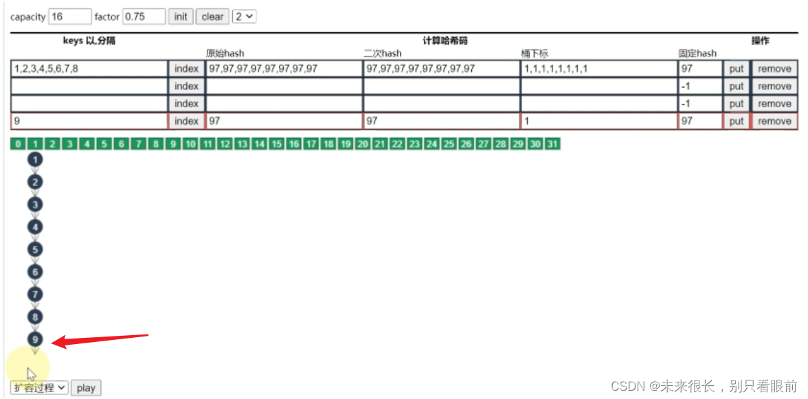

#### 为什么要使用红黑树，为何不一上来就进行树化？

因为如果链表太长了，那么查询的速度就会变成O(n),大大的影响了hashmap的性能，所以在1.8后引入了红黑树（查询速度O(nlogn) log的底数为2），可以在链表比较长的时候让hash表的查询速度依旧很快。

树化的条件：链表的长度大于8，并且数组的容量要大于等于64，只有这两个条件都满足链表才会进行树化。

之所以不一开始就进行树化，是因为如果开始链表中只有2-3个元素，其实比较多次数也不是很多，那么在这种情况下你费了很大劲把一个短的链表进行树化，实际上性能压根不会提升说不定还会下降（因为在数据比较少的情况下链表的查询效率是高于红黑树的），而且红黑树占用的内存更大。


#### 树化的阈值为啥会是8？

首先得考虑一下什么情况hash表中的链表长度才会大于8，这种情况正不正常？

我们来看看hashmap源码中给出链表元素个数的各种概率情况：**这个前提是在负载因子为0.75的情况下**

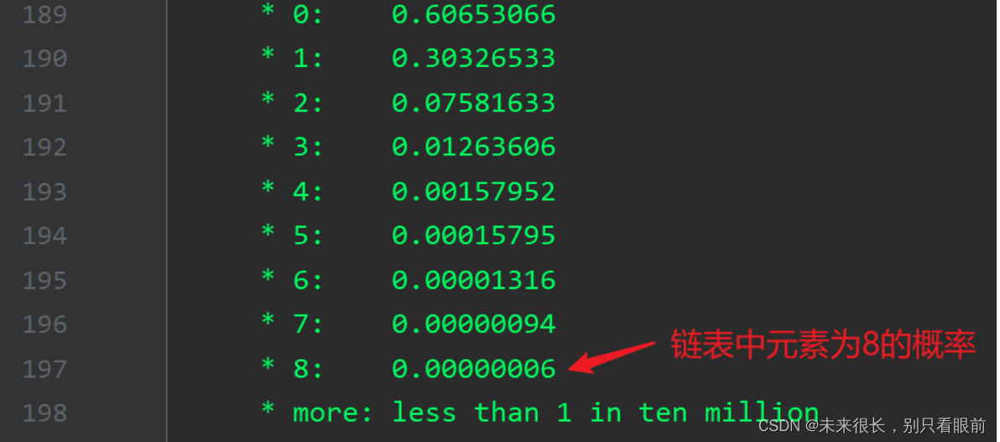

 我们发现链表元素为8的概率是非常非常小的（亿分之6），这个概率符合泊松分布，也就是说正 常情况下是不会发生的。

**红黑树是用来避免Dos攻击，防止链表超长时性能下降，树化应该是偶然的情况。**

#### 红黑树什么时候回退化成链表？

退化的情况1：在扩容时如果发生**拆分树**时，**树元素个数小于等于6** 则会退化成链表。

退化的情况2：remove树节点**之前**会检查，若root，root.left，root.right，root.left.left 有一个为null，也会退化成链表。

#### 哈希表的索引如何计算？

任何对象都是有hsahcode()方法的，所以任何对象调用这个方法就可以得到自己的**原始hash值**，那么我们还要对这个原始值调用hashmap提供的hash（）方法来对它**进行二次hash**, 二次hash的结果再跟我们的这个hash表的**数组的容量-1做一个取模运算**，就可以得到一个**余数**，那么这个余数**就是我们的索引**（或者是数组下标）。

然后取模运算实际上做的是除法，除法会占用更多的cpu资源，所以hashmap中就想使用**位运算来替代这个取模除法**，因为位运算的效率是大大高于这个除法运算的。**但是这里有一个前提就是 这个除数必须是2的n次幂才能进行等价运算。**

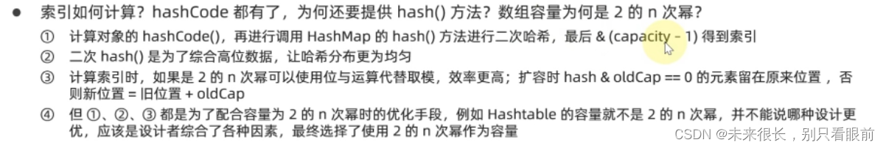

#### 二次hash的作用？

下面是hashmap中二次hash的方法，**jdk1.8版本。**

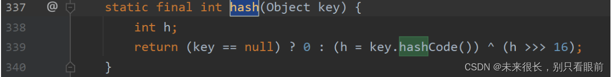

如果key为null会认为这个hash值为0，如果key不为null 那么二次hash的值就是 **key的原始hash值与 原始hash值无符号右移16位进行异或运算。** 这个异或运算的结果就是二次hash值得结果。

之所以使用二次hash值作为hash值，**因为这样得到的hash值更加随机**，可以**使hash表分布更加均匀，可以避免链表过长**。

#### 数组容量为何是2的n次幂？

之前说的第一个好处是 可以让**位移运算代替取模的除法运算**，效率就更高了。

第二个好处，数组在进行扩容的时候 可以使用这个元素的hash值 & oldCap (使用这个元素的hash值去按位与这个数组的旧容量)，**如果等于0 表示元素需要留在原位置**，否则新位置 = 旧位置下标 + oldCap, 这样就对hashmap进行了一定的优化了。

**但是这个也有一个缺点：如果put的元素全是偶数，这就会导致hash分布不均匀。**

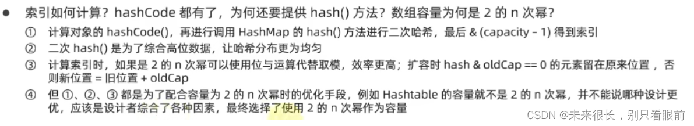

#### 介绍put方法的流程，1.7和1.8有何不同？

①HashMap是懒惰创建数组的，首次使用才会创建数组。

②计算索引（数组下标），上面我们已经详细的讲解了计算索引了，参考上面讲的。

③如果数组下标还没有被元素占用，那么创建Node节点，把我们的键值对存储进来，然后返回。

④如果数组下标已经有元素占用

- 已经是TreeNode 那么就会走红黑树的添加和更新逻辑
- 如果是普通的Node , 那么就会走连不到添加和更新逻辑，如果链表长度超过树化阈值，那么就走树化逻辑

⑤返回前检查容量是否超过阈值，一旦超过就进行扩容（**扩容是在添加新元素后才进行扩容判断的**）。

⑥不同

- 1、链表插入节点时，1.7是头插法，1.8是尾插法
- 2、1.7是大于等于阈值且没空位时才扩容，**而1.8是大于阈值就扩容**
- 3、1.8在扩容计算Node索引时，会进行优化。

#### 为什么加载因子默认为0.75？

- 在空间占用和查询时间之间取得较好的权衡。
- 大于这个值，空间节省了，但是链表就会比较长，然后影响性

- 能。
- 小于这个值，冲突减少了，但扩容就会更加频繁，空间占用较多。


#### 多线程下操作hashmap会出现什么问题？

①扩容死链（1.7）

在1.7hashMap是使用头插法的。产生问题的根源是，在使用头插法的链表中，当hash表进行扩容后，需要对链表进行迁移到时候，由于使用的是头插法所以就会导致迁移后的链表的顺序发生逆转，比如链表开始是 a -> b，迁移后就会变成 b -> a 。 那么在多线程的操作下，可能就会导致链表指针出现问题，导致出现死链(a->b, b->a).

②数据错乱（1.7、1.8）：多个线程下同时操作hashmap会导致链表中的数据被覆盖，从而导致数据丢失。

#### key是否可以为null？作为key的对象有什么要求？

- HashMap的key可以为null，但Map的其他实现则不然。（比如hashTable,ConcurrentHashMap这些都key都不能为null）

- 作为key的对象，必须重写HashCode和 equals，因为如果HashCode相同那么可以提供equals来比较对象是否相同，**并且key的内容不可变**，不然会导致你之前存进去的对象可能会找不到了（hashcode变化了）。

**注意：两个对象的hashcode相同它们的equals并不一定相同，但是两个对象的equals为ture那么它们的hashcode是一定相同的。**

#### hashcode的设计

String对象的hashcode如何设计的，为什么每次乘31？

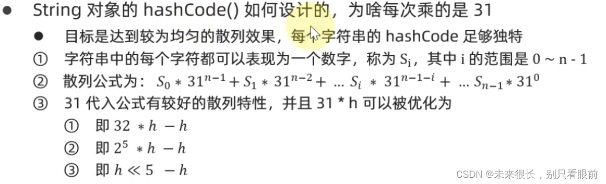

 其实我们从下面的散列图可以看出来41的散列是比31的更加均匀，但是31还可以提高计算性能。所以综合考虑后选择了31。

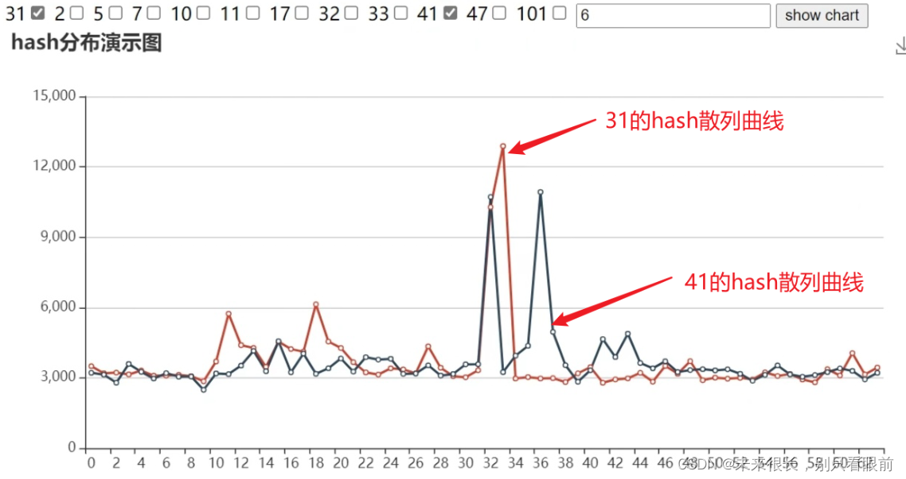