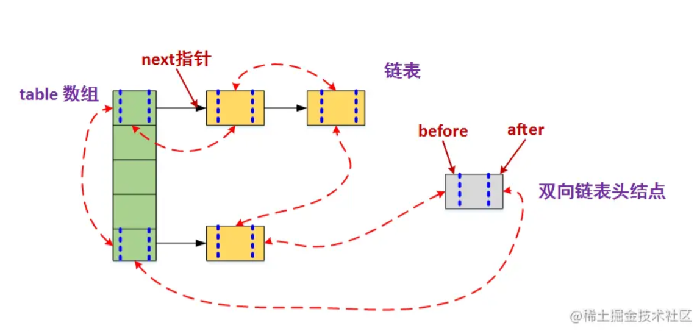

资料来源：<br/>
[Java中的5大队列，你知道几个？](https://www.toutiao.com/article/6886612634859536900/?log_from=ac58831c58baa_1650432268817)<br/>
[JAVA队列（ Queue ) 详解](https://www.toutiao.com/article/7082294108403892774/?channel=&source=search_tab)<br/>
[基础篇：JAVA集合，面试专用](https://juejin.cn/post/7024775152231514142)


## Queue

### 概述

> List 数组
> Vector 向量
> Stack 栈
> Map 映射字典
> Set 集合
> Queue 队列
> Deque 双向队列

- 一般队列的通用方法

| 操作方法 | 抛出异常  | 阻塞线程 | 返回特殊值 | 超时退出                |
| -------- | --------- | -------- | ---------- | ----------------------- |
| 插入元素 | add(e)    | put(e)   | offer(e)   | offer(e, timeout, unit) |
| 移除元素 | remove()  | take()   | poll()     | pull(timeout, unit)     |
| 检查     | element() | peek()   | 无         | 无                      |


## list

- 元素按进入先后有序保存，可重复
- List有两种底层实现，一种是数组，一种是链表，而链表的实现继承了 Collection。数组和集合的区别：
  - 数组大小是固定，集合是可变的
  - 数组的元素可以基本类型也可以是引用类型，而集合只能是引用类型

### ArrayList

ArrayList底层是使用一个可动态扩容的数组，与普通数组的区别就是它是没有固定大小的限制，可以添加或删除元素

它的特点就是读速度、更新快，增删慢；内存相邻，根据Index读取的时间复杂度是O(1)；可以存储重复元素，但线程不安全

ArrayList 的扩容机制

```java
//ArrayList openJDK 13
private void add(E e, Object[] elementData, int s) {
    if (s == elementData.length) //放不下了
        elementData = grow(); // 扩容
    elementData[s] = e;
    size = s + 1;
}
private Object[] grow() {
    return grow(size + 1);
}
private Object[] grow(int minCapacity) {
    int oldCapacity = elementData.length;
    if (oldCapacity > 0 || elementData != DEFAULTCAPACITY_EMPTY_ELEMENTDATA) {
        int newCapacity = ArraysSupport.newLength(oldCapacity,
                minCapacity - oldCapacity,  // minCapacity - oldCapacity == 1
                oldCapacity >> 1 ); // oldCapacity == 1/2 oldCapacity
        return elementData = Arrays.copyOf(elementData, newCapacity);
    } else {
        return elementData = new Object[Math.max(DEFAULT_CAPACITY, minCapacity)];
    }
}
```

- 如果当前元素放不下，则扩容至 1.5 倍，且大于等于 1

```java
// ArraysSupport.newLength
public static int newLength(int oldLength, int minGrowth, int prefGrowth) {
    //prefGrowth 是 oldLength 的 1/2，minGrowth 是 1。因此 newLength = 1.5 oldLength
    int newLength = Math.max(minGrowth, prefGrowth) + oldLength;
    if (newLength - MAX_ARRAY_LENGTH <= 0) { // MAX_ARRAY_LENGTH = Integer.MAX_VALUE - 8
        return newLength;
    }
    return hugeLength(oldLength, minGrowth);
}
```

### LinkedList

LinkedList的节点并不是存储真实的数据，而是存下数据的引用对象，而且节点之间使用引用相关联

LinkedList实现了Queue、Deque接口，可作为队列使用；查找慢，增删快，可以存储重复元素，但线程不安全

使用 LinkedList 实现LRU

```java
public static class LRU<T> {
    //默认的缓存大小
    private  int CAPACITY = 0;
    //引用一个双向链接表
    private LinkedList<T> list;
    //构造函数
    public LRU(int capacity) {
        this.CAPACITY = capacity;
        list = new LinkedList();
    }
    //添加一个元素
    public synchronized void put(T object) {
        if (list != null && list.contains(object)) {
            list.remove(object);
        }
        removeLeastVisitElement();
        list.addFirst(object);
    }
    //移除最近访问次数最少的元素
    private void removeLeastVisitElement() {
        int size = list.size();
        //注意，这儿必须得是CAPACITY - 1否则所获的size比原来大1
        if (size > (CAPACITY - 1)) {
            Object object = list.removeLast();
        }
    }
    //获取第N个索引下面的元素
    public  T get(int index) {
        return list.get(index);
    }
}

```

- LinkedList 的 API

```java
public E getFirst() //获取第一个元素
public E getLast()  //获取最后一个元素
public E removeFirst() // 移除第一个元素，并返回
public E removeLast() // 移除最后一个元素，并返回
public void addFirst(E e) //加入头部
public void addLast(E e)  //加入尾部
public void add(E e) //加入尾部
public boolean contains(Object o) //是否包含 元素 o
public E peek() //获取头部第一个元素
public E element()  // 获取头部第一个元素,不存在则报错
public E poll() //获取头部第一个元素，并移除
public boolean offer(E e) // 调用 add(E e)
public boolean offerFirst(E e) // 调用 addFirst
public boolean offerLast(E e) // 调用 addLast
public void push(E e) //在头部压入一个元素
public E pop()  //弹出第一个元素，并移除。不存在则报错
```

- ArrayList 和 LinkedList 使用场景
  - 频繁访问列表中的某一个元素，或者需要在列表末尾进行添加和删除元素操作，用ArrayList
  - 频繁的在列表开头、中间、末尾等位置进行添加和删除元素操作，用LinkedList

**Iterator 和 fast-fail、fail-safe机制**

- Java Iterator（迭代器）不是一个集合，它是一种用于访问集合的方法，可用于迭代 List 和 Set 等集合，主要有hashNext()，next()，remove()三种方法
- fail-fast 是Java集合(Collection)的一种错误机制。当多个线程对同一个集合进行修改结构操作，使用集合的迭代器iterator，会首先检测是否有对集合的并发修改，进而产生ConcurrentModificationException 异常提示
- fail-safe：保证在对任何集合结构的修改操作都基于 《复制-修改》 进行的，即先copy一个新的集合对象，然后对新的集合对象进行修改，最后将新的集合对象替换掉老的集合对象(老的集合对象的地址指向新的集合对象)。java.util.concurrent包下采用的是fail-safe机制。
  - 缺点1-对集合的复制copy会产生大量的对象，造成内存空间的浪费。
  - 缺点2-无法保证集合迭代过程中获取的集合数据是最新的内容

### CopyOnWriteArrayList

- CopyOnWriteArrayList 的线程安全：CopyOnWriteArrayList 在写的时候会加锁，为了保证写安全，会在写操作时复制一个新数组来操作，然后覆盖旧的数组；不会影响读的性能

```java
public class CopyOnWriteArrayList<E>
    implements List<E>, RandomAccess, Cloneable, java.io.Serializable {
    //可重入锁
    final transient ReentrantLock lock = new ReentrantLock();
    //数组，仅通过get和set方法操作
    private transient volatile Object[] array; 
    ....
    public boolean add(E e) {
        final ReentrantLock lock = this.lock;
        lock.lock();
        try {
            Object[] elements = getArray();//拿到当前数组
            int len = elements.length;//获得长度
            //拷贝当前数组
            Object[] newElements = Arrays.copyOf(elements, len + 1);
            newElements[len] = e;
            setArray(newElements); //调用set方法将新数组设置为当前数组
            return true;
        } finally {
            lock.unlock();//解锁
        }
    }

```

- CopyOnWriteArrayList 的缺点
  - CopyOnWrite 在进行写操作的时候，内存里会同时驻扎两个对象的内存，导致内存的浪费
  - CopyOnWrite 容器只能保证数据的最终一致性，不能保证数据的实时一致性。如果你希望写入的的数据，马上能读到，请不要使用CopyOnWrite容器，没有阻塞等待的概念
- CopyOnWriteArrayList 和 Collections.synchronizedList 区别
  - CopyOnWriteArrayList 的写操作性能较差，而多线程的读操作性能较好
  - Collections.synchronizedList的写操作性能比CopyOnWriteArrayList在多线程操作的情况下要好很多，而读操作因为是采用了 synchronized关键字的方式，其读操作性能并不如CopyOnWriteArrayList

### 线程安全的List

- A:使用 Vector；
- B:使用 Collections.synchronized() 返回线程安全的 List；
- C:使用 CopyOnWriteArrayList
```java
boolean contains(Object o) // 是否包含 o
boolean isEmpty(); // 是否为空
int size(); //集合元素
Iterator<E> iterator(); // 返回迭代器
Object[] toArray(); // 转为 Object数组
<T> T[] toArray(T[] a); // 转为具体类型数组
boolean add(E e); // 加入尾部
boolean remove(Object o); // 移除 o
boolean containsAll(Collection<?> c); //是否报考 集合 c
boolean addAll(Collection<? extends E> c);// 合并 c 
boolean retainAll(Collection<?> c);//保留只存在集合 c 的元素
void clear(); // 清除集合元素
void sort(Comparator<? super E> c) //根据 Comparator 排序
E get(int index); // 根据下标获取 元素
E set(int index, E element); // 设置第 index 的元素
E remove(int index); // 移除 第 index 的元素
<E> List<E> of(E e1.....) // jdk 9
List<E> copyOf(Collection<? extends E> coll)  // 复制
```

#### Vector（向量）

 ArrayList 和 Vector、LinkedList 的区别

- Vector 相当于是 ArrayList 线程安全的翻版
- Vector 继承实现List 特点: 底层数据结构是数组，查询快，线程安全

 `Vector` 的API示例

```java
boolean synchronized contains(Object o);
boolean synchronized isEmpty();
boolean synchronized containsAll(Collection<?> c);
boolean addAll(Collection<? extends E> c);
public synchronized boolean add(E e)
public synchronized E get(int index);
public synchronized E set(int index, E element);
public synchronized E firstElement()
public synchronized void removeElementAt(int index)
public synchronized E lastElement()
public synchronized void setElementAt(E obj, int index)
public synchronized E remove(int index)
public void clear()
Iterator<E> iterator();
```

#### Stack（栈）

- Stack 是 Vector提供的一个子类，用于模拟"栈"这种数据结构(LIFO后进先出)
- 线程安全，允许 null 值

####  Stack 的API示例

```java
public E push(E item) //推入栈顶
public synchronized E pop() // 弹出栈顶元素，不存在则报错
public synchronized E peek() // 获取栈顶元素，不移除
public boolean empty()  // 栈是否为空
public synchronized int search(Object o) // 搜索元素 
```

### Map

- Map 用于保存具有映射关系的数据，Map里保存着两种映射的数据：key和value，它们都可以使任何引用类型的数据，但key不能重复。所以通过指定的key就可以取出对应的value
- 请注意！！！Map 没有继承 Collection 接口

#### TreeMap(1.8JDK)

- 继承 AbstractMap，TreeMap 是基于红黑树实现，可保证在`log(n)`时间复杂度内完成 containsKey，get，put 和 remove 操作，效率很高。（红黑数的原理这里不展开讲，后面会专门写一篇）
- 另一方面，由于 TreeMap 基于红黑树实现，因此 TreeMap 的键是有序的

#### HashMap

- HashMap 继承AbstractMap类实现了Map，是一个散列表，它存储的内容是键值对(key-value)映射。HashMap 实现了 Map 接口，根据键的 HashCode 值存储数据，具有很快的访问速度，最多允许一条记录的键为 null，不支持线程同步。HashMap 是无序的，即不会记录插入的顺序
- HashMap如何处理hash冲突，hash冲突的几种解决方法
  - 开放定址法
    - 线性探查在散列的时候，如果当前计算出的位置已经被存储，那么就顺序的向后查找，知道找到空位置或则是所有位置均不为空失败
    - 二次探查使用一个辅助散列函数，使得后续的探查位置在前一个探查位置上加上一个偏移量，该偏移量以二次方的形式依赖于探查号i。二次探查的散列函数形式为：h(k,i)=(h'(k,i)+c1*i + c2 * i^2) mod m
    - 双重散列使用两个辅助散列函数h1和h2，初始的散列位置是h1(k)，后续的散列位置在此基础上增加一个偏移量h2(k)*i mod m
  - 链地址法
    - 链地址法-如果存在 hash 碰撞，则创建一链表存储相同的元素
    - 开放定址法容易导致 hash 碰撞，查询慢
- HashMap 底层实现是**数组+链表+红黑树**。空参的HashMap初始容量是16，默认加载因子为0.75。取值0.75是因为 0.5 容易浪费空间，取值 1 则需要填满每一个桶，实际情况很难达到，会产生大量的哈希碰撞。因此取中间值
- HashMap 的容量一般是 2 的幂次方，可直接使用“位与”计算 hash 值，相对取模计算 hash 快

#### Hashtable

- 继承于Dictionary，现在基本已被淘汰
- HashTable的操作几乎和HashMap一致，主要的区别在于HashTable为了实现多线程安全，在几乎所有的方法上都加上了synchronized锁，而加锁的结果就是HashTable操作的效率十分低下
- HashMap允许有一个键为null，允许多个值为null；但HashTable不允许键或值为null
- Hash映射：HashMap的hash算法通过非常规设计，将底层table长度设计为2的幂，使用位与运算代替取模运算，减少运算消耗；而HashTable的hash算法首先使得hash值小于整型数最大值，再通过取模进行散射运算

#### LinkedHashMap

- LinkedHashMap的元素存取过程基本与HashMap基本类似，只是在细节实现上稍有不同。当然，这是由LinkedHashMap本身的特性所决定的，因为它额外维护了一个双向链表用于保持迭代顺序。此外，LinkedHashMap可以很好的支持LRU算法。HashMap和双向链表合二为一即是LinkedHashMap



#### WeakHashMap

- WeakHashMap 也是一个散列表，它存储的内容也是键值对(key-value)映射，而且键和值都可以是 null
- WeakHashMap的键是“弱键”。在 WeakHashMap 中，当某个 key 不再被强引用使用时，会被从WeakHashMap中被 JVM 自动移除，然后它对应的键值对也会被从WeakHashMap中移除。[JAVA引用类型和ThreadLocal](https://juejin.cn/post/6940228444949053470)

#### ConcurrentHashMap(1.8JDK)

- ConcurrentHashMap 是 HashMap 的多线程安全版本。它使用了细粒度锁 和 cas 提高了在多线程环境的安全性和高并发
- 底层数据结构是 数组 + 链表/红黑树（后面专门写一篇介绍）

#### ConcurrentSkipListMap 了解一波

- ConcurrentSkipListMap 则是基于跳跃链表的实现的 map，使用了 cas 技术实现线程安全性，高并发
- ConcurrentSkipListMap 相比 ConcurrentHashMap 的优点
  - ConcurrentSkipListMap 的key是有序的。
  - ConcurrentSkipListMap 支持更高的并发。ConcurrentSkipListMap的存取时间是log（N），和线程数几乎无关。也就是说在数据量一定的情况下，并发的线程越多，ConcurrentSkipListMap 越能体现出它的优势

#### NavigableMap 和 ConcurrentNavigableMap 操作 key 值的范围区间

- TreeMap 实现了 NavigableMap 。ConcurrentNavigableMap 高并发线程安全版的 TreeMap
- NavigableMap 提供了针对给定搜索目标返回最接近匹配项的导航方法。直接看API

```java
K lowerKey(K key)  // 找到第一个比指定的key小的值
K floorKey(K key)  // 找到第一个比指定的key小于或等于的key
K ceilingKey(K key) // 找到第一个大于或等于指定key的值
K higherKey(K key) // 找到第一个大于指定key的值
Map.Entry<K,V> firstEntry() // 获取最小值
Map.Entry<K,V> lastEntry() // 获取最大值
Map.Entry<K,V> pollFirstEntry() // 删除最小的元素
Map.Entry<K,V> pollLastEntry() // 删除最大的元素
NavigableMap<K,V> descendingMap() //返回一个倒序的Map 
// 返回值小于 toKey 的 NavigableMap
NavigableMap<K,V> headMap(K toKey, boolean inclusive)
// 返回值大于 fromKey 的 NavigableMap
NavigableMap<K,V> tailMap(K fromKey, boolean inclusive)
// 返回值小于 toKey 大于 的 fromKey NavigableMap
NavigableMap<K,V> subMap(K fromKey, boolean fromInclusive, K toKey,   boolean toInclusive)
```

##  Set（集合）

- Set特点：元素无放入顺序，元素不可重复，如果加入重复元素，会保留最先加入的对象。存取速度快

### Set 的几种实现子类和各自特点

- TreeSet：底层数据结构采用二叉树来实现，元素唯一且已经排好序；唯一性同样需要重写 hashCode 和 equals()方法，二叉树结构保证了元素的有序
  - 根据构造方法不同，分为自然排序（无参构造）和比较器排序（有参构造），自然排序要求元素必须实现Compareable接口，并重写里面的compareTo()方法
- HashSet：是哈希表实现的，HashSet中的数据是无序的，可以放入 null，但只能放入一个null，两者中的值都不能重复，就如数据库中唯一约束
  - HashSet 是基于 HashMap 算法实现的，其性能通常都优于TreeSet
  - 为快速查找而设计的Set，我们通常都会用到HashSet，若需要排序的功能时，才使用TreeSet
- LinkedHashSet：底层数据结构采用链表和哈希表共同实现，链表保证了元素的顺序与存储顺序一致，哈希表保证了元素的唯一性，效率高。但线程不安全

### ConcurrentSkipListSet

- 基于 ConcurrentSkipListMap 实现

### CopyOnWriteArraySet

- 基于 CopyOnWriteArrayList 实现

### BitSet

- BitSet是位操作的对象，值只有 0 或 1 即false和true，内部维护了一个long数组，初始只有一个long，所以BitSet最小的size是64，当随着存储的元素越来越多，BitSet内部会动态扩充，最终内部是由N个long来存储
- 如统计40亿个数据中没有出现的数据，将40亿个不同数据进行排序等。
- 现在有1千万个随机数，随机数的范围在1到1亿之间。现在要求写出一种算法，将1到1亿之间没有在随机数中的数求出来

```java
void and(BitSet set) // 两个BitSet 做与操作，结果并存入当前 BitSet
void andNot(BitSet set) //  两个BitSet 与非操作
void flip(int index) // 反转某一个指定 index 
boolean intersects(BitSet bitSet) // 是否有交集
int cardinality() //返回 true/1 的个数
void clear() // 重置
void clear(int startIndex, int endIndex) // startIndex~endIndex 重置
int nextSetBit(int startIndex) //检索在startIndex之后出现为1的第一位的索引
int nextClearBit(int startIndex) //检索在startIndex之后出现为0的第一位的索引
```
