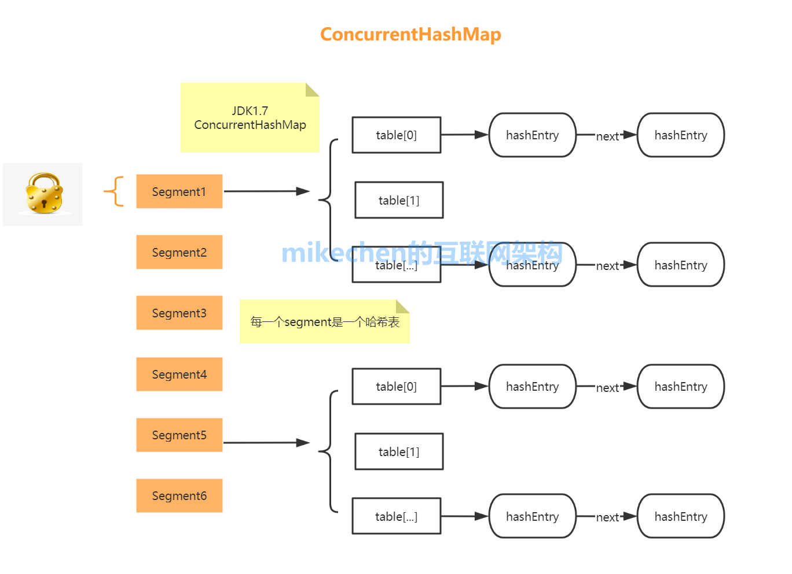
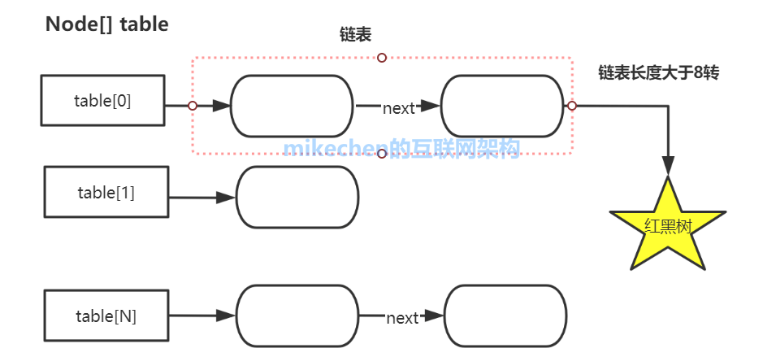

资料来源：<br/>
[5大线程安全Map](https://mikechen.cc/28504.html)

## 五大安全的hashmap

线程安全的Map经常在[Java面试](https://mikechen.cc/20716.html)被问到，线程安全的Map主要有5大类，下面详解5大线程安全Map

### 1.ConcurrentHashMap

[ConcurrentHashMap](https://mikechen.cc/28166.html)是Java中最常用的线程安全的Map实现之一。

在JDK1.7中ConcurrentHashMap采用了**数组+Segment+分段锁**的方式实现。

如下图所示：


JDK8中[ConcurrentHashMap](https://mikechen.cc/28166.html)参考了JDK8 HashMap的实现，进行全面升级。

如下图所示：



示例如下：

```java
ConcurrentHashMap<String, Integer> map = new ConcurrentHashMap<>();
map.put("apple", 1);
map.put("banana", 2);
map.put("orange", 3);

// 使用ConcurrentHashMap的forEach方法遍历Map
map.forEach((key, value) -> {
    System.out.println(key + ": " + value);
});
```

ConcurrentHashMap支持高并发读写操作，可以实现高效的并发处理。

想更加深入的了解ConcurrentHashMap，请查看：[ConcurrentHashMap详解(作用原理及使用场景)](https://mikechen.cc/28166.html)


### 2.Hashtable

Hashtable是Java中最早提供的线程安全的Map实现，如下所示：

```java
Hashtable<String, Integer> table = new Hashtable<>();
table.put("apple", 1);
table.put("banana", 2);
table.put("orange", 3);

// 使用Hashtable的forEach方法遍历Map
table.forEach((key, value) -> {
    System.out.println(key + ": " + value);
});
```

Hashtable对数据的读写操作，都采用[Synchronized](https://mikechen.cc/618.html)来实现线程安全，如下所示：

```java
public synchronized V get(Object key) {
       Entry<?,?> tab[] = table;
       ......
   }
```

在多线程环境下，无论是读数据，还是修改数据，在同一时刻只能有一个线程在执行synchronize方法，因为是对整个表进行锁定。

所以Hashtable性能比较差，现在都建议使用ConcurrentHashMap来替换。

 

### 3.ConcurrentSkipListMap

ConcurrentSkipListMap是一种基于跳表（Skip List）实现的线程安全的Map。

跳表是一种可以支持快速查找、插入、删除的数据结构，与红黑树相比，它的查询效率更高。

ConcurrentSkipListMap支持高并发读写操作，同时也支持高级操作，比如原子性的putIfAbsent、replace等操作。

如下所示：

```java
ConcurrentSkipListMap<String, Integer> map = new ConcurrentSkipListMap<>();
map.put("apple", 1);
map.put("banana", 2);
map.put("orange", 3);

// 使用ConcurrentSkipListMap的forEach方法遍历Map
map.forEach((key, value) -> {
    System.out.println(key + ": " + value);
});

// 使用ConcurrentSkipListMap的putIfAbsent方法插入新值
map.putIfAbsent("peach", 4);

// 使用ConcurrentSkipListMap的replace方法替换值
map.replace("banana", 5);

// 使用ConcurrentSkipListMap的get方法获取值
int value = map.get("apple");
```

 

### 4.SynchronizedMap

SynchronizedMap是一种基于Synchronized关键字实现的线程安全的Map。

如下所示：

```java
Map<String, Integer> map = new HashMap<>();
Map<String, Integer> synchronizedMap = Collections.synchronizedMap(map);

synchronizedMap.put("apple", 1);
synchronizedMap.put("banana", 2);
synchronizedMap.put("orange", 3);

// 使用SynchronizedMap的forEach方法遍历Map
synchronizedMap.forEach((key, value) -> {
    System.out.println(key + ": " + value);
});
```

它通过Synchronized对整个Map对象进行同步来实现并发安全，因此它的性能比[ConcurrentHashMap](https://mikechen.cc/28166.html)和ConcurrentSkipListMap要差一些。

SynchronizedMap的优点是实现简单，易于使用，可以作为一种基础的线程安全Map使用。


### 5.ConcurrentHashMap.KeySetView

ConcurrentHashMap.KeySetView是ConcurrentHashMap中的一个内部类，它提供了一种只读的线程安全的Set视图，可以用于读取ConcurrentHashMap中的Key。

如下所示：

```java
ConcurrentHashMap<String, Integer> map = new ConcurrentHashMap<>();
map.put("apple", 1);
map.put("banana", 2);
map.put("orange", 3);

ConcurrentHashMap.KeySetView<String, Integer> keySetView = map.keySet();

// 使用ConcurrentHashMap.KeySetView的forEach方法遍历Map的Key
keySetView.forEach(key -> {
    System.out.println(key);
});
```

ConcurrentHashMap.KeySetView支持高并发读操作，但不支持写操作，因此它适用于读多写少的场景。