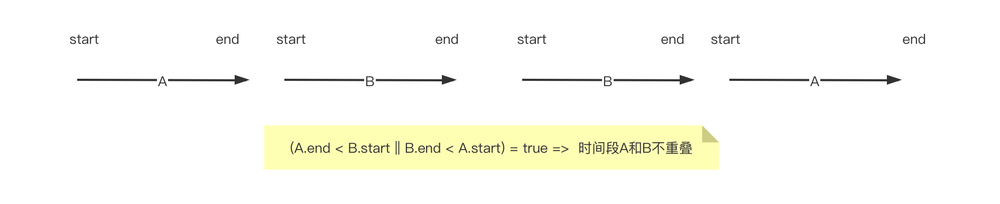
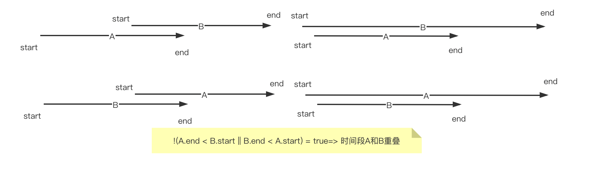

资料来源<br/>
[多个时间段取并集或交集工具类](https://www.cnblogs.com/zhangxl1016/articles/16417504.html)

## 两个时间段是否有重叠（交集）的算法：

首先要将两个时间段 按开始时间（或结束时间）生序排序。时间段A和时间段B按照结束时间生序排序后会有两种情况：

- 情况一：不重叠



情况二：重叠



**可以看到 重叠 与 不重叠 的条件是相反的。**

## java代码实现

```java
/**
     * 判断2个时间段是否有重叠（交集）
     *
     * @param startDate1 时间段1开始时间戳
     * @param endDate1   时间段1结束时间戳
     * @param startDate2 时间段2开始时间戳
     * @param endDate2   时间段2结束时间戳
     * @param isStrict   是否严格判断是否重叠 true-严格，没有任何相交或相等；false 不严格，可以首尾相等，比如 2021/5/29-2021/5/31 和 2021/5/31-2021/6/1 不重叠。
     * @return 返回是否重叠
     */
    private static boolean isOverlap(long startDate1, long endDate1, long startDate2, long endDate2, boolean isStrict) {
        if (endDate1 < startDate1) {
            throw new DateTimeException("endDate1不能小于startDate1");
        }
        if (endDate2 < startDate2) {
            throw new DateTimeException("endDate2不能小于startDate2");
        }
        if (isStrict) {
            if (!(endDate1 < startDate2 || startDate1 > endDate2)) {
                return true;
            }
        } else {
            if (!(endDate1 <= startDate2 || startDate1 >= endDate2)) {
                return true;
            }
        }
        return false;
    }

    /**
     * 判断2个时间段是否有重叠（交集）
     *
     * @param startDate1 时间段1开始时间
     * @param endDate1   时间段1结束时间
     * @param startDate2 时间段2开始时间
     * @param endDate2   时间段2结束时间
     * @param isStrict   是否严格判断是否重叠 true-严格，没有任何相交或相等；false 不严格，可以首尾相等，比如 2021/5/29-2021/5/31 和 2021/5/31-2021/6/1 不重叠。
     * @return 返回是否重叠
     */
    public static boolean isOverlap(Date startDate1, Date endDate1, Date startDate2, Date endDate2, boolean isStrict) {
        Objects.requireNonNull(startDate1, "startDate1 not is null");
        Objects.requireNonNull(endDate1, "endDate1 not is null");
        Objects.requireNonNull(startDate2, "startDate2 not is null");
        Objects.requireNonNull(endDate2, "endDate2 not is null");
        return isOverlap(startDate1.getTime(), endDate1.getTime(), startDate2.getTime(), endDate2.getTime(), isStrict);
    }


```

## 多个时间段，处理重叠时间

```java
public class DatePeriodUtil {


    /**
     * 判断2个时间段是否有重叠（交集）
     *
     * @param startDate1 时间段1开始时间戳
     * @param endDate1   时间段1结束时间戳
     * @param startDate2 时间段2开始时间戳
     * @param endDate2   时间段2结束时间戳
     * @param isStrict   是否严格判断是否重叠 true-严格，没有任何相交或相等；false 不严格，可以首尾相等，比如 2021/5/29-2021/5/31 和 2021/5/31-2021/6/1 不重叠。
     * @return 返回是否重叠
     */
    private static boolean isOverlap(long startDate1, long endDate1, long startDate2, long endDate2, boolean isStrict) {
        if (endDate1 < startDate1) {
            throw new DateTimeException("endDate1不能小于startDate1");
        }
        if (endDate2 < startDate2) {
            throw new DateTimeException("endDate2不能小于startDate2");
        }
        if (isStrict) {
            if (!(endDate1 < startDate2 || startDate1 > endDate2)) {
                return true;
            }
        } else {
            if (!(endDate1 <= startDate2 || startDate1 >= endDate2)) {
                return true;
            }
        }
        return false;
    }

    /**
     * 判断2个时间段是否有重叠（交集）
     *
     * @param startDate1 时间段1开始时间
     * @param endDate1   时间段1结束时间
     * @param startDate2 时间段2开始时间
     * @param endDate2   时间段2结束时间
     * @param isStrict   是否严格判断是否重叠 true-严格，没有任何相交或相等；false 不严格，可以首尾相等，比如 2021/5/29-2021/5/31 和 2021/5/31-2021/6/1 不重叠。
     * @return 返回是否重叠
     */
    public static boolean isOverlap(Date startDate1, Date endDate1, Date startDate2, Date endDate2, boolean isStrict) {
        Objects.requireNonNull(startDate1, "startDate1 not is null");
        Objects.requireNonNull(endDate1, "endDate1 not is null");
        Objects.requireNonNull(startDate2, "startDate2 not is null");
        Objects.requireNonNull(endDate2, "endDate2 not is null");
        return isOverlap(startDate1.getTime(), endDate1.getTime(), startDate2.getTime(), endDate2.getTime(), isStrict);
    }


    /**
     * 判断多个时间段是否有重叠（交集）
     *
     * @param timePairs 时间段数组
     * @param isStrict  是否严格判断是否重叠 true-严格，没有任何相交或相等；false 不严格，可以首尾相等，比如 2021/5/29-2021/5/31 和 2021/5/31-2021/6/1 不重叠。
     * @return 返回是否重叠
     */
    public static boolean isOverlap(TimePeriod[] timePairs, boolean isStrict) {
        if (timePairs == null || timePairs.length == 0) {
            throw new DateTimeException("timePairs不能为空");
        }

        Arrays.sort(timePairs, Comparator.comparingLong(TimePeriod::getStart));

        for (int i = 1; i < timePairs.length; i++) {
            if (isStrict) {
                if (!(timePairs[i - 1].getEnd() < timePairs[i].getStart())) {
                    return true;
                }
            } else {
                if (!(timePairs[i - 1].getEnd() <= timePairs[i].getStart())) {
                    return true;
                }
            }
        }
        return false;
    }

    /**
     * 判断多个时间段是否有重叠（交集）
     *
     * @param timePairList 时间段列表
     * @param isStrict     是否严格判断是否重叠 true-严格，没有任何相交或相等；false 不严格，可以首尾相等，比如 2021/5/29-2021/5/31 和 2021/5/31-2021/6/1 不重叠。
     * @return 返回是否重叠
     */
    public static boolean isOverlap(List<TimePeriod> timePairList, boolean isStrict) {
        if (CollectionUtil.isEmpty(timePairList)) {
            throw new DateTimeException("timePairList不能为空");
        }
        TimePeriod[] timePairs = new TimePeriod[timePairList.size()];
        timePairList.toArray(timePairs);
        return isOverlap(timePairs, isStrict);
    }

    //---------------------------------------------分割----------------------------------------------//

    /**
     * 获取日期中的最大或最小者
     *
     * @param maxOrMin true 最大值 false最小值
     * @param dates    可变参数
     * @return 最大或最小的日期
     */
    public static Date getExtremumDate(Boolean maxOrMin, Date... dates) {
        List<Date> dateList = new ArrayList<>(dates.length);
        for (Date date : dates) {
            if (date != null) {
                dateList.add(date);
            }
        }
        if (dateList.size() == 0) {
            return null;
        }
        if (maxOrMin) {
            return Collections.max(dateList);
        } else {
            return Collections.min(dateList);
        }
    }

    /**
     * 多个时间段 重叠部分取并集或交集后 的时间段列表
     *
     * @param intersectionOrUnion 重叠的时间段 是取交集 还是 并集 true:交集  false:并集
     * @param periods             时间段列表
     * @return 时间并集 Map<Date, Date> key-开始时间 value-结束时间
     */
    public static Map<Date, Date> getTimePeriodsUnion(Boolean intersectionOrUnion, List<DatePeriod> periods) {
        // 结果集
        Map<Date, Date> dateMap = new TreeMap<>();

        // 进行排序（此步骤很关键，生序排序）
        periods.sort(Comparator.comparing(DatePeriod::getEndTime));

        // 循环时间段列表
        for (DatePeriod period : periods) {
            // 时间段1 的开始时间+结束时间
            Date start1 = period.getStartTime();
            Date end1 = period.getEndTime();

            if (MapUtils.isEmpty(dateMap)) {
                // 初始化结果集
                dateMap.put(start1, end1);
            }
            // TreeMap能自动根据Key排序，只需要合并交集
            Map<Date, Date> tempMap = new TreeMap<>();
            Iterator<Map.Entry<Date, Date>> iterator = dateMap.entrySet().iterator();
            // 遍历结果集dateMap
            while (iterator.hasNext()) {
                Map.Entry<Date, Date> entry = iterator.next();
                // 时间段2 的开始时间+结束时间
                Date start2 = entry.getKey();
                Date end2 = entry.getValue();

                // 判断两个时间段是否有重叠
                if (DatePeriodUtil.isOverlap(start1, end1, start2, end2, false)) {
                    // 有重叠，移除此时间段。
                    iterator.remove();
                    if (intersectionOrUnion) {
                        // 取交集
                        tempMap.put(DatePeriodUtil.getExtremumDate(true, start1, start2), DatePeriodUtil.getExtremumDate(false, end1, end2));
                    } else {
                        // 取并集
                        tempMap.put(DatePeriodUtil.getExtremumDate(false, start1, start2), DatePeriodUtil.getExtremumDate(true, end1, end2));
                    }
                } else {
                    // 本次遍历没有重叠
                    if (!iterator.hasNext()) {
                        // 当遍历到最后一个时间段，说明时间段 start1-end1 和 结果集中所有时间段都不重叠，直接添加即可。
                        tempMap.put(start1, end1);
                    }
                }
            }
            dateMap.putAll(tempMap);
        }
        return dateMap;
    }
}


/**
 * 时间段
 */
class TimePeriod {
    TimePeriod(long start, long end) {
        if (end < start) {
            throw new DateTimeException("end不能小于start");
        }
        this.start = start;
        this.end = end;
    }

    private long start;

    private long end;

    public long getStart() {
        return start;
    }

    public void setStart(long start) {
        this.start = start;
    }

    public long getEnd() {
        return end;
    }

    public void setEnd(long end) {
        this.end = end;
    }

}

/**
 * 时间段
 */
class DatePeriod {

    /**
     * 开始时间
     */
    @DateTimeFormat(pattern = "yyyy-MM-dd HH:mm:ss")
    private Date startTime;

    /**
     * 结束时间
     */
    @DateTimeFormat(pattern = "yyyy-MM-dd HH:mm:ss")
    private Date endTime;

    public Date getStartTime() {
        return startTime;
    }

    public void setStartTime(Date startTime) {
        this.startTime = startTime;
    }

    public Date getEndTime() {
        return endTime;
    }

    public void setEndTime(Date endTime) {
        this.endTime = endTime;
    }

    public static void main(String[] args) {
        DatePeriod datePeriod = new DatePeriod();
        datePeriod.setStartTime(new Date());
        datePeriod.setEndTime(new Date());
        System.out.println("ok");
        new Date();
    }
}
```

