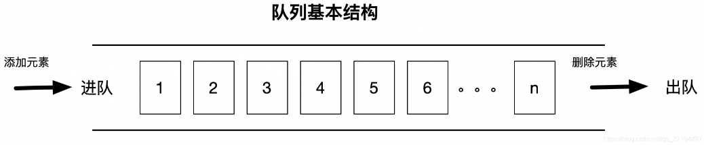
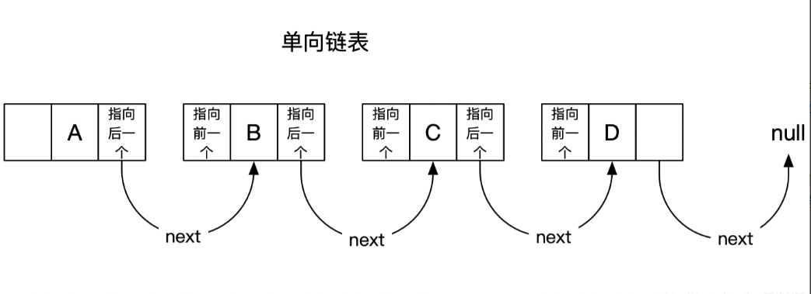
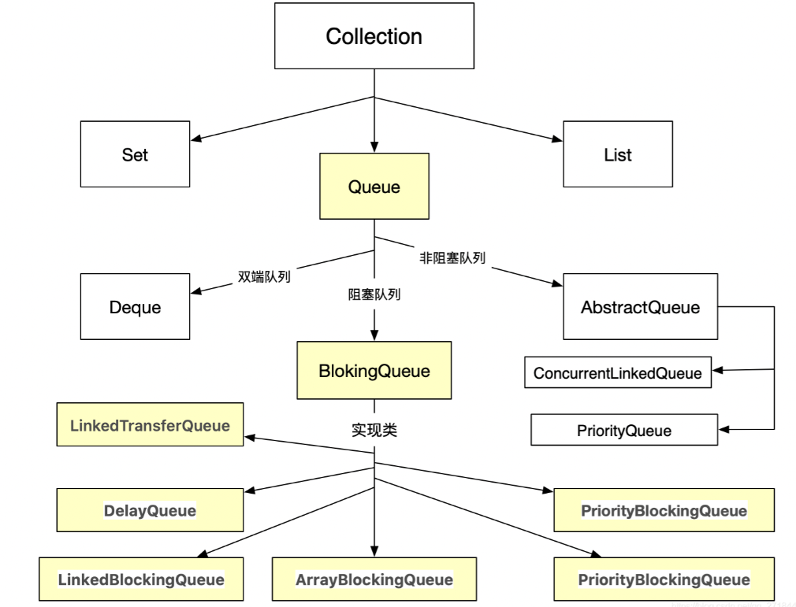

资料来源：<br/>
[Java中的5大队列，你知道几个？](https://www.toutiao.com/article/6886612634859536900/?log_from=ac58831c58baa_1650432268817)<br/>
[JAVA队列（ Queue ) 详解](https://www.toutiao.com/article/7082294108403892774/?channel=&source=search_tab)<br/>
[基础篇：JAVA集合，面试专用](https://juejin.cn/post/7024775152231514142)


##  Queue（队列）

### 什么是队列？

队列是一种特殊的线性表，遵循先入先出、后入后出的基本原则，一般来说，它只允许在表的前端进行删除操作，而在表的后端进行插入操作，但是java的某些队列运行在任何地方插入删除；比如我们常用的 LinkedList 集合，它实现了Queue 接口，因此，我们可以理解为 LinkedList 就是一个队列；




java队列特性

> 队列主要分为阻塞和非阻塞，有界和无界、单向链表和双向链表之分；

阻塞和非阻塞

- 阻塞

>入列(删除元素)时，如果元素数量超过队列总数，会进行等待（阻塞），待队列的中的元素出列后，元素数量未超过队列总数时，就会解除阻塞状态，进而可以继续入列；
>
>出列(添加元素)时，如果队列为空的情况下，也会进行等待（阻塞），待队列有值的时候即会解除阻塞状态，进而继续出列；
>
>阻塞队列的好处是可以防止队列容器溢出；只要满了就会进行阻塞等待；也就不存在溢出的情况；
>
>只要是阻塞队列，都是线程安全的；

- 非阻塞

> 不管出列还是入列，都不会进行阻塞，
>
> 入列时，如果元素数量超过队列总数，则会抛出异常，
>
> 出列时，如果队列为空，则取出空值；
>
> 一般情况下，非阻塞式队列使用的比较少，一般都用阻塞式的对象比较多；阻塞和非阻塞队列在使用上的最大区别就是阻塞队列提供了以下2个方法：
>
> 出队阻塞方法 ： take()
>
> 入队阻塞方法 ： put()

有界和无界

> 有界：有界限，大小长度受限制
>
> 无界：无限大小，其实说是无限大小，其实是有界限的，只不过超过界限时就会进行扩容，就行ArrayList 一样，在内部动态扩容

单向链表和双向链表

- 单向链表

> 单向链表 ： 每个元素中除了元素本身之外，还存储一个指针，这个指针指向下一个元素；



### 队列接口继承图




队列常用方法

~~~~c
　　add 增加一个元索 如果队列已满，则抛出一个IIIegaISlabEepeplian异常
　　remove 移除并返回队列头部的元素 如果队列为空，则抛出一个NoSuchElementException异常
　　element 返回队列头部的元素 如果队列为空，则抛出一个NoSuchElementException异常
　　offer 添加一个元素并返回true 如果队列已满，则返回false
　　poll 移除并返问队列头部的元素 如果队列为空，则返回null
　　peek 返回队列头部的元素 如果队列为空，则返回null
　　put 添加一个元素 如果队列满，则阻塞
　　take 移除并返回队列头部的元素 如果队列为空，则阻塞
   drainTo(list) 一次性取出队列所有元素
~~~~

>  知识点： remove、element、offer 、poll、peek 其实是属于Queue接口。

非阻塞队列

> 1、ConcurrentLinkedQueue
>
> 单向链表结构的无界并发队列, 非阻塞队列，由CAS实现线程安全，内部基于节点实现
>
> 2、ConcurrentLinkedDeque
>
> 双向链表结构的无界并发队列, 非阻塞队列，由CAS实现线程安全
>
> 3、PriorityQueue
>
> 内部基于数组实现，线程不安全的队列

阻塞队列

> 1、DelayQueue
>
> 一个支持延时获取元素的无界阻塞队列
>
> 2、LinkedTransferQueue
>
> 一个由链表结构组成的无界阻塞队列。
>
> 3、ArrayBlockingQueue
>
> 有界队列，阻塞式,初始化时必须指定队列大小，且不可改变；，底层由数组实现；
>
> 4、SynchronousQueue
>
> 最多只能存储一个元素，每一个put操作必须等待一个take操作，否则不能继续添加元素
>
> 5、PriorityBlockingQueue
>
> 一个带优先级的队列，而不是先进先出队列。元素按优先级顺序被移除，而且它也是无界的，也就是没有容量上限，虽然此队列逻辑上是无界的，但是由于资源被耗尽，所以试图执行添加操作可能会导致 OutOfMemoryError 错误；

## 队列
- Queue的概念 队列是一种特殊的线性表，只允许元素从队列一端入队，而另一端出队（获取元素），就像我们平时排队结算一样（懂文明讲礼貌不插队）。Queue 的数据结构和 List 一样，可以基于数组，链表实现，队列通常都是一端进(offer)，另一端出(poll)，有序性

### PriorityQueue

- PriorityQueue是按优先级排序的队列，也就是说 vip 可以插队。优先队列要求使用 Java Comparable 和 Comparator 接口给对象排序，并且在排序时会按照优先级处理其中的元素
- PriorityBlockingQueue 是线程安全的PriorityQueue

### BlockingQueue

- BlockingQueue很好的解决了多线程中，如何高效安全“传输”数据的问题。通过这些高效并且线程安全的队列类，为我们快速搭建高质量的多线程程序带来极大的便利。常用于线程的任务队列
- DelayQueue
  - DelayQueue是一个没有边界BlockingQueue实现，加入元素必需实现Delayed接口。当生产者线程调用put之类的方法加入元素时，会触发 Delayed 接口中的compareTo方法进行排序
  - 消费者线程查看队列头部的元素，注意是查看不是取出。然后调用元素的getDelay方法，如果此方法返回的值小0或者等于0，则消费者线程会从队列中取出此元素，并进行处理。如果getDelay方法返回的值大于0，则消费者线程阻塞到第一元素过期

### Queue 的 API

```java
boolean add(E e); //加入队列尾部
boolean offer(E e); // 加入队列尾部，并返回结果
E remove(); //移除头部元素
E poll();  // 获取头部元素，并移除
E element(); // 获取头部元素，不存在则报错
E peek(); // 获取头部元素，不移除
```

## Deque（双向队列）

- Deque接口代表一个"双端队列"，双端队列可以同时从两端来添加、删除元素，因此Deque的实现类既可以当成队列使用、也可以当成栈使用
- Deque 的子类 LinkedList，ArrayDeque，LinkedBlockingDeque

### Deque的 API

```java
void addFirst(E e); //加入头部
void addLast(E e);  //加入尾部
boolean offerFirst(E e); //加入头部，并返回结果
boolean offerLast(E e); //加入尾部，并返回结果
E removeFirst(); // 移除第一个元素
E removeLast(); // 移除最后一个元素
E getFirst(); //获取第一个元素,不存在则报错
E getLast();  //获取最后一个元素,不存在则报错
E pollFirst(); //获取第一个元素,并移除
E pollLast(); //获取最后一个元素,并移除
E peekFirst(); //获取第一个元素
E peekLast(); // 获取最后一个元素
void push(E e); //加入头部
E pop(); //弹出头部元素
```

