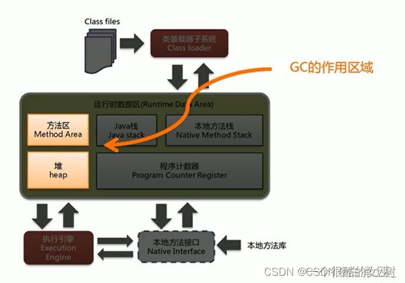
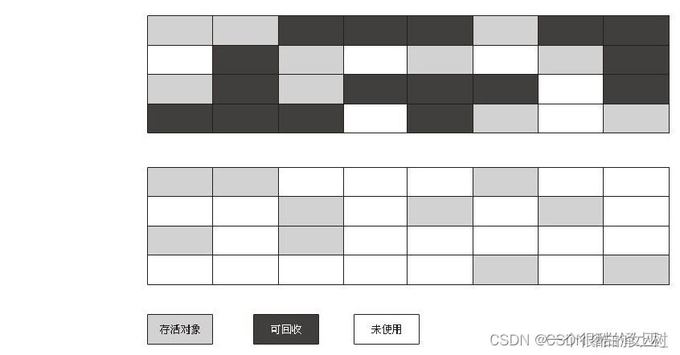
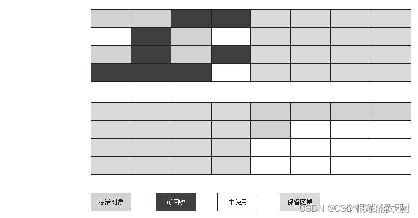
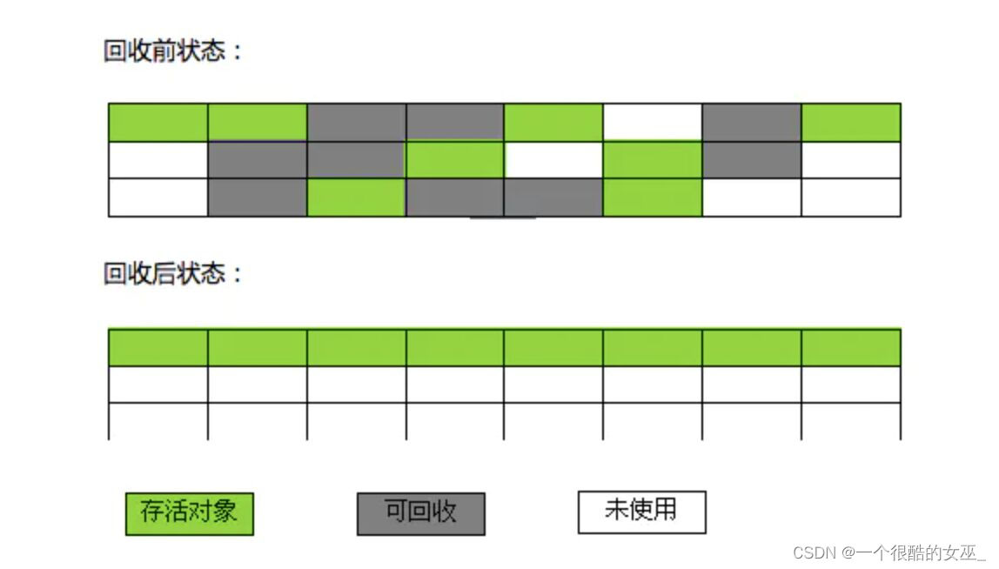

资料来源： 
[【JVM】万字详解垃圾回收机制（面试常问）](https://blog.csdn.net/weixin_48271092/article/details/125330239?spm=1001.2014.3001.5502&ydreferer=aHR0cHM6Ly9ibG9nLmNzZG4ubmV0L3dlaXhpbl80ODI3MTA5Mi9hcnRpY2xlL2RldGFpbHMvMTI1MzMwMjM5P3NwbT0xMDAxLjIwMTQuMzAwMS41NTAy)

## 垃圾回收的区域

JVM的内存结构包括5大区域：方法区，堆区，虚拟机栈，本地方法栈，程序计数器。

对于程序计数器、虚拟机栈、本地方法栈这三部分而言，他们的生命周期与相关线程有关，**随线程而生，随线程而灭**，因此这几个区域的内存分配和回收都具备确定性，就不需要过多考虑回收的问题，**因为方法结束或者线程结束时，内存自然就跟随着回收了**。

而JAVA**堆区和方法区**不一样，这部分内存的分配和回收都是**动态**的，也就是垃圾收集器所关注的地方了。

在进行垃圾回收之前，首先要判断哪些对象还存活着，哪些对象已经“死去”，判断对象是否已“死”有以下几种算法：

### 死亡对象的判断算法

#### 引用计数算法
给对象增加一个引用计数器，每当有一个地方引用它时，计数器就加1；当引用失效时，计数器就减一，任何时刻计数器为0的对象就是不能再被使用的，即“死亡对象”。
这个算法简单高效，就是无法解决对象之间循环引用的问题。
所谓**循环引用**就是对象A和对象B相互依赖，但是外界已经不再指向该对象，本该回收，但是引用计数算法会使得A和B的计数 都是1，导致无法回收，这就是引用计数算法的缺点，因此当前主流的JVM都没有使用引用计数算法。

#### 可达性分析算法
上面我们提到主流的JVM都不采用引用计数法，而是都采用可达性分析算法。
该算法的核心思想：通过一系列称为“GC Roots”的对象作为起始点，从这些节点开始向下搜索，搜索的路径称之为“引用链”，**当一个对象到GC Roots没有任何的引用链相连时（从GC Roots到这个对象不可达时），证明这个对象是不可用的。**

图中的obj4、obj5、obj6就会被认为是死亡对象，因为从GC Roots出发这几个对象已经不可达。

在java语言中，可作为GC Roots对象包含下面几种：

- 虚拟机栈中引用的对象

- 方法区中类静态属性引用的对象

- 方法区中常量引用的对象

- 本地方法栈中Native引用的对象

总结以下：除了堆空间外的一些结构，比如虚拟机栈、本地方法栈、方法区、字符串常量池等地方对堆空间进行引用的，都可以作为GC Roots进行可达性分析。

#### 二次标记回收对象

不可达对象将暂时处于“缓刑”阶段，要真正宣告一个对象死亡，至少要经历两次标记的过程：

- 如果对象在进行可达性分析后发现没有与GC Roots相连接的引用链，那它将会被第一次标记并且进行一次筛选，筛选的条件是此对象是否有必要执行finalize()方法。
- 当对象没有重写finalize()方法，或者finalize()方法已经被虚拟机调用过，虚拟机将这两种情况都视为“没有必要执行”，直接进行第二次标记。
- 如果这个对象被判定为有必要执行finalize()方法，那么这个对象被判定为有必要执行finalize()方法，那么这个对象将会放置在一个叫做F-Queue的队列之中，并在稍后由一个虚拟机自动创建的、低优先级的Finalizer线程去执行它。

这里的“执行”是指虚拟机会触发这个方法，但并不承诺会等他运行结束。

finalize()方法运行在子类中被重写，**用于在对象被回收时进行资源释放**，通常在这个方法中进行一些资源释放和清理的工作比如关闭文件，套接字和数据库连接等。

### JAVA中的四种引用

DK1.2时，JAVA对引用的概念做了扩充，将引用分为强引用、软引用、弱引用和虚引用。

1、强引用(Strong Reference):强引用指的是在程序代码之中普遍存在的，类似于“Object obj=new Object()”这类的引用，只要强引用还在，**垃圾回收器永远不会回收掉被引用的对象实例**。

2、软引用(Soft Reference):软引用是用来描述一些还有用但是不是必须的对象。**在系统要发生内存溢出之前，会把这些对象列入回收范围之中进行第二次回收**。在JDK1.2之后提供了SoftReference类来实现软引用。

3、弱引用(Weak Reference):用来描述非必需对象。**被弱引用关联的对象只能生存到下一次垃圾回收发生之前**。当垃圾回收器开始工作时不管当前内容是否够用，都会回收掉弱引用关联的对象，在JDK1.2之后提供了WeakReference类来实现弱引用。

4、虚引用(Phantom Reference):最弱的一种引用关系，无法通过虚引用来取得一个对象的实例。**为一个对象设置虚引用的唯一目的就是能在这个对象被收集器回收时收到一个系统通知**。

## 垃圾回收算法

上面讲了死亡对象的标记方法，那么标记好死亡对象之后，我们就可以开始进行垃圾回收了。
垃圾回收是由垃圾回收器实现的，但是我们在学习垃圾回收器之前，先来看几个垃圾回收器使用的算法。
### 标记-清除算法
最基础的手机算法，分为标记和清除两个阶段：首先标记出所有需要回收的对象，在标记完成后统一回收所有被标记的对象。
它的缺点：

- 效率问题：标记和清除这两个过程效率都不高
- 空间问题：标记清除后会产生大量不连续的内存碎片，空间碎片太多可能会导致以后在程序中需要分配较大对象时，无法找到足够大的连续内存而不得不提前触发另一次垃圾收集。

### 复制算法

复制算法是为了解决效率问题，它将可用内存按容量划分为大小相等的两块，每次只使用其中的一块。当这一块内存用完了，就将还存活着的对象复制到另外一块上面，然后再把已使用过的内存空间一次清理掉。这样使得每次都是对整个半区进行内存回收，内存分配也不用再考虑内存碎片等复杂情况，只要移动堆顶指针，按顺序分配内存即可，实现简单，运行高效。只是这种算法的代价是将内存缩小为原来的一半。

现代的商用虚拟机采用这种算法来回收新生代：

堆中的新生代中的98%的对象都是“朝生夕死”的，所有不需要按照1：1来划分内存空间，而是将内存(新生代内存)分为一块较大的Eden空间和两块较小的Survivor空间，每次使用Eden和其中一块Survivor。当回收时，将Eden和Survivor中还存活着的对象一次性复制到另一块Survivor空间上，最后清理掉Eden和刚才用过的Survivor空间。

HotSpot默认Eden与Survivor的大小比例是8：1：1，也就是说Eden:Survivor From : Survivor To=8：1：1，根据上面的算法流程可知，每次新生代可用内存空间为整个新生代容量的90%，而剩下的10%用来存放回收后存活的对象。

### 标记-整理算法

复制算法再存活率比较高时会进行比较多的复制操作，效率会变低。并且在复制算法中如果Survivor空间不足的话，需要老年代进行内存分配担保（前提：老年代的最大可用的连续空间是否大于新生代所有对象的总空间），因此在老年代一般不能使用复制算法。

针对老年代的特点，提出了一种称之为“标记-整理”算法，标记过程与“标记-清除”过程一致，但后续步骤不是直接对可回收对象进行回收，而是让所有存活对象都向一端移动，然后直接清理掉端边界以外的内存。

### 分代收集算法

这个算法就是将堆内存划分为新生代、老年代。在**新生代**中，每次垃圾回收都有大批对象死去，只有少量存活，因此我们使用**复制算法**，而**老年代**中对象存活率高、没有额外空间对它进行分配担保，就必须**采用“标记-清除”或“标记-整理”算法**。

## Minor GC 与 Full GC

GC的分类：

- 新生代GC(Minor GC/Scavenge GC):发生在新生代的垃圾 动作。因为大多Java对象都具有朝生夕灭的特性，因此Minor GC非常频繁（不一定等Eden区满了才触发），一般回收速度也比较快。在新生代中，每次垃圾收集时都会发现有大量对象死去，只有少量存活，因此可采用复制算法来完成收集。
- 老年代GC(Major GC/Full GC):发生在老年代的垃圾回收动作。Major GC经常会伴随至少一次Minor GC。由于老年代中的对象生命周期较长，因此Major GC并不频繁，一般都是等老年代满了之后才进行Major GC,而且其速度一般会比Major GC慢10倍以上。
  