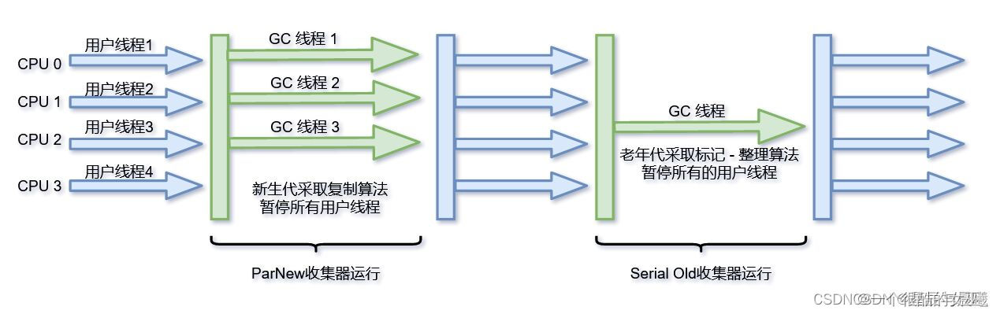

资料来源： 
[【JVM】万字详解垃圾回收机制（面试常问）](https://blog.csdn.net/weixin_48271092/article/details/125330239?spm=1001.2014.3001.5502&ydreferer=aHR0cHM6Ly9ibG9nLmNzZG4ubmV0L3dlaXhpbl80ODI3MTA5Mi9hcnRpY2xlL2RldGFpbHMvMTI1MzMwMjM5P3NwbT0xMDAxLjIwMTQuMzAwMS41NTAy)

## 垃圾回收器的分类

### 按线程数

可以分为串行垃圾回收器和并行垃圾回收器。 

- **串行垃圾回收**：指的是在同一个时间段内只允许有一个CPU用于执行垃圾回收的操作，此时工作线程被暂停，直至垃圾回收工作结束。 
- **并行垃圾回收**：是和串行垃圾回收相反的，并行运算可以拥有多个CPU同时执行垃圾回收。与串行垃圾回收一致，采用独占式，使用`Stop The World机制`，在回收的时候需要暂停所有的线程。 

### 按照工作模式

可以分为并发式垃圾回收器和独占式垃圾回收器。 
**并发式垃圾回收**：与应用程序交替工作，以尽可能减少应用程序的停顿时间。 
**独占式垃圾回收器**：一旦运行，就停止应用程序中所有用户线程，直到垃圾回收的过程完全结束 

### 按照工作的内存区间

又分为年轻代垃圾回收器和老年代垃圾回收器 
**年轻代垃圾回收器**：效率高，采用复制算法，但对内存的占用控制不精确，容易造成内存溢出。 
**老年代垃圾回收器**：效率低，在执行的时候会STW（独占式执行），但一般启动次数少 

### **GC的性能指标**：

1.**吞吐量**：吞吐量=运行用户代码的时间/(运行用户代码时间+垃圾收集的时间) 
2.**垃圾收集开销**：垃圾收集所用时间与总运行时间的比例 
3.**暂停时间**：执行垃圾收集时，程序的工作线程被暂停的时间 

## 垃圾收集器

### HotSpot虚拟机中的垃圾收集器

以下是HotSpot虚拟机随着不同版本推出的垃圾收集器： 

如果两个收集器之间存在连线，就说明他们之间可以搭配使用，上图中收集器所处的位置代表了他是新生代收集器或者是老年代收集器。

- 串行收集器：Serial,Serial old; 
- 并行回收器：ParNew,Parallel Scavenge,Parallel Old; 
- 并发回收器：CMS，G1; 

> **并行**：描述的是多条垃圾收集器线程之间的关系。 
> 说明同一时间有多条这样的线程协同工作，通常默认此时用户线程是处于等待状态。 
> **并发**：并发描述的是垃圾收集器与用户线程之间的关系 
> 说明同一时间垃圾收集器线程与用户线程都在运行。由于用户线程不是被冻结，所以程序仍然能够响应服务请求的，但由于垃圾收集器线程占有了一部分的系统资源，此时应用程序的处理的吞吐量将会受到一定的影响。 

### Serial垃圾收集器

**特性**：是一个单线程收集器，只用一个CPU或一条线程去收集垃圾，并且在进行垃圾收集时必须暂停其他所有的工作线程，直到它收集结束。 

运行图：

**优势**：简单高效，采用复制算法，对于单CPU环境，Serial收集器由于没有线程交互的开销，专心做垃圾收集可以获得最高的单线程收集效率。

**应用场景**：适用Client模式下的虚拟机。

### Serial Old垃圾收集器

**特性**：是Serial收集器的老年代版本，它同样是一个单线程收集器，使用**标记-整理**算法。

**应用场景**：适用于Client模式下的虚拟机，也可在Server模式下适用。

### ParNew垃圾收集器 
是Serial收集器的多线程版本，在实现上，这两种收集器也共用了相当多的代码。 

特性：多线程，ParNew收集器默认开启的收集线程数与CPU数量相同，在CPU非常多的环境中，可使用 -XX:ParallelGCThreads参数来限制垃圾收集的线程，和Serial收集器一样存在STW的问题。 

**应用场景**：ParNew收集器是许多运行在Server模式下虚拟机中首选的新生代收集器，因为它是除了Serial收集器外，唯一一个能与CMS收集器配合工作的。

###  Parallel Scavenge垃圾收集器
Parallel Scavenge是一个新生代垃圾收集器，所以它也是采用复制算法实现，同时它还是并行收集的垃圾收集器。

特性：Parallel Scavenge收集器使用两个参数来控制吞吐量：

- -XX:MaxGCPauseMillis 控制最大的垃圾收集停顿时间 
- -XX:GCRatio 直接设置吞吐量的大小 
GC停顿的时间的缩短是以牺牲吞吐量和新生代空间作为代价的。 

应用场景：停顿时间越短就越适合与用户交互的程序，响应时间短，用户的体验感就比较好。高吞吐量适合在后台运算而不需要太多交互的任务。

对比：

- Parallel Scavenge VS CMS收集器： Parallel Scavenge的关注点与其他垃圾收集器关注的点不同， Parallel Scavenge关注的是达到一个可控制的吞吐量，而CMS等其他收集器关注的是尽可能缩短垃圾收集时用户线程的停顿时间。 
- Parallel Scavenge VS ParNew： Parallel Scavenge与ParNew的一个重要区别是它具有自适应调节策略。 
  自适应调节策略：不需要手工指定新生代大学校、Eden与Survivor区的比例、晋升老年代对象的年龄等这些细节的参数了。虚拟机会根据当前系统的运行情况动态调整这些参数以提供最适合的停顿时间或者最大吞吐量。 

### Parallel Old垃圾收集器
是 Parallel Scavenge收集器的老年代版本。

**特性**：支持多线程并发，采用标记-整理算法。

这个收集器在JDK1.6才开始提供，在这之前，Parallel Scavenge一直处于比较尴尬的境地，因为如果新生代垃圾收集器选择了Parallel Scavenge收集器，那么老年代垃圾收集器中除了Serial Old收集器，其他别无可选。比如CMS是无法配合它工作的。由于Serial Old的性能拖累，使得Parallel Scavenge 收集器没有办法在整体上获得吞吐量最大化的效果。直到Parallel Old出现后才有了“吞吐量优先”的比较名副其实的应用组合。 

**应用场景**：在注重吞吐量或者处理器资源较为稀缺的场合，都可以优先考虑Parallel Scavenge+Parallel Old这个组合。

### CMS垃圾收集器
**特性**：**是一种以获取最短回收停顿时间为目标的收集器**。
CMS收集器基于“标记-清除”算法实现，它的运作过程比较复杂，分为以下四个步骤：

- 初始标记：这个阶段仅是标记一下GC Roots能关联到的对象，速度很快，需要STW。 
- 并发标记：这个阶段就是从GC Roots的直接关系对象开始遍历整个对象图的过程，这个过程耗时较长，但是不需要停顿用户线程，可以和垃圾收集线程一起并发执行。 
- 重新标记：这个阶段则是为了修正并发标记期间，因用户程序继续运作而导致标记产生变动的那一部分对象的标记记录，这个阶段的停顿时间会比初始标记稍长一点，但远比并发标记时间短，仍需STW。 
- 并发清除：这个阶段，就是清理删除掉标记阶段已经死亡掉的对象，由于不需要移动存活的对象，所以这个阶段也是可以和用户线程同时并发的。 
 

由于在整个过程中，最耗时的并发标记和清除的过程都是与用户线程并发的，所以从总体上看，CMS收集器的内存回收过程是与线程一期并发执行的。

**优点**：并发收集、低停顿。 
**缺点**：会占用一部分线程而导致应用程序变慢，降低总吞吐量。会产生大量内存碎片，空间碎片过多时，可能会提前触发一次Full GC。 

### G1垃圾收集器
G1是用在堆空间很大的情况下，把堆划分成很多大小相等的区域，每个区域叫做Region。 
G1是面向服务端应用的垃圾收集器。 

G1中的内存布局如下：

region分为Eden、Survivor、Old、Humongous区域，Humongous是用来存储大对象的，某个对象超过了region的一半旧认为是大对象，如果这个对象超级大，，就放在多个连续的Humongous里。 
G1会将Humongous看作老年代来处理。 

**设计思想**：

- 跟踪每个region中的垃圾堆积的价值大小 
- G1在后台构建一个优先列表，根据允许的收集时间，优先回收价值高的region,这样就可以获得更高的回收效率。 

垃圾回收机制：

- Young GC：当所有的Eden都满了之后，就会触发Young GC,所有的Eden里面的对象就会转移到新的Survivor region中，或者晋升到Old region,最后空闲的region会被放入空闲的列表中，等待下次使用。 
- Mixed GC：当老年代大小占整个堆的百分比达到一定阈值时(可用-- - - XX:InitiatingHeapOccupancyPercent指定，默认45%)，就会触发Mixed GC,Mixed GC会回收所有的Young region,同时回收部分Old Region。 
Mixed GC:

**特点**：可以作用在整个堆，没有内存碎片，

HotSpot赋予它的使命是未来可以替换掉JDK1.5中发布的CMS收集器。