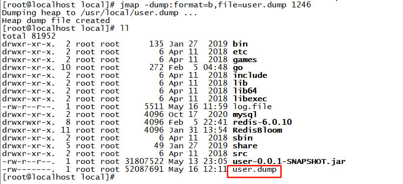
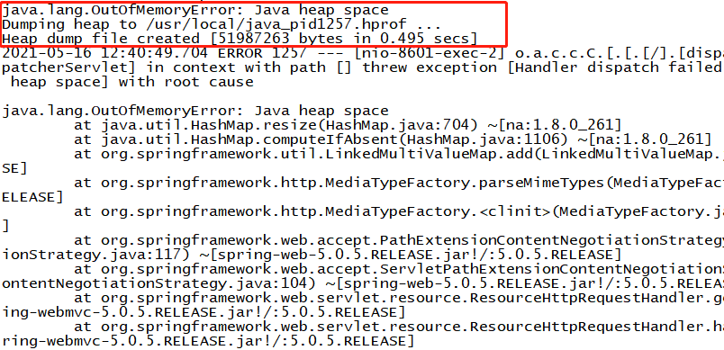
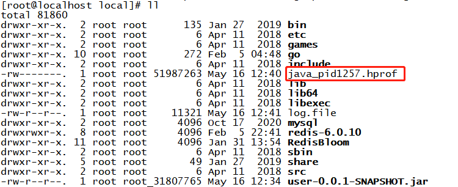
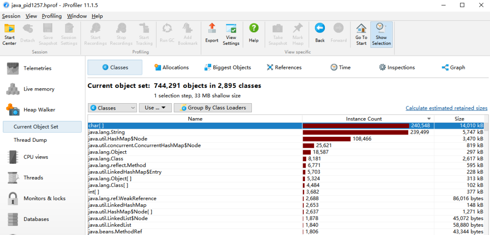
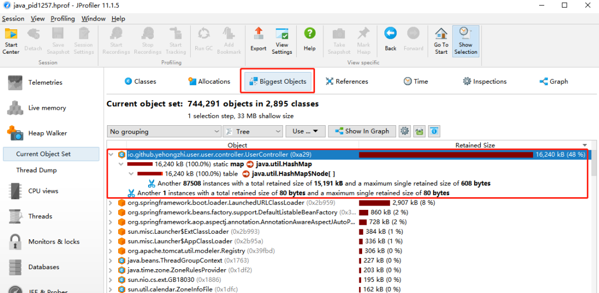

资料来源：<br/>
[OOM怎么办，教你生成dump文件以及查看](https://mp.weixin.qq.com/s/Xt6k-_7m-gwlZKXNNbUpbg)


## Dump 介绍

在日常开发中，即使代码写得有多谨慎，免不了还是会发生各种意外的事件，比如服务器内存突然飙高，又或者发生内存溢出(OOM)。当发生这种情况时，我们怎么去排查，怎么去分析原因呢？

这时就引出这篇文章要讲的dump文件，各位看官且往下看。

### 什么是dump文件

dump文件是一个进程或者系统在某一个给定的时间的快照。

dump文件是用来给驱动程序编写人员调试驱动程序用的，这种文件必须用专用工具软件打开。

dump文件中包含了程序运行的模块信息、线程信息、堆栈调用信息、异常信息等数据。

在服务器运行我们的Java程序时，是无法跟踪代码的，所以当发生线上事故时，dump文件就成了一个很关键的分析点。

### 生成dump

#### 方式一

主动生成dump文件。首先要查找运行的Java程序的pid。

使用`top`命令：


然后使用jmap命令生成dump文件。file后面是保存的文件名称，1246则是java程序的PID。

```shell
jmap -dump:format=b,file=user.dump 1246
```



#### 方式二

其实在很多时候我们是不知道何时会发生OOM，所以需要在发生OOM时自动生成dump文件。

其实很简单，只需要在启动时加上如下参数即可。HeapDumpPath表示生成dump文件保存的目录。

```java
-XX:+HeapDumpOnOutOfMemoryError -XX:HeapDumpPath=D:\tmp
```

我们还需要模拟出OOM错误，以此触发产生dump文件，首先写个接口：

```java
private static Map<String, String> map = new HashMap<>();

@RequestMapping("/oom")
public String oom() throws Exception {
    for (int i = 0; i < 100000; i++) {
        map.put("key" + i, "value" + i);
    }
    return "oom";
}
```

然后在启动时设置堆内存大小为32M。

```shell
-Xms32M -Xmx32M
```

因为要后台启动，并且输出日志，所以最后启动命令就是这样：

```shell
nohup java -jar -Xms32M -Xmx32M -XX:+HeapDumpOnOutOfMemoryError -XX:HeapDumpPath=/usr/local user-0.0.1-SNAPSHOT.jar  > log.file  2>&1 &
```

然后请求oom的接口，查看日志，果然发生了OOM错误。



查看保存dump的目录，果然生成了对应的dump文件。



### 如何查看dump文件

这里我介绍使用`Jprofiler`，有可视化界面，功能也比较完善，能够打开JVM工具(通过-XX:+HeapDumpOnOutOfMemoryError JVM参数触发)创建的hporf文件。

安装过程这里就省略了，网上谷歌，百度自行查找。我们把刚刚自动生成的`java_pid1257.hprof`用`Jprofiler`打开，看到是这个样子。



明显可以看出HashMap的Node对象，还有String对象的实例很多，占用内存也是最多的。这里还不够明显，我们看Biggest Objects。



这里就看出是UserController类的HashMap占用了大量的内存。所以造成OOM的原因不难看出，就是在UserController里的Map集合。

### 总结

当然线上的代码量，类的数量，实例的数量都非常庞大，所以没有那么简单就能找出报错的原因，但是要用什么工具，怎么用至少要知道，那么当遇到问题时，才不会慌张。

我问过一些技术大佬，为什么技术大佬代码写得不是很多，但是工资却特别高。大佬说，那是因为当线上出现问题时，大佬能解决大家解决不了的问题，这种能力就体现出他个人的价值。

一句话讲完，业务代码大部分程序员都会写，而线上排错能力并不是大部分程序员都会排。

这篇文章就讲到这里了，感谢大家的阅读，希望看完大家能有所收获！