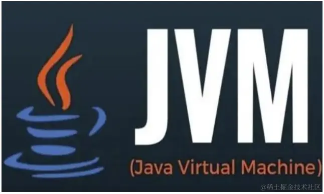
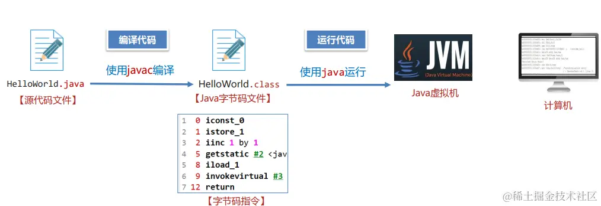
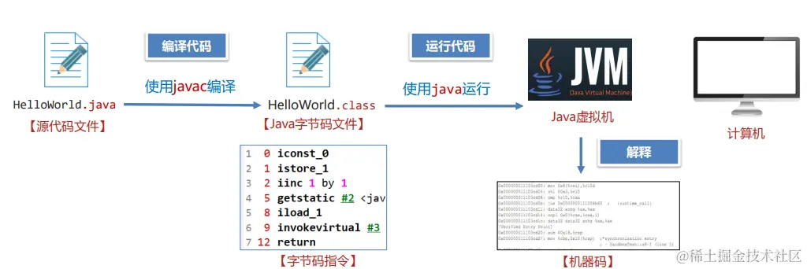
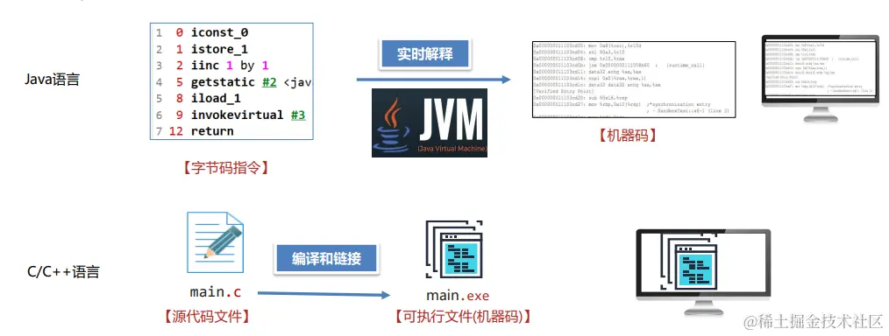
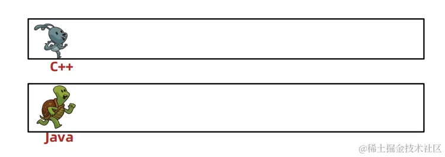
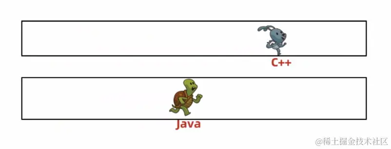
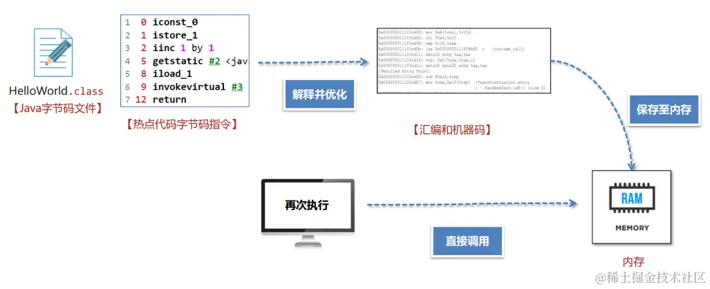
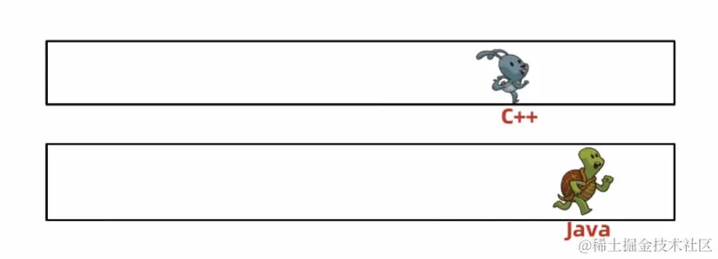
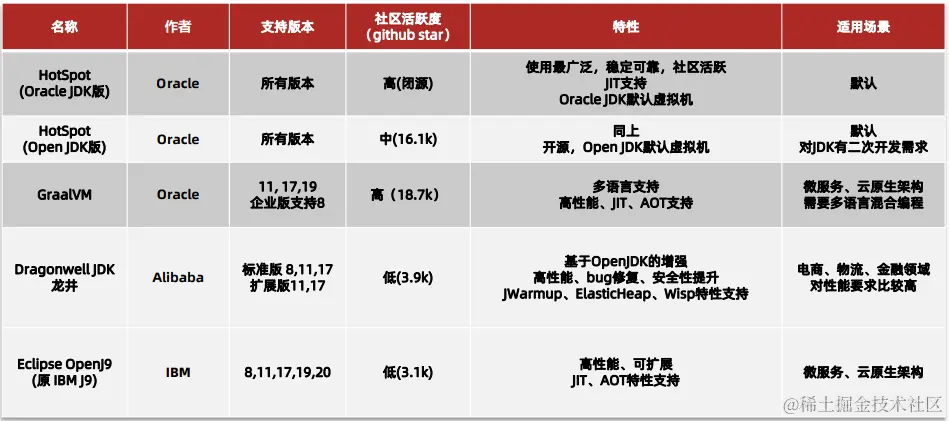
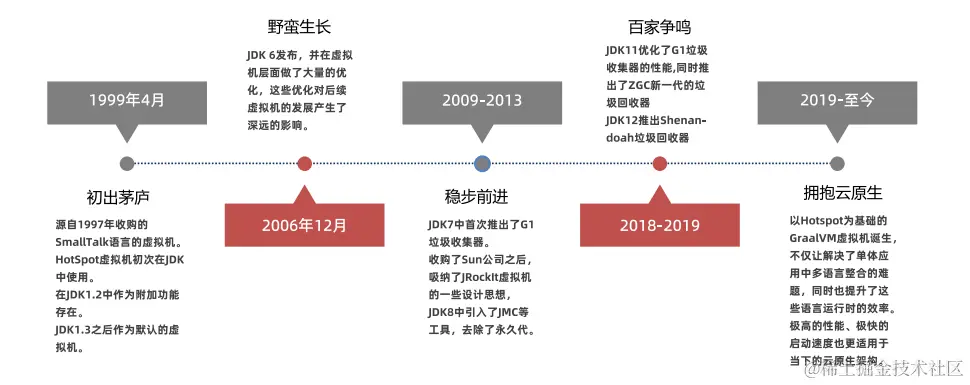

资料来源： 
[JVM系列-1.初识JVM](https://juejin.cn/post/7325979519477776384) 

# 初识JVM

## 什么是JVM

JVM 全称是 Java Virtual Machine，中文译名 Java虚拟机。

JVM 本质上是一个运行在计算机上的程序，他的职责是运行Java字节码文件。

Java虚拟机主要是将字节码转换成机器码

最后将机器码交给计算机去运行

从上面就可以看到JVM的一个功能，解释和运行

从功能上来看，JVM主要有：

## JVM的功能 - 即时编译

Java语言如果不做任何优化，性能不如C、C++等语言。

java需要将字节码指令实时的通过java虚拟机解释成机器码，才可以交给计算机去运行。这个过程随着程序的执行需要反复的进行。所以每一次运行都需要花费一定的时间。但是c和c++在编译过程中直接可以将你的源代码文件转换成计算机认可的机器码，只需要将机器码运行就可以得到最终结果。节省了一个解释的过程。

而java之所以要这样做主要是为了支持跨平台特性。将一份字节码指令交给linux或者windows不同的平台，这些平台上会安装不一样的java虚拟机，它们分别将其解释成当前平台的机器码，然后就可以交给不同的操作系统去运行了。

正如c和c++追求性能不具备跨平台特性，而java跨平台性能相对差一些。

由于JVM需要实时解释虚拟机指令，不做任何优化性能不如直接运行机器码的C、C++等语言。

### 即时编译

虚拟机如果发现这段指令是热点代码，也就是在很短的时间内被多次调用，那么就会认为这段代码有必要去优化，将这段代码保存在内存中，当第二次执行的时候，从内存中直接调用即可。这样就省略了一次解释的步骤，提升了性能。

JVM提供了即时编译（Just-In-Time 简称JIT) 进行性能的优化，最终能达到接近C、C++语言的运行性能甚至在特定场景下实现超越。

### 常见的JVM

《Java虚拟机规范》由Oracle制定，内容主要包含了Java虚拟机在设计和实现时需要遵守的规范，主要包含class字节码文件的定义、类和接口的加载和初始化、指令集等内容。

《Java虚拟机规范》是对虚拟机设计的要求，而不是对Java设计的要求，也就是说虚拟机可以运行在其他的语言比如Groovy、Scala生成的class字节码文件之上。

### HotSpot的发展历程

作者：爱吃芝士的土豆倪 
链接：https://juejin.cn/post/7325979519477776384 
来源：稀土掘金 
著作权归作者所有。商业转载请联系作者获得授权，非商业转载请注明出处。 