资料来源：<br/>
[JVM系列-3.类的生命周期](https://juejin.cn/post/7325979519478317056)<br/>

# 类的生命周期

类的生命周期描述了一个类加载、使用、卸载的整个过程


## 生命周期概述

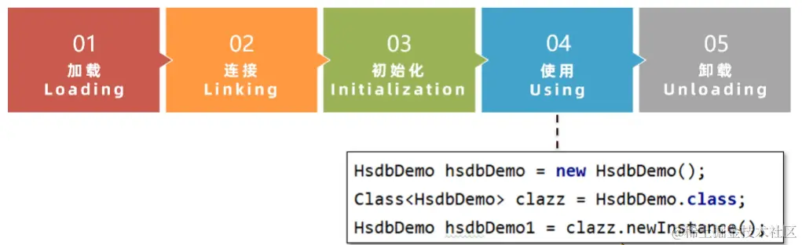

类的卸载会在垃圾回收篇讲解

如果比较细致的区分，会分成七个阶段。

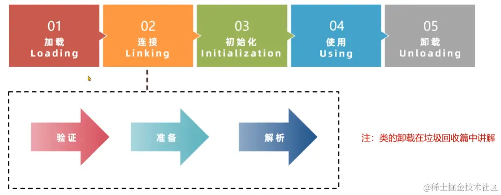

## 加载阶段

1.加载(Loading)阶段第一步是**类加载器**根据类的全限定名通过不同的渠道以二进制流的方式获取字节码信息。


**程序员可以使用Java代码拓展的不同的渠道。**比如有些公司可能需要将类保存到数据库里面去进行持久化，那么就可以在这一步进行处理。

2.类加载器在加载完类之后，Java虚拟机会将字节码中的信息保存到方法区中。

3.生成一个InstanceKlass对象，保存类的所有信息，里边还包含实现特定功能比如多态的信息。

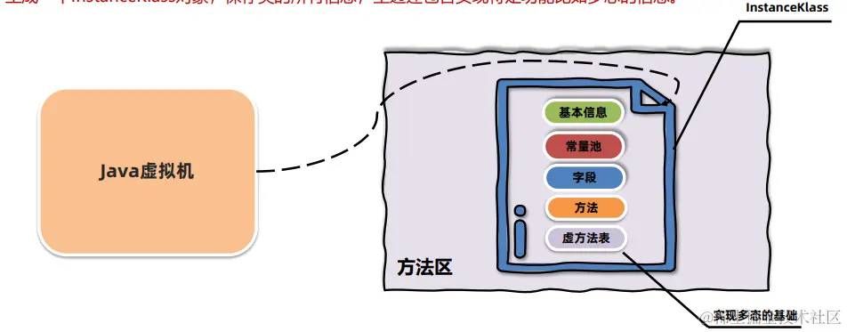

4、同时，Java虚拟机还会在堆中生成一份与方法区中数据类似的java.lang.Class对象。**作用是在Java代码中去获取类的信息以及存储静态字段的数据**（JDK8及之后）。

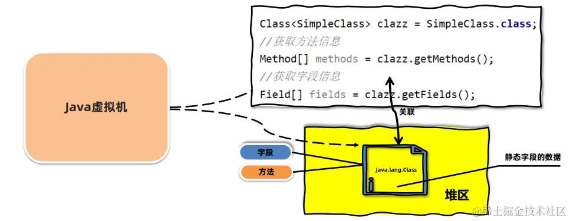

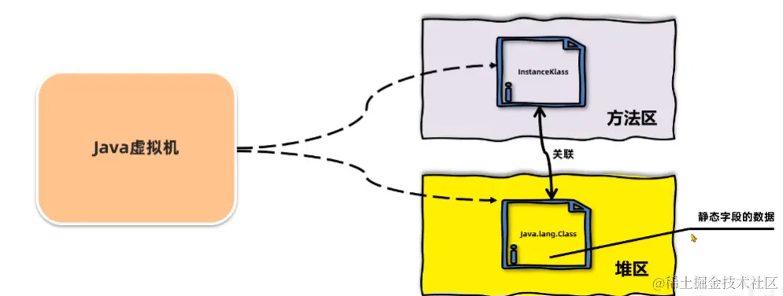

JDK8以前静态字段是存在于方法区的。

对于开发者来说，只需要访问堆中的Class对象而不需要访问方法区中所有信息。**这样Java虚拟机就能很好地控制开发者访问数据的范围。**

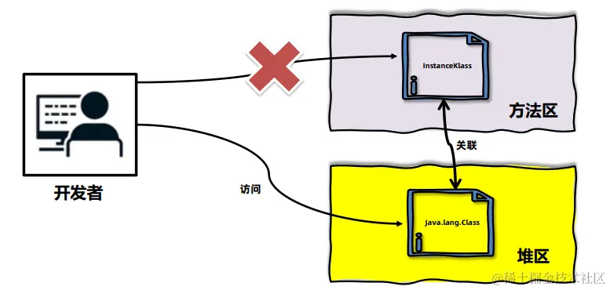

上面的InstanceKlass是使用C++去编写的对象，而Java代码一般不能去直接操作C++编写的对象，所以Java虚拟机在堆上创建了一个Java.Lang.Class这种用Java包装后的对象，可以让我们在代码中获取到。并且Java.Lang.Class所包含的要少于方法区中所包含的字段。比如虚方法表。

### 类的生命周期 加载阶段 – 查看内存中的对象

推荐使用 **JDK自带的hsdb**工具查看Java虚拟机内存信息。工具位于JDK安装目录下lib文件夹中的sa-jdi.jar中。


启动命令：java -cp sa-jdi.jar sun.jvm.hotspot.HSDB

这段代码就是我们要监控的程序

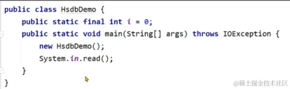

通过jps找到对应项目的进程号，然后使用HSDB连接到这个程序

所以我们就需要再HSDB中去找到HsdbDemo对象

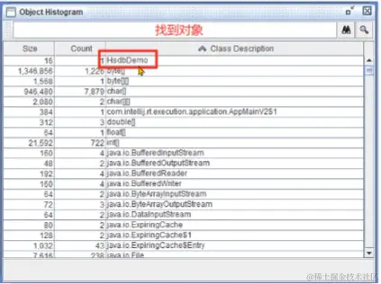

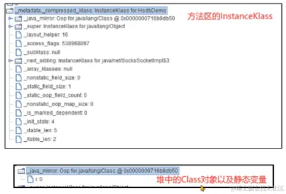

## 连接阶段

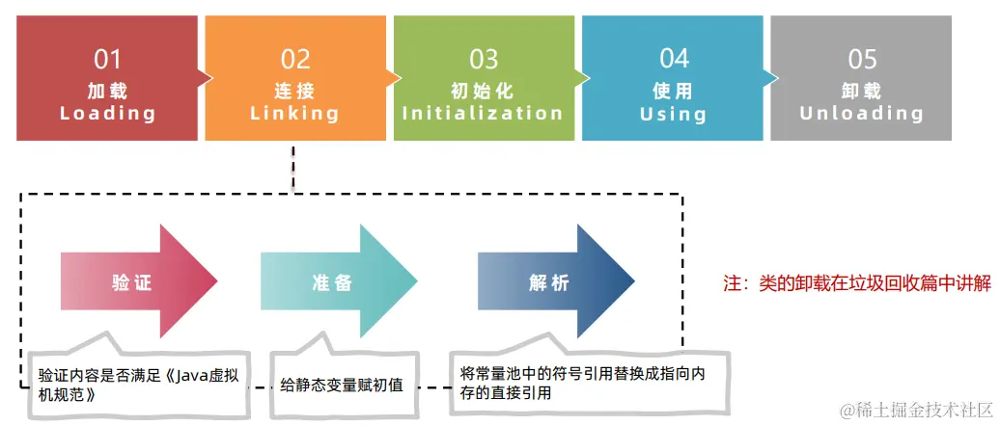

### 类的生命周期 连接阶段之验证

连接（Linking）阶段的第一个环节是验证，验证的主要目的是检测Java字节码文件是否遵守了《Java虚拟机规范》中的约束。**这个阶段一般不需要程序员参与。**

主要包含如下四部分，具体详见《Java虚拟机规范》：

1.文件格式验证，比如文件是否以0xCAFEBABE开头，主次版本号是否满足当前Java虚拟机版本要求。

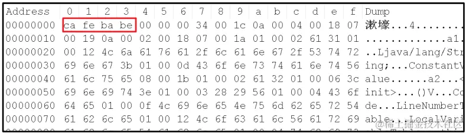

2.元信息验证，例如类必须有父类（super不能为空）。

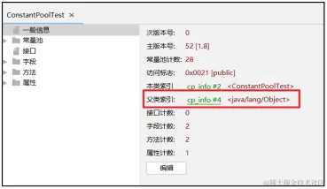

3.验证程序执行指令的语义，比如方法内的指令执行中跳转到不正确的位置。

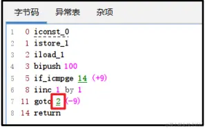

4.符号引用验证，例如是否访问了其他类中private的方法等。

#### 验证案例-版本号的检测

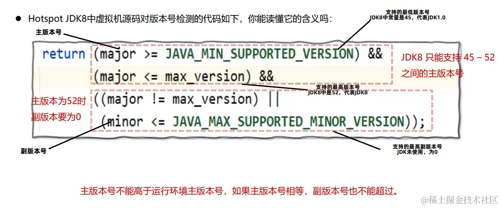

### 类的生命周期 连接阶段之准备

准备阶段为静态变量（static）分配内存并设置初始值。

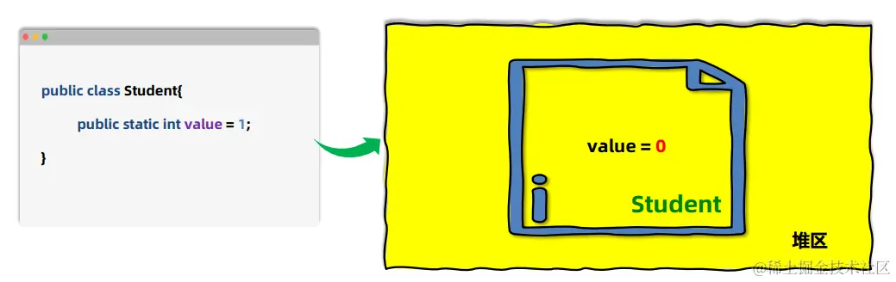

准备阶段只会给静态变量赋初始值，而每一种基本数据类型和引用数据类型都有其初始值。

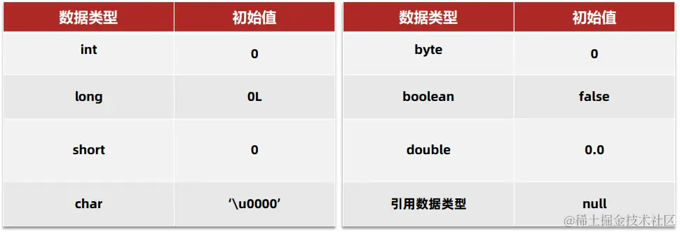

final修饰的基本数据类型的静态变量，准备阶段直接会将代码中的值进行赋值。

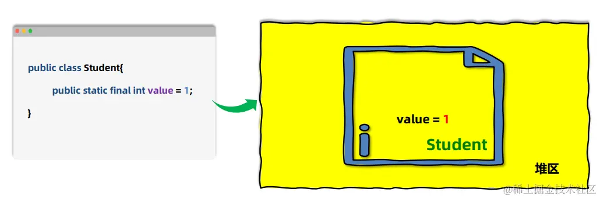

### 类的生命周期 连接阶段之解析

解析阶段主要是将常量池中的符号引用替换为直接引用。

符号引用就是在字节码文件中使用编号来访问常量池中的内容。

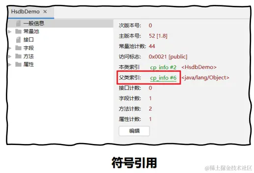

直接引用不在使用编号，而是使用内存中地址进行访问具体的数据。

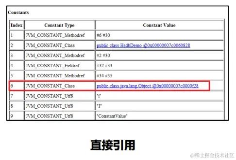

## 类的生命周期 初始化阶段

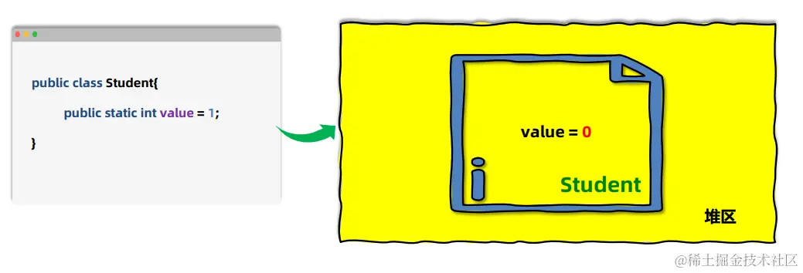

准备阶段为静态变量（static）分配内存并设置初始值。但是最终value值不应该是1吗？

初始化阶段会执行**静态代码块中的代码**，并为**静态变量赋值。**

初始化阶段会执行字节码文件中**clinit**部分的字节码指令。

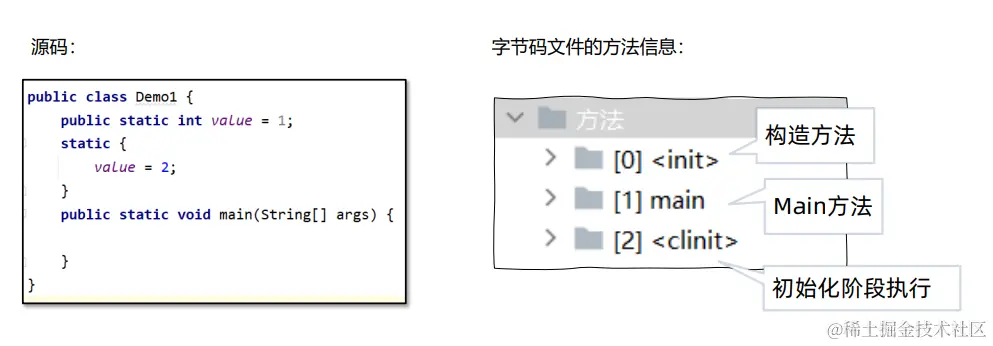

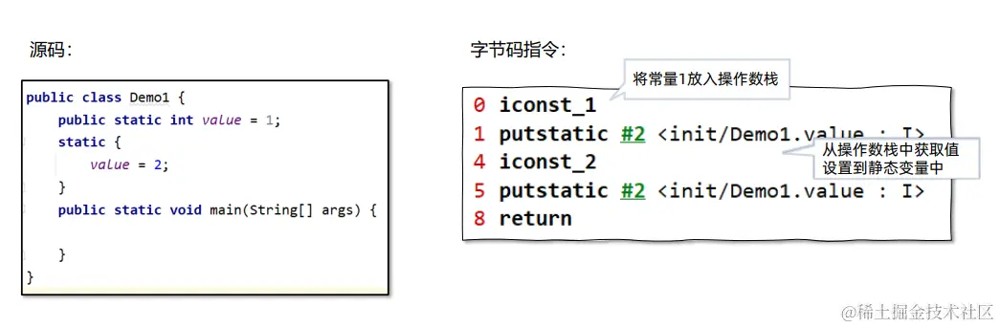

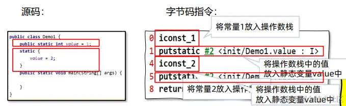

上面的案例将两句话对调顺序，结果会怎么样呢？

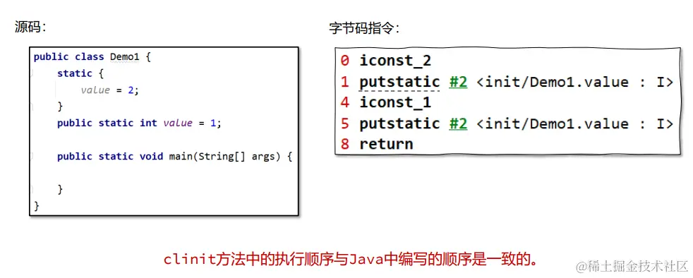

以下几种方式会导致类的初始化：

1.访问一个类的静态变量或者静态方法，注意变量是final修饰的并且等号右边是常量不会触发初始化。

2.调用Class.forName(String className)。

3.new一个该类的对象时。

4.执行Main方法的当前类。

### 经典面试题

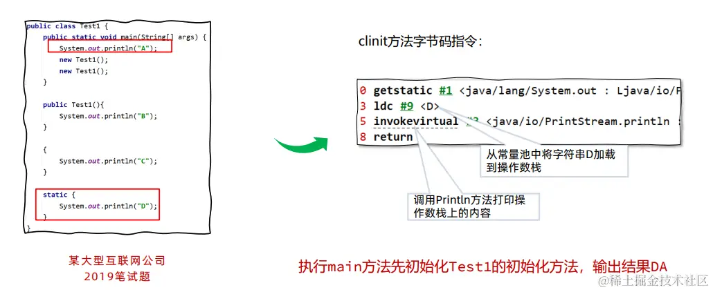

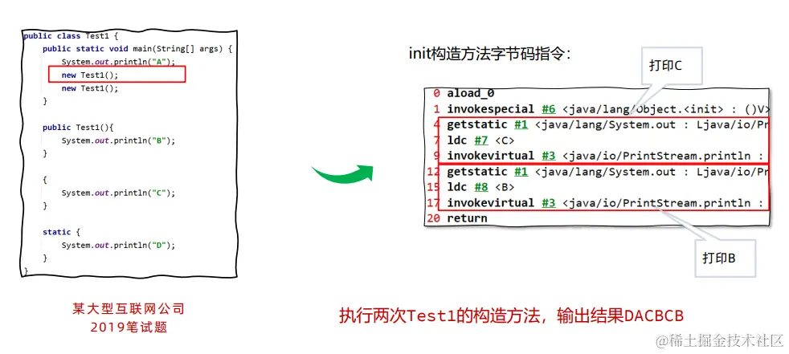

```csharp
{
	System.out.println("C")
}
这段代码块最终会被放到构造方法中去
```

clinit指令在特定情况下不会出现，比如：如下几种情况是不会进行初始化指令执行的。

1.无静态代码块且无静态变量赋值语句。

2.有静态变量的声明，但是没有赋值语句。

3.静态变量的定义使用final关键字，这类变量会在准备阶段直接进行初始化。

------

直接访问父类的静态变量，不会触发子类的初始化。

子类的初始化clinit调用之前，会先调用父类的clinit初始化方法。

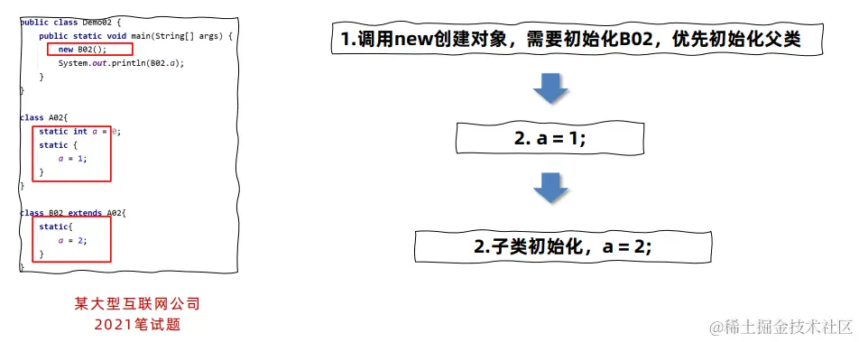

如果把new B02()去掉会怎么样呢？

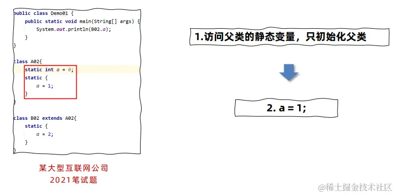

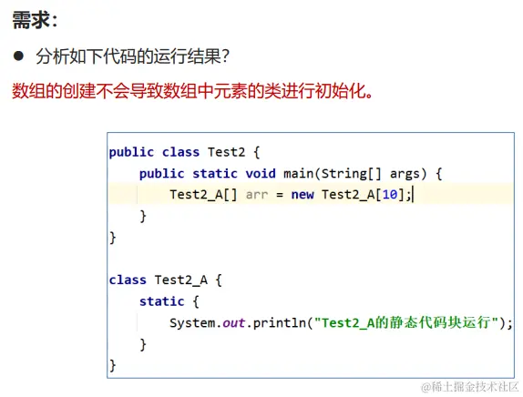

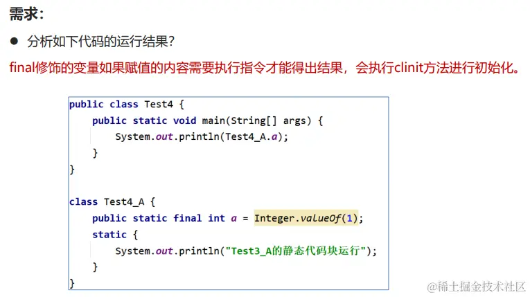


作者：爱吃芝士的土豆倪<br/>
链接：https://juejin.cn/post/7325979519478317056<br/>
来源：稀土掘金<br/>
著作权归作者所有。商业转载请联系作者获得授权，非商业转载请注明出处。<br/>