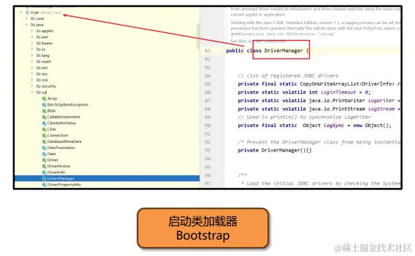
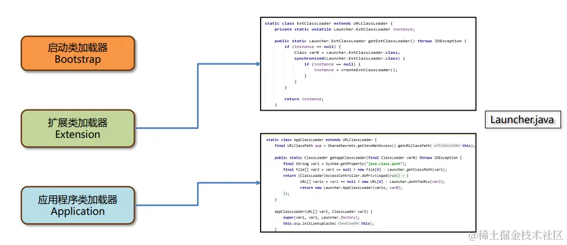

资料来源：<br/>
[JVM系列-4.类加载器](https://juejin.cn/post/7326759323064041507)<br/>

# 类加载器

类加载器（ClassLoader）是Java虚拟机提供给应用程序去实现获取类和接口字节码数据的技术。 类加载器只参与加载过程中的字节码获取并加载到内存这一部分。


## 类加载器的分类

类加载器分为两类，一类是Java代码中实现的，一类是Java虚拟机底层源码实现的。


类加载器的设计JDK8和8之后的版本差别较大，**JDK8及之前的版本中默认的类加载器有如下几种：**


### Arthas中类加载器相关的功能

类加载器的详细信息可以通过classloader命令查看：

classloader - 查看 classloader 的继承树，urls，类加载信息，使用 classloader 去 getResource


### 启动类加载器


其中最核心的就是rt.jar是jdk8中最核心的jar包，平时用到的字符串String类，装箱类型Integer，还有日期类Date等等。启动类加载器将这些都加载进来之后，相当于提供了一个基础的运行环境。

```java
ClassLoader classLoader = String.class.getClassLoader();
System.out.println(classLoader);

输出为null
```

但是由于这个类加载器不存在于java代码中，而是位于虚拟机环境中，所以在java环境中获取不到。所以出于安全性的考虑，在代码中，不允许我们获取到虚拟机的启动类。

制作jar的方式，idea maven install

### Java中的默认类加载器

扩展类加载器和应用程序类加载器都是JDK中提供的、使用Java编写的类加载器。

**它们的源码都位于sun.misc.Launcher中，是一个静态内部类。继承自URLClassLoader。具备通过目录或者指定jar包将字节码文件加载到内存中。**


### 扩展类加载器


### 应用程序类加载器


### Arthas中类加载器相关的功能

类加载器的加载路径可以通过classloader –c hash值 查看：


## 双亲委派机制

由于java虚拟机中有多个类加载器，双亲委派机制的核心就是解决一个类到底是由谁加载的问题。


在Java中如何使用代码的方式去主动加载一个类呢？

方式1：使用Class.forName方法，使用当前类的类加载器去加载指定的类。

方式2：获取到类加载器，通过类加载器的loadClass方法指定某个类加载器加载。

在Idea中测试下面的案例：


应用程序类加载器的parent父类加载器是扩展类加载器，而扩展类加载器的parent是空。

启动类加载器使用C++编写，没有上级类加载器。


类加载器的继承关系可以通过classloader –t 查看：


**如果类加载的parent为null，则会提交给启动类加载器处理。**


如果所有的父类加载器都无法加载该类，则由当前类加载器自己尝试加载。所以看上去是自顶向下尝试加载。


第二次再去加载相同的类，仍然会向上进行委派，如果某个类加载器加载过就会直接返回。


双亲委派机制指的是：**自底向上查找是否加载过，再由顶向下进行加载。**


另一个案例：com.itheima.my.C这个类在当前程序的classpath中，看看是如何加载的。


## 打破双亲委派机制


### 打破双亲委派机制–自定义类加载器

一个Tomcat程序中是可以运行多个Web应用的，如果这两个应用中出现了相同限定名的类，比如Servlet类，Tomcat要保证这两个类都能加载并且它们应该是不同的类。

如果不打破双亲委派机制，当应用类加载器加载Web应用1中的MyServlet之后，Web应用2中相同限定名的MyServlet类就无法被加载了。


Tomcat使用了自定义类加载器来实现应用之间类的隔离。

每一个应用会有一个独立的类加载器加载对应的类。


先来分析ClassLoader的原理，ClassLoader中包含了4个核心方法。

双亲委派机制的核心代码就位于loadClass方法中。


阅读双亲委派机制的核心代码，分析如何通过自定义的类加载器打破双亲委派机制。

打破双亲委派机制的核心就是将下边这一段代码重新实现。

```java
//parent等于null说明父类加载器是启动类加载器，直接调用findBootstrapClassOrNull
//否则调用父类加载器的加载方法
if (parent != null) {
 	c = parent.loadClass(name, false);
 	} else {
 		c = findBootstrapClassOrNull(name);
 	}
//父类加载器爱莫能助，我来加载！
if (c == null) 
 	c = findClass(name);
```

自定义类加载器父类怎么是AppClassLoader呢？


以Jdk8为例，ClassLoader类中提供了构造方法设置parent的内容：


这个构造方法由另外一个构造方法调用，其中父类加载器由getSystemClassLoader方法设置，该方法返回的是AppClassLoader。


两个自定义类加载器加载相同限定名的类，不会冲突吗？

**不会冲突**，在同一个Java虚拟机中，只有**相同类加载器+相同的类限定名**才 会被认为是同一个类。

在Arthas中使用sc –d 类名的方式查看具体的情况。


正确的去实现一个自定义类加载器的方式是重写findClass方法，这样不会破坏双亲委派机制。


### 打破双亲委派机制的第二种方法：JDBC案例

JDBC中使用了DriverManager来管理项目中引入的不同数据库的驱动，比如mysql驱动、oracle驱动。


DriverManager类位于rt.jar包中，由启动类加载器加载。



依赖中的mysql驱动对应的类，由应用程序类加载器来加载。


DriverManager属于rt.jar是启动类加载器加载的。而用户jar包中的驱动需要由应用类加载器加载，这就违反了双亲委派机制。


DriverManager怎么知道jar包中要加载的驱动在哪儿？


DriverManage使用SPI机制，最终加载jar包中对应的驱动类。


SPI全称为(Service Provider Interface) 是JDK内置的一种服务提供发现机制

其工作原理：

1.在ClassPath路径下的META-INF/services文件夹下，以接口的全限定名来命名文件名，对应的文件里面写该接口的实现。

2.使用ServiceLoader加载实现类


SPI中是如何获取到应用程序类加载器的？

SPI中使用了线程上下文中保存的类加载器进行类的加载，这个类加载器一般是应用程序类加载器。


1、启动类加载器加载DriverManager。

2、在初始化DriverManager时，通过SPI机制加载jar包中的myql驱动。

3、SPI中利用了线程上下文类加载器（应用程序类加载器）去加载类并创建对象。

**这种由启动类加载器加载的类，委派应用程序类加载器去加载类的方式，打破了双亲委派机制。**


### 打破双亲委派机制的第三种方法： OSGi模块化

历史上，OSGi模块化框架。它存在同级之间的类加载器的委托加载。OSGi还使用类加载器实现了**热部署**的功能。

热部署指的是在服务不停止的情况下，动态地更新字节码文件到内存中。


#### 使用阿里arthas不停机解决线上问题

小李的团队将代码上线之后，发现存在一个小bug，但是用户急着使用，如果重 新打包再发布需要一个多小时的时间，所以希望能使用arthas尽快的将这个问 题修复。

**思路：**

- 在出问题的服务器上部署一个 arthas，并启动。
- jad --source-only 类全限定名 > 目录/文件名.java jad 命令反编译，然后可以用其它编译器，比如 vim 来修改源码
- sc -d 输入类名，找到hashcode
- mc –c 类加载器的hashcode 目录/文件名.java -d 输出目录 mc 命令用来编译修改过的代码
- retransform class文件所在目录/xxx.class 用 retransform 命令加载新的字节码

**注意事项：**

1、程序重启之后，字节码文件会恢复，除非将class文件放入jar包中进行更新。 2、使用retransform不能添加方法或者字段，也不能更新正在执行中的方法。

## JDK9之后的类加载器

JDK8及之前的版本中，扩展类加载器和应用程序类加载器的源码位于rt.jar包中的sun.misc.Launcher.java。



由于JDK9引入了module的概念，类加载器在设计上发生了很多变化。


启动类加载器使用Java编写，位于jdk.internal.loader.ClassLoaders类中。

Java中的BootClassLoader继承自BuiltinClassLoader实现从模块中找到要加载的字节码资源文件。

**启动类加载器依然无法通过java代码获取到，返回的仍然是null，保持了统一。**


扩展类加载器被替换成了平台类加载器（Platform Class Loader）。

平台类加载器遵循模块化方式加载字节码文件，所以继承关系从URLClassLoader变成了BuiltinClassLoader，BuiltinClassLoader实现了从模块中加载字节码文件。**平台类加载器的存在更多的是为了与老版本的设计方案兼容，自身没有特殊的逻辑。**


作者：爱吃芝士的土豆倪<br/>
链接：https://juejin.cn/post/7326759323064041507<br/>
来源：稀土掘金<br/>
著作权归作者所有。商业转载请联系作者获得授权，非商业转载请注明出处。<br/>