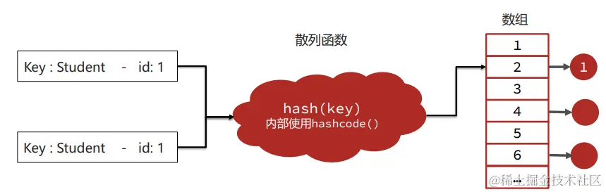

资料来源：<br/>
[JVM系列-7内存调优](https://juejin.cn/post/7328221562816937993)<br/>

# 内存调优

## 内存泄漏和内存溢出

**内存泄漏**（memory leak）：在Java中如果不再使用一个对象，但是该对象依然在GC ROOT的引用链上，这个对象就不会被垃圾回收器回收，这种情况就称之为**内存泄漏**。

内存泄漏绝大多数情况都是由**堆内存**泄漏引起的，所以后续没有特别说明则讨论的都是堆内存泄漏。

少量的内存泄漏可以容忍，但是如果发生持续的内存泄漏，就像滚雪球雪球越滚越大，不管有多大的内存迟早会被消耗完，最终导致的结果就是**内存溢出**。**但是产生内存溢出并不是只有内存泄漏这一种原因。**

比如初始是这样的。


随着持续泄漏，变成了这样。


### 常见场景

#### 第一种

内存泄漏导致溢出的常见场景是大型的Java后端应用中，在处理用户的请求之后，没有及时将用户的数据删除。随着用户请求数量越来越多，内存泄漏的对象占满了堆内存最终导致内存溢出。

这种产生的内存溢出会直接导致用户请求无法处理，影响用户的正常使用。重启可以恢复应用使用，但是在运行一段时间之后依然会出现内存溢出。


#### 第二种

常见场景是分布式任务调度系统如Elastic-job、Quartz等进行任务调度时，被调度的Java应用在调度任务结束中出现了内存泄漏，最终导致多次调度之后内存溢出。

这种产生的内存溢出会导致应用执行下次的调度任务执行。同样重启可以恢复应用使用，但是在调度执行一 段时间之后依然会出现内存溢出。


## 解决内存溢出的方法

解决内存溢出的步骤总共分为四个步骤，**其中前两个步骤是最核心的：**


发现的过程特别重要，在很多公司内部，使用监控工具进行告警。

### Top命令

top命令是linux下用来查看系统信息的一个命令，它提供给我们去实时地去查看系统的资源，比如执行时的进程、线程和系统参数等信息。


其优点是操作简单，无额外的软件安装。缺点是只能查看最基础的进程信息，无法查看每个部分的内存占用（堆、方法区、堆外）。

### VisualVM

VisualVM是多功能合一的Java故障排除工具并且他是一款可视化工具，整合了命令行 JDK 工具和轻量级分析功能，功能非常强大。

这款软件在Oracle JDK 6~8 中发布，但是在 Oracle JDK 9 之后不在JDK安装目录下需要单独下载。下载地址：[visualvm.github.io/](https://link.juejin.cn?target=https%3A%2F%2Fvisualvm.github.io%2F)


JDK8中的打开方式为 **bin/jvisualvm.exe**

在生产环境上其实是禁止使用VisualVM的，因为可以手动Full GC、Heap Dump。这些步骤会将你的整个线程都停止，这样会影响到用户的使用。但是这种方式可以被应用到测试环境去定位一些问题。

其优点是功能丰富、实时监控CPU、内存、线程等详细信息，并且支持Idea插件、开发过程中也可以使用。缺点就是对大量集群化部署的Java进程需要手动进行管理。

### Arthas

Arthas 是一款线上监控诊断产品，通过全局视角实时查看应用 load、内存、gc、线程的状态信息，并能在不修改应用代码的情况下，对业务问题进行诊断，包括查看方法调用的出入参、异常，监测方法执行耗时，类加载信息等，大大提升线上问题排查效率。


#### 使用阿里arthas tunnel管理所有的需要监控的程序

**背景：**

小李的团队已经普及了arthas的使用，但是由于使用了微服务架构，生产环境上的应用数量非常多，使用arthas还得登录到每一台服务器上再去操作非常不方便。他看到官方文档上可以使用tunnel来管理所有需要监控的程序。


**步骤：**

1. 在Spring Boot程序中添加arthas的依赖(支持Spring Boot2)，在配置文件中添加tunnel服务端的地址，便于tunnel去监控所有的程序。
2. 将tunnel服务端程序部署在某台服务器上并启动。
3. 启动java程序
4. 打开tunnel的服务端页面，查看所有的进程列表，并选择进程进行arthas的操作。

这种服务就比较适合于生产环境或者测试环境去管理大量的集群。

### Prometheus + Grafana

Prometheus+Grafana是企业中运维常用的监控方案，其中Prometheus用来采集系统或者应用的相关数据，同时具备告警功能。Grafana可以将Prometheus采集到的数据以可视化的方式进行展示。


其优点支持系统级别和应用级别的监控，比如linux操作系统、Redis、MySQL、Java进程。支持告警并允许自定义告警指标，通过邮件、短信等方式尽早通知相关人员进行处理。

### 堆内存状况的对比


## 产生内存泄漏的原因

### 代码中的内存泄漏

#### 案例1：equals()和hashCode()导致的内存泄漏

**问题：**

在定义新类时没有重写正确的equals()和hashCode()方法。在使用HashMap的场景下，如果使用这个类对象作为key，HashMap在判断key是否已经存在时会使用这些方法，如果重写方式不正确，会导致相同的数据被保存多份。

**正常情况：**

1、以JDK8为例，首先调用hash方法计算key的哈希值，hash方法中会使用到key的hashcode方法。根据hash方法的结果决定存放的数组中位置。

2、如果没有元素，直接放入。如果有元素，先判断key是否相等，会用到equals方法，如果key相等，直接替换value；key不相等，走链表或者红黑树查找逻辑，其中也会使用equals比对是否相同。



**异常情况：**

1、hashCode方法实现不正确，会导致相同id的学生对象计算出来的hash值不同，可能会被分到不同的槽中。


2、equals方法实现不正确，会导致key在比对时，即便学生对象的id是相同的，也被认为是不同的key。


3、长时间运行之后HashMap中会保存大量相同id的学生数据。


**解决方案：**

1、在定义新实体时，始终重写equals()和hashCode()方法。

2、重写时一定要确定使用了唯一标识去区分不同的对象，比如用户的id等。

3、hashmap使用时尽量使用编号id等数据作为key，不要将整个实体类对象作为key存放。

#### 案例2：内部类引用外部类

**问题：**

1、非静态的内部类默认会持有外部类，尽管代码上不再使用外部类，所以如果有地方引用了这个非静态内部类，会导致外部类也被引用，垃圾回收时无法回收这个外部类。

```java
public class Outer{
    private byte[] bytes = new byte[1024 * 1024]; //外部类持有数据
    private String name  = "测试";
    class Inner{
        private String name;
        public Inner() {
            this.name = Outer.name;
        }
    }

    public static void main(String[] args) throws IOException, InterruptedException {
//        System.in.read();
        int count = 0;
        ArrayList<Inner> inners = new ArrayList<>();
        while (true){
            if(count++ % 100 == 0){
                Thread.sleep(10);
            }
            inners.add(new Outer().new Inner());
        }
    }
}
```

1、这个案例中，使用内部类的原因是可以直接获取到外部类中的成员变量值，简化开发。如果不想持有外部类对象，应该使用静态内部类。

2、使用静态方法，可以避免匿名内部类持有调用者对象。

```java
public class Outer{
    private byte[] bytes = new byte[1024 * 1024]; //外部类持有数据
    private static String name  = "测试";
    static class Inner{
        private String name;
        public Inner() {
            this.name = Outer.name;
        }
    }

    public static void main(String[] args) throws IOException, InterruptedException {
//        System.in.read();
        int count = 0;
        ArrayList<Inner> inners = new ArrayList<>();
        while (true){
            if(count++ % 100 == 0){
                Thread.sleep(10);
            }
            inners.add(new Inner());
        }
    }
}
```

2、匿名内部类对象如果在非静态方法中被创建，会持有调用者对象，垃圾回收时无法回收调用者。（和非静态内部类同理）

```java
public class Outer {
    private byte[] bytes = new byte[1024];
    public List<String> newList() {
        List<String> list = new ArrayList<String>() {{
            add("1");
            add("2");
        }};
        return list;
    }

    public static void main(String[] args) throws IOException {
        System.in.read();
        int count = 0;
        ArrayList<Object> objects = new ArrayList<>();
        while (true){
            System.out.println(++count);
            objects.add(new Outer().newList());
        }
    }
}
```

修改过后

```java
public class Outer {
    private byte[] bytes = new byte[1024];
    public static List<String> newList() {
        List<String> list = new ArrayList<String>() {{
            add("1");
            add("2");
        }};
        return list;
    }

    public static void main(String[] args) throws IOException {
        System.in.read();
        int count = 0;
        ArrayList<Object> objects = new ArrayList<>();
        while (true){
            System.out.println(++count);
            objects.add(newList());
        }
    }
}
```

#### 案例3：ThreadLocal的使用

**问题：**

如果仅仅使用手动创建的线程，就算没有调用ThreadLocal的remove方法清理数据，也不会产生内存泄漏。因为当线程被回收时，ThreadLocal也同样被回收。但是如果使用线程池就不一定了。

**解决方案：**

线程方法执行完，一定要调用ThreadLocal中的remove方法清理对象。

#### 案例4：通过静态字段保存对象

**问题：**

如果大量的数据在静态变量中被长期引用，数据就不会被释放，如果这些数据不再使用，就成为了内存泄漏。

**解决方案：**

1、尽量减少将对象长时间的保存在静态变量中，如果不再使用，必须将对象删除（比如在集合中）或者将静态变量设置为null。

2、使用单例模式时，尽量使用懒加载，而不是立即加载。

3、Spring的Bean中不要长期存放大对象，如果是缓存用于提升性能，尽量设置过期时间定期失效。

#### 案例5：资源没有正常关闭

**问题：**

连接和流这些资源会占用内存，**如果使用完之后没有关闭，这部分内存不一定会出现内存泄漏**，但是会导致close方法不被执行。

**解决方案：**

1、为了防止出现这类的资源对象泄漏问题，必须在finally块中关闭不再使用的资源。

2、从 Java 7 开始，使用try-with-resources语法可以用于自动关闭资源。

### 并发请求问题

并发请求问题指的是用户通过发送请求向Java应用获取数据，正常情况下Java应用将数据返回之后，这部分数据就可以在内存中被释放掉。但是由于用户的并发请求量有可能很大，同时处理数据的时间很长，导致大量的数据存在于内存中，最终超过了内存的上限，导致内存溢出。**这类问题的处理思路和内存泄漏类似，首先要定位到对象产生的根源。**


对于我们常用的SpringBoot应用，同一时间最大量是有限的，因为默认情况下，tomcat最大线程数为200.所以同一时间只能处理200个请求。如果要导致内存溢出，**一般会有三个条件，第一个是同时并发的请求量比较大，第二个每一次请求内存中加载的数据比较多，第三个是每一笔请求处理时间比较长。**满足了这三个条件，大量的数据在内存中积压，最终导致内存溢出。

#### 模拟并发请求

使用Apache Jmeter软件可以进行并发请求测试。

Apache Jmeter是一款开源的测试软件，使用Java语言编写，最初是为了测试Web程序，目前已经发展成支持数据库、消息队列、邮件协议等不同类型内容的测试工具。


Apache Jmeter支持插件扩展，生成多样化的测试结果。


#### 使用Jmeter进行并发测试，发现内存溢出问题

**背景：**

小李的团队发现有一个微服务在晚上8点左右用户使用的高峰期会出现内存溢出的问题，于是他们希望在自己的开发环境能重现类似的问题。

**步骤：**

1. 安装Jmeter软件，添加线程组。
2. 在线程组中增加Http请求，添加随机参数。
3. 在线程组中添加监听器 – 聚合报告，用来展示最终结果。
4. 启动程序，运行线程组并观察程序是否出现内存溢出。

## 诊断

### 内存快照

当堆内存溢出时，需要在堆内存溢出时将整个堆内存保存下来，生成**内存快照**(Heap Profile )文件。

使用MAT打开hprof文件，并选择内存泄漏检测功能，MAT会自行根据内存快照中保存的数据分析内存泄漏的根源。


**生成内存快照的Java虚拟机参数：（添加两个jvm参数）**

-XX:+HeapDumpOnOutOfMemoryError：发生OutOfMemoryError错误时，自动生成hprof内存快照文件。

-XX:HeapDumpPath=：指定hprof文件的输出路径。

根据MAT的报告能够很快的找到内存泄漏的原因。

### MAT内存泄漏检测的原理 – 支配树

MAT提供了称为**支配树（Dominator Tree）**的对象图。支配树展示的是对象实例间的支配关系。**在对象引用图中，所有指向对象B的路径都经过对象A，则认为对象A支配对象B。**


支配树中对象本身占用的空间称之为**浅堆(Shallow Heap）。**

支配树中对象的子树就是所有被该对象支配的内容，这些内容组成了对象的**深堆（Retained Heap）**，也称之为保留集（ Retained Set ） 。**深堆的大小表示该对象如果可以被回收，能释放多大的内存空间。**


使用如下代码生成内存快照，并分析TestClass对象的深堆和浅堆。

**如何在不内存溢出情况下生成堆内存快照？-XX:+HeapDumpBeforeFullGC可以在FullGC之前就生成内存快照。**


MAT就是根据支配树，**从叶子节点向根节点遍历，如果发现深堆的大小超过整个堆内存的一定比例阈值，就会将其标记成内存泄漏的“嫌疑对象”**。


### 导出运行中系统的内存快照并进行分析

**背景：**

小李的团队通过监控系统发现有一个服务内存在持续增长，希望尽快通过内存快照分析增长的原因，由于并未产生内存溢出所以不能通过HeapDumpOnOutOfMemoryError参数生成内存快照。

**思路：**

导出运行中系统的内存快照，比较简单的方式有两种，注意只需要导出标记为存活的对象：

1. 通过JDK自带的jmap命令导出，格式为：

**jmap -dump:live,format=b,file=文件路径和文件名 进程ID**

1. 通过arthas的heapdump命令导出，格式为：

**heapdump --live 文件路径和文件名**

#### 分析超大堆的内存快照

在程序员开发用的机器内存范围之内的快照文件，直接使用MAT打开分析即可。但是经常会遇到服务器上的程序占用的内存达到10G以上，开发机无法正常打开此类内存快照，此时需要下载服务器操作系统对应的MAT。下载地址：[eclipse.dev/mat/downloa…](https://link.juejin.cn?target=https%3A%2F%2Feclipse.dev%2Fmat%2Fdownloads.php)

注意：默认MAT分析时只使用了1G的堆内存，如果快照文件超过1G，需要修改MAT目录下的MemoryAnalyzer.ini配置文件调整最大堆内存。


## 案例实战

修复内存溢出问题的要**具体问题具体分析**，问题总共可以分成三类：


### 案例1 – 分页查询文章接口的内存溢出

**背景：**

小李负责的新闻资讯类项目采用了微服务架构，其中有一个文章微服务，这个微服务在业务高峰期出现了内存溢出的现象。


**解决思路：**

1、服务出现OOM内存溢出时，生成内存快照。

2、使用MAT分析内存快照，找到内存溢出的对象。

3、尝试在开发环境中重现问题，分析代码中问题产生的原因。

4、修改代码。

5、测试并验证结果。

使用MAT最想做的就是定位到那个接口造成了内存溢出，那么只需要通过并发测试单个接口，就一定能找到对应的问题，然后制定出对应的修改方案。


使用mat进行分析发现有两个怀疑对象，这个数据的来源就是从支配树上获取到的。

第一个怀疑对象是线程池里面的大量线程。这个线程是处理HTTP请求的。底层使用了NIO，端口号是8881


第二个怀疑对象是ResultSet，如果了解JDBC，其实这个就是其包装对象


接下来在支配树上按照深堆进行倒序排序。


我们也可以根据深堆里面的内容点开来看看，比如这个你就可以知道具体来自那张表。


也可以基于线程入手，点开线程的支配树，里面有很多的局部变量，我们得精准的知道，这个线程执行的方法是哪一个。在这里有一个对象叫做HandlerMethod，是当前springmvc的处理器，对应的当前的controller方法，但是在支配树上看不到任何的东西。


然后我们就可以非常快速的找到当前线程在执行那个方法。


如果是这个接口，那么就去直方图看看这个接口的对象是不是有很多没有回收呢？也就是看其深堆大小。发现当前接口的对象的深堆大小远远大于其他的。所以我们有理由怀疑是这个对象导致了内存溢出。


**问题根源：**

文章微服务中的分页接口没有限制最大单次访问条数，并且单个文章对象占用的内存量较大，在业务高峰期并发量较大时这部分从数据库获取到内存之后会占用大量的内存空间。

**解决思路：**

1、与产品设计人员沟通，限制最大的单次访问条数。

2、分页接口如果只是为了展示文章列表，不需要获取文章内容，可以大大减少对象的大小。

3、在高峰期对微服务进行限流保护。

### 案例2 – Mybatis导致的内存溢出

**背景：**

小李负责的文章微服务进行了升级，新增加了一个判断id是否存在的接口，第二天业务高峰期再次出现了内存溢出，小李觉得应该和新增加的接口有关系。


**解决思路：**

1、服务出现OOM内存溢出时，生成内存快照。

2、使用MAT分析内存快照，找到内存溢出的对象。

3、尝试在开发环境中重现问题，分析代码中问题产生的原因。

4、修改代码。

5、测试并验证结果。

首先分析其mat报告，看到这个图，可能就猜出来了，这唯一的怀疑对象里面可能包含了罪魁祸首。


按照之前说的方法，找到对应的接口。这个接口的功能主要是为了判断当前的id在数据库中存不存在。

最终核心sql定位到这里：


**问题根源：**

Mybatis在使用foreach进行sql拼接时，会在内存中创建对象，如果foreach处理的数组或者集合元素个数过多，会占用大量的内存空间。

**解决思路：**

1、限制参数中最大的id个数。

2、将id缓存到redis或者内存缓存中，通过缓存进行校验。

### 案例3 – 导出大文件内存溢出

**背景：**

小李负责了一个管理系统，这个管理系统支持几十万条数据的excel文件导出。他发现系统在运行时如果有几十个人同时进行大数据量的导出，会出现内存溢出。


**问题根源：**

Excel文件导出如果使用POI的XSSFWorkbook，在大数据量（几十万）的情况下会占用大量的内存。

**解决思路：**

1、使用poi的SXSSFWorkbook。

2、hutool提供的BigExcelWriter减少内存开销。

3、**使用easy excel，对内存进行了大量的优化。将数十万分批导出，使得内存尽可能的小，会导致导出的时间比较长一些。**

### 案例4 – ThreadLocal使用时占用大量内存

**背景：**

小李负责了一个微服务，但是他发现系统在没有任何用户使用时，也占用了大量的内存。导致可以使用的内存大大减少。


通过mat分析发现，threadlocal这个深堆很大，原因是因为很多微服务会选择在拦截器preHandle方法中去解析请求头中的数据，并放入一些数据到 ThreadLocal中方便后续使用。


而实际的解决办法就是当这个请求处理完之后呢，正常应该在拦截器中将这个threadlocal清理掉，这样threadlocal的深堆里的空间就被释放掉了。**所以需要在拦截器的afterCompletion方法中，必须要将ThreadLocal中的数据清理掉。**

之所以会出现这个问题是因为使用了线程池，如果线程被回收了，那么不会出现这个问题，但是如果线程没有回收的话，threadlocal的深堆会一直大。

### 案例5 – 文章内容审核接口的内存问题

**背景：**

文章微服务中提供了文章审核接口，会调用阿里云的内容安全接口进行文章中文字和图片的审核，在自测过程中出现内存占用较大的问题。


**设计1：**

使用SpringBoot中的@Async注解进行异步的审核。


**存在问题：**

1、线程池参数设置不当，会导致大量线程的创建或者队列中保存大量的数据。

2、任务没有持久化，一旦走线程池的拒绝策略或者服务宕机、服务器掉电等情况很有可能会丢失任务。

**设计2：**

使用生产者和消费者模式进行处理，队列数据可以实现持久化到数据库。


**存在问题：**

1、队列参数设置不正确，会保存大量的数据。

2、实现复杂，需要自行实现持久化的机制，否则数据会丢失。

**设计3：**

使用mq消息队列进行处理，由mq来保存文章的数据。发送消息的服务和拉取消息的服务可以是同一个，也可以不是同一个。


**问题根源和解决思路：**

在项目中如果要使用异步进行业务处理，或者实现生产者 – 消费者的模型，如果在Java代码中实现，会占用大量的内存去保存中间数据。

尽量使用Mq消息队列，可以很好地将中间数据单独进行保存，不会占用Java的内存。同时也可以将生产者和消费者拆分成不同的微服务。

## 诊断和解决问题 – 两种方案


**在线定位问题 – 步骤**

1、使用jmap -histo:live 进程ID > 文件名 命令将内存中存活对象以直方图的形式保存到文件中，这个过程会影响用户的时间，但是时间比较短暂。

2、分析内存占用最多的对象，一般这些对象就是造成内存泄漏的原因。


3、使用arthas的stack命令，追踪对象创建的方法被调用的调用路径，找到对象创建的根源。


作者：爱吃芝士的土豆倪<br/>
链接：https://juejin.cn/post/7328221562816937993<br/>
来源：稀土掘金<br/>
著作权归作者所有。商业转载请联系作者获得授权，非商业转载请注明出处。<br/>