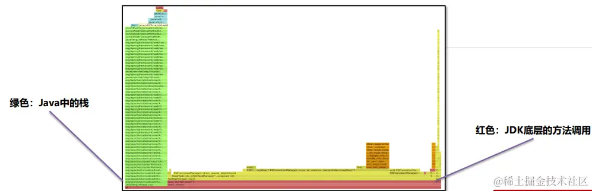

资料来源：<br/>
[JVM系列-9.性能调优](https://juejin.cn/post/7328317010211061794)<br/>

# 性能调优

性能优化的步骤总共分为四个步骤，其中修复部分要具体问题具体分析且处理方式各不相同。


## 性能调优解决的问题

应用程序在运行过程中经常会出现性能问题，比较常见的性能问题现象是：

1、通过top命令查看CPU占用率高，接近100甚至多核CPU下超过100都是有可能的。


2、请求单个服务处理时间特别长，多服务使用skywalking等监控系统来判断是哪一个环节性能低下。


3、程序启动之后运行正常，但是在运行一段时间之后无法处理任何的请求（内存和GC正常）。

## 性能调优的方法

线程转储（Thread Dump）提供了对所有运行中的线程当前状态的快照。线程转储可以通过jstack、visualvm等工具获取。其中包含了线程名、优先级、线程ID、线程状态、线程栈信息等等内容，可以用来解决**CPU占用率高、死锁等问题。**


先使用jps 查看对应的进程号，然后使用jstack 进程号即可。或者使用visualvm的 thread dump。

线程转储（Thread Dump）中的几个核心内容：

◆ 名称： 线程名称，通过给线程设置合适的名称更容易“见名知意”

◆ 优先级（prio）：线程的优先级

◆ Java ID（tid）：JVM中线程的唯一ID

◆ 本地 ID (nid)：操作系统分配给线程的唯一ID

◆ 状态：线程的状态，分为：

NEW – 新创建的线程，尚未开始执行

RUNNABLE –正在运行或准备执行

BLOCKED – 等待获取监视器锁以进入或重新进入同步块/方法

WAITING – 等待其他线程执行特定操作，没有时间限制

TIMED_WAITING – 等待其他线程在指定时间内执行特定操作

TERMINATED – 已完成执行

◆ 栈追踪： 显示整个方法的栈帧信息

### 案例1：CPU占用率高问题的解决方案

**问题：**

监控人员通过prometheus的告警发现CPU占用率一直处于很高的情况，通过top命令看到是由于Java程序引起的，希望能快速定位到是哪一部分代码导致了性能问题。

**解决思路：**

1、通过top –c 命令找到CPU占用率高的进程，获取它的进程ID。


2、使用top -p 进程ID单独监控某个进程，按H可以查看到所有的线程以及线程对应的CPU使用率，找到CPU使用率特别高的线程。


3、使用 jstack 进程ID 命令可以查看到所有线程正在执行的栈信息。使用 jstack 进程ID > 文件名 保存到文件中方便查看。


4、找到nid线程ID相同的栈信息，需要将之前记录下的十进制线程号转换成16进制。通过 printf ‘%x\n’ 线程ID 命令直接获得16进制下的线程ID。


5、找到栈信息对应的源代码，并分析问题产生原因。

### 案例2：接口响应时间很长的问题

**问题：**

在程序运行过程中，发现有几个接口的响应时间特别长，需要快速定位到是哪一个方法的代码执行过程中出现了性能问题。

**解决思路：**

已经确定是某个接口性能出现了问题，但是由于方法嵌套比较深，需要借助于arthas定位到具体的方法。


#### Arthas的trace命令

使用arthas的trace命令，可以展示出整个方法的调用路径以及每一个方法的执行耗时。

**命令： trace 类名 方法名**

- 添加 --skipJDKMethod false 参数可以输出JDK核心包中的方法及耗时。
- 添加 ‘#cost > 毫秒值’ 参数，只会显示耗时超过该毫秒值的调用。
- 添加 –n 数值 参数，最多显示该数值条数的数据。
- 所有监控都结束之后，输入stop结束监控，重置arthas增强的对象。


#### Arthas的watch命令

在使用trace定位到性能较低的方法之后，使用watch命令监控该方法，可以获得更为详细的方法信息。

**命令： watch 类名 方法名 ‘{params, returnObj}’ ‘#cost>毫秒值' -x 2**

- ‘{params, returnObj}‘ 代表打印参数和返回值。
- -x 代表打印的结果中如果有嵌套（比如对象里有属性），最多只展开2层。允许设置的最大值为4。


**总结：**

1、通过arthas的trace命令，首先找到性能较差的具体方法，如果访问量比较大，建议设置最小的耗时，精确的找到耗时比较高的调用。

2、通过watch命令，查看此调用的参数和返回值，重点是参数，这样就可以在开发环境或者测试环境模拟类似的现象，通过debug找到具体的问题根源。

3、**使用stop命令将所有增强的对象恢复。（因为arthas底层是使用动态代理的方式去增强这些对象，从而获取调用时间的。这样就增加了方法调用的开销，降低了性能）**

### 案例3：定位偏底层的性能问题

**问题：**

有一个接口中使用了for循环向ArrayList中添加数据，但是最终发现执行时间比较长，需要定位是由于什么原因导致的性能低下。

**解决思路：**

Arthas提供了性能火焰图的功能，可以非常直观地显示所有方法中哪些方法执行时间比较长。

#### Arthas的profile命令

这个命令不支持windows版本，所以需要在linux上运行。

**命令1： profiler start 开始监控方法执行性能**

**命令2： profiler stop --format html 以HTML的方式生成火焰图**

火焰图中一般找绿色部分Java中栈顶上比较平的部分，很可能就是性能的瓶颈。



**总结：**

**偏底层的性能问题，特别是由于JDK中某些方法被大量调用导致的性能低下，可以使用火焰图非常直观的找到原因。**

这个案例中是由于创建ArrayList时没有手动指定容量，导致使用默认的容量而在添加对象过程中发生了多次的扩容，扩容需要将原来数组中的元素复制到新的数组中，消耗了大量的时间。通过火焰图可以看到大量的调用，修复完之后节省了20% ~ 50%的时间。

### 案例4：线程被耗尽问题

**问题：**

程序在启动运行一段时间之后，就无法接受任何请求了。将程序重启之后继续运行，依然会出现相同的情况。

**解决思路：**

线程耗尽问题，一般是由于执行时间过长，分析方法分成两步：

1、**检测是否有死锁产生，无法自动解除的死锁会将线程永远阻塞。**

2、如果没有死锁，再使用案例1的打印线程栈的方法检测线程正在执行哪个方法，一般这些大量出现的方法就是慢方法。

死锁：两个或以上的线程因为争夺资源而造成互相等待的现象。

**解决方案：**

线程死锁可以通过三种方法定位问题：

1、 **jstack -l 进程ID > 文件名 将线程栈保存到本地。**

在文件中搜索deadlock即可找到死锁位置：


2、 开发环境中使用visual vm或者Jconsole工具，都可以检测出死锁。使用线程快照生成工具就可以看到死锁的根源。生产环境的服务一般不会允许使用这两种工具连接。

 3、 使用fastthread自动检测线程问题。

Fastthread和Gceasy类似，是一款在线的AI自动线程问题检测工具，可以提供线程分析报告。通过报告查看是否存在死锁问题。


### 更精细化的性能测试


Java程序在运行过程中，JIT即时编译器会实时对代码进行性能优化，所以仅凭少量的测试是无法真实反应运行系统最终给用户提供的性能。如下图，随着执行次数的增加，程序性能会逐渐优化。


OpenJDK中提供了一款叫JMH（Java Microbenchmark Harness）的工具，可以准确地对Java代码进行基准测试，量化方法的执行性能。

官网地址：[github.com/openjdk/jmh](https://link.juejin.cn?target=https%3A%2F%2Fgithub.com%2Fopenjdk%2Fjmh)

JMH会首先执行预热过程，确保JIT对代码进行优化之后再进行真正的迭代测试，最后输出测试的结果。


**JMH环境搭建：**

创建基准测试项目，在CMD窗口中，使用以下命令创建JMH环境项目：

```ini
mvn archetype:generate \
-DinteractiveMode=false \
-DarchetypeGroupId=org.openjdk.jmh \
-DarchetypeArtifactId=jmh-java-benchmark-archetype \
-DgroupId=org.sample \
-DartifactId=test \
-Dversion=1.0
```

修改POM文件中的JDK版本号和JMH版本号，JMH最新版本号参考Github。


测试代码

```java
//执行5轮预热，每次持续1秒
@Warmup(iterations = 5, time = 1, timeUnit = TimeUnit.SECONDS)
//执行一次测试
@Fork(value = 1, jvmArgsAppend = {"-Xms1g", "-Xmx1g"})
//显示平均时间，单位纳秒
@BenchmarkMode(Mode.AverageTime)
@OutputTimeUnit(TimeUnit.NANOSECONDS)
@State(Scope.Benchmark)
public class HelloWorldBench {

    @Benchmark
    public int test1() {
        int i = 0;
        i++;
        return i;
    }

    public static void main(String[] args) throws RunnerException {
        Options opt = new OptionsBuilder()
                .include(HelloWorldBench.class.getSimpleName())
                .resultFormat(ResultFormatType.JSON)
                .forks(1)
                .build();

        new Runner(opt).run();
    }
}
```

#### 案例：日期格式化方法性能测试

**问题：**

在JDK8中，可以使用Date进行日期的格式化，也可以使用LocalDateTime进行格式化，使用JMH对比这两种格式化的性能。

**解决思路：**

1、搭建JMH测试环境。

2、编写JMH测试代码。

3、进行测试。

4、比对测试结果。

```java
java复制代码//执行5轮预热，每次持续1秒
@Warmup(iterations = 5, time = 1, timeUnit = TimeUnit.SECONDS)
//执行一次测试
@Fork(value = 1, jvmArgsAppend = {"-Xms1g", "-Xmx1g"})
//显示平均时间，单位纳秒
@BenchmarkMode(Mode.AverageTime)
@OutputTimeUnit(TimeUnit.NANOSECONDS)
@State(Scope.Thread)
public class DateBench {


    private static String sDateFormatString = "yyyy-MM-dd HH:mm:ss";
    private Date date = new Date();
    private LocalDateTime localDateTime = LocalDateTime.now();
    private static ThreadLocal<SimpleDateFormat> simpleDateFormatThreadLocal = new ThreadLocal();
    private static final DateTimeFormatter formatter = DateTimeFormatter.ofPattern("yyyy-MM-dd HH:mm:ss");

    @Setup
    public void setUp() {

        SimpleDateFormat sdf = new SimpleDateFormat(sDateFormatString);
        simpleDateFormatThreadLocal.set(sdf);

    }

    @Benchmark
    public String date() {
        SimpleDateFormat simpleDateFormat = new SimpleDateFormat(sDateFormatString);
        return simpleDateFormat.format(date);
    }

    @Benchmark
    public String localDateTime() {
        return localDateTime.format(formatter);
    }
    @Benchmark
    public String localDateTimeNotSave() {
        return localDateTime.format(DateTimeFormatter.ofPattern("yyyy-MM-dd HH:mm:ss"));
    }

    @Benchmark
    public String dateThreadLocal() {
        return simpleDateFormatThreadLocal.get().format(date);
    }


    public static void main(String[] args) throws RunnerException {
        Options opt = new OptionsBuilder()
                .include(DateBench.class.getSimpleName())
                .resultFormat(ResultFormatType.JSON)
                .forks(1)
                .build();

        new Runner(opt).run();
    }
}
```

1、Date对象使用的SimpleDateFormatter是线程不安全的，所以每次需要重新创建对象或者将对象放入ThreadLocal中进行保存。其中每次重新创建对象性能比较差，将对象放入ThreadLocal之后性能相对还是比较好的。

2、LocalDateTime对象使用的DateTimeFormatter线程安全，并且性能较好，如果能将DateTimeFormatter对象保存下来，性能可以得到进一步的提升。


#### 性能调优综合实战

**问题：**

小李的项目中有一个获取用户信息的接口性能比较差，他希望能对这个接口在代码中进行彻底的优化，提升性能。

**解决思路：**

1、使用trace分析性能瓶颈。

2、优化代码，反复使用trace测试性能提升的情况。

3、使用JMH在SpringBoot环境中进行测试。

4、比对测试结果。


作者：爱吃芝士的土豆倪<br/>
链接：https://juejin.cn/post/7328317010211061794<br/>
来源：稀土掘金<br/>
著作权归作者所有。商业转载请联系作者获得授权，非商业转载请注明出处。<br/>