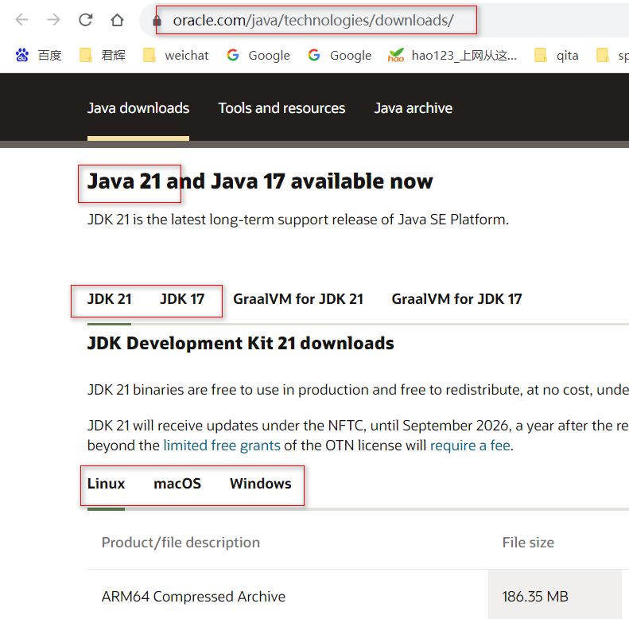

资料来源： 
[下载地址jdk21](https://www.oracle.com/java/technologies/downloads/) 
[看看新发布的 JDK 21 带着哪些新特性？](https://www.toutiao.com/article/7281613145850937910/?app=news_article&timestamp=1696167855&use_new_style=1&req_id=20231001214414B8BE7874029DABD0C372&group_id=7281613145850937910&wxshare_count=1&tt_from=weixin&utm_source=weixin&utm_medium=toutiao_android&utm_campaign=client_share&share_token=24d83fe5-534f-4b1b-969c-4cdacaa6cecd&source=m_redirect)

## jdk 下载

[下载地址jdk21](https://www.oracle.com/java/technologies/downloads/) 

官网提供下载

看到 Java 21 已经 GA 了。 GA，就是我上面框起来的“General Availability”的缩写，直译成中文，虽然是“普通可用”的意思，但是在软件行业，它就代表正式版。如果对外发布一个 GA 版本，就意味着这个版本已经经过全面的测试，不存在任何重大的 bug，可供普通用户进行使用。

既然说到 GA 了，顺便给大家普及一下一般我们看到的版本号的含义。

比如我们经常会看到一些软件发布的时候都会带上 Alpha、Beta、Gamma、RC 等等这些莫名其妙的单词，它们代表什么意思呢？

- Alpha：软件或系统的内部测试版本，仅内部人员使用。一般不向外部发布，通常会有很多 Bug，除非你也是测试人员，否则不建议使用，alpha 就是 α，是希腊字母的第一位，表示最初级的版本，beta 就是 β，alpha 版就是比 beta 还早的测试版，一般都是内部测试的版本。
- Beta：公开测试版。β 是希腊字母的第二个，顾名思义，这一版本通常是在 Alpha 版本后，该版本相对于 Alpha 版已有了很大的改进，消除了严重的错误，但还是存在着一缺陷，需要经过多次测试来进一步消除。这个阶段的版本会一直加入新的功能。
- Gamma：软件或系统接近于成熟的版本，只需要做一些小的改进就能发行。是 beta 版做过一些修改，成为正式发布的候选版本。
- RC：Release Candidate，发行候选版本。和 Beta 版最大的差别在于 Beta 阶段会一直加入新的功能，但是到了 RC 版本，几乎就不会加入新的功能了，而主要着重于除错。RC 版本是最终发放给用户的最接近正式版的版本，发行后改正 bug 就是正式版了，就是正式版之前的最后一个测试版。
- GA：General Available，正式发布的版本，这个版本就是正式的版本。在国外都是用 GA 来说明 release 版本的。比如：MySQL Community Server 5.7.21 GA 这是 MySQL Community Server 5.7 第 21 个发行稳定的版本，GA 意味着 General Available，也就是官方开始推荐广泛使用了。
- Release：这个版本通常就是所谓的“最终版本”，在前面版本的一系列测试版之后，终归会有一个正式版本，是最终交付用户使用的一个版本，该版本有时也称为标准版。一般情况下，Release 不会以单词形式出现在软件封面上，取而代之的是符号(R)。
- Stable：稳定版。在开源软件中，都有 stable 版，这个就是开源软件的最终发行版，用户可以放心大胆的用了。这一版本基于 Beta 版，已知 Bug 都被修复，一般情况下，更新比较慢。

除了上面的这些之外，我们还经常看见一个 LTS 的版本号。

LTS，Long Term Support，长期支持版，是指针对软件的某一版本，提供长时间的技术支持、安全更新和错误修复。

相对于非 LTS 版本，LTS 版本被认为是更为稳定、可靠和安全的版本。因此，在需要稳定性和安全性较高的场景中，如生产环境、企业级应用等，LTS 版本得到广泛的应用。

在 Java 领域，LTS 版本是指 Oracle 公司发布的 Java SE（Standard Edition，标准版）中，每隔一段时间发布一个长期支持版本。

自 2018 年开始，Oracle Java SE 8 、Java SE 11、Java SE 17 成为了 LTS 版本，分别提供了 3 年、 8 年、至少 3 年的支持。

你看，一个小小的 GA 里面，隐藏了这么多的小知识点，一不小心就铺垫这么长。