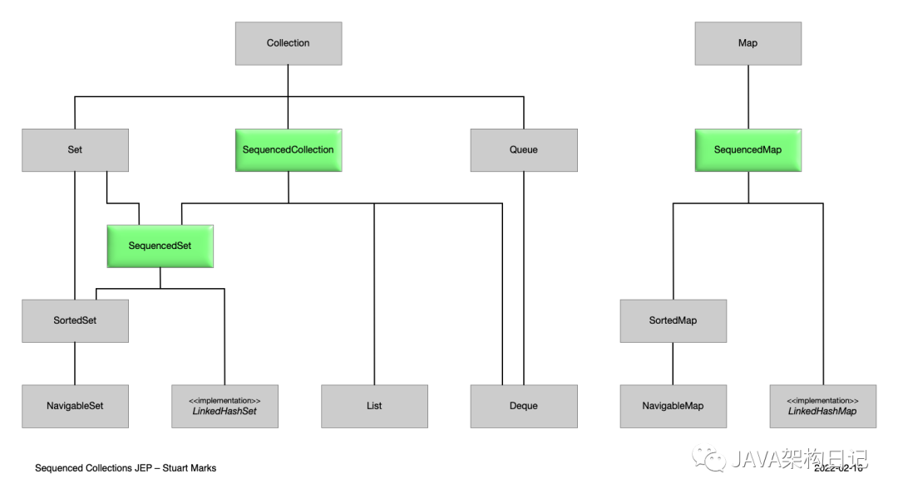

资料来源：<br/>
[Java21 LTS版本来了， API 变更详细汇总](https://mp.weixin.qq.com/s/k7beS2MkiArWatzTtKmMPg)

## 一、前言

除了众所周知的 JEP 之外，Java 21 还有更多内容。首先请确认 java 版本：

```java
$ java -version
openjdk version "21" 2023-09-19
OpenJDK Runtime Environment (build 21+35-2513)
OpenJDK 64-Bit Server VM (build 21+35-2513, mixed mode, sharing)
```

我们一起来看看 String 和它的朋友们 Collections、Date、Time、HttpClient、并发、Math 和 BigInteger 的新增一些 API。

## 二、String（Java21新增）

String 新增了 indexOf() 方法，允许在起始索引和结束索引之间查找单个字符或子字符串。

```java
public int indexOf(int ch, int beginIndex, int endIndex);
public int indexOf(String str, int beginIndex, int endIndex);
```

示例：

```java
String text = "JAVA架构日记-2023-如梦技术";

int index = text.indexOf("0", 5, 15);
```

## 三、Character（Java21新增）

Character 类新增了几个方法来支持 Emoji 表情符号，新增了五个方法：`isEmoji()`、`isEmojiComponent()`、`isEmojiModifier()`、`isEmojiModifierBase()` 和 `isEmojiPresentation()`。

```java
public static boolean isEmoji(int codePoint);
public static boolean isEmojiPresentation(int codePoint);
public static boolean isEmojiModifier(int codePoint);
public static boolean isEmojiModifierBase(int codePoint);
public static boolean isEmojiComponent(int codePoint);
public static boolean isExtendedPictographic(int codePoint);
```

所有这些方法都接受一个 int 类型的码点作为参数，判断传入的码点是否具有对应的表情符号。

## 四、StringBuffer 和 StringBuilder（Java21新增）

`StringBuffer` 和 `StringBuilder` 新增了 `repeat()` 方法重复单个字符或字符串多次。

**StringBuilder:**

```java
@Override
public StringBuilder repeat(int codePoint, int count);

@Override
public StringBuilder repeat(CharSequence cs, int count);
```

**StringBuffer:**

```java
@Override
public synchronized StringBuffer repeat(int codePoint, int count);

@Override
public synchronized StringBuffer repeat(CharSequence cs, int count);
```

## 五、Charset（Java18）

Charset 新增了一个带 fallback 的 `forName()`方法。

```java
public static Charset forName(String charsetName, Charset fallback);
```

## 六、正则分组优化（Java20）

笔者有幸用过正则分组，需求是提取地址中的省市区县，代码如下：

```java
private static final Pattern PATTERN = Pattern.compile("(?<province>[^省]+自治区|.*?省|.*?行政区|.*?市)(?<city>[^市]+自治州|.*?地区|.*?行政单位|.+盟|市辖区|.*?市|.*?县)(?<county>[^县]+县|.+区|.+市|.+旗|.+海域|.+岛)?(?<town>[^区]+区|.+镇)?(?<village>.*)");

public static Map<String, String> getAddressResolution(String address) {
 Matcher matcher = PATTERN.matcher(address);
 String province, city, county, town, village;
 Map<String, String> row = new HashMap<>();
 while (matcher.find()) {
  province = matcher.group("province");
  row.put("province", province == null ? "" : province.trim());
  city = matcher.group("city");
  row.put("city", city == null ? "" : city.trim());
  county = matcher.group("county");
  row.put("county", county == null ? "" : county.trim());
  town = matcher.group("town");
  row.put("town", town == null ? "" : town.trim());
  village = matcher.group("village");
  row.put("village", village == null ? "" : village.trim());
 }
 return row;
}

public static void main(String[] args) {
 String address = "湖南省长沙市岳麓区永青路668号";
 System.out.println(getAddressResolution(address));
 // {province=湖南省, city=长沙市, county=岳麓区, town=, village=永青路668号}
}
```

Matcher、MatchResult、Pattern 现在新增了 `namedGroups()` 相关方法， `getAddressResolution()` 方法简化成这样了：

```
public static Map<String, String> getAddressResolution(String address) {
 Matcher matcher = PATTERN.matcher(address);
 Map<String, String> row = new HashMap<>();
 if (matcher.matches()) {
  Map<String, Integer> groupMap = matcher.namedGroups();
  groupMap.forEach((key, group) -> row.put(key, matcher.group(group)));
 }
 return row;
}
```

## 七、集合

Collections 框架中添加了 SequencedCollection、SequencedSet 和 SequencedMap 三个接口（Java21 新增）。

```java
interface SequencedCollection<E> extends Collection<E> {
    // new method
    SequencedCollection<E> reversed();
    // methods promoted from Deque
    void addFirst(E);
    void addLast(E);
    E getFirst();
    E getLast();
    E removeFirst();
    E removeLast();
}

interface SequencedSet<E> extends Set<E>, SequencedCollection<E> {
    SequencedSet<E> reversed();    // covariant override
}

interface SequencedMap<K,V> extends Map<K,V> {
    // new methods
    SequencedMap<K,V> reversed();
    SequencedSet<K> sequencedKeySet();
    SequencedCollection<V> sequencedValues();
    SequencedSet<Entry<K,V>> sequencedEntrySet();
    V putFirst(K, V);
    V putLast(K, V);
    // methods promoted from NavigableMap
    Entry<K, V> firstEntry();
    Entry<K, V> lastEntry();
    Entry<K, V> pollFirstEntry();
    Entry<K, V> pollLastEntry();
}
```

添加这 3 个新接口后，Java 集合类图发生了变化，图示：



除了这些，现在还可以使用多个工厂方法创建具有给定初始容量的不同类型的 Map（Java19新增）。

```java
HashMap.newHashMap(100);
HashSet.newHashSet(100);
LinkedHashMap.newLinkedHashMap(100);
LinkedHashSet.newLinkedHashSet(100);
WeakHashMap.newWeakHashMap(100);
```

Map 创建看起来很简单，但实际上却有一些技巧。例如，HashMap 内部是基于数组构建的，当该数组装满时，它会被复制到一个更大的数组中。所以阿里《JAVA开发手册》也建议设置 HashMap 的初始容量。问题在于，实际上并不仅仅是复制，第一个数组的所有键值对都需要重新计算哈希值，以便放置在新数组的正确位置上。由于哈希值的计算取决于数组的大小，每个数组的存储位置很可能不同。因此，我们不能简单地将第一个数组的内容复制到第二个数组中。为了避免冲突，当数组达到 75% 的容量时，就被认为已经满了。因此，要创建一个可以存储 100 个键值对的 Map，实际上需要一个大小为 134 的数组。考虑到数组的大小必须是 2 的次方，因此实际上会创建一个大小为 256 的数组。这种计算很容易出错，所以现在有了一个工厂方法。现在我们只需要调用 `newHashMap(size)`，传递所需的容量就好了。

## 八、日期和时间 API（Java19新增）

Date and Time API 的一个很好的增加功能是 DateTimeFormatter 的本地化支持`ofLocalizedPattern()` 工厂方法，传递一个字符串格式，它会生成一个本地化的模式。

DateTimeFormatterBuilder 也已更新，添加了一个 `appendLocalized()` 方法，用于添加一个本地化模式（类型为字符串）。

```java
LocalDateTime now = LocalDateTime.now();
DateTimeFormatter formatter = DateTimeFormatter.ofLocalizedPattern("yM");
System.out.println(now.format(formatter)); // 2023年9月
```

## 九、IO流

PrintStream 在 Java18 中新增了 `charset()`方法用于获取使用的字符集。

```java
public Charset charset();
```

HttpClient、ExecutorService 和 ForkJoinPool 类在 17 和 21 之间实现了 `AutoCloseable`。现在可以使用 `try-with-resources`语句来创建实例。

## 十、Math 和 BigInteger

Math 类和 BigInteger 类也得到了一些关注。首先，Math类添加了一系列方法。

```java
// 执行两个数字的向上取整除法运算，并返回大于或等于除法结果的最小整数。
public static int ceilDiv(int x, int y);
public static long ceilDiv(long x, int y);
public static long ceilDiv(long x, long y);

// 执行两个数字的向上取整除法运算，但是在被除数不能被除数整除时，
// 会抛出ArithmeticException异常。
public static int ceilDivExact(int x, int y);
public static long ceilDivExact(long x, long y);

// 这个方法返回的是两个数字进行向上取整除法运算后的余数。
public static int ceilMod(int x, int y);
public static int ceilMod(long x, int y);
public static long ceilMod(long x, long y);

// 这个方法用于对两个数字进行整除运算，并确保结果是一个整数。
// 如果除数无法整除被除数，将会抛出ArithmeticException异常。
public static int divideExact(int x, int y);
public static long divideExact(long x, long y);

// 执行两个数字的向下取整除法运算，但是在被除数不能被除数整除时，
// 会抛出ArithmeticException异常。
public static int floorDivExact(int x, int y);
public static long floorDivExact(long x, long y);
```

添加了 `clamp()` 方法可以处理 int、long、float 和 double 原始类型，将提供的值限制在给定的最小值和最大值之间。

```java
public static int clamp(long value, int min, int max);
public static long clamp(long value, long min, long max);
public static double clamp(double value, double min, double max);
public static float clamp(float value, float min, float max);
```

还有一个方法：`unsignedMultiplyHigh()`，用于将两个长整型数作为无符号数相乘，并将64位高位作为长整型返回。

```java
public static long unsignedMultiplyHigh(long x, long y);
```

BigInteger 类增加了一个功能：在并行中执行乘法运算，使用了 Fork/Join 框架。

```
public BigInteger parallelMultiply(BigInteger val);
```

## 十一、Thread

关于 VirtualThread 的内容这里不做过多介绍，想必各位会在各种途径看到各式各样的文章。在这里，我只想介绍两个方面。

首先，Thread 现在添加了 `join()`方法和 `sleep()`方法，两者都接受 Duration 作为参数，Duration 语义化更加易用。另外就是 `isVirtual()`方法，用于判断线程是否为虚拟线程。

```java
public static void sleep(Duration duration) throws InterruptedException;
public final boolean join(Duration duration) throws InterruptedException;
public final boolean isVirtual();
```

另外需要重点介绍的一个是在 Future 接口中添加的新方法。实际上有三个方法：

`resultNow()`和`exceptionNow()` 这两个方法不会抛出已检查异常，因此代码中不再需要 `try catch`，使用起来更加方便。但请注意，如果调用这些方法并且使用的 Future 对象尚未完成，那么将会得到一个 `IllegalStateException`异常。需要在确保 Future 对象产生了结果或异常时调用这些方法。

第三个方法是 `state()`，可以调用它来检查 Future 对象的当前状态。返回值是一个新的枚举：Future.State。

```java
enum State {
 /**
  * 表示任务尚未完成
  */
 RUNNING,
 /**
  * 表示任务成功完成
  */
 SUCCESS,
 /**
  * 表示任务完成但出现异常
  */
 FAILED,
 /**
  * 表示任务被取消。
  */
 CANCELLED
}
```

因此，通过这个API，现在可以更精确地监控任务的进展情况。