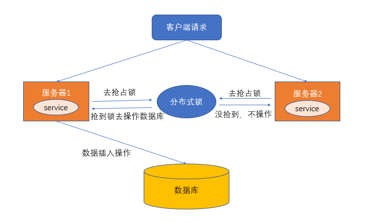
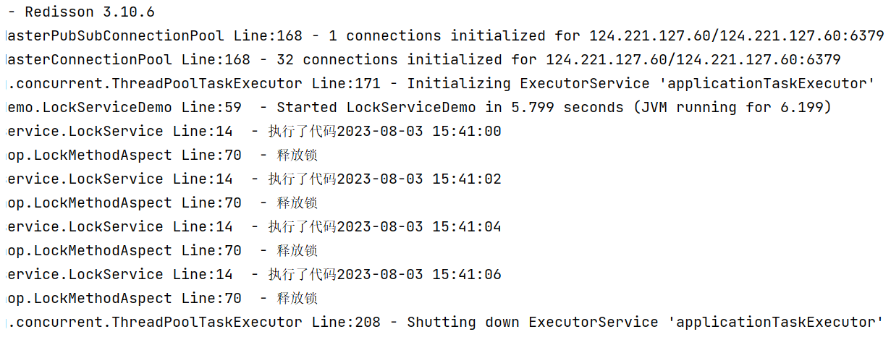

资料来源：<br/>
[基于Redis的分布式锁实现](https://juejin.cn/post/6844903830442737671)<br/>
[红锁redlock](https://github.com/redisson/redisson/wiki/8.-%E5%88%86%E5%B8%83%E5%BC%8F%E9%94%81%E5%92%8C%E5%90%8C%E6%AD%A5%E5%99%A8#84-%E7%BA%A2%E9%94%81redlock)<br/>
[github](https://github.com/pjmike/redis-distributed-lock/tree/master)<br/>
[redisson的tryLock()和lock()的区别](https://www.cnblogs.com/lyn8100/p/17264270.html)


## 概述

在多线程的环境下，为了保证一个代码块在同一时间只能由一个线程访问，Java中我们一般可以使用synchronized语法和ReetrantLock去保证，这实际上是本地锁的方式。但是现在公司都是流行分布式架构，在分布式环境下，如何保证不同节点的线程同步执行呢？

实际上，对于分布式场景，我们可以使用分布式锁，它是控制分布式系统之间**互斥访问共享资源**的一种方式。

比如说在一个分布式系统中，多台机器上部署了多个服务，当客户端一个用户发起一个数据插入请求时，如果没有分布式锁机制保证，那么那多台机器上的多个服务可能进行并发插入操作，导致数据重复插入，对于某些不允许有多余数据的业务来说，这就会造成问题。而分布式锁机制就是为了解决类似这类问题，保证多个服务之间互斥的访问共享资源，如果一个服务抢占了分布式锁，其他服务没获取到锁，就不进行后续操作。大致意思如下图所示（不一定准确）：



### 分布式锁的特点

分布式锁一般有如下的特点：

- 互斥性： 同一时刻只能有一个线程持有锁
- 可重入性： 同一节点上的同一个线程如果获取了锁之后能够再次获取锁
- 锁超时：和J.U.C中的锁一样支持锁超时，防止死锁
- 高性能和高可用： 加锁和解锁需要高效，同时也需要保证高可用，防止分布式锁失效
- 具备阻塞和非阻塞性：能够及时从阻塞状态中被唤醒


## 分布式锁的实现

### 1. 利用setnx+expire命令 (错误的做法)

Redis的SETNX命令，setnx key value，将key设置为value，当键不存在时，才能成功，若键存在，什么也不做，成功返回1，失败返回0 。 SETNX实际上就是SET IF NOT Exists的缩写

因为分布式锁还需要超时机制，所以我们利用expire命令来设置，所以利用setnx+expire命令的核心代码如下：

```java
public boolean tryLock(String key,String requset,int timeout) {
    Long result = jedis.setnx(key, requset);
    // result = 1时，设置成功，否则设置失败
    if (result == 1L) {
        return jedis.expire(key, timeout) == 1L;
    } else {
        return false;
    }
}
```

实际上上面的步骤是有问题的，setnx和expire是分开的两步操作，不具有原子性，如果执行完第一条指令应用异常或者重启了，锁将无法过期。

一种改善方案就是使用Lua脚本来保证原子性（包含setnx和expire两条指令）

### 2. 使用Lua脚本（包含setnx和expire两条指令）

代码如下

```java
public boolean tryLock_with_lua(String key, String UniqueId, int seconds) {
    String lua_scripts = "if redis.call('setnx',KEYS[1],ARGV[1]) == 1 then" +
            "redis.call('expire',KEYS[1],ARGV[2]) return 1 else return 0 end";
    List<String> keys = new ArrayList<>();
    List<String> values = new ArrayList<>();
    keys.add(key);
    values.add(UniqueId);
    values.add(String.valueOf(seconds));
    Object result = jedis.eval(lua_scripts, keys, values);
    //判断是否成功
    return result.equals(1L);
}
```

### 3. 使用 set key value [EX seconds][PX milliseconds][NX|XX] 命令 (正确做法)

Redis在 2.6.12 版本开始，为 SET 命令增加一系列选项：

```java
SET key value[EX seconds][PX milliseconds][NX|XX]
```

- EX seconds: 设定过期时间，单位为秒
- PX milliseconds: 设定过期时间，单位为毫秒
- NX: 仅当key不存在时设置值
- XX: 仅当key存在时设置值

set命令的nx选项，就等同于setnx命令，代码过程如下：

```java
public boolean tryLock_with_set(String key, String UniqueId, int seconds) {
    return "OK".equals(jedis.set(key, UniqueId, "NX", "EX", seconds));
}
```

value必须要具有唯一性，比如UUID，至于为什么要保证唯一性？我的理解是当我们释放锁时需要验证value值，如果value不唯一，有多个相同的值，释放锁的过程就可能会出现问题。

#### 关于释放锁的问题

释放锁时需要验证value值，也就是说我们在获取锁的时候需要设置一个value，不能直接用del key这种粗暴的方式，因为直接del key任何客户端都可以进行解锁了，所以**解锁时，我们需要判断锁是否是自己的，基于value值来判断**，代码如下：

```java
public boolean releaseLock_with_lua(String key,String value) {
    String luaScript = "if redis.call('get',KEYS[1]) == ARGV[1] then " +
            "return redis.call('del',KEYS[1]) else return 0 end";
    return jedis.eval(luaScript, Collections.singletonList(key), Collections.singletonList(value)).equals(1L);
}
```

这里使用Lua脚本的方式，尽量保证原子性。

使用 `set key value [EX seconds][PX milliseconds][NX|XX]` 命令 看上去很OK，实际上在Redis集群的时候也会出现问题，比如说A客户端在Redis的master节点上拿到了锁，但是这个加锁的key还没有同步到slave节点，master故障，发生故障转移，一个slave节点升级为master节点，B客户端也可以获取同个key的锁，但客户端A也已经拿到锁了，这就导致多个客户端都拿到锁。

所以针对Redis集群这种情况，还有其他方案

##  Redlock算法 与 Redisson 实现

对于Java用户而言，我们经常使用Jedis，Jedis是Redis的Java客户端，除了Jedis之外，Redisson也是Java的客户端，Jedis是阻塞式I/O，而Redisson底层使用Netty可以实现非阻塞I/O，该客户端封装了锁的，继承了J.U.C的Lock接口，所以我们可以像使用ReentrantLock一样使用Redisson，具体使用过程如下。

### 简单使用案例

1. 首先加入POM依赖

```xml
<dependency>
    <groupId>org.redisson</groupId>
    <artifactId>redisson</artifactId>
    <version>3.10.6</version>
</dependency>
```

1. 使用Redisson，代码如下(与使用ReentrantLock类似）

```java
// 1. 配置文件
Config config = new Config();
config.useSingleServer()
        .setAddress("redis://127.0.0.1:6379")
        .setPassword(RedisConfig.PASSWORD)
        .setDatabase(0);
//2. 构造RedissonClient
RedissonClient redissonClient = Redisson.create(config);

//3. 设置锁定资源名称
RLock lock = redissonClient.getLock("redlock");
lock.lock();
try {
    System.out.println("获取锁成功，实现业务逻辑");
    Thread.sleep(10000);
} catch (InterruptedException e) {
    e.printStackTrace();
} finally {
    lock.unlock();
}
```

关于Redlock算法的实现，在Redisson中我们可以使用RedissonRedLock来完成

### tryLock()和lock()的区别

Reddison是Redis的流行Java客户端，Redis是一种流行的内存数据存储。它为使用Redis提供了许多特性，包括对分布式锁的支持。在Reddison中，tryLock和lock方法用于获取Redis密钥上的锁。

这些方法之间的主要区别是**tryLock将尝试在不阻塞的情况下获取锁，而lock将阻塞直到获得锁**。

下面是一个**使用tryLock获取Redis锁**的例子:

```java
RLock lock = redisson.getLock("myLock");
boolean isLocked = lock.tryLock();
if (isLocked) {
    try {
        // Do some work while holding the lock
    } finally {
        lock.unlock();
    }
} else {
    // Failed to acquire the lock
}
```

在本例中，调用tryLock方法来尝试获取锁。如果成功获得锁，则在持有锁时执行try块中的代码。如果无法获取锁，则执行else块中的代码。

使用lock获取Redis锁
下面是一个使用lock获取Redis锁的例子:

```java
RLock lock = redisson.getLock("myLock");
lock.lock();
try {
    // Do some work while holding the lock
} finally {
    lock.unlock();
}
```


在本例中，调用lock方法来获取锁。如果不能立即获得锁，代码将阻塞，直到锁可用为止。获取锁后，将执行try块中的代码，同时持有锁。最后，在Finally块中释放锁。

## Redis实现的分布式锁轮子

下面利用SpringBoot + Jedis + AOP的组合来实现一个简易的分布式锁。

### 依赖的jar

```xml
 <dependencies>
        <dependency>
            <groupId>org.springframework.boot</groupId>
            <artifactId>spring-boot-starter</artifactId>
        </dependency>
        <dependency>
            <groupId>org.springframework.boot</groupId>
            <artifactId>spring-boot-starter-web</artifactId>
        </dependency>
        <dependency>
            <groupId>redis.clients</groupId>
            <artifactId>jedis</artifactId>
        </dependency>
        <dependency>
            <groupId>org.redisson</groupId>
            <artifactId>redisson</artifactId>
            <version>3.10.6</version>
        </dependency>
        <dependency>
            <groupId>org.springframework.boot</groupId>
            <artifactId>spring-boot-starter-aop</artifactId>
        </dependency>
        <dependency>
            <groupId>org.projectlombok</groupId>
            <artifactId>lombok</artifactId>
            <optional>true</optional>
        </dependency>
        <dependency>
            <groupId>org.springframework.boot</groupId>
            <artifactId>spring-boot-starter-test</artifactId>
            <scope>test</scope>
        </dependency>

        <dependency>
            <groupId>cn.hutool</groupId>
            <artifactId>hutool-all</artifactId>
        </dependency>
    </dependencies>
```

### 配置

```yaml
## redis 配置
redis:
  config:
    host: 124.221.127.60 # Redis 服务器地址
    port: 6379 # Redis 服务器端口
    password: foobared # Redis 服务器密码
    max_idle: 8  #连接池最大链接数默认值为8
    max_wait: -1 #连接池最大阻塞时间（使用负值表示没有限制）默认为-1
    timeout: 3000 # 连接超时时间
    retry_num: 3
```

读取配置

```java

import lombok.Data;
import lombok.ToString;
import org.springframework.boot.context.properties.ConfigurationProperties;
import org.springframework.stereotype.Component;

/**
 * @description:
 * @author: pjmike
 * @create: 2019/04/24 19:01
 */
@Data
@ToString
@Component
@ConfigurationProperties(prefix = "redis.config")
public class RedisProperties {
    private int max_idle;
    private int max_wait;
    private String host;
    private int port;
    private String password;
    private int retry_num;
    private int timeout;
}
```

### 客户端

```java
import org.redisson.Redisson;
import org.redisson.api.RedissonClient;
import org.redisson.config.Config;
import org.springframework.beans.factory.annotation.Autowired;
import org.springframework.context.annotation.Bean;
import org.springframework.context.annotation.Configuration;

@Configuration
public class RedissionConfig {

    @Autowired
    private RedisProperties redisProperties;

    @Bean
    public RedissonClient getRedisson() {
        Config config = new Config();
        config.useSingleServer().
                setAddress("redis://" + redisProperties.getHost() + ":" + redisProperties.getPort()).
                setPassword(redisProperties.getPassword())
                .setConnectTimeout(redisProperties.getTimeout())
        ;

        return Redisson.create(config);
    }
}

```

### 注解

```java

import java.lang.annotation.*;
import java.util.concurrent.TimeUnit;

@Target(ElementType.METHOD)
@Retention(RetentionPolicy.RUNTIME)
@Documented
@Inherited
public @interface RedisLock {
    /**
     * 业务键
     *
     * @return
     */
    String key();
    /**
     * 锁的过期秒数,默认是5秒
     *
     * @return
     */
    int expire() default 5;

    /**
     * 尝试加锁，最多等待时间
     *
     * @return
     */
    long waitTime() default Long.MIN_VALUE;
    /**
     * 锁的超时时间单位
     *
     * @return
     */
    TimeUnit timeUnit() default TimeUnit.SECONDS;
}
```

### aop

```java

import org.aspectj.lang.ProceedingJoinPoint;
import org.aspectj.lang.annotation.Around;
import org.aspectj.lang.annotation.Aspect;
import org.aspectj.lang.reflect.MethodSignature;
import org.redisson.api.RLock;
import org.redisson.api.RedissonClient;
import org.slf4j.Logger;
import org.slf4j.LoggerFactory;
import org.springframework.beans.factory.annotation.Autowired;
import org.springframework.stereotype.Component;
import store.liuwei.blog.redis.lock.annotation.RedisLock;

import java.lang.reflect.Method;

/**
 * @description: AOP拦截器
 * @author: pjmike
 * @create: 2019/04/24 18:43
 */
@Aspect
@Component
public class LockMethodAspect {


    @Autowired
    private RedissonClient redissonClient;

    private Logger logger = LoggerFactory.getLogger(LockMethodAspect.class);

    private RLock getRlock(String key){
       return redissonClient.getLock(key);
    }


    // https://juejin.cn/post/6961380552519712798#heading-6
    @Around("@annotation(store.liuwei.blog.redis.lock.annotation.RedisLock)")
    public Object around(ProceedingJoinPoint joinPoint) {
        MethodSignature signature = (MethodSignature) joinPoint.getSignature();
        Method method = signature.getMethod();

        RedisLock redisLock = method.getAnnotation(RedisLock.class);

        String key = redisLock.key();
        RLock rlock = null;
        try {
            rlock = getRlock(key);
            // https://www.cnblogs.com/lyn8100/p/17264270.html
            // 获取锁， 灯带获取锁时候进行执行
            rlock.lock(redisLock.expire(), redisLock.timeUnit());

            // 没有获取到锁，执行else内容
//            final boolean islock = rlock.tryLock(redisLock.expire(), redisLock.timeUnit());
//            logger.info("isLock : {}",islock);
//            if (!islock) {
//                logger.error("获取锁失败");
//                throw new RuntimeException("获取锁失败");
//            }
             return joinPoint.proceed();
        } catch (Throwable e) {
            throw new RuntimeException(e);
        } finally {
            logger.info("释放锁");
            rlock.unlock();
        }
    }
}
```

### 测试lock

做一个接口进行测试

```java
import cn.hutool.core.date.DateUtil;
import lombok.extern.slf4j.Slf4j;
import org.springframework.stereotype.Service;
import store.liuwei.blog.redis.lock.annotation.RedisLock;

@Slf4j
@Service
public class LockService {

    @RedisLock(key="2",waitTime = 5)
    public String run(){
        log.info("执行了代码{}", DateUtil.now());
        try {
            Thread.sleep(2 * 1000);
        } catch (InterruptedException e) {
            throw new RuntimeException(e);
        }

        return "success";
    }
}
```

接口中，进行模拟耗时操作

测试类

```java
import lombok.SneakyThrows;
import org.junit.Test;
import org.junit.runner.RunWith;
import org.springframework.beans.factory.annotation.Autowired;
import org.springframework.boot.test.context.SpringBootTest;
import org.springframework.test.context.junit4.SpringRunner;
import store.liuwei.blog.redis.lock.service.LockService;

@SpringBootTest
@RunWith(SpringRunner.class)
public class LockServiceDemo {

    @Autowired
    private LockService lockService;

    @SneakyThrows
    @Test
    public void test01(){
        doOne();
        doOne();
        doOne();
        doOne();

        // 阻塞程序，防止程序结束
        Thread.currentThread().join();
    }

    /**
     * 新开一个线程，执行代码
     */
    public void doOne() {
        Thread thread = new Thread(() -> lockService.run());
        thread.start();
    }
}
```

运行的结果



### 参考代码

代码上传[gitee代码](https://gitee.com/L10052108/store/tree/master/redis/redis-lock) 

注意：代码是私人仓库，需要登录

