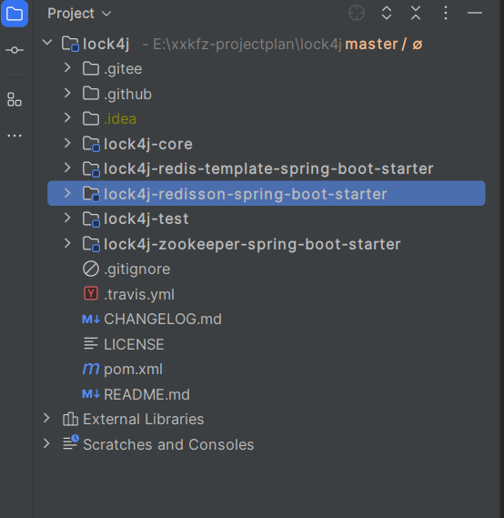
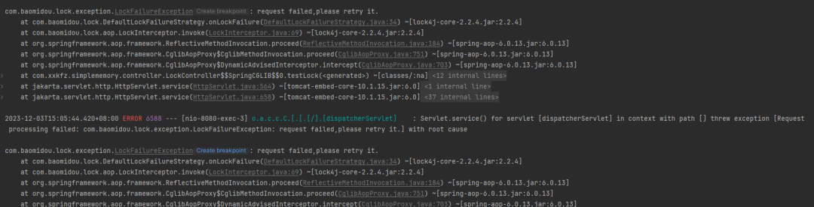
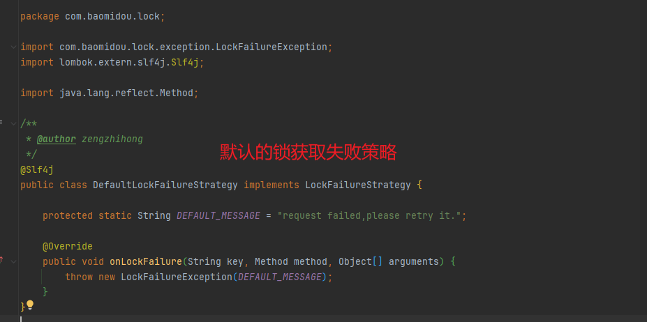

资料来源：<br/>
[分布式锁框架Lock4j简单使用](https://mp.weixin.qq.com/s/M-FDYHLClUUw6Xb1zwJKHQ)<br/>

最近项目中使用到了`Lock4j`的分布式锁组件，小编今天就带大家学习一下该框架，以及如何在我们项目中进行集成使用。

## 一、简介

`Lock4j`是一个分布式锁组件，它提供了多种不同的支持以满足不同性能和环境的需求；它基于`Spring AOP`，支持`RedisTemplate`、`Redisson`、`Zookeeper`作为底层。

## 二、开源地址

> https://gitee.com/baomidou/lock4j



Lock4j框架源码目录结构

关于具体实现源码分析，小编这里就不带大家介绍了~

## 三、特性

- 简单易用，功能强大，扩展性强。
- 支持`redission`、`redisTemplate`、`zookeeper`。可混用，支持扩展。

## 四、Lock4j注解介绍

`@Lock4j`注解共有六个属性：

|      属性      |                             说明                             |
| :------------: | :----------------------------------------------------------: |
|      name      |                      需要锁住的key名称                       |
|    executor    |            lock 执行器，可以使用该参数自定义设置             |
|      keys      |                需要锁住的keys名称，可以是多个                |
|     expire     |                锁过期时间，主要是用来防止死锁                |
| acquireTimeout | 可以理解为排队等待时长，超过这个时长就退出排队，并排除获取锁超时异常 |
|  autoRelease   |                  是否自动释放锁，默认为true                  |

```java
public @interface Lock4j {

    /**
     * 用于多个方法锁同一把锁 可以理解为锁资源名称 为空则会使用 包名+类名+方法名
     *
     * @return 名称
     */
    String name() default "";

    /**
     * @return lock 执行器
     */
    Class<? extends LockExecutor> executor() default LockExecutor.class;

    /**
     * support SPEL expresion 锁的key = name + keys
     *
     * @return KEY
     */
    String[] keys() default "";

    /**
     * @return 过期时间 单位：毫秒
     * <pre>
     *     过期时间一定是要长于业务的执行时间. 未设置则为默认时间30秒 默认值：{@link Lock4jProperties#expire}
     * </pre>
     */
    long expire() default -1;

    /**
     * @return 获取锁超时时间 单位：毫秒
     * <pre>
     *     结合业务,建议该时间不宜设置过长,特别在并发高的情况下. 未设置则为默认时间3秒 默认值：{@link Lock4jProperties#acquireTimeout}
     * </pre>
     */
    long acquireTimeout() default -1;

    /**
     * 业务方法执行完后（方法内抛异常也算执行完）自动释放锁，如果为false，锁将不会自动释放直至到达过期时间才释放 {@link com.baomidou.lock.annotation.Lock4j#expire()}
     *
     * @return 是否自动释放锁
     */
    boolean autoRelease() default true;

}
```

## 五、简单使用

### 5.1、引入相关依赖

> pom.xml

```xml
<!-- 引入Lock4j依赖 -->
<!-- 若使用redisTemplate作为分布式锁底层，则需要引入 -->
<dependency>
    <groupId>com.baomidou</groupId>
    <artifactId>lock4j-redis-template-spring-boot-starter</artifactId>
    <version>2.2.4</version>
</dependency>
<!-- 若使用redisson作为分布式锁底层，则需要引入 -->
<dependency>
    <groupId>com.baomidou</groupId>
    <artifactId>lock4j-redisson-spring-boot-starter</artifactId>
    <version>2.2.4</version>
</dependency>
```

### 5.2、添加redis相关配置

> application.yml

```yaml
spring:
  redis:
    database: 1
    # Redis服务器地址 写你的ip
    host: 127.0.0.1
    # Redis服务器连接端口
    port: 6379
    # Redis服务器连接密码（默认为空）
    password:
    # 连接池最大连接数（使用负值表示没有限制  类似于mysql的连接池
    jedis:
      pool:
        max-active: 200
        # 连接池最大阻塞等待时间（使用负值表示没有限制） 表示连接池的链接拿完了 现在去申请需要等待的时间
        max-wait: -1
        # 连接池中的最大空闲连接
        max-idle: 10
        # 连接池中的最小空闲连接
        min-idle: 0
    # 连接超时时间（毫秒） 去链接redis服务端
    timeout: 6000
```

### 5.3、简单使用

> LockController.java

```java
@RestController
@RequestMapping("/lock")
public class LockController {

    @Autowired
    private LockService lockService;

    /**
     * @param key
     * @return
     */
    @GetMapping
    @Lock4j(keys = {"#key"}, acquireTimeout = 1000, expire = 6000)
    @SneakyThrows
    public R testLock(@RequestParam String key) {
        Thread.sleep(3000);
        return R.success(key);
    }
}
```

> 浏览器地址栏访问：http://localhost:8080/lock?key=xxkfz

```
{"code":200,"status":true,"message":"xxkfz","data":null}
```

我们在浏览器连续快速访问上述地址，模拟抢占不到锁得场景：

抢占不到锁的情况默认将会抛出：com.baomidou.lock.exception.LockFailureException: request failed,please retry it.异常。

如下图所示：



默认的锁获取失败策略为 `com.baomidou.lock.DefaultLockFailureStrategy`.



我们也可以自己定义抢占锁失败执行策略：

我们只需要创建一个类实现`LockFailureStrategy接口`重写`onLockFailure方法`即可。

> CustomLockFailureStrategy.java

```java
@Component
@Slf4j
public class CustomLockFailureStrategy implements LockFailureStrategy {

    /**
     * 锁失败事件
     *
     * @param key
     * @param method
     * @param arguments
     */
    @Override
    public void onLockFailure(String key, Method method, Object[] arguments) {
        log.error("抢占锁失败：{}==={}", key, method.getName());
    }
}
```

此时，抢占锁失败将会输出以下日志：

```shell
2023-12-03T15:13:33.455+08:00 ERROR 18952 --- [nio-8080-exec-3] c.x.s.config.CustomLockFailureStrategy   : 抢占锁失败：lock4j:com.xxkfz.simplememory.controller.LockControllertestLock#xxkfz===testLock
2023-12-03T15:13:38.468+08:00 ERROR 18952 --- [nio-8080-exec-4] c.x.s.config.CustomLockFailureStrategy   : 抢占锁失败：lock4j:com.xxkfz.simplememory.controller.LockControllertestLock#xxkfz===testLock
```

## 六、高级使用

### 6.1、自定义执行器

创建类`CustomRedissonLockExecutor.java`继承抽象类`AbstractLockExecutor`，通过源码可以得知，AbstractLockExecutor抽象类实现了LockExecutor接口，我们重写`acquire`、`releaseLock`方法即可。

> CustomRedissonLockExecutor.java

```java
@Component
public class CustomRedissonLockExecutor extends AbstractLockExecutor {

    /**
     * 加锁
     *
     * @param lockKey        锁标识
     * @param lockValue      锁值
     * @param expire         锁有效时间
     * @param acquireTimeout 获取锁超时时间
     * @return 锁信息
     */
    @Override
    public Object acquire(String lockKey, String lockValue, long expire, long acquireTimeout) {
        return null;
    }

    /**
     * 解锁
     *
     * <pre>
     * 为何解锁需要校验lockValue
     * 客户端A加锁，一段时间之后客户端A解锁，在执行releaseLock之前，锁突然过期了。
     * 此时客户端B尝试加锁成功，然后客户端A再执行releaseLock方法，则将客户端B的锁给解除了。
     * </pre>
     *
     * @param key          加锁key
     * @param value        加锁value
     * @param lockInstance 锁实例
     * @return 是否释放成功
     */
    @Override
    public boolean releaseLock(String key, String value, Object lockInstance) {
        return false;
    }
}
```

### 6.2、自定义锁key生成器

默认的锁key生成器为 `com.baomidou.lock.DefaultLockKeyBuilder` ,我们创建类`CustomKeyBuilder`继承`DefaultLockKeyBuilder`重写buildKey方法，自己实现key生成逻辑即可。

> CustomKeyBuilder.java

```java
@Component
@Slf4j
public class CustomKeyBuilder extends DefaultLockKeyBuilder {


    public CustomKeyBuilder(BeanFactory beanFactory) {
        super(beanFactory);
    }

    @Override
    public String buildKey(MethodInvocation invocation, String[] definitionKeys) {
        return super.buildKey(invocation, definitionKeys);
    }
}
```

### 6.3、手动上锁解锁

> LockService.java

```java
@Service
public class LockService {
    
    @Autowired
    private LockTemplate lockTemplate;

   public void lock(String key) {
        // 获取锁
        LockInfo lockInfo = lockTemplate.lock(key, 30000L, 5000L, RedissonLockExecutor.class);
        if (Objects.isNull(lockInfo)) {
            throw new RuntimeException("业务处理中,请稍后再试......");
        }
        // 获取锁成功，处理业务
        try {
            // 处理业务逻辑 
        } catch (Exception e) {
            throw new RuntimeException(e);
        } finally {
            //释放锁
            lockTemplate.releaseLock(lockInfo);
        }
    }
}
```

