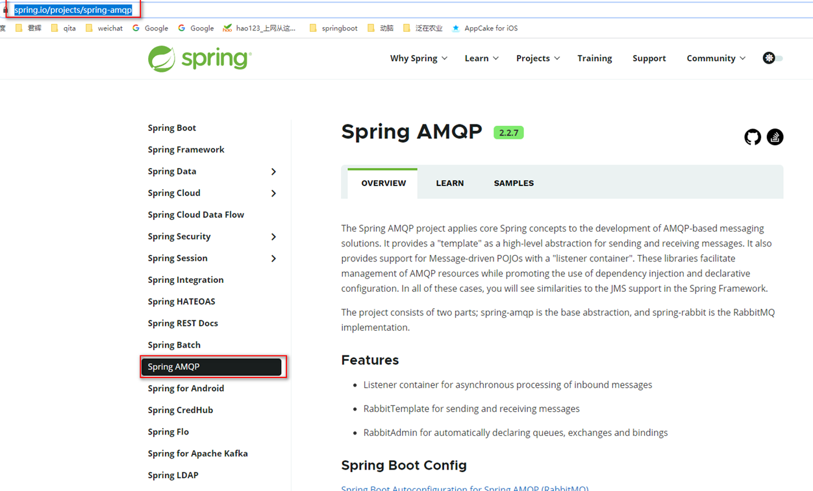
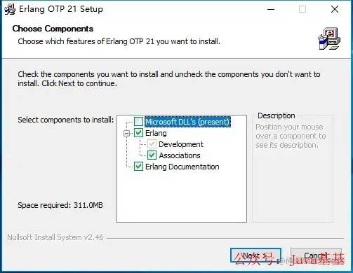
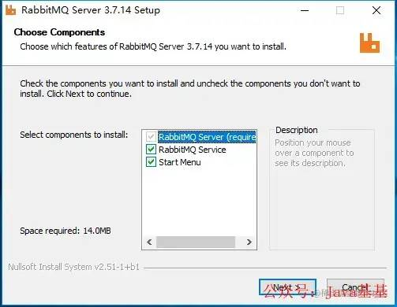
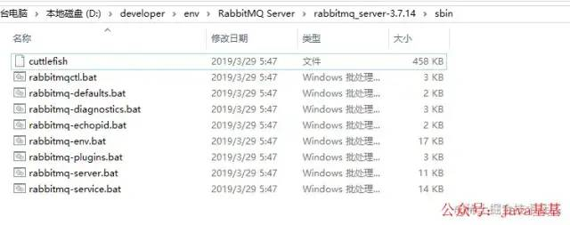
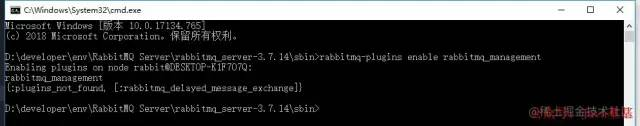
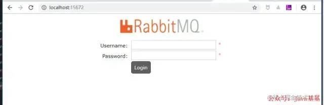
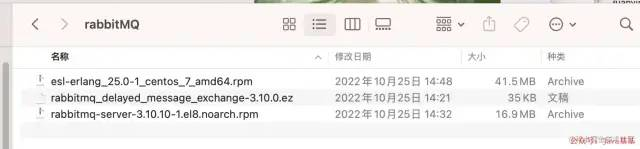

资料来源：<br/>
[会用RabbitMQ延迟插件，代码量直接降一半？](https://mp.weixin.qq.com/s/Mh914S6nU0qjeijTRhEkOQ)<br/>


## RabbitMQ 介绍

### 概述

Springboot 官网中可以 看到 rabbitmq 的支持

 

RabbitMQ 即一个消息队列，主要是用来实现应用程序的异步和解耦，同时也能起到消息缓冲，消息分发的作用。

消息中间件在互联网公司的使用中越来越多，刚才还看到新闻阿里将RocketMQ捐献给了apache，当然了今天的主角还是讲RabbitMQ。消息中间件最主要的作用是解耦，中间件最标准的用法是生产者生产消息传送到队列，消费者从队列中拿取消息并处理，生产者不用关心是谁来消费，消费者不用关心谁在生产消息，从而达到解耦的目的。在分布式的系统中，消息队列也会被用在很多其它的方面，比如：分布式事务的支持，RPC的调用等等。

###  RabbitMQ介绍

RabbitMQ是实现AMQP（高级消息队列协议）的消息中间件的一种，最初起源于金融系统，用于在分布式系统中存储转发消息，在易用性、扩展性、高可用性等方面表现不俗。RabbitMQ主要是为了实现系统之间的双向解耦而实现的。当生产者大量产生数据时，消费者无法快速消费，那么需要一个中间层。保存这个数据。

AMQP，即Advanced Message Queuing Protocol，高级消息队列协议，是应用层协议的一个开放标准，为面向消息的中间件设计。消息中间件主要用于组件之间的解耦，消息的发送者无需知道消息使用者的存在，反之亦然。AMQP的主要特征是面向消息、队列、路由（包括点对点和发布/订阅）、可靠性、安全。

RabbitMQ是一个开源的AMQP实现，服务器端用Erlang语言编写，支持多种客户端，如：Python、Ruby、.NET、Java、JMS、C、PHP、ActionScript、XMPP、STOMP等，支持AJAX。用于在分布式系统中存储转发消息，在易用性、扩展性、高可用性等方面表现不俗。

## RabbitMq 安装

#### MAC端

```
brew install rabbitmq
```

#### Windows端

1. 安装Erlang，下载地址：`http://erlang.org/download/otp_win64_21.3.exe`

安装Erlang

1. 安装RabbitMQ，下载地址：`https://dl.bintray.com/rabbitmq/all/rabbitmq-server/3.7.14/rabbitmq-server-3.7.14.exe`

安装RabbitMQ

1. 安装完成后，进入RabbitMQ安装目录下的sbin目录

RabbitMQ

1. 在地址栏输入cmd并回车启动命令行，然后输入以下命令启动管理功能：

```
rabbitmq-plugins enable rabbitmq_management
```

RabbitMQ

1. 访问地址查看是否安装成功：`http://localhost:15672/`

RabbitMQ

#### CentOS端

**安装erlang**

```
# rabbitmq依赖erlang 需要自己去自行下载
cd /path/to/erlang-sound-code && ./configure --prefix=/usr/local/erlang
make && make install 

vim /etc/profile
# 添加
export PATH=$PATH:/usr/local/erlang/bin

source /etc/profile
# 输入erl，会出现版本信息，即安装成功
```

**安装rabbitmq**

```
 #下载 abbitmq_server-3.8.16 并移动到/usr/local/下
vim /etc/profile
 # 添加
export PATH=$PATH:/usr/local/rabbitmq_server-3.8.16/sbin
source /etc/profile

cd /usr/local/rabbitmq_server-3.8.16/sbin 
# 启动
./rabbitmq-server start
```

**功能实现**

> ❝
>
> RabbitMQ实现延迟消息的方式有两种，一种是使用`死信队列`实现，另一种是使用`延迟插件`实现。
>
> 死信队列的实现网上较多，本文介绍更简单的，使用`延迟插件`实现（mac环境，java版本）。
>
> ❞

**另外的安装方式（建议使用这种）**

首先准备需要用到的安装文件及插件(rabbitmq_delayed_message_exchange)，版本需要匹配，不匹配的版本可能装不上或导致兼容问题。

rabbitmq_delayed_message_exchange

本人使用的erl_25.0和rabbitMQ-3.10.0（可以到官网下载或者私信作者获取）。使用这种方式安装的优点在于本地安装和服务器安装流程完全一致，不过服务器需要开放安全端口5672,15672视情况，一般建议测试环境开放，生产环境关闭。

安装erl和rabbitMQ，具体步骤略（这个应该没人不会吧，逃~）。

将插件文件复制到RabbitMQ安装目录的`plugins`目录下，执行以下命令后重启rabbitMQ：

```
rabbitmq-plugins enable rabbitmq_delayed_message_exchange
```

**docker 方式安装**

直接跳转[02_rabbitMq安装](linux/docker服务/02_rabbitMq安装.md)


