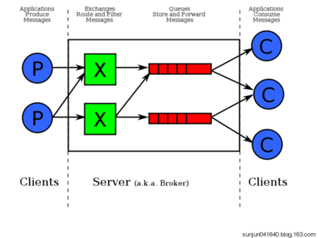
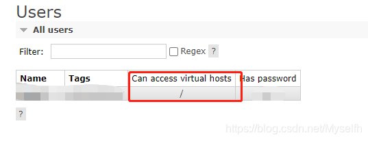
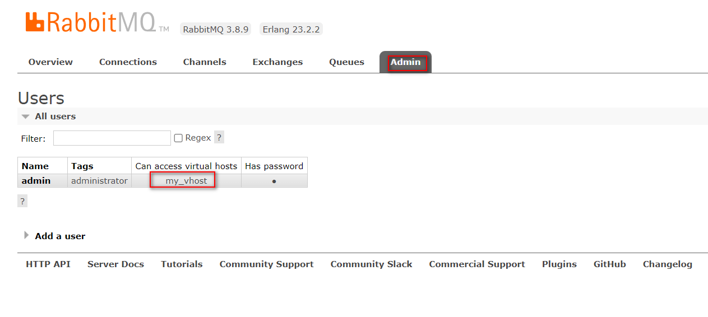
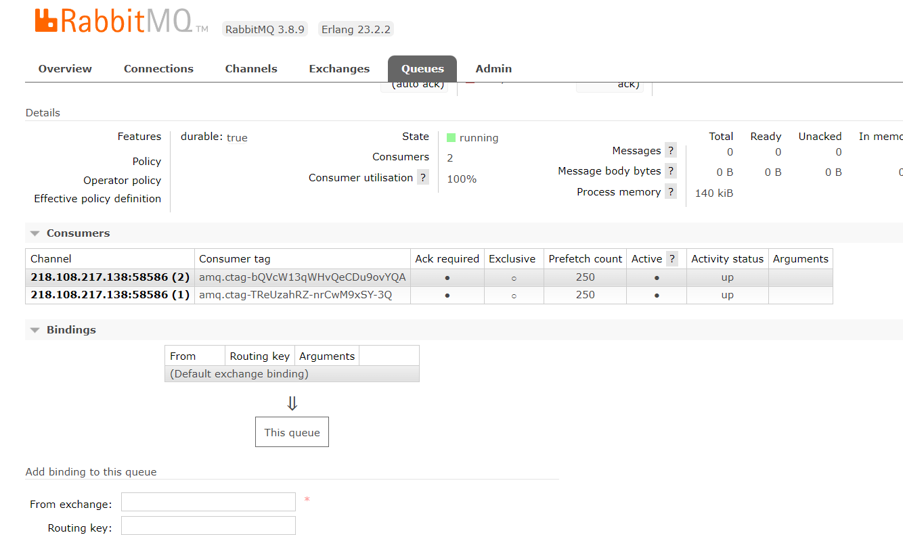
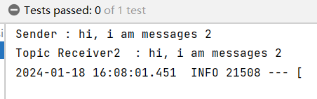
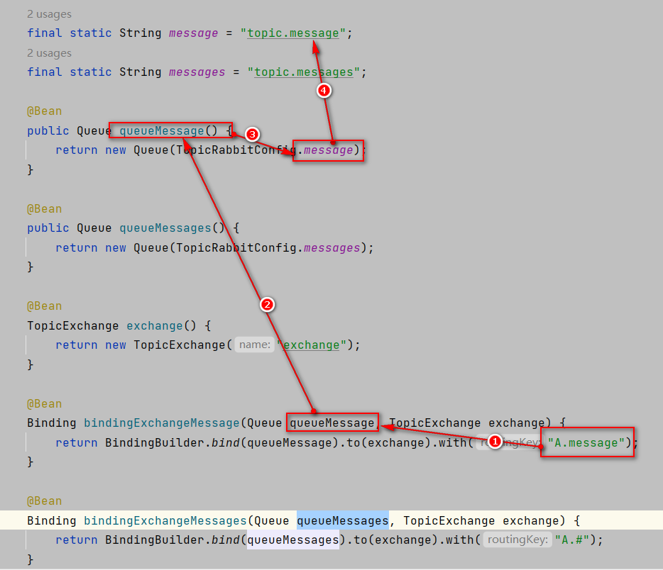
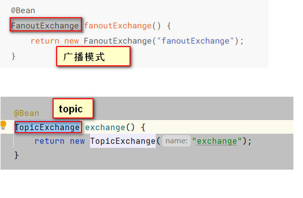

资料来源：<br/>
[Spring Boot(八)：RabbitMQ 详解](http://www.ityouknow.com/springboot/2016/11/30/spring-boot-rabbitMQ.html)<br/>
[#method＜connection.close＞(reply-code=530, reply-text=NOT_ALLOWED - vhost /my_vhost not found](https://blog.csdn.net/Myselfh/article/details/111288235)


## RabbitMQ 介绍

RabbitMQ 是实现 AMQP（高级消息队列协议）的消息中间件的一种，最初起源于金融系统，用于在分布式系统中存储转发消息，在易用性、扩展性、高可用性等方面表现不俗。 RabbitMQ 主要是为了实现系统之间的双向解耦而实现的。当生产者大量产生数据时，消费者无法快速消费，那么需要一个中间层。保存这个数据。

AMQP，即 Advanced Message Queuing Protocol，高级消息队列协议，是应用层协议的一个开放标准，为面向消息的中间件设计。消息中间件主要用于组件之间的解耦，消息的发送者无需知道消息使用者的存在，反之亦然。AMQP 的主要特征是面向消息、队列、路由（包括点对点和发布/订阅）、可靠性、安全。

RabbitMQ 是一个开源的 AMQP 实现，服务器端用Erlang语言编写，支持多种客户端，如：Python、Ruby、.NET、Java、JMS、C、PHP、ActionScript、XMPP、STOMP 等，支持 AJAX。用于在分布式系统中存储转发消息，在易用性、扩展性、高可用性等方面表现不俗。

### 相关概念

通常我们谈到队列服务, 会有三个概念： 发消息者、队列、收消息者，RabbitMQ 在这个基本概念之上, 多做了一层抽象, 在发消息者和 队列之间, 加入了交换器 (Exchange). 这样发消息者和队列就没有直接联系, 转而变成发消息者把消息给交换器, 交换器根据调度策略再把消息再给队列。



- 左侧 P 代表 生产者，也就是往 RabbitMQ 发消息的程序。
- 中间即是 RabbitMQ，*其中包括了 交换机 和 队列。*
- 右侧 C 代表 消费者，也就是往 RabbitMQ 拿消息的程序。

那么，*其中比较重要的概念有 4 个，分别为：虚拟主机，交换机，队列，和绑定。*

- 虚拟主机：一个虚拟主机持有一组交换机、队列和绑定。为什么需要多个虚拟主机呢？很简单， RabbitMQ 当中，*用户只能在虚拟主机的粒度进行权限控制。* 因此，如果需要禁止A组访问B组的交换机/队列/绑定，必须为A和B分别创建一个虚拟主机。每一个 RabbitMQ 服务器都有一个默认的虚拟主机“/”。
- 交换机：*Exchange 用于转发消息，但是它不会做存储* ，如果没有 Queue bind 到 Exchange 的话，它会直接丢弃掉 Producer 发送过来的消息。 这里有一个比较重要的概念：**路由键** 。消息到交换机的时候，交互机会转发到对应的队列中，那么究竟转发到哪个队列，就要根据该路由键。
- 绑定：也就是交换机需要和队列相绑定，这其中如上图所示，是多对多的关系。

### 交换机(Exchange)

交换机的功能主要是接收消息并且转发到绑定的队列，交换机不存储消息，在启用ack模式后，交换机找不到队列会返回错误。交换机有四种类型：Direct, topic, Headers and Fanout

- Direct：direct 类型的行为是”先匹配, 再投送”. 即在绑定时设定一个 **routing_key**, 消息的**routing_key** 匹配时, 才会被交换器投送到绑定的队列中去.
- Topic：按规则转发消息（最灵活）
- Headers：设置 header attribute 参数类型的交换机
- Fanout：转发消息到所有绑定队列

**Direct Exchange**

Direct Exchange 是 RabbitMQ 默认的交换机模式，也是最简单的模式，根据key全文匹配去寻找队列。


第一个 X - Q1 就有一个 binding key，名字为 orange； X - Q2 就有 2 个 binding key，名字为 black 和 green。*当消息中的 路由键 和 这个 binding key 对应上的时候，那么就知道了该消息去到哪一个队列中。*

Ps：为什么 X 到 Q2 要有 black，green，2个 binding key呢，一个不就行了吗？ - 这个主要是因为可能又有 Q3，而Q3只接受 black 的信息，而Q2不仅接受black 的信息，还接受 green 的信息。

**Topic Exchange**

*Topic Exchange 转发消息主要是根据通配符。* 在这种交换机下，队列和交换机的绑定会定义一种路由模式，那么，通配符就要在这种路由模式和路由键之间匹配后交换机才能转发消息。

在这种交换机模式下：

- 路由键必须是一串字符，用句号（`.`） 隔开，比如说 agreements.us，或者 agreements.eu.stockholm 等。
- 路由模式必须包含一个 星号（`*`），主要用于匹配路由键指定位置的一个单词，比如说，一个路由模式是这样子：agreements..b.*，那么就只能匹配路由键是这样子的：第一个单词是 agreements，第四个单词是 b。 井号（#）就表示相当于一个或者多个单词，例如一个匹配模式是 agreements.eu.berlin.#，那么，以agreements.eu.berlin 开头的路由键都是可以的。

具体代码发送的时候还是一样，第一个参数表示交换机，第二个参数表示 routing key，第三个参数即消息。如下：

```
rabbitTemplate.convertAndSend("testTopicExchange","key1.a.c.key2", " this is  RabbitMQ!");
```

topic 和 direct 类似, 只是匹配上支持了”模式”, 在”点分”的 routing_key 形式中, 可以使用两个通配符:

- `*`表示一个词.
- `#`表示零个或多个词.

**Headers Exchange**

headers 也是根据规则匹配, 相较于 direct 和 topic 固定地使用 routing_key , headers 则是一个自定义匹配规则的类型. 在队列与交换器绑定时, 会设定一组键值对规则, 消息中也包括一组键值对( headers 属性), 当这些键值对有一对, 或全部匹配时, 消息被投送到对应队列.

**Fanout Exchange**

Fanout Exchange 消息广播的模式，不管路由键或者是路由模式，*会把消息发给绑定给它的全部队列*，如果配置了 routing_key 会被忽略。

## 使用案例

### 基本配置

1、配置 Pom 包，主要是添加 `spring-boot-starter-amqp` 的支持

```
<dependency>
	<groupId>org.springframework.boot</groupId>
	<artifactId>spring-boot-starter-amqp</artifactId>
</dependency>
```

2、配置文件

配置 RabbitMQ 的安装地址、端口以及账户信息

```yaml
spring:
  application:
    name: Spring-boot-rabbitmq
  rabbitmq:
    host: 124.221.127.60
    port: 5672
    username: admin
    password: admin
    virtual-host: my_vhost
```

`spring.rabbitmq.virtual-host=/my_vhost`的值是在主机上看到的




如果是上面的的，写法就是

```
	spring.rabbitmq.virtual-host=my_vhost
```

如果是my_vhost



```
	spring.rabbitmq.virtual-host=my_vhost
```

### 简答使用

**队列配置**

```java
@Configuration
public class RabbitConfig {

    @Bean
    public Queue Queue() {
        return new Queue("hello");
    }

}
```

**发送者**

rabbitTemplate 是 Spring Boot 提供的默认实现

```java
@component
public class HelloSender {

	@Autowired
	private AmqpTemplate rabbitTemplate;

	public void send() {
		String context = "hello " + new Date();
		System.out.println("Sender : " + context);
		this.rabbitTemplate.convertAndSend("hello", context);
	}

}
```

**接收者**

```java
@Component
@RabbitListener(queues = "hello")
public class HelloReceiver {

    @RabbitHandler
    public void process(String hello) {
        System.out.println("Receiver  : " + hello);
    }

}
```

5、测试

```java
@RunWith(SpringRunner.class)
@SpringBootTest
public class RabbitMqHelloTest {

	@Autowired
	private HelloSender helloSender;

	@Test
	public void hello() throws Exception {
		helloSender.send();
         Thread.currentThread().join(); // 防止程序结束
	}

}
```

> 注意，发送者和接收者的 queue name 必须一致，不然不能接收

### 多对多使用

一个发送者，N 个接收者或者 N 个发送者和 N 个接收者会出现什么情况呢？

**一对多发送**

对上面的代码进行了小改造，接收端注册了两个 Receiver,Receiver1 和 Receiver2，发送端加入参数计数，接收端打印接收到的参数，下面是测试代码，发送一百条消息，来观察两个接收端的执行效果

```java
@Test
public void oneToMany() throws Exception {
	for (int i=0;i<100;i++){
		neoSender.send(i);
	}
	 Thread.currentThread().join(); // 防止程序结束
}
```

结果如下：

```
Receiver 1: Spring boot neo queue ****** 11
Receiver 2: Spring boot neo queue ****** 12
Receiver 2: Spring boot neo queue ****** 14
Receiver 1: Spring boot neo queue ****** 13
Receiver 2: Spring boot neo queue ****** 15
Receiver 1: Spring boot neo queue ****** 16
Receiver 1: Spring boot neo queue ****** 18
Receiver 2: Spring boot neo queue ****** 17
Receiver 2: Spring boot neo queue ****** 19
Receiver 1: Spring boot neo queue ****** 20
```

根据返回结果得到以下结论

> 一个发送者，N个接受者,经过测试会均匀的将消息发送到N个接收者中

**多对多发送**

复制了一份发送者，加入标记，在一百个循环中相互交替发送

```java
@Test
	public void manyToMany() throws Exception {
		for (int i=0;i<100;i++){
			neoSender.send(i);
			neoSender2.send(i);
		}
		 Thread.currentThread().join(); // 防止程序结束
}
```

结果如下：

```
Receiver 1: Spring boot neo queue ****** 20
Receiver 2: Spring boot neo queue ****** 20
Receiver 1: Spring boot neo queue ****** 21
Receiver 2: Spring boot neo queue ****** 21
Receiver 1: Spring boot neo queue ****** 22
Receiver 2: Spring boot neo queue ****** 22
Receiver 1: Spring boot neo queue ****** 23
Receiver 2: Spring boot neo queue ****** 23
Receiver 1: Spring boot neo queue ****** 24
Receiver 2: Spring boot neo queue ****** 24
Receiver 1: Spring boot neo queue ****** 25
Receiver 2: Spring boot neo queue ****** 25
```

> 结论：和一对多一样，接收端仍然会均匀接收到消息




## 高级使用

### 对象的支持

Spring Boot 以及完美的支持对象的发送和接收，不需要格外的配置。

```java
//发送者
public void send(User user) {
	System.out.println("Sender object: " + user.toString());
	this.rabbitTemplate.convertAndSend("object", user);
}

...

//接收者
@RabbitHandler
public void process(User user) {
    System.out.println("Receiver object : " + user);
}
```

结果如下：

```shell
Sender object: User{name='neo', pass='123456'}
Receiver object : User{name='neo', pass='123456'}
```

### Topic Exchange

topic 是 RabbitMQ 中最灵活的一种方式，可以根据 routing_key 自由的绑定不同的队列

首先对 topic 规则配置，这里使用两个队列来测试

```java
@Configuration
public class TopicRabbitConfig {

    final static String message = "topic.message";
    final static String messages = "topic.messages";

    @Bean
    public Queue queueMessage() {
        return new Queue(TopicRabbitConfig.message);
    }

    @Bean
    public Queue queueMessages() {
        return new Queue(TopicRabbitConfig.messages);
    }

    @Bean
    TopicExchange exchange() {
        return new TopicExchange("exchange");
    }

    @Bean
    Binding bindingExchangeMessage(Queue queueMessage, TopicExchange exchange) {
        return BindingBuilder.bind(queueMessage).to(exchange).with("A.message");
    }

    @Bean
    Binding bindingExchangeMessages(Queue queueMessages, TopicExchange exchange) {
        return BindingBuilder.bind(queueMessages).to(exchange).with("A.#");
    }
}
```

**发送**

使用 queueMessages 同时匹配两个队列，queueMessage 只匹配 “topic.message” 队列

```java
import org.springframework.amqp.core.AmqpTemplate;
import org.springframework.beans.factory.annotation.Autowired;
import org.springframework.stereotype.Component;

@Component
public class HelloSender {

    @Autowired
    private AmqpTemplate rabbitTemplate;

    public void send1() {
        String context = "hi, i am message 1";
        System.out.println("Sender : " + context);
        this.rabbitTemplate.convertAndSend("exchange", "A.message", context);
    }

    public void send2() {
        String context = "hi, i am messages 2";
        System.out.println("Sender : " + context);
        this.rabbitTemplate.convertAndSend("exchange", "A.messages", context);
    }

}
```

发送send1会匹配到topic.#和topic.message 两个Receiver都可以收到消息，发送send2只有topic.#可以匹配所有只有Receiver2监听到消息

**接收**

两个接收到者

```java
import org.springframework.amqp.rabbit.annotation.RabbitHandler;
import org.springframework.amqp.rabbit.annotation.RabbitListener;
import org.springframework.stereotype.Component;

@Component
@RabbitListener(queues = TopicRabbitConfig.message)
public class TopicReceiver {

    @RabbitHandler
    public void process(String message) {
        System.out.println("Topic Receiver1  : " + message);
    }

}
```

```java
import org.springframework.amqp.rabbit.annotation.RabbitHandler;
import org.springframework.amqp.rabbit.annotation.RabbitListener;
import org.springframework.stereotype.Component;

@Component
@RabbitListener(queues = TopicRabbitConfig.messages)
public class TopicReceiver2 {

    @RabbitHandler
    public void process(String message) {
        System.out.println("Topic Receiver2  : " + message);
    }

}
```

测试方法

```java
@RunWith(SpringRunner.class)
@SpringBootTest
public class Rabbit2MqHelloTest {

    @Autowired
    private HelloSender helloSender;

    @SneakyThrows
    @Test
    public void test01(){
        helloSender.send1();
       // helloSender.send1();
        Thread.currentThread().join();

    }
}
```


send1结果


send2结果




解释：

TopicExchange的值是`exchange`

发送1 内容是`"topic.message"`而2的内容是`topic.messages`



test1 中发送的内容是`A.message` 是完全匹配第一个的，但是`A#`也匹配，根据这个路线找到两个消费者


### Fanout Exchange

Fanout 就是我们熟悉的广播模式或者订阅模式，给 Fanout 交换机发送消息，绑定了这个交换机的所有队列都收到这个消息。

Fanout 相关配置

**路由配置**

```java
@Configuration
public class FanoutRabbitConfig {

    @Bean
    public Queue AMessage() {
        return new Queue("fanout.A");
    }

    @Bean
    public Queue BMessage() {
        return new Queue("fanout.B");
    }

    @Bean
    public Queue CMessage() {
        return new Queue("fanout.C");
    }

    @Bean
    FanoutExchange fanoutExchange() {
        return new FanoutExchange("fanoutExchange");
    }

    @Bean
    Binding bindingExchangeA(Queue AMessage,FanoutExchange fanoutExchange) {
        return BindingBuilder.bind(AMessage).to(fanoutExchange);
    }

    @Bean
    Binding bindingExchangeB(Queue BMessage, FanoutExchange fanoutExchange) {
        return BindingBuilder.bind(BMessage).to(fanoutExchange);
    }

    @Bean
    Binding bindingExchangeC(Queue CMessage, FanoutExchange fanoutExchange) {
        return BindingBuilder.bind(CMessage).to(fanoutExchange);
    }

}
```

备注：之前是



接收

```java
import org.springframework.amqp.rabbit.annotation.RabbitHandler;
import org.springframework.amqp.rabbit.annotation.RabbitListener;
import org.springframework.stereotype.Component;

@Component
@RabbitListener(queues = "fanout.A")
public class FanoutReceiverA {

    @RabbitHandler
    public void process(String message) {
        System.out.println("fanout Receiver A  : " + message);
    }

}
```

```java
import org.springframework.amqp.rabbit.annotation.RabbitHandler;
import org.springframework.amqp.rabbit.annotation.RabbitListener;
import org.springframework.stereotype.Component;

@Component
@RabbitListener(queues = "fanout.B")
public class FanoutReceiverB {

    @RabbitHandler
    public void process(String message) {
        System.out.println("fanout Receiver B: " + message);
    }

}
```

```java
import org.springframework.amqp.rabbit.annotation.RabbitHandler;
import org.springframework.amqp.rabbit.annotation.RabbitListener;
import org.springframework.stereotype.Component;

@Component
@RabbitListener(queues = "fanout.C")
public class FanoutReceiverC {

    @RabbitHandler
    public void process(String message) {
        System.out.println("fanout Receiver C: " + message);
    }

}
```

这里使用了 A、B、C 三个队列绑定到 Fanout 交换机上面，发送端的 routing_key 写任何字符都会被忽略：

```java
public void send() {
	String context = "hi, fanout msg ";
	System.out.println("Sender : " + context);
	this.rabbitTemplate.convertAndSend("fanoutExchange","", context);
}
```

结果如下：

```shell
Sender : hi, fanout msg 
...
fanout Receiver B: hi, fanout msg 
fanout Receiver A  : hi, fanout msg 
fanout Receiver C: hi, fanout msg 
```

结果说明，绑定到 fanout 交换机上面的队列都收到了消息

**[示例代码-github](https://github.com/ityouknow/spring-boot-examples/tree/master/spring-boot-rabbitmq)**

**[示例代码-码云](https://gitee.com/ityouknow/spring-boot-examples/tree/master/spring-boot-rabbitmq)**

### 参考

[RabbitMQ 使用参考](https://www.zouyesheng.com/rabbitmq.html)

[RabbitMQ：Spring 集成 RabbitMQ 与其概念，消息持久化，ACK机制](https://github.com/401Studio/WeekLearn/issues/2)