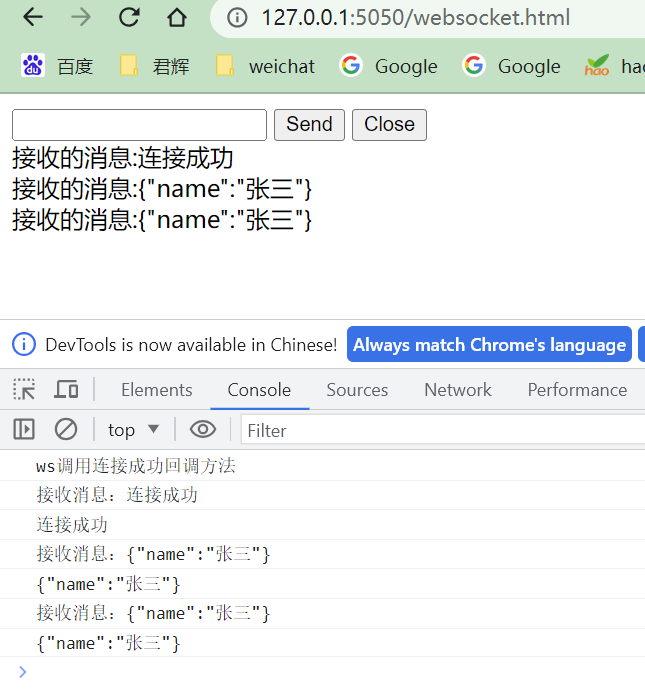

## websocket在项目中的使用

在项目中，页面订阅一个地址以后。通过调用接口，向这个页面进行推送内容。其他的页面，是无法收到这个推送内容

### 依赖的jar

```xml
	<!-- websocket 推送 -->
			<dependency>
				<groupId>org.yeauty</groupId>
				<artifactId>netty-websocket-spring-boot-starter</artifactId>
				<version>0.12.0</version>
			</dependency>
```


### 实现的过程

```java

import cn.hutool.extra.spring.SpringUtil;
import com.yuandi.injectiondispenser.core.websocket.WebsocketService;
import com.yuandi.injectiondispenser.core.websocket.impl.WebsocketServiceImpl;
import io.netty.handler.codec.http.HttpHeaders;
import io.netty.handler.timeout.IdleStateEvent;
import lombok.extern.slf4j.Slf4j;
import org.apache.commons.lang3.StringUtils;
import org.springframework.util.MultiValueMap;
import org.yeauty.annotation.*;
import org.yeauty.pojo.Session;

import javax.websocket.server.PathParam;
import java.io.IOException;
import java.util.Set;
import java.util.concurrent.ConcurrentHashMap;
import java.util.concurrent.CopyOnWriteArraySet;
import java.util.concurrent.locks.Lock;
import java.util.concurrent.locks.ReentrantLock;


@Slf4j
@ServerEndpoint(path = "/server/{pageId}",port = "${websocket.port}")
public class WebSocketUtils {

    WebsocketService websocketService = SpringUtil.getBean(WebsocketServiceImpl.class);

    Lock lock = new ReentrantLock();

    /**静态变量，用来记录当前在线连接数。应该把它设计成线程安全的。*/
    private static int onlineCount = 0;
    /**concurrent包的线程安全集合，也可以map改成set，用来存放每个客户端对应的MyWebSocket对象。*/
    // concurrent包的线程安全Set，用来存放每个客户端对应的MyWebSocket对象。
    private static ConcurrentHashMap<String, CopyOnWriteArraySet<WebSocketUtils>> webSocketMap = new ConcurrentHashMap<>();
    /**与某个客户端的连接会话，需要通过它来给客户端发送数据*/
    private Session session;
    /**接收userId*/
    private String pageId="";

    /**
     *建立ws连接前的配置
     */
//   @BeforeHandshake
//    public void handshake(Session session, HttpHeaders headers, @RequestParam String req, @RequestParam MultiValueMap reqMap, @PathVariable String arg, @PathVariable MappingChange.Map pathMap){
//        //采用stomp子协议
//        session.setSubprotocols("stomp");
//        if (!"ok".equals(req)){
//            System.out.println("Authentication failed!");
//            session.close();
//        }
//    }

    @OnOpen
    public void onOpen(Session session, HttpHeaders headers, @RequestParam String req, @RequestParam MultiValueMap reqMap, @PathVariable String pageId/*, @PathVariable MappingChange.Map pathMap*/){
        this.session = session;
        this.pageId=pageId;

        CopyOnWriteArraySet<WebSocketUtils> set = null;


        // 每次创建必须是单线程，防止创建多个
        lock.lock();
        try {
            set = webSocketMap.get(pageId);
            if(set == null){
                set = new CopyOnWriteArraySet<>();
                webSocketMap.put(pageId,set);
            }
        } catch (Exception e) {
            // TODO: handle exception
        }finally {
            lock.unlock();
        }


        if(!set.contains(this)){
            //加入集合中
            set.add(this);
        }

        log.info("页面id:"+pageId+",当前在线人数为:" + set.size());

        try {
            sendMessage("连接成功");
        } catch (IOException e) {
            log.error("页面id:"+pageId+",网络异常!!!!!!");
        }
    }

    @OnClose
    public void onClose(Session session) throws IOException {
        CopyOnWriteArraySet<WebSocketUtils> set = webSocketMap.get(pageId);
        if(set.contains(this)){
            set.remove(this);
            //从集合中删除
        }
        log.info("页面id:"+pageId+",当前在线人数为:" + set.size());
    }

    @OnError
    public void onError(Session session, Throwable throwable) {
        log.error("页面id:" + this.pageId + "错误,原因:" + throwable.getMessage());
        throwable.printStackTrace();
    }

    @OnMessage
    public void onMessage(Session session, String message,  @PathVariable String pageId) {
//        log.info("【websocket消息】收到客户端发来的消息:{}", message);


        websocketService.processMessage(pageId, session, message);


//        {"toUserId":"10","contentText":"hello websocket"}
//        JSONObject jsonObject = JSONObject.parseObject(message);
//        String toUserId = jsonObject.getString("toUserId");
//        String contentText = jsonObject.getString("contentText");
//
//        try {
//            sendInfo(contentText,toUserId);
//        } catch (IOException e) {
//            e.printStackTrace();
//        }
    }


    @OnBinary
    public void onBinary(Session session, byte[] bytes) {
        for (byte b : bytes) {
            System.out.println(b);
        }
        session.sendBinary(bytes);
    }

    @OnEvent
    public void onEvent(Session session, Object evt) {
        if (evt instanceof IdleStateEvent) {
            IdleStateEvent idleStateEvent = (IdleStateEvent) evt;
            switch (idleStateEvent.state()) {
                case READER_IDLE:
                    System.out.println("read idle");
                    break;
                case WRITER_IDLE:
                    System.out.println("write idle");
                    break;
                case ALL_IDLE:
                    System.out.println("all idle");
                    break;
                default:
                    break;
            }
        }
    }

    /**
     * 实现服务器主动推送
     */
    public void sendMessage(String message) throws IOException {
        this.session.sendText(message);
    }

    /**
     * 发送自定义消息
     * */
    public static void sendInfo(String message,@PathParam("pageId") String pageId) throws IOException {
        log.info("发送消息到:"+pageId+"，报文:"+message);
        if(StringUtils.isNotBlank(pageId)&&webSocketMap.containsKey(pageId)){
            Set<WebSocketUtils> webSocketUtilsList = webSocketMap.get(pageId);

            for (WebSocketUtils webSocketUtils : webSocketUtilsList) {
                webSocketUtils.sendMessage(message);
            }

        }else{
            log.error("页面id:"+pageId+",不在线！");
        }
    }

}
```

发送接口

```java
import org.yeauty.pojo.Session;

import java.io.IOException;

public interface WebsocketService {

    /**
     * 发送一条消息
     * @param pageId  页面的id
     * @param message 发送的消息
     * @throws IOException
     */
    void sendInfo(String pageId, String message) throws IOException;


    /**
     * 页面发送的消息
     * @param pageId  页面的id
     * @param session 对话
     * @param message 发送的消息
     */
    void processMessage(String pageId, Session session, String message);
}

```

接口的实现

```java
@Slf4j
@Service
public class WebsocketServiceImpl implements WebsocketService {

    @Override
    public void sendInfo(String userId, String message) throws IOException {
        WebSocketUtils.sendInfo(message, userId);
    }

    @Override
    public void processMessage(String pageId, Session session, String message) {
        log.info("【websocket消息】收到客户端发来的消息:{}", message);
//        session.sendText("数据，已经收到了");   // 测试回复功能
    }
}
```


### 前端页面

订阅页面

```html
<!DOCTYPE html>
<html lang="en">
<head>
    <meta charset="UTF-8">
    <title>My WebSocke</title>
</head>

<body>
<input id="text" type="text" />
<button onclick="send()">Send</button>
<button onclick="closeWebSocket()">Close</button>
<div id="message"></div>
</body>
<script type="text/javascript">
    let ws = null;
    //判断当前浏览器是否支持WebSocket
    if ('WebSocket' in window) {
        ws = new WebSocket("ws://127.0.0.1:8880/server/10");
    }
    else {
        alert('当前浏览器 Not support websocket')
    }

    //连接发生错误的回调方法
    ws.onerror = function () {
        setMessageInnerHTML("WebSocket连接发生错误");
    };

    //连接成功建立的回调方法
    ws.onopen = function(event) {
        console.log("ws调用连接成功回调方法")
        //ws.send("")
    }
    //接收到消息的回调方法
    ws.onmessage = function(message) {
        console.log("接收消息：" + message.data);
        if (typeof(message.data) == 'string') {
            setMessageInnerHTML(message.data);
        }
    }
    //ws连接断开的回调方法
    ws.onclose = function(e) {
        console.log("ws连接断开")
        //console.log(e)
        setMessageInnerHTML("ws close");
    }

    //将消息显示在网页上
    function setMessageInnerHTML(innerHTML) {
        console.log(innerHTML)
        document.getElementById('message').innerHTML += '接收的消息:' + innerHTML + '<br/>';
    }

    //关闭连接
    function closeWebSocket() {
        ws.close();
    }


    //发送消息
    function send(msg) {
        if(!msg){
            msg = document.getElementById('text').value;
            document.getElementById('message').innerHTML += "发送的消息:" + msg + '<br/>';
            ws.send(msg);
        }
    }
</script>
</html>
```

`ajax`发送推送测试页面

```html
<!DOCTYPE html>
<html lang="en">
<head>
  <meta charset="UTF-8" />
  <title>jquery-ajax</title>
</head>
<body>
<input id="sendText" type="text" value='{"name":"张三"}' style="width: 200px;" />
<input type="button" value="点击" id="btn" />

<div id="showInfo"></div>
<script type="text/javascript" src="js/jquery-1.11.2.js"></script>
<script type="text/javascript">

  $(function () {
    // var data = '{"name":"liuwei"}';
    $('#btn').click(function () {
      var sendTextValues = $("#sendText").val();
      var data = sendTextValues;
      $.ajax({
        url: '/websocket/say', // 接口的请求地址
        dataType: 'json',
        type: 'post',
        headers:{'Content-Type':'application/json;charset=utf8'},
        data: data, // 请求参数
        success: function (data) {
          $("#showInfo").html(s);
        },
        error: function (err) {
          console.log('接口请求失败：' + err);
        },
      });
    });
  });
</script>
</body>
</html>
```

### 对应的测试controller

```java
import com.alibaba.fastjson2.JSONObject;
import com.yuandi.injectiondispenser.core.web.Result;
import com.yuandi.injectiondispenser.core.websocket.WebsocketService;
import org.springframework.beans.factory.annotation.Autowired;
import org.springframework.web.bind.annotation.PostMapping;
import org.springframework.web.bind.annotation.RequestBody;
import org.springframework.web.bind.annotation.RequestMapping;
import org.springframework.web.bind.annotation.RestController;

import java.io.IOException;
import java.util.Map;

@RestController
@RequestMapping("/websocket")
public class WebSocketDemoController {

    @Autowired
    private WebsocketService websocketService;

    @PostMapping("/say")
    public Result say(@RequestBody Map<String ,String> body) throws IOException {
        JSONObject jo = new JSONObject(body);
        websocketService.sendInfo("10", jo.toJSONString());
        return Result.success();
    }
}
```

发送后的效果

