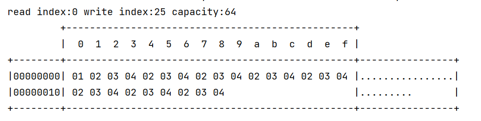
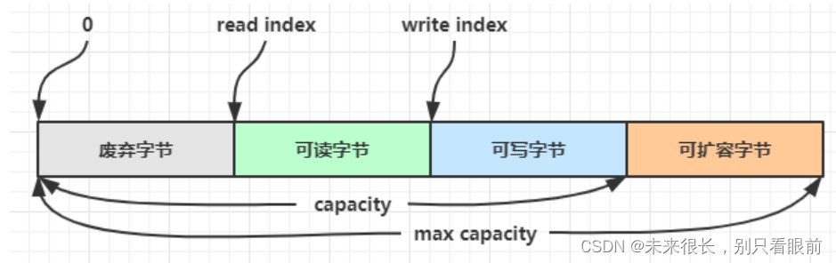

资料来源：<br/>
[ByteBuf用法详解](https://blog.csdn.net/smith789/article/details/104410317?spm=1001.2101.3001.6650.1&utm_medium=distribute.pc_relevant.none-task-blog-2%7Edefault%7ECTRLIST%7ERate-1-104410317-blog-123698827.235%5Ev33%5Epc_relevant_increate_t0_download_v2_base&depth_1-utm_source=distribute.pc_relevant.none-task-blog-2%7Edefault%7ECTRLIST%7ERate-1-104410317-blog-123698827.235%5Ev33%5Epc_relevant_increate_t0_download_v2_base&utm_relevant_index=2)<br/>
[Netty 入门学习](https://blog.csdn.net/weixin_53142722/article/details/124942857?utm_medium=distribute.pc_relevant.none-task-blog-2~default~baidujs_baidulandingword~default-1-124942857-blog-105618052.pc_relevant_recovery_v2&spm=1001.2101.3001.4242.2&utm_relevant_index=4)


## ByteBuf使用

### ByteBuf 介绍

ByteBuf from Netty比ByteBuffer from java nio更强大，比如可以进行池化，不需要flip切换读写模式。
ByteBuf内部结构如图所示：
ByteBuf本质上是一个字节数组，分为了4个部分。


readerIndex是读指针，每读取一个字节，readerIndex就会+1。一旦readerIndex = writerIndex，不可再读了。
writerIndex是写指针，每写入一个字节，writerIndex就会+1.一旦writerIndex = readerIndex，不可再写了。
capacity表示ByteBuf容量，它的值 = 废弃的字节数 + 可读的字节数 + 可写的字节数。
读取之后，0~readerIndex就被视为废弃的，调用discardReadBytes方法，可以释放这部分空间。
maxCapacity是ByteBuf可以扩容的最大容量。扩容超过maxCapacity就会报错。
使用示例

```java
@Test
public void test1(){
    ByteBuf b = ByteBufAllocator.DEFAULT.buffer(1,10);
    System.out.println("可读字节数：" + b.readableBytes() + ",可写字节数：" + b.writableBytes());
    System.out.println("分配了初始容量是9，最大容量10个字节的缓冲区" + b);
    b.writeBytes(new byte[]{1,2});
    System.out.println("写入了2个字节" + b);
    System.out.println("可读字节数：" + b.readableBytes() + ",可写字节数：" + b.writableBytes());
    getByteBuf(b);
    System.out.println("可读字节数：" + b.readableBytes() + ",可写字节数：" + b.writableBytes());
    System.out.println(b);
    readByteBuf(b);
    System.out.println("可读字节数：" + b.readableBytes() + ",可写字节数：" + b.writableBytes());
    System.out.println(b);
    getByteBuf(b);
    System.out.println("可读字节数：" + b.readableBytes() + ",可写字节数：" + b.writableBytes());
    System.out.println(b);
}

private void readByteBuf(ByteBuf buffer){
    System.out.println("开始读取，改变了buffer内部指针,buffer内容如下：");
    while(buffer.isReadable()){
        System.out.print(buffer.readByte() + ",");
    }
    System.out.println();
}

/**
 * 读取字节，不改变指针
 * @param buffer
 */
private void getByteBuf(ByteBuf buffer){
    System.out.println("开始读取，不改变buffer内部指针，buffer内容如下：");
    for (int i = 0; i < buffer.readableBytes(); i++) {
        System.out.print(buffer.getByte(i) + ",");
    }
    System.out.println();
}
```

运行结果

```
可读字节数：0,可写字节数：1
分配了初始容量是9，最大容量10个字节的缓冲区PooledUnsafeDirectByteBuf(ridx: 0, widx: 0, cap: 1/10)
写入了2个字节PooledUnsafeDirectByteBuf(ridx: 0, widx: 2, cap: 10/10)
可读字节数：2,可写字节数：8
开始读取，不改变buffer内部指针，buffer内容如下：
1,2,
可读字节数：2,可写字节数：8
PooledUnsafeDirectByteBuf(ridx: 0, widx: 2, cap: 10/10)
开始读取，改变了buffer内部指针,buffer内容如下：
1,2,
可读字节数：0,可写字节数：8
PooledUnsafeDirectByteBuf(ridx: 2, widx: 2, cap: 10/10)
开始读取，不改变buffer内部指针，buffer内容如下：

可读字节数：0,可写字节数：8
PooledUnsafeDirectByteBuf(ridx: 2, widx: 2, cap: 10/10)
```

工具类

用到的jar包

```xml
            <!-- 工具类 -->
            <dependency>
                <groupId>cn.hutool</groupId>
                <artifactId>hutool-all</artifactId>
                <version>5.8.5</version>
            </dependency>
```

字符串数组转化

```java
import cn.hutool.core.util.HexUtil;
import io.netty.buffer.ByteBuf;

public class ByteBufUtils {

    /**
     * 获取其中的字节数组
     *
     * @param byteBuf 数据
     * @return 字节数组
     */
    public static byte[] byteArray(ByteBuf byteBuf) {
        byte[] bytes = new byte[byteBuf.readableBytes()];
        byteBuf.getBytes(0, bytes);
        return bytes;
    }


    /**
     * 字符串解析数组
     * @param str
     * @return
     */
    public static byte[] decodeHex(String str){
        return HexUtil.decodeHex(str);
    }


    /**
     * 将数据转为十六进制字符串，字节之间保留空格
     *
     * @param byteBuf 数据
     * @return 十六进制字符串
     */
    public static String toHex(ByteBuf byteBuf) {
        byte[] bytes = byteArray(byteBuf);
        return getFormatHexStr(bytes);
    }

    /**
     * 字符串进行格式化
     * @param bytes 原先字符串
     * @return
     */
    public static String getFormatHexStr(byte[] bytes){
        String encodeHexStr = HexUtil.encodeHexStr(bytes);
        return HexUtil.format(encodeHexStr);
    }

    /**
     * 把二进制字符串转化成byte数组
     * @param str 二进制字符串
     * @return
     */
    public static byte[] strToByte(String str){
        return HexUtil.decodeHex(str);
    }
    
    /**
     * 把Long类型的数字转成byte数组
     * @param l 需要转化的数字
     * @return
     */
    public static byte[] getLongByte(Long l){
        ByteBuffer bb = ByteBuffer.allocate(8);
        bb.putLong(0, 25);

        return bb.array();
    }

}
```

补充：

`byte`数组和数字类型之间的转化

```java
    @Test
    public void test01(){
//        int i = ByteUtil.byteToUnsignedInt(100);
        byte[] b = ByteUtil.numberToBytes(100L);
        String formatHexStr = HexUtils.getFormatHexStr(b);
        System.out.println(formatHexStr);
    }

    @Test
    public void test02(){
        String str = "64 00 00 00 00 00 00 00";
        byte[] bytes = HexUtils.decodeHex(str);
        long l = ByteUtil.bytesToLong(bytes);
        System.out.println(l);
    }
```

### ByteBuf 使用介绍

#### 创建

```java
    @Test
    public void test01(){

        ByteBuf buffer = ByteBufAllocator.DEFAULT.buffer(10);  //默认容量是256，可以动态扩容
        buffer.writeBytes(new byte[]{1, 2, 3, 4, 2, 3, 4, 2, 3, 4, 2, 3, 4, 2, 3, 4, 2, 3, 4, 2, 3, 4, 2, 3, 4});

        ByteBufLogUtils.log(buffer);

    }
```

上面代码创建了一个默认的 ByteBuf（池化基于直接内存的 ByteBuf），初始容量是 10

其中 log 方法参考如下：

```java

import io.netty.buffer.ByteBuf;

import static io.netty.buffer.ByteBufUtil.appendPrettyHexDump;
import static io.netty.util.internal.StringUtil.NEWLINE;

public class ByteBufLogUtils {

    /**
     * 打印日志
     * @param buffer
     */
    public static void log(ByteBuf buffer) {
        int length = buffer.readableBytes();
        int rows = length / 16 + (length % 15 == 0 ? 0 : 1) + 4;
        StringBuilder buf = new StringBuilder(rows * 80 * 2)
                .append("read index:").append(buffer.readerIndex())
                .append(" write index:").append(buffer.writerIndex())
                .append(" capacity:").append(buffer.capacity())
                .append(NEWLINE);
        appendPrettyHexDump(buf, buffer);
        System.out.println(buf.toString());
    }
}
```

输出：



#### 直接内存 vs 堆内存

堆内存（会受垃圾回收的影响）的分配效率高但是读写效率低

直接内存（系统内存）分配效率低但是读写效率高

可以使用下面的代码来创建池化基于堆的 ByteBuf

```java
ByteBuf buffer = ByteBufAllocator.DEFAULT.heapBuffer(10);
```

也可以使用下面的代码来创建池化基于直接内存的 ByteBuf

```java
ByteBuf buffer = ByteBufAllocator.DEFAULT.directBuffer(10);
```


- 直接内存创建和销毁的代价昂贵，但读写性能高（少一次内存复制），适合配合池化功能一起用

- 直接内存对 GC 压力小，因为这部分内存不受 JVM 垃圾回收的管理，但也要注意及时主动释放

- 默认使用直接内存

#### 池化 vs 非池化

池化的最大意义在于可以重用 ByteBuf，优点有

没有池化，则每次都得创建新的 ByteBuf 实例，这个操作对直接内存代价昂贵，就算是堆内存，也会增加 GC 压力

有了池化，则可以重用池中 ByteBuf 实例，并且采用了与 jemalloc 类似的内存分配算法提升分配效率

高并发时，**池化功能更节约内存，减少内存溢出的可能**

池化功能是否开启，可以通过下面的系统环境变量来设置 在Windows的系统中是默认开启池化功能，安卓是默认关闭的

```java
-Dio.netty.allocator.type={unpooled|pooled}
```

- 4.1 以后，非 Android 平台默认启用池化实现，Android 平台启用非池化实现

- 4.1 之前，池化功能还不成熟，默认是非池化实现

#### 组成

ByteBuf 由四部分组成



最开始读写指针都在 0 位置；

不用像NIO一样需要开发人员切换读写模式，**而且这个ByteBuf还是动态扩容；**

#### 写入

下面是重要的方法

| 方法签名                                                     | 含义                   | 备注                                                         |
| ------------------------------------------------------------ | ---------------------- | ------------------------------------------------------------ |
| writeBoolean(boolean value)                                  | 写入 boolean 值        | 用一字节 01\|00 代表 true\|false                             |
| writeByte(int value)                                         | 写入 byte 值           |                                                              |
| writeShort(int value)                                        | 写入 short 值          |                                                              |
| writeInt(int value)                                          | 写入 int 值            | Big Endian，即 0x250，写入后 00 00 02 50 先写高位 网络编程一般是使用这个 |
| writeIntLE(int value)                                        | 写入 int 值            | Little Endian，即 0x250，写入后 50 02 00 00 先写低位         |
| writeLong(long value)                                        | 写入 long 值           |                                                              |
| writeChar(int value)                                         | 写入 char 值           |                                                              |
| writeFloat(float value)                                      | 写入 float 值          |                                                              |
| writeDouble(double value)                                    | 写入 double 值         |                                                              |
| writeBytes(ByteBuf src)                                      | 写入 netty 的 ByteBuf  |                                                              |
| writeBytes(byte[] src)                                       | 写入 byte[]            |                                                              |
| writeBytes(ByteBuffer src)                                   | 写入 nio 的 ByteBuffer |                                                              |
| int writeCharSequence(CharSequence  sequence, Charset charset) | 写入字符串             |                                                              |

> 注意
>
> - 这些方法的未指明返回值的，其返回值都是 ByteBuf，意味着可以链式调用
>
> - 网络传输，默认习惯是 Big Endian


先写入 4 个字节：

```java
    @Test
    public void test01(){

        ByteBuf buffer = ByteBufAllocator.DEFAULT.buffer(10);  //默认容量是256，可以动态扩容
       buffer.writeBytes(new byte[]{1, 2, 3, 4});


        ByteBufLogUtils.log(buffer);

    }
```


结果是：

```java
         +-------------------------------------------------+
         |  0  1  2  3  4  5  6  7  8  9  a  b  c  d  e  f |
+--------+-------------------------------------------------+----------------+
|00000000| 01 02 03 04                                     |....            |
+--------+-------------------------------------------------+----------------+
```


 再写入一个 int 整数，也是 4 个字节：

~~~~java
buffer.writeInt(5);
~~~~

结果是：

```java
         +-------------------------------------------------+
         |  0  1  2  3  4  5  6  7  8  9  a  b  c  d  e  f |
+--------+-------------------------------------------------+----------------+
|00000000| 00 00 00 05                                     |....            |
+--------+-------------------------------------------------+----------------+
```


还有一类方法是 set 开头的一系列方法，也可以写入数据，但不会改变写指针位置

#### 扩容

再写入一个 int 整数时，容量不够了（初始容量是 10），这时会引发扩容

```java
    @Test
    public void test01(){

        ByteBuf buffer = ByteBufAllocator.DEFAULT.buffer(10);  //默认容量是256，可以动态扩容
        buffer.writeInt(5);
        buffer.writeInt(5);
        buffer.writeInt(5);
        buffer.writeInt(5);
        buffer.writeInt(5);
        buffer.writeInt(5);

        ByteBufLogUtils.log(buffer);
    }
```

扩容规则是

- 如何写入后数据大小未超过 512，则选择下一个 16 的整数倍，例如写入后大小为 12 ，则扩容后 capacity 是 16

- 如果写入后数据大小超过 512，则选择下一个 2^n，例如写入后大小为 513，则扩容后 capacity 是 2^10=1024（2^9=512 已经不够了）

- **扩容不能超过 max capacity 会报错**

结果是：

```java
read index:0 write index:24 capacity:64
         +-------------------------------------------------+
         |  0  1  2  3  4  5  6  7  8  9  a  b  c  d  e  f |
+--------+-------------------------------------------------+----------------+
|00000000| 00 00 00 05 00 00 00 05 00 00 00 05 00 00 00 05 |................|
|00000010| 00 00 00 05 00 00 00 05                         |........        |
+--------+-------------------------------------------------+----------------+
```

#### 读取

例如读了 4 次，每次一个字节;

```java
System.out.println(buffer.readByte());  //readByte()一次读取一个字节
System.out.println(buffer.readByte());
System.out.println(buffer.readByte());
System.out.println(buffer.readByte());
log(buffer);
```

读过的内容，就属于废弃部分了，再读只能读那些尚未读取的


。。。。。。。。。