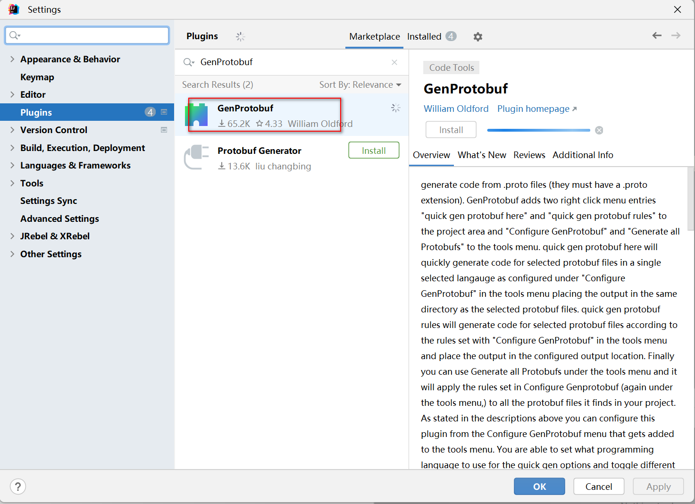
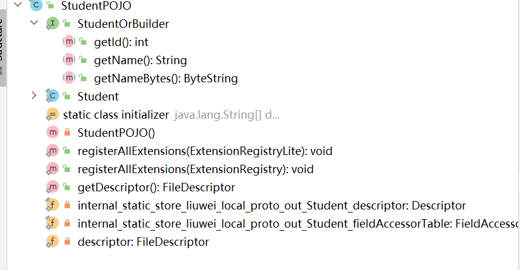

资料来源：<br/>
[Google Protobuf 快速入门实例（Netty）](https://www.toutiao.com/article/7166878389264908813/?app=news_article&timestamp=1668695460&use_new_style=1&req_id=202211172230590102091561620D1DB0D9&group_id=7166878389264908813&share_token=8306EBAF-820B-4F5E-84CD-EB463744837F&tt_from=weixin&utm_source=weixin&utm_medium=toutiao_ios&utm_campaign=client_share&wxshare_count=1&source=m_redirect)<br/>
[rotoBuf 入门教程](https://www.tizi365.com/archives/367.html)<br/>
[IDEA插件GenProtobuf编译proto文件](https://blog.csdn.net/u010837612/article/details/114582239)<br/>
[Intellij IDEA中使用Protobuf的正确姿势](https://www.cnblogs.com/liugh/p/7505533.html)<br/>
[Protobuf3 语法指南](https://colobu.com/2017/03/16/Protobuf3-language-guide/)<br/>
[springboot-netty](https://github.com/pjmike/springboot-netty/blob/master/README.md)<br/>
[Protobuf: 高效数据传输的秘密武器](https://www.cnblogs.com/niumoo/p/17390027.html)


## protobuf

### 简介

而 Google Protobuf 跨语言，支持C++、java和python。然后利用protobuf 编码后的消息更小，有利于存储和传输，并且其性能也非常高，相比其他序列化框架，它也是非常有优势的，具体的关于Java 各种序列化框架比较此处就不多说了。总之，目前Google Protobuf 广泛的被使用到各种项目，它的诸多优点让我们选择使用它。

**Protobuf**（Protocol Buffers）是由 Google 开发的一种**轻量级、高效**的数据交换格式，它被用于结构化数据的序列化、反序列化和传输。相比于 XML 和 JSON 等文本格式，Protobuf 具有更小的数据体积、更快的解析速度和更强的可扩展性。

Protobuf 的核心思想是**使用协议（Protocol）来定义数据的结构和编码方式**。使用 Protobuf，可以先定义数据的结构和各字段的类型、字段等信息，**然后使用Protobuf提供的编译器生成对应的代码**，**用于序列化和反序列化数据**。由于 Protobuf 是基于二进制编码的，因此可以在数据传输和存储中实现更高效的数据交换，同时也可以**跨语言**使用。

我们这里是用 protobuf 做为我们的序列化手段，那我们为什么要使用 protobuf,而不使用其他序列化方案呢，比如 jdk 自带的序列化，Thrift,fastjson等。

首先 jdk 自带序列化手段有很多缺点，比如：

- 序列化后的码流太大
- 性能太低
- 无法跨语言


相比于 XML 和 JSON，**Protobuf 有以下几个优势**：

- **更小的数据量**：Protobuf 的二进制编码通常比 XML 和 JSON 小 3-10 倍，因此在网络传输和存储数据时可以节省带宽和存储空间。
- **更快的序列化和反序列化速度**：由于 Protobuf 使用二进制格式，所以序列化和反序列化速度比 XML 和 JSON 快得多。
- **跨语言**：Protobuf 支持多种编程语言，可以使用不同的编程语言来编写客户端和服务端。这种跨语言的特性使得 Protobuf 受到很多开发者的欢迎（JSON 也是如此）。
- **易于维护可扩展**：Protobuf 使用 .proto 文件定义数据模型和数据格式，这种文件比 XML 和 JSON 更容易阅读和维护，且可以在不破坏原有协议的基础上，轻松添加或删除字段，实现版本升级和兼容性。

### 编写 Protobuf

使用 Protobuf 的语言定义文件（.proto）可以定义要传输的信息的数据结构，可以包括各个字段的名称、类型等信息。同时也可以相互嵌套组合，构造出更加复杂的消息结构。

比如想要构造一个地址簿 AddressBook 信息结构。一个 AddressBook 可以包含多个人员 Person 信息，每个 Person 信息可以包含 id、name、email 信息，同时一个 Person 也可以包含多个电话号码信息 PhoneNumber，每个电话号码信息需要指定号码种类，如手机、家庭电话、工作电话等。

如果使用 Protobuf 编写定义文件如下：新建一个文件`Student.proto`

```protobuf
syntax = "proto3"; //版本
option optimize_for = SPEED; //加速解析
// 是否生成多个文件
option java_multiple_files = false;
// 指定 protobuf 包名，防止有相同类名的 message 定义
package store.liuwei.local.proto.out;
// 生成的文件存放在哪个包下
option java_package = "store.liuwei.local.proto.out"; //指定java文件生成到哪个包下
// 生成的类名，如果没有指定，会根据文件名自动转驼峰来命名
option java_outer_classname = "StudentPOJO"; //生成的java类名
//使用message管理数据，会在StudentPOJO类中生成一个内部类Student
message Student {
 //对应Student类中的属性int id，1：表示属性序号
  int32 id = 1;
  //对应Student类中的属性String name，2：表示属性序号
  string name = 2; 
}
```

Protobuf 文件中的语法解释。

### 头部全局定义

- `syntax = "proto3";`指定 Protobuf 版本为版本3（最新版本）
- `package com.wdbyte.protobuf;`指定 Protobuf 包名，防止有相同类名的 `message` 定义，这个包名是生成的类中所用到的一些信息的前缀，并非类所在包。
- `option java_multiple_files = true;` 是否生成多个文件。若 `false`，则只会生成一个类，其他类以内部类形式提供。
- `option java_package =` 生成的类所在包。
- `option java_outer_classname` 生成的类名，若无，自动使用文件名进行驼峰转换来为类命名。

### 消息结构具体定义

`message Person` 定一个了一个 Person 类。

Person 类中的字段被 `optional` 修饰，被 `optional` 修饰说明字段可以不赋值。

- 修饰符 `optional` 表示可选字段，可以不赋值。
- 修饰符 `repeated` 表示数据重复多个，如数组，如 List。
- 修饰符 `required` 表示必要字段，必须给值，否则会报错 `RuntimeException`，但是在 Protobuf 版本 3 中被移除。即使在版本 2 中也应该慎用，因为一旦定义，很难更改。

### 字段类型定义

修饰符后面紧跟的是字段类型，如 `int32` 、`string`。常用的类型如下：

- `int32、int64、uint32、uint64`：整数类型，包括有符号和无符号类型。
- `float、double`：浮点数类型。
- `bool`：布尔类型，只有两个值，true 和 false。
- `string`：字符串类型。
- `bytes`：二进制数据类型。
- `enum`：枚举类型，枚举值可以是整数或字符串。
- `message`：消息类型，可以嵌套其他消息类型，类似于结构体。

字段后面的 `=1，=2` 是作为序列化后的二进制编码中的字段的对应标签，因为 Protobuf 消息在序列化后是不包含字段信息的，只有对应的字段序号，所以**节省了空间**。也因此，1-15 比 16 会少一个字节，所以**尽量使用 1-15 来指定常用字段**。且一旦定义，**不要随意更改，否则可能会对不上序列化信息**。

### 标量数值类型

一个标量消息字段可以含有一个如下的类型——该表格展示了定义于.proto文件中的类型，以及与之对应的、在自动生成的访问类中定义的类型：

| .proto Type | Notes                                                        | C++ Type | Java Type  | Python Type[2] | Go Type | Ruby Type                      | C# Type    | PHP Type       |
| :---------- | :----------------------------------------------------------- | :------- | :--------- | :------------- | :------ | :----------------------------- | :--------- | :------------- |
| double      |                                                              | double   | double     | float          | float64 | Float                          | double     | float          |
| float       |                                                              | float    | float      | float          | float32 | Float                          | float      | float          |
| int32       | 使用变长编码，对于负值的效率很低，如果你的域有可能有负值，请使用sint64替代 | int32    | int        | int            | int32   | Fixnum 或者 Bignum（根据需要） | int        | integer        |
| uint32      | 使用变长编码                                                 | uint32   | int        | int/long       | uint32  | Fixnum 或者 Bignum（根据需要） | uint       | integer        |
| uint64      | 使用变长编码                                                 | uint64   | long       | int/long       | uint64  | Bignum                         | ulong      | integer/string |
| sint32      | 使用变长编码，这些编码在负值时比int32高效的多                | int32    | int        | int            | int32   | Fixnum 或者 Bignum（根据需要） | int        | integer        |
| sint64      | 使用变长编码，有符号的整型值。编码时比通常的int64高效。      | int64    | long       | int/long       | int64   | Bignum                         | long       | integer/string |
| fixed32     | 总是4个字节，如果数值总是比总是比228大的话，这个类型会比uint32高效。 | uint32   | int        | int            | uint32  | Fixnum 或者 Bignum（根据需要） | uint       | integer        |
| fixed64     | 总是8个字节，如果数值总是比总是比256大的话，这个类型会比uint64高效。 | uint64   | long       | int/long       | uint64  | Bignum                         | ulong      | integer/string |
| sfixed32    | 总是4个字节                                                  | int32    | int        | int            | int32   | Fixnum 或者 Bignum（根据需要） | int        | integer        |
| sfixed64    | 总是8个字节                                                  | int64    | long       | int/long       | int64   | Bignum                         | long       | integer/string |
| bool        |                                                              | bool     | boolean    | bool           | bool    | TrueClass/FalseClass           | bool       | boolean        |
| string      | 一个字符串必须是UTF-8编码或者7-bit ASCII编码的文本。         | string   | String     | str/unicode    | string  | String (UTF-8)                 | string     | string         |
| bytes       | 可能包含任意顺序的字节数据。                                 | string   | ByteString | str            | []byte  | String (ASCII-8BIT)            | ByteString | string         |

你可以在文章[Protocol Buffer 编码](https://developers.google.com/protocol-buffers/docs/encoding?hl=zh-cn)中，找到更多“序列化消息时各种类型如何编码”的信息。

1. 在java中，无符号32位和64位整型被表示成他们的整型对应形式，最高位被储存在标志位中。
2. 对于所有的情况，设定值会执行类型检查以确保此值是有效。
3. 64位或者无符号32位整型在解码时被表示成为ilong，但是在设置时可以使用int型值设定，在所有的情况下，值必须符合其设置其类型的要求。
4. python中string被表示成在解码时表示成unicode。但是一个ASCIIstring可以被表示成str类型。
5. Integer在64位的机器上使用，string在32位机器上使用

## 编译 Protobuf

使用 Protobuf 提供的编译器，可以将 `.proto` 文件编译成各种语言的代码文件（如 Java、C++、Python 等）。


下载[编译器](https://github.com/protocolbuffers/protobuf/releases/latest)

我使用的是window系统选择


### 使用命令

安装完成后可以使用 `protoc` 命令编译 `proto` 文件，如编译示例中的 `addressbook.proto`.

```shell
protoc --java_out=./java ./resources/addressbook.proto
# --java_out 指定输出 java 格式文件，输出到 ./java 目录
# ./resources/addressbook.proto 为 proto 文件位置
```

### idea插件

安装插件



配置插件


生成文件


运行结果

```shell
working directory:D:/file/ideaProject_store/store/local/proto/src/main/java/store/liuwei/local/proto
D:\java\protoc-24.0-rc-3-win64\bin\protoc.exe --java_out=D:\file\ideaProject_store\store\local\proto\src\main\java Student.proto 

completed:D:/file/ideaProject_store/store/local/proto/src/main/java/store/liuwei/local/proto/Student.proto at: 15:30:01
```


生成文件完成



## 对象和byte[]的转化

引用的jar包

```xml
        <!-- https://mvnrepository.com/artifact/com.google.protobuf/protobuf-java -->
        <dependency>
            <groupId>com.google.protobuf</groupId>
            <artifactId>protobuf-java</artifactId>
            <version>3.23.2</version>
        </dependency>
```

直接上代码

```java
public class Demo {


    @Test
    public void test() throws InvalidProtocolBufferException {

        // 转成byte[]
        StudentPOJO.Student student = StudentPOJO.Student.newBuilder().setId(1).setName("阿斗").build();
        byte[] byteArray = student.toByteArray();

        // 变成对象
        StudentPOJO.Student stu = StudentPOJO.Student.parseFrom(byteArray);
        int id = stu.getId();
        String name = stu.getName();
        System.out.println("id:"+ id + " name："+ name );
    }
}

```

## 为什么高效？

**Protobuf 是如何实现这种高效紧凑的数据编码和解码的呢？**

首先，Protobuf 使用二进制编码，会提高性能；其次 Protobuf 在将数据转换成二进制时，会对字段和类型重新编码，减少空间占用。它采用 `TLV` 格式来存储编码后的数据。`TLV` 也是就是 **Tag-Length-Value** ，是一种常见的编码方式，因为数据其实都是键值对形式，所以在 `TAG` 中会存储对应的**字段和类型**信息，`Length` 存储内容的长度，`Value` 存储具体的内容。


还记得上面定义结构体时每个字段都对应一个数字吗？如 `=1`,`=2`,`=3`.

```shell
message Person {
  optional int32 id = 1;
  optional string name = 2;
  optional string email = 3;
}
```

在序列化成二进制时候就是通过这个数字来标记对应的字段的，二进制中只存储这个数字，反序列化时通过这个数字找对应的字段。这也是上面为什么说尽量使用 1-15 范围内的数字，因为一旦超过 15，就需要多一个 bit 位来存储。

那么类型信息呢？比如 `int32` 怎么标记，因为类型个数有限，所以 Protobuf 规定了每个类型对应的二进制编码，比如 `int32` 对应二进制 `000`，`string` 对应二进制 `010`，这样就可以只用三个比特位存储类型信息。

> 这里只是举例描述大概思想，具体还有一些变化。
>
> 详情可以参考官方文档：https://protobuf.dev/programming-guides/encoding/

其次，Protobuf 还会采用一种**变长编码的方式来存储数据**。这种编码方式能够保证数据占用的空间最小化，从而减少了数据传输和存储的开销。具体来说，Protobuf 会将整数和浮点数等类型变换成一个或多个字节的形式，其中每个字节都包含了一部分数据信息和一部分标识符信息。这种编码方式可以**在数据值比较小的情况下，只使用一个字节来存储数据**，以此来提高编码效率。

最后，Protobuf 还可以通过**采用压缩算法来减少数据传输的大小**。比如 GZIP 算法能够将原始数据压缩成更小的二进制格式，从而在网络传输中能够节省带宽和传输时间。Protobuf 还提供了一些可选的压缩算法，如 zlib 和 snappy，这些算法在不同的场景下能够适应不同的压缩需求。

综上所述，Protobuf 在实现高效编码和解码的过程中，采用了多种优化方式，从而在实际应用中能够有效地提升数据传输和处理的效率。

## 总结

ProtoBuf 是一种**轻量、高效**的数据交换格式，它具有以下优点：

- **语言中立**，可以支持多种编程语言；
- 数据结构清晰，易于维护和扩展；
- 二进制编码，数据**体积小，传输效率高**；
- 自动生成代码，开发效率高。

但是，ProtoBuf 也存在以下缺点：

- 学习成本较高，需要掌握其语法规则和使用方法；
- 需要先定义数据结构，然后才能对数据进行序列化和反序列化，增加了一定的开发成本；
- 由于二进制编码，**可读性较差，这点不如 JSON 可以直接阅读**。

总体来说，**Protobuf 适合用于数据传输和存储等场景，能够提高数据传输效率和减少数据体积**。但对于需要人类可读的数据，或需要实时修改的数据，或者对数据的传输效率和体积没那么在意的场景，选择更加通用的 JSON 未尝不是一个好的选择。