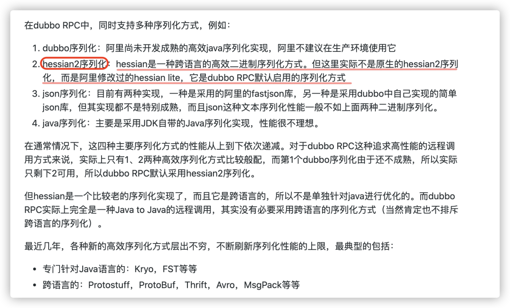

资料来源：<br/>
[招银网络二面：什么是序列化？常见的序列化协议有哪些？](https://mp.weixin.qq.com/s/ZK-hiRwAl6LFh111HFQBBQ)

[支付宝开源一骑绝尘的新序列化框架 —— Fury](https://mp.weixin.qq.com/s/Q-bnCGQL3zQpSR8LnvWBcg)

## 序列化介绍

### 什么是序列化?什么是反序列化?

如果我们需要持久化 Java 对象比如将 Java 对象保存在文件中，或者在网络传输 Java 对象，这些场景都需要用到序列化。

简单来说：

- **序列化**：将数据结构或对象转换成二进制字节流的过程
- **反序列化**：将在序列化过程中所生成的二进制字节流的过程转换成数据结构或者对象的过程

对于 Java 这种面向对象编程语言来说，我们序列化的都是对象（Object）也就是实例化后的类(Class)，但是在 C++这种半面向对象的语言中，struct(结构体)定义的是数据结构类型，而 class 对应的是对象类型。

维基百科是如是介绍序列化的：

> **序列化**（serialization）在计算机科学的数据处理中，是指将数据结构或对象状态转换成可取用格式（例如存成文件，存于缓冲，或经由网络中发送），以留待后续在相同或另一台计算机环境中，能恢复原先状态的过程。依照序列化格式重新获取字节的结果时，可以利用它来产生与原始对象相同语义的副本。对于许多对象，像是使用大量引用的复杂对象，这种序列化重建的过程并不容易。面向对象中的对象序列化，并不概括之前原始对象所关系的函数。这种过程也称为对象编组（marshalling）。从一系列字节提取数据结构的反向操作，是反序列化（也称为解编组、deserialization、unmarshalling）。

我们知道网络通信的双方必须要采用和遵守相同的协议。TCP/IP 四层模型是下面这样的，序列化协议属于哪一层呢？

1. 应用层
2. 传输层
3. 网络层
4. 网络接口层


如上图所示，OSI 七层协议模型中，表示层做的事情主要就是对**应用层**的用户数据进行处理转换为二进制流。反过来的话，就是将二进制流转换成应用层的用户数据。这不就对应的是序列化和反序列化么？

因为，OSI 七层协议模型中的应用层、表示层和会话层对应的都是 TCP/IP 四层模型中的应用层，所以序列化协议属于 TCP/IP 协议应用层的一部分。


## 常见序列化协议对比

JDK 自带的序列化方式一般不会用 ，因为序列化效率低并且部分版本有安全漏洞。比较常用的序列化协议有 hessian、kyro、protostuff。

下面提到的都是基于二进制的序列化协议，像 JSON 和 XML 这种属于文本类序列化方式。虽然 JSON 和 XML 可读性比较好，但是性能较差，一般不会选择。

### JDK 自带的序列化方式

JDK 自带的序列化，只需实现 `java.io.Serializable`接口即可。

```java
@AllArgsConstructor
@NoArgsConstructor
@Getter
@Builder
@ToString
public class RpcRequest implements Serializable {
    private static final long serialVersionUID = 1905122041950251207L;
    private String requestId;
    private String interfaceName;
    private String methodName;
    private Object[] parameters;
    private Class<?>[] paramTypes;
    private RpcMessageTypeEnum rpcMessageTypeEnum;
}
```

> 序列化号 serialVersionUID 属于版本控制的作用。序列化的时候 serialVersionUID 也会被写入二级制序列，当反序列化时会检查 serialVersionUID 是否和当前类的 serialVersionUID 一致。如果 serialVersionUID 不一致则会抛出 `InvalidClassException` 异常。强烈推荐每个序列化类都手动指定其 `serialVersionUID`，如果不手动指定，那么编译器会动态生成默认的序列化号

我们很少或者说几乎不会直接使用这个序列化方式，主要原因有两个：

1. **不支持跨语言调用** : 如果调用的是其他语言开发的服务的时候就不支持了。
2. **性能差** ：相比于其他序列化框架性能更低，主要原因是序列化之后的字节数组体积较大，导致传输成本加大。

### Kryo

Kryo 是一个高性能的序列化/反序列化工具，由于其变长存储特性并使用了字节码生成机制，拥有较高的运行速度和较小的字节码体积。

另外，Kryo 已经是一种非常成熟的序列化实现了，已经在 Twitter、Groupon、Yahoo 以及多个著名开源项目（如 Hive、Storm）中广泛的使用。

**guide-rpc-framework**[1] 就是使用的 kyro 进行序列化，序列化和反序列化相关的代码如下：

```java
/**
 * Kryo serialization class, Kryo serialization efficiency is very high, but only compatible with Java language
 *
 * @author shuang.kou
 * @createTime 2020年05月13日 19:29:00
 */
@Slf4j
public class KryoSerializer implements Serializer {

    /**
     * Because Kryo is not thread safe. So, use ThreadLocal to store Kryo objects
     */
    private final ThreadLocal<Kryo> kryoThreadLocal = ThreadLocal.withInitial(() -> {
        Kryo kryo = new Kryo();
        kryo.register(RpcResponse.class);
        kryo.register(RpcRequest.class);
        return kryo;
    });

    @Override
    public byte[] serialize(Object obj) {
        try (ByteArrayOutputStream byteArrayOutputStream = new ByteArrayOutputStream();
             Output output = new Output(byteArrayOutputStream)) {
            Kryo kryo = kryoThreadLocal.get();
            // Object->byte:将对象序列化为byte数组
            kryo.writeObject(output, obj);
            kryoThreadLocal.remove();
            return output.toBytes();
        } catch (Exception e) {
            throw new SerializeException("Serialization failed");
        }
    }

    @Override
    public <T> T deserialize(byte[] bytes, Class<T> clazz) {
        try (ByteArrayInputStream byteArrayInputStream = new ByteArrayInputStream(bytes);
             Input input = new Input(byteArrayInputStream)) {
            Kryo kryo = kryoThreadLocal.get();
            // byte->Object:从byte数组中反序列化出对对象
            Object o = kryo.readObject(input, clazz);
            kryoThreadLocal.remove();
            return clazz.cast(o);
        } catch (Exception e) {
            throw new SerializeException("Deserialization failed");
        }
    }

}
```

Github 地址：**https://github.com/EsotericSoftware/kryo** 。

### Protobuf

Protobuf 出自于 Google，性能还比较优秀，也支持多种语言，同时还是跨平台的。就是在使用中过于繁琐，因为你需要自己定义 IDL 文件和生成对应的序列化代码。这样虽然不然灵活，但是，另一方面导致 protobuf 没有序列化漏洞的风险。

> Protobuf 包含序列化格式的定义、各种语言的库以及一个 IDL 编译器。正常情况下你需要定义 proto 文件，然后使用 IDL 编译器编译成你需要的语言

一个简单的 proto 文件如下：

Github 地址：**https://github.com/protocolbuffers/protobuf**

### ProtoStuff

由于 Protobuf 的易用性，它的哥哥 Protostuff 诞生了。

protostuff 基于 Google protobuf，但是提供了更多的功能和更简易的用法。虽然更加易用，但是不代表 ProtoStuff 性能更差。

Github 地址：**https://github.com/protostuff/protostuff**

### hession

hessian 是一个轻量级的,自定义描述的二进制 RPC 协议。hessian 是一个比较老的序列化实现了，并且同样也是跨语言的。



dubbo RPC 默认启用的序列化方式是 hession2 ,但是，Dubbo 对 hessian2 进行了修改，不过大体结构还是差不多。

### 开发中使用的一种

在开发中使用的其中一种序列化方式

~~~~java
import java.io.ByteArrayInputStream;
import java.io.ByteArrayOutputStream;
import java.io.IOException;
import java.io.ObjectInputStream;
import java.io.ObjectOutputStream;
 
import org.springframework.stereotype.Component;
 
@Component
public class SerializerUtil {
 
	
	public static byte[] serializeKey(String key) {
		return key.getBytes();
	}
	
	public static byte[] serializeValue(Object object) {
		return serialize(object);
	}
	
	public static Object deserializeValue(byte[] bytes) {
		return deSerialize(bytes);
	}
	
	public static String deserializeKey(byte[] bytes) {
		return new String(bytes);
	}
	
	
	public static byte[] serialize(Object obj) {
		byte[] bytes = null;
		try {
			ByteArrayOutputStream baos = new ByteArrayOutputStream();
			;
			ObjectOutputStream oos = new ObjectOutputStream(baos);
			oos.writeObject(obj);
			bytes = baos.toByteArray();
			baos.close();
			oos.close();
		} catch (IOException e) {
			e.printStackTrace();
		}
		return bytes;
	}
 
	public static Object deSerialize(byte[] bytes) {
		Object obj = null;
		try {
			ByteArrayInputStream bais = new ByteArrayInputStream(bytes);
			ObjectInputStream ois = new ObjectInputStream(bais);
			obj = ois.readObject();
		} catch (Exception e) {
			e.printStackTrace();
		}
		return obj;
	}
}
~~~~

### 支付宝开源一骑绝尘的新序列化框架 —— Fury

最近支付宝开源了一款重磅的产品，一个号称超过现有序列化框架 170x 性能的序列化框架 `Fury`。根据官方的介绍 `Fury` 是一个极快的多语言序列化框架，由 `jit`（即时编译）和零拷贝提供支持，提供高达 170 倍的性能和终极易用性。

- 支持多种语言：`Java/Python/C++/Golang/Javascript`；

- 零拷贝：受 `pickle5` 和堆外读 / 写启发的跨语言带外序列化；

- 高性能：高度可扩展的 `JIT` 框架，可在运行时以异步多线程方式生成序列化器代码以加速序列化，通过以下方式提供 20-170 倍的加速：

- - 通过生成代码中的内联变量减少内存访问。
  - 通过生成代码中的内联调用减少虚拟方法调用。
  - 减少条件分支。
  - 减少哈希查找。

- 多种二进制协议：对象图、行格式等。

- 直接替换  `JDK/Kryo/Hessian` 等 `Java` 序列化框架，无需修改任何代码，但速度提高 100 倍。它可以极大地提高高性能 RPC 调用、数据传输和对象持久化的效率。

- `JDK` 序列化 100% 兼容，原生支持 java 自定义序列化 `writeObject/readObject/writeReplace/readResolve/readObjectNoData`。

- 支持 `golang` 的共享和循环引用对象序列化。

- 支持 `golang` 自动对象序列化。

Github 地址：**https://github.com/alipay/fury**

**依赖的jar包**

```xml
<repositories>
  <repository>
    <id>sonatype</id>
    <url>https://s01.oss.sonatype.org/content/repositories/snapshots</url>
    <releases>
      <enabled>false</enabled>
    </releases>
    <snapshots>
      <enabled>true</enabled>
    </snapshots>
  </repository>
</repositories>
<dependency>
  <groupId>org.furyio</groupId>
  <artifactId>fury-core</artifactId>
  <version>0.1.0-SNAPSHOT</version>
</dependency>
<!-- row/arrow format support -->
<!-- <dependency>
  <groupId>org.furyio</groupId>
  <artifactId>fury-format</artifactId>
  <version>0.1.0-SNAPSHOT</version>
</dependency> -->
```

java 测试代码

```java
package com.example.furytest.demo;

import io.fury.Fury;
import io.fury.Language;
import io.fury.ThreadSafeFury;

/**
 * <br>
 * <b>Function：</b><br>
 * <b>Author：</b>@author Java极客技术<br>
 * <b>Date：</b>2023-07-24 21:50<br>
 * <b>Desc：</b>无<br>
 */
public class StudentDTO {
    private Long id;
    private String name;
    private int age;
    ... 省略 getter setter

    public static void main(String[] args) {
        StudentDTO studentDTO = new StudentDTO();
        studentDTO.setAge(18);
        studentDTO.setName("Java极客技术");
        studentDTO.setId(1L);

        Fury fury = Fury.builder().withLanguage(Language.JAVA).build();
        fury.register(StudentDTO.class);
        byte[] bytes = fury.serialize(studentDTO);
        System.out.println(fury.deserialize(bytes));


        ThreadSafeFury fury2 = Fury.builder().withLanguage(Language.JAVA)
                // Allow to deserialize objects unknown types,
                // more flexible but less secure.
//                 .withSecureMode(false)
                .buildThreadSafeFury();
        fury2.getCurrentFury().register(StudentDTO.class);
        byte[] bytes2 = fury2.serialize(studentDTO);
        System.out.println(fury2.deserialize(bytes2));
    }
}

```

构造 `Fury` 的时候我们可以构造单线程 `Fury` 或者线程安全的 `Fuyr`，分别如下

创建单线程 `Fury`

```java
Fury fury = Fury.builder()
  .withLanguage(Language.JAVA)
  // 是否开启循环引用，如果并不需要的话可以关闭，提升性能
  .withRefTracking(false)
  // 是否压缩 Integer 或者 Long 类型的数字
  // .withNumberCompressed(true)
  // 类型前后一致性兼容
  .withCompatibleMode(CompatibleMode.SCHEMA_CONSISTENT)
  // .withCompatibleMode(CompatibleMode.COMPATIBLE)
  // 是否开启多线程编译
  .withAsyncCompilationEnabled(true)
  .build();
byte[] bytes = fury.serialize(object);
System.out.println(fury.deserialize(bytes));
```

创建线程安全的 `Fury`

```java
ThreadSafeFury fury = Fury.builder()
  .withLanguage(Language.JAVA)
  .withRefTracking(false)
  .withCompatibleMode(CompatibleMode.SCHEMA_CONSISTENT)
  .withAsyncCompilationEnabled(true)
  .buildThreadSafeFury();
byte[] bytes = fury.serialize(object);
System.out.println(fury.deserialize(bytes));
```

