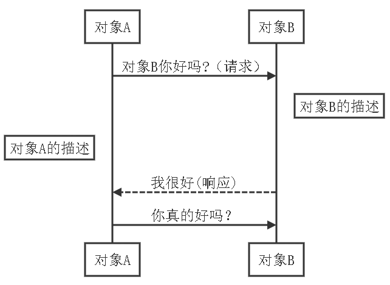
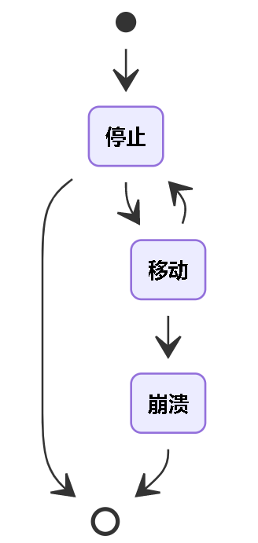
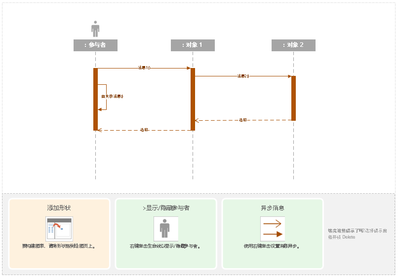
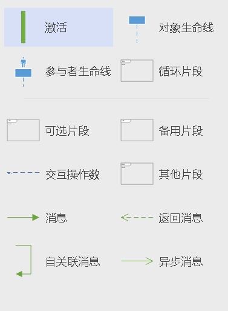
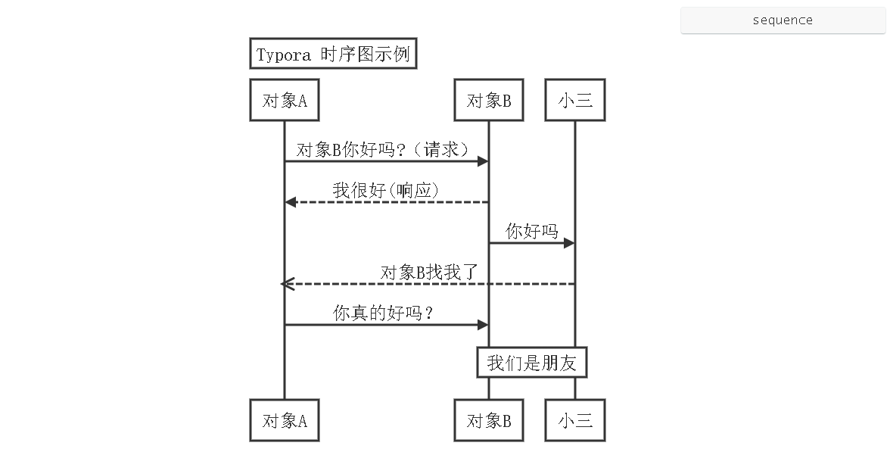
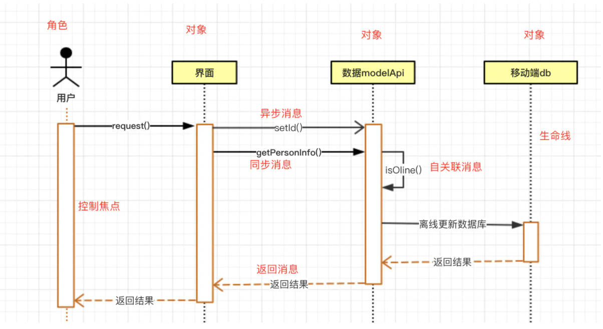
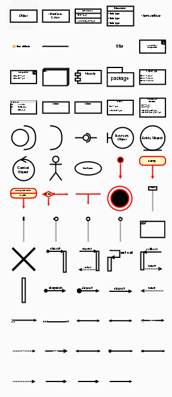

资料来源：<br/>
[【云驻共创】作为程序员，你一般用什么软件画流程图时序图和状态图等？](https://bbs.huaweicloud.com/blogs/329422?utm_source=zhihu&utm_medium=bbs-ex&utm_campaign=other&utm_content=content)

## 使用工具

作为一名合格的程序员，在需求整理及功能实现的时候，各种流程图是避免不了的，像用例图、时序图、状态图基本上是必备，辅助分析需求及梳理实现思路。



1. 时序图，又称为序列图、循序图，是一种UML交互图。时序图通过描述对象之间发送消息的时间顺序，显示多个对象之间的动态协作过程。

1. 时序图的使用场景非常广泛，几乎各行各业都可以使用。当然，作为一个软件工作者，我这边主要列举和软件开发有关的场景。
2. 时序图涉及到的角色主要包括
   - 角色(Actor) 系统角色，可以是人或者其他系统和子系统。以一个小人图标表示。
   - 对象(Object) 对象位于时序图的顶部,以一个矩形表示。
   - 生命线(LifeLine) 时序图中每个对象和底部中心都有一条垂直的虚线，这就是对象的生命线(对象的时间线)。以一条垂直的虚线表。
   - 控制焦点(Activation) 控制焦点代表时序图中在对象时间线上某段时期执行的操作。以一个很窄的矩形表示。
   - 消息(Message) 表示对象之间发送的信息。主要分同步消息、异步消息、返回消息
   - 自关联消息 表示方法的自身调用或者一个对象内的一个方法调用另外一个方法。以一个半闭合的长方形+下方实心剪头表示。
   - 组合片段 组合片段用来解决交互执行的条件和方式，它允许在序列图中直接表示逻辑组件，用于通过指定条件或子进程的应用区域，为任何生命线的任何部分定义特殊条件和子进程。



\2. 状态图，是描述一个实体基于事件反应的动态行为，常常用于显示状态机、使对象达到这些状态的事件和条件、以及达到这些状态时所发生的操作。UML状态图可以研究类、角色、子系统、或组件的复杂行为。

- 1. 用状态机对一个对象的生命周期建模，状态图用于显示状态机（State Machine Diagram），重点在与描述状态图的控制流。
  2. 状态图涉及到的角色主要包括
     - 状态（States）指在对象的生命周期中的某个条件或者状况，在此期间对象将满足某些条件、执行某些活动活活等待某些事件，状态用圆角矩形表示
     - 转移（Transitions）转移（Transitions）是两个状态之间的一种关系，表示对象将在源状态（Source State）中执行一定的动作，并在某个特定事件发生而且某个特定的警界条件满足时进入目标状态（Target State）
     - 动作（State Actions）动作（Actions）是一个可执行的原子操作,也就是说动作是不可中断的，其执行时间是可忽略不计的。
     - 自身转移（Self-Transitions）状态可以有返回自身状态的转移，称之为自身转移（Self-Transitions）
     - 组合状态（Compound States）嵌套在另外一个状态中的状态称之为子状态（sub-state）,一个含有子状态的状态被称作组合状态（Compound States）
     - 进入节点（Entry Point）由于一些原因并不会执行初始化（initialization），而是直接通过一个节点进入状态【Ready】，则此节点称之为进入节点（Entry Point）
     - 历史状态（History States）历史状态是一个伪状态（Pseudostate）,其目的是记住从组合状态中退出时所处的子状态，当再次进入组合状态，可直接进入这个子状态，而不是再次从组合状态的初态开始。
     - 并发区域（Concurrent Regions）状态图可以分为区域，而区域又包括退出或者当前执行的子状态。说明组合状态在某一时刻可以同时达到多个子状态。
- 在介绍工具使用时主要以时序图为主，状态图只要明白了概念，设计的时候类似，主要是介绍工具的选择，供参考

#### **常用工具**

- 在工作中常用的工具有visio、Typora(最新版收费)、Drawio(免费)

1. visio是office办公套件之一，也是普遍使用的流程图工具，程序员及非程序员都可以使用，产品做的也非常人性化，容易上手，如下时序图所示效果

   

   

   - 绘图区域上半部分为示例图，下面为时序图各个组成部分的说明，几点可以查看每个时序图组成部分的用意及使用说明

   - visio左边为工具栏、右侧为绘画图，像生命线、参与者、消息 都提供了完整的支持，工具栏提供的工具如图所示：

     

     

2. Typora应该是程序员的最爱，Typora容许随时随地开展无缝拼接浏览，因而您能够在检查显示信息实际效果的另外形象化地开展撰写。在Win，Mac和Linux上能用。它具备审校作用，能够检查拼读和英语的语法。全自动匹配Markdown标记，比如括弧。支持大概100种語言并支持英语的语法突显。丰富多彩的作用和键盘快捷键使您轻轻松松浏览瘙痒的地区。与内联公式和显示信息公式适配。公式还可以即时浏览。能够轻轻松松插进图象（载入时显示信息图象）。以各种各样格式导出来，比如PDF，LaTeX，HTML 。您能够依据自身的喜好变更外型（主题）。支持全自动储存和修复。有对焦模式，打印机方式和源码方式，能够依据本人喜好开展转换。标识符，行和英语单词的总数能够马上检查。能够建立简易的序列图。可以说一个写作的利器，目前应该是程序员的标配了，在做流程图这块也是佼佼者，但对非程序员不是太友好，效果显示如下

   

   - 显示的源文件

     ```
     Title: Typora 时序图示例
     对象A->对象B: 对象B你好吗?（请求）
     对象B-->对象A: 我很好(响应)
     对象B->小三: 你好吗
     小三-->>对象A: 对象B找我了
     对象A->对象B: 你真的好吗？
     Note over 小三,对象B: 我们是朋友
     ```

   - typora设计流程图非常简洁，但没有提供直接的设计工具，对非开发人员中很少使用。

   1. Drawio是一款绘制流程图的利器。而且界面简洁清晰，最重要的是免费的，visio 不是免费的。还有其他很多好处，它跨平台，还提供了 Chrome 插件和 VScode 插件，而且支持多语言，很友好。这么多好处，那必须搞起来啊。我已经完成从 visio 转移到 draw.io，不过国内用的好像并不多，人性化设计的不错，可以跟visio又得一拼，效果如下

      

   - 流程图非常的简洁漂亮，同事还提供大量的模板供参考，非常的方便

   - 工作区也分工具区及绘画区，工具区如下所示，个人感觉比office的visio更全面

     

#### **推荐总结**

- 如果已经安装office，建议使用visio，可以满足大部分需求，同时满足业务流程图设计，visio面向各个行业的人员使用
- 如果是没有安装office，又有流程图设计要求，推荐使用drawio，设计的图也非常漂亮，觉得不让你失望
- 如果是开发人员，强烈推荐Typora，有一种写代码的感觉，逼格绝对上升一个档次，同时跟写文档结合，非常流畅

