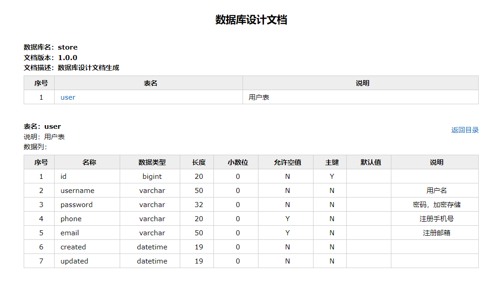

资料来源：

[使用screw一键生成数据库文档](https://www.toutiao.com/article/7299308128263373352/?app=news_article&timestamp=1699594314&use_new_style=1&req_id=20231110133153089FC9514FEB2465F918&group_id=7299308128263373352&wxshare_count=1&tt_from=weixin&utm_source=weixin&utm_medium=toutiao_android&utm_campaign=client_share&share_token=0ed122b6-5101-4230-b4c1-c24e73ed05de&source=m_redirect)

> 今天分享一个好用的工具，screw，他是一款国产开源软件支持将数据库库表结构一键生成html、word、markdown文档，非常的好用，项目详情页：https://gitee.com/leshalv/screw

## 背景

我们项目的开发模式是甲方、乙方这种，我们乙方负责数据库的开发、维护和设计，但是甲方爸爸有要求，每次的需求设计评审时都需要将库表导出成word格式发给他们归档（实在搞不懂为什么这种方式），**我曾经使用过navicat或者PDManer将库表结构导出成图片然后放到word中**，甲方爸爸不认可这种方式，反正就是一大堆甲方公司的理由。没办法，我只能手动的将每一张表注意复制到word中，可是微服务太多了，有30多个微服务，200多张表，每次搞一轮下来，我都得一天时间，直到我发现了screw，他完美的解决了我上面的问题。

screw提供两种实现方式，分别是代码实现和maven plugin实现，接下来我会分别介绍下这种方式的实现，希望能解决和我有一样问题的你。


## maven plugin实现

在maven pom.xml中直接引入screw-maven-plugin插件，然后运行maven compile命令即可，如下参考：

```xml
<build>
        <plugins>
            <plugin>
                <groupId>cn.smallbun.screw</groupId>
                <artifactId>screw-maven-plugin</artifactId>
                <version>1.0.5</version>
                <dependencies>
                    <!-- HikariCP -->
                    <dependency>
                        <groupId>com.zaxxer</groupId>
                        <artifactId>HikariCP</artifactId>
                        <version>3.4.5</version>
                    </dependency>
                    <!--mysql driver-->
                    <dependency>
                        <groupId>mysql</groupId>
                        <artifactId>mysql-connector-java</artifactId>
                        <version>8.0.20</version>
                    </dependency>
                </dependencies>
                <configuration>
                    <!--username-->
                    <username>username</username>
                    <!--password-->
                    <password>password</password>
                    <!--driver-->
                    <driverClassName>com.mysql.cj.jdbc.Driver</driverClassName>
                    <!--jdbc url-->
                    <jdbcUrl>jdbc:mysql://127.0.0.1:3306/mydatabase</jdbcUrl>
                    <!--生成文件类型，支持：HTML,WORD,MD-->
                    <fileType>WORD</fileType>
                    <!--打开文件输出目录-->
                    <openOutputDir>false</openOutputDir>
                    <!--生成模板-->
                    <produceType>freemarker</produceType>
                    <!--文档名称 为空时:将采用[数据库名称-描述-版本号]作为文档名称-->
                    <fileName>mydatabase数据库</fileName>
                    <!--描述-->
                    <description>mydatabase，我的个人测试数据库</description>
                    <!--版本-->
                    <version>${project.version}</version>
                    <!--标题-->
                    <title>数据库文档</title>
                </configuration>
                <executions>
                    <execution>
                        <phase>compile</phase>
                        <goals>
                            <goal>run</goal>
                        </goals>
                    </execution>
                </executions>
            </plugin>
        </plugins>
    </build>
```

## 代码实现

引入maven依赖：

```xml
<dependency>
    <groupId>cn.smallbun.screw</groupId>
    <artifactId>screw-core</artifactId>
    <version>1.0.5</version>
 </dependency>
```

编写代码：

```java
/**
 * 文档生成
 */
void documentGeneration() {
   //数据源
   HikariConfig hikariConfig = new HikariConfig();
   hikariConfig.setDriverClassName("com.mysql.cj.jdbc.Driver");
   hikariConfig.setJdbcUrl("jdbc:mysql://127.0.0.1:3306/database");
   hikariConfig.setUsername("root");
   hikariConfig.setPassword("password");
   //设置可以获取tables remarks信息
   hikariConfig.addDataSourceProperty("useInformationSchema", "true");
   hikariConfig.setMinimumIdle(2);
   hikariConfig.setMaximumPoolSize(5);
   DataSource dataSource = new HikariDataSource(hikariConfig);
   //生成配置
   EngineConfig engineConfig = EngineConfig.builder()
         //生成文件路径
         .fileOutputDir(fileOutputDir)
         //打开目录
         .openOutputDir(true)
         //文件类型
         .fileType(EngineFileType.WORD)
         //生成模板实现
         .produceType(EngineTemplateType.freemarker)
         //自定义文件名称
         .fileName("自定义文件名称").build();

   //忽略表
   ArrayList<String> ignoreTableName = new ArrayList<>();
   ignoreTableName.add("test_user");
   ignoreTableName.add("test_group");
   //忽略表前缀
   ArrayList<String> ignorePrefix = new ArrayList<>();
   ignorePrefix.add("test_");
   //忽略表后缀    
   ArrayList<String> ignoreSuffix = new ArrayList<>();
   ignoreSuffix.add("_test");
   ProcessConfig processConfig = ProcessConfig.builder()
         //指定生成逻辑、当存在指定表、指定表前缀、指定表后缀时，将生成指定表，其余表不生成、并跳过忽略表配置 
   //根据名称指定表生成
   .designatedTableName(new ArrayList<>())
   //根据表前缀生成
   .designatedTablePrefix(new ArrayList<>())
   //根据表后缀生成 
   .designatedTableSuffix(new ArrayList<>())
         //忽略表名
         .ignoreTableName(ignoreTableName)
         //忽略表前缀
         .ignoreTablePrefix(ignorePrefix)
         //忽略表后缀
         .ignoreTableSuffix(ignoreSuffix).build();
   //配置
   Configuration config = Configuration.builder()
         //版本
         .version("1.0.0")
         //描述
         .description("数据库设计文档生成")
         //数据源
         .dataSource(dataSource)
         //生成配置
         .engineConfig(engineConfig)
         //生成配置
         .produceConfig(processConfig)
         .build();
   //执行生成
   new DocumentationExecute(config).execute();
}
```

