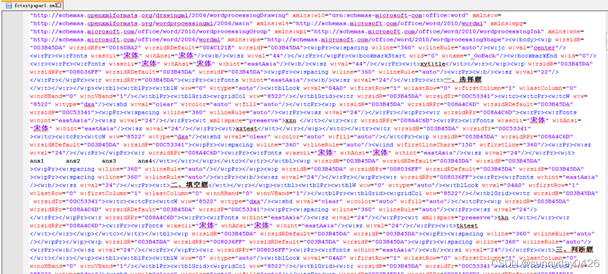

资料来源：<br/>
[Java自动生成word文档，用心看这篇就够了【重点】](https://blog.csdn.net/weixin_42039228/article/details/123798801)

## 生成word 文档

### 1.1 概述

在网上找了好多天将数据库中信息导出到`word`中的解决方案，现在将这几天的总结分享一下。总的来说，`Java`导出`word`大致有`5`种解决方案比较。

### 1.2 方案比较

1、`Jacob`是`Java-COM Bridge`的缩写，它在`Java`与微软的`COM`组件之间构建一座桥梁。通过`Jacob`实现了在`Java`平台上对微软`Office`的`COM`接口进行调用。

优点：调用微软`Office`的`COM`接口，生成的`word`文件格式规范。

缺点：服务器只能是`windows`平台，不支持`unix`和`linux`，且服务器上必须安装微软`Office`。

2、`Apache POI`包括一系列的`API`，它们可以操作基于`MicroSoft OLE 2 Compound Document Format`的各种格式文件，可以通过这些`API`在`Java`中读写`Excel`、`Word`等文件。

优点：跨平台支持`windows`、`unix`和`linux`。

缺点：相对与对`word`文件的处理来说，`POI`更适合`excel`处理，对于`word`实现一些简单文件的操作凑合，不能设置样式且生成的`word`文件格式不够规范。

3、Java2word是一个在Java程序中调用 MS Office Word 文档的组件(类库)。该组件提供了一组简单的接口，以便Java程序调用他的服务操作Word 文档。 这些服务包括： 打开文档、新建文档、查找文字、替换文字，插入文字、插入图片、插入表格，在书签处插入文字、插入图片、插入表格等。

优点：足够简单，操作起来要比`FreeMarker`简单的多。

缺点：没有`FreeMarker`强大，不能够根据模版生成`Word`文档，`word`的文档的样式等信息都不能够很好的操作。

4、FreeMarker生成word文档的功能是由XML+FreeMarker来实现的。先把word文件另存为xml，在xml文件中插入特殊的字符串占位符，将xml翻译为FreeMarker模板，最后用Java来解析FreeMarker模板，编码调用FreeMarker实现文本替换并输出Doc。

优点：比Java2word功能强大，也是纯Java编程。缺点：生成的文件本质上是`xml`，不是真正的`word`文件格式，有很多常用的`word`格式无法处理或表现怪异，比如：超链、换行、乱码、部分生成的文件打不开等。

5、PageOffice生成word文件。PageOffice封装了微软Office繁琐的vba接口，提供了简洁易用的Java编程对象，支持生成word文件，同时实现了在线编辑word文档和读取word文档内容。

优点：跨平台支持windows、unix和linux，生成word文件格式标准，支持文本、图片、表格、字体、段落、颜色、超链、页眉等各种格式的操作，支持多word合并，无需处理并发，不耗费服务器资源，运行稳定。

缺点：必须在客户端生成文件（可以不显示界面），不支持纯服务器端生成文件。


### 1.3 `Apache POI`

#### 1.3.1 参考一

**1、`poi`之`word`文档结构介绍之正文段落**

一个文档包含多个段落，一个段落包含多个Runs，一个Runs包含多个Run，Run是文档的最小单元

获取所有段落：List<XWPFParagraph> paragraphs = word.getParagraphs();

获取一个段落中的所有Runs：List<XWPFRun> xwpfRuns = xwpfParagraph.getRuns();

获取一个Runs中的一个Run：XWPFRun run = xwpfRuns.get(index);


**2、poi之word文档结构介绍之正文表格**

一个文档包含多个表格，一个表格包含多行，一行包含多列（格），每一格的内容相当于一个完整的文档

获取所有表格：`List<XWPFTable> xwpfTables = doc.getTables();`

获取一个表格中的所有行：List<XWPFTableRow> xwpfTableRows = xwpfTable.getRows();

获取一行中的所有列：List<XWPFTableCell> xwpfTableCells = xwpfTableRow.getTableCells();

获取一格里的内容：List<XWPFParagraph> paragraphs = xwpfTableCell.getParagraphs();

之后和正文段落一样


注：

- 表格的一格相当于一个完整的docx文档，只是没有页眉和页脚。里面可以有表格，使用xwpfTableCell.getTables()获取等等，
- 在poi文档中段落和表格是完全分开的，如果在两个段落中有一个表格，在poi中是没办法确定表格在段落中间的。只有文档的格式固定，才能正确的得到文档的结构。


**3、poi之word文档结构介绍之页眉：**

一个文档可以有多个页眉，页眉里面可以包含段落和表格

获取文档的页眉：`List<XWPFHeader> headerList = doc.getHeaderList();`

获取页眉里的所有段落：`List<XWPFParagraph> paras = header.getParagraphs();`

获取页眉里的所有表格：`List<XWPFTable> tables = header.getTables();`

**4、poi之word文档结构介绍之页脚**

页脚和页眉基本类似，可以获取表示页数的角标

#### 1.3.2 参考二

**(1) `POI`操作`Word`简介**
`POI`读写`Excel`功能强大、操作简单。但是`POI`操作时，一般只用它读取`word`文档，`POI`只能能够创建简单的`word`文档，相对而言`POI`操作时的功能太少

**(2) `POI`创建`Word`文档的简单示例**

```java
XWPFDocument doc = new XWPFDocument();// 创建Word文件
XWPFParagraph p = doc.createParagraph();// 新建一个段落
p.setAlignment(ParagraphAlignment.CENTER);// 设置段落的对齐方式
p.setBorderBottom(Borders.DOUBLE);//设置下边框
p.setBorderTop(Borders.DOUBLE);//设置上边框
p.setBorderRight(Borders.DOUBLE);//设置右边框
p.setBorderLeft(Borders.DOUBLE);//设置左边框
XWPFRun r = p.createRun();//创建段落文本
r.setText("POI创建的Word段落文本");
r.setBold(true);//设置为粗体
r.setColor("FF0000");//设置颜色
p = doc.createParagraph();// 新建一个段落
r = p.createRun();
r.setText("POI读写Excel功能强大、操作简单。");
XWPFTable table= doc.createTable(3, 3);//创建一个表格
table.getRow(0).getCell(0).setText("表格1");
table.getRow(1).getCell(1).setText("表格2");
table.getRow(2).getCell(2).setText("表格3");
FileOutputStream out = newFileOutputStream("d:\\POI\\sample.doc");
doc.write(out);
out.close();

```


**(3) `POI`读取`Word`文档里的文字**

```java
FileInputStream stream = newFileInputStream("d:\\POI\\sample.doc");
XWPFDocument doc = new XWPFDocument(stream);// 创建Word文件
for(XWPFParagraph p : doc.getParagraphs())//遍历段落
{
 System.out.print(p.getParagraphText());
}
for(XWPFTable table : doc.getTables())//遍历表格
{
 for(XWPFTableRow row : table.getRows())
 {
 for(XWPFTableCell cell : row.getTableCells())
 {
 System.out.print(cell.getText());
 }
 }

```

#### 1.3.4 代码示例

该代码示例只是一个`demo`，简单的生成了一个`word `文件，包括`word `文档常规的一些样式设置，包括设置文件字体、首行缩进、设置文字大小，段落的对齐方式，换行。还有常见的表格的创建，以及表格的合并效果等等。

直接看效果图：


```java

public void createFile(HttpServletRequest request, HttpServletResponse response) throws IOException {
        //创建文本对象
        XWPFDocument docxDocument = new XWPFDocument();
        //创建第一段落
        XWPFParagraph firstParagraphX = docxDocument.createParagraph();
        firstParagraphX.setAlignment(ParagraphAlignment.CENTER);

        XWPFRun runTitle = firstParagraphX.createRun();
        runTitle.setText("医院报告申请");
        runTitle.setBold(true);
        runTitle.setFontSize(24);
        runTitle.setFontFamily("宋体");
        runTitle.addCarriageReturn();//回车键
        runTitle.setKerning(30);

        XWPFParagraph paragraphX = docxDocument.createParagraph();

        paragraphX.setAlignment(ParagraphAlignment.LEFT);//对齐方式
        paragraphX.setFirstLineIndent(400);//首行缩进
        //创建段落中的run
        XWPFRun run = paragraphX.createRun();
        run.setText("开始新的额一页了健康卡离开了危，机容量为金融界王仁君我快速建房可谓集，有分页吗，按时交付问我问问");
        //run.addCarriageReturn();//回车键

        XWPFRun run2 = paragraphX.createRun();
        run2.setText("这是第二段了吧，接口了就废了我今儿来将危及，不知道嗯么回事了了，啦啦啦啦啦啦啦");
        run2.setText("这个不是能分段吗，测试一下试试");
        run2.setBold(true);//加粗

        //创建第二段落
        XWPFParagraph paragraphX2 = docxDocument.createParagraph();
        paragraphX2.setIndentationFirstLine(420);//首行缩进
        XWPFRun secondRun = paragraphX2.createRun();
        secondRun.setText("第二天的开始，就忙吧尽快立法捡垃圾而");
        secondRun.setColor("FFC0CB");
        secondRun.setUnderline(UnderlinePatterns.SINGLE);
        secondRun.addCarriageReturn();

        //创建表格 4行*5列(创建table 时，会有一个默认一行一列的表格)
       // XWPFTable table =  createTable( docxDocument,4,5);
        XWPFTable table = docxDocument.createTable(4,5);
        table.setWidth("95%");
        table.setWidthType(TableWidthType.PCT);//设置表格相对宽度
        table.setTableAlignment(TableRowAlign.CENTER);

        //合并单元格
        XWPFTableRow row1 = table.getRow(0);
        XWPFTableCell cell1 = row1.getCell(0);
        CTTcPr cellCtPr = getCellCTTcPr(cell1);
        cellCtPr.addNewHMerge().setVal(STMerge.RESTART);

        XWPFTableCell cell2 = row1.getCell(1);
        CTTcPr cellCtPr2 = getCellCTTcPr(cell2);
        cellCtPr2.addNewHMerge().setVal(STMerge.CONTINUE);

        //给表格填充文本
        setTableText(docxDocument);


        XWPFParagraph endParagraphX = docxDocument.createParagraph();
        endParagraphX.setAlignment(ParagraphAlignment.RIGHT);

        XWPFRun endRun = endParagraphX.createRun();
        endRun.setText("2021年11月18日");

        String path="F://home//docBoke.docx";
        File file = new File(path);
        FileOutputStream stream = new FileOutputStream(file);
        docxDocument.write(stream);
        stream.close();
        System.out.println("文件生成完成!");
    }

    private void setTableText(XWPFDocument docxDocument) {
        //获取第一个表格
        XWPFTable table = docxDocument.getTableArray(0);
        List<XWPFTableRow> rows = table.getRows();
        int i=1;
        for(XWPFTableRow row :rows){
            List<XWPFTableCell> cells = row.getTableCells();
            for(XWPFTableCell cell: cells){
                cell.setText("第"+String.valueOf(i++)+"格");
                cell.setVerticalAlignment(XWPFTableCell.XWPFVertAlign.CENTER);
                //cell.setWidthType(TableWidthType.PCT);
                //cell.setWidth("30%");
            }
        }

    }

    public static CTTcPr getCellCTTcPr(XWPFTableCell cell) {
        CTTc cttc = cell.getCTTc();
        CTTcPr tcPr = cttc.isSetTcPr() ? cttc.getTcPr() : cttc.addNewTcPr();
        return tcPr;
    }

```

### 1.4 `FreeMarker`

`FreeMarker`是一个基于`Java`的模板引擎最初专注于使用`MVC`软件架构生成动态网页。但是，它是一个通用的模板引擎，不依赖于`servlets`或`HTTP`或`HTML`，因此它通常还用于生成源代码，配置文件或电子邮件。
此时，我们用它动态生成`xml`文件，进而导出`word`文档。

#### 1.4.1 流程图


#### 1.4.2 代码示例

以前项目常常要导出`word`文档，我大多时候还是用`freemarker`的模板来实现，现总结一下关键步骤，供大家参考。

一、模板的制作

先用`Word`做一个模板，如下图：


注意，上面是有表格的，我设置了边框不可见）然后另存为`XML`文件，之后用工具打开这个`xml`文件，有人用`firstobject XML Editor`感觉还不如`notepad++`，我这里用`notepad++`，主要是有高亮显示，和元素自动配对，效果如下：



上面黑色的地方基本是我们之后要替换的地方，比如xytitle替换为${xytitle}，对已表格要十分注意，比如选择题下面的表格，我们可以通过<w:tr>查找来定位，一对<w:tr></w:tr>代表一行，也就是一条记录（一道题），我们这里要用一对<#list></#list>来将其包括，以便后续填充数据，具体可参照Freemarker页面语法，例如这里选择题，我们是两行为一条记录，所以要<#list></#list>要包括两行，形如：<#list table1 as plan1><w:tr>题号 题目</w:tr><w:tr>选项</w:tr></#list>，然后在这其中找着对应的xzn，xztest，ans1，ans2，ans3，ans4替换为${plan1.xzn}，${plan1.xztest}，${plan1.ans1}，${plan1.ans2}，${plan1.ans3}，${plan1.ans4}，注意这里的table1及plan1命名，table1后续填充数据要用到，其他的替换同理操作，得到效果如下：


保存后，修改后缀名为`ftl`，至此模板制作完毕。

二、编程实现

这里用到了`freemarker-2.3.13.jar`包，代码如下

```java
package common;
 
import java.io.BufferedWriter;
import java.io.File;
import java.io.FileNotFoundException;
import java.io.FileOutputStream;
import java.io.IOException;
import java.io.OutputStreamWriter;
import java.io.UnsupportedEncodingException;
import java.io.Writer;
import java.util.Map;
 
import freemarker.template.Configuration;
import freemarker.template.Template;
import freemarker.template.TemplateException;
 
public class DocumentHandler {
 
	private Configuration configuration = null;
 
	public DocumentHandler() {
		configuration = new Configuration();
		configuration.setDefaultEncoding("utf-8");
	}
 
	public void createDoc(Map<String,Object> dataMap,String fileName) throws UnsupportedEncodingException {
		//dataMap 要填入模本的数据文件
		//设置模本装置方法和路径,FreeMarker支持多种模板装载方法。可以重servlet，classpath，数据库装载，
		//这里我们的模板是放在template包下面
		configuration.setClassForTemplateLoading(this.getClass(), "/template");
		Template t=null;
		try {
			//test.ftl为要装载的模板
			t = configuration.getTemplate("fctestpaper.ftl");
		} catch (IOException e) {
			e.printStackTrace();
		}
		//输出文档路径及名称
		File outFile = new File(fileName);
		Writer out = null;
		FileOutputStream fos=null;
		try {
			fos = new FileOutputStream(outFile);
			OutputStreamWriter oWriter = new OutputStreamWriter(fos,"UTF-8");
			//这个地方对流的编码不可或缺，使用main（）单独调用时，应该可以，但是如果是web请求导出时导出后word文档就会打不开，并且包XML文件错误。主要是编码格式不正确，无法解析。
			//out = new BufferedWriter(new OutputStreamWriter(new FileOutputStream(outFile)));
			 out = new BufferedWriter(oWriter); 
		} catch (FileNotFoundException e1) {
			e1.printStackTrace();
		}
		 
        try {
			t.process(dataMap, out);
			out.close();
			fos.close();
		} catch (TemplateException e) {
			e.printStackTrace();
		} catch (IOException e) {
			e.printStackTrace();
		}
        
        //System.out.println("---------------------------");
	}
}

```

然后是准备数据调用就行，代码如下：

```java
package com.havenliu.document;
 
import java.io.UnsupportedEncodingException;
import java.util.ArrayList;
import java.util.HashMap;
import java.util.List;
import java.util.Map;
 
public class Main {
 
	/**
	 * @param args
	 * @throws UnsupportedEncodingException 
	 */
	public static void main(String[] args) throws UnsupportedEncodingException {;
 
		Map<String, Object> dataMap = new HashMap<String, Object>();
		dataMap.put("xytitle", "试卷");
		int index = 1;
		// 选择题
		List<Map<String, Object>> list1 = new ArrayList<Map<String, Object>>();//题目
		List<Map<String, Object>> list11 = new ArrayList<Map<String, Object>>();//答案
		index = 1;
		for (int i = 0; i < 5; i++) {
 
			Map<String, Object> map = new HashMap<String, Object>();
			map.put("xzn", index + ".");
			map.put("xztest",
					"(   )操作系统允许在一台主机上同时连接多台终端，多个用户可以通过各自的终端同时交互地使用计算机。");
			map.put("ans1", "A" + index);
			map.put("ans2", "B" + index);
			map.put("ans3", "C" + index);
			map.put("ans4", "D" + index);
			list1.add(map);
 
			Map<String, Object> map1 = new HashMap<String, Object>();
			map1.put("fuck", index + ".");
			map1.put("abc", "A" + index);
			list11.add(map1);
 
			index++;
		}
		dataMap.put("table1", list1);
		dataMap.put("table11", list11);
 
		// 填空题
		List<Map<String, Object>> list2 = new ArrayList<Map<String, Object>>();
		List<Map<String, Object>> list12 = new ArrayList<Map<String, Object>>();
		index = 1;
		for (int i = 0; i < 5; i++) {
 
			Map<String, Object> map = new HashMap<String, Object>();
			map.put("tkn", index + ".");
			map.put("tktest",
					"操作系统是计算机系统中的一个___系统软件_______，它管理和控制计算机系统中的___资源_________.");
			list2.add(map);
 
			Map<String, Object> map1 = new HashMap<String, Object>();
			map1.put("fill", index + ".");
			map1.put("def", "中级调度" + index);
			list12.add(map1);
 
			index++;
		}
		dataMap.put("table2", list2);
		dataMap.put("table12", list12);
 
		// 判断题
		List<Map<String, Object>> list3 = new ArrayList<Map<String, Object>>();
		List<Map<String, Object>> list13 = new ArrayList<Map<String, Object>>();
		index = 1;
		for (int i = 0; i < 5; i++) {
 
			Map<String, Object> map = new HashMap<String, Object>();
			map.put("pdn", index + ".");
			map.put("pdtest",
					"复合型防火墙防火墙是内部网与外部网的隔离点，起着监视和隔绝应用层通信流的作用，同时也常结合过滤器的功能。");
			list3.add(map);
 
			Map<String, Object> map1 = new HashMap<String, Object>();
			map1.put("judge", index + ".");
			map1.put("hij", "对" + index);
			list13.add(map1);
 
			index++;
		}
		dataMap.put("table3", list3);
		dataMap.put("table13", list13);
 
		// 简答题
		List<Map<String, Object>> list4 = new ArrayList<Map<String, Object>>();
		List<Map<String, Object>> list14 = new ArrayList<Map<String, Object>>();
		index = 1;
		for (int i = 0; i < 5; i++) {
 
			Map<String, Object> map = new HashMap<String, Object>();
			map.put("jdn", index + ".");
			map.put("jdtest", "说明作业调度，中级调度和进程调度的区别，并分析下述问题应由哪一级调度程序负责。");
			list4.add(map);
 
			Map<String, Object> map1 = new HashMap<String, Object>();
			map1.put("answer", index + ".");
			map1.put("xyz", "说明作业调度，中级调度和进程调度的区别，并分析下述问题应由哪一级调度程序负责。");
			list14.add(map1);
 
			index++;
		}
		dataMap.put("table4", list4);
		dataMap.put("table14", list14);
 
		MDoc mdoc = new MDoc();
		mdoc.createDoc(dataMap, "E:/outFile.doc");
	}
 
}

```

注意上面`map`中的`key`必须和模板中的对应，否则会报错。效果如下：


### 项目中使用

引用jar包

```xml
			<dependency>
                <groupId>org.apache.poi</groupId>
                <artifactId>poi-ooxml</artifactId>
                <version>5.2.2</version>
            </dependency>
```

代码

```java
package cn.zhaotx.system;

import cn.hutool.core.util.IdUtil;
import lombok.SneakyThrows;
import org.apache.commons.lang3.StringUtils;
import org.apache.poi.xwpf.usermodel.*;
import org.openxmlformats.schemas.wordprocessingml.x2006.main.*;

import java.io.File;
import java.io.FileOutputStream;
import java.io.IOException;
import java.math.BigInteger;
import java.util.List;

/**
 * 生成word文档
 * 资料来源：https://blog.csdn.net/weixin_42039228/article/details/123798801
 */
public class FileDemo {

    @SneakyThrows
    public static void main(String[] args) {
        FileDemo depositDoc = new FileDemo();
        XWPFDocument file = depositDoc.createFile();
        // 生成文件
        export(file);
    }

    public XWPFDocument createFile() throws IOException {
        //创建文本对象
        XWPFDocument docxDocument = new XWPFDocument();
        // 将页边距设置为 1厘米(567)
        setPageMargin(docxDocument, 1082, 1082, 1140, 1140);

        // 生成头:
        createTitle(docxDocument);

        // 生成抬头
        createMyHead(docxDocument);

        // 描述的段落
        createDesc(docxDocument);

        // 投标人名单如下：
        createNormLine(docxDocument, "投标人名单如下：");

        // 中标候选人:
        createBold(docxDocument, "中标候选人:");
        createTable(docxDocument);

        // 符合投标保证金退还条件的投标人:
        createBold(docxDocument, "符合投标保证金退还条件的投标人:");
        createTable(docxDocument);

        //  应予暂扣投标保证金的投标人:
        createBold(docxDocument, "应予暂扣投标保证金的投标人:");
        createTable(docxDocument);
        addCarriageReturn(docxDocument);

        // 盖章
        createNormLine(docxDocument, "招标人（签章）：                     招标代理（签章）：");

        return docxDocument;
    }

    /**
     * 行间距1.5倍
     * @param paragraph
     */
    private void setLine(XWPFParagraph paragraph){
        paragraph.setSpacingBetween(1.5);
    }

    private void createTable(XWPFDocument docxDocument){
        //创建表格 4行*5列(创建table 时，会有一个默认一行一列的表格)
        // XWPFTable table =  createTable( docxDocument,4,5);
        XWPFTable table = docxDocument.createTable(2,5);
        table.setWidth("100%");
//        table.setWidthType(TableWidthType.PCT);//设置表格相对宽度
        table.setTableAlignment(TableRowAlign.CENTER);

        //给表格填充文本
        //获取第一个表格
        List<XWPFTableRow> rows = table.getRows();
        XWPFTableRow row0 = rows.get(0);
        setTableHeadText(row0);

        // 设置宽度
        XWPFTableRow row1 = rows.get(1);
        setTableBodyText(row1);

        addCarriageReturn(docxDocument);
    }

    /**
     * 写入文本
     * @param cell
     * @param text
     */
    private void wirteCell(XWPFTableCell cell, String text){
        XWPFParagraph trd_row_first_paragraph = cell.getParagraphs().get(0);
        XWPFRun trdRowFirstCellRun = trd_row_first_paragraph.createRun();
        trdRowFirstCellRun.setFontSize(12);
        trdRowFirstCellRun.setBold(true);
        trdRowFirstCellRun.setFontFamily("仿宋");
        trdRowFirstCellRun.setText(text);

        cell.setVerticalAlignment(XWPFTableCell.XWPFVertAlign.CENTER);//垂直居中对齐
        XWPFParagraph paragraph1=cell.getParagraphArray(0);
        paragraph1.setAlignment(ParagraphAlignment.CENTER);//水平居中对齐
    }

    /**
     * 生成表头
     */
    private void setTableBodyText(XWPFTableRow row) {
        //设置宽度
        row.setHeight(600);

        XWPFTableCell cell0 = row.getCell(0);
        wirteCell(cell0, "");
        setWidth(cell0, 145L);

        XWPFTableCell cell1 = row.getCell(1);
        wirteCell(cell1, "");
        setWidth(cell1, 500L);

        XWPFTableCell cell2 = row.getCell(2);
        wirteCell(cell2, "");
        setWidth(cell2, 200L);

        XWPFTableCell cell3 = row.getCell(3);
        wirteCell(cell3, "");
        setWidth(cell3, 200L);

        XWPFTableCell cell4 = row.getCell(4);
        wirteCell(cell4, "");
        setWidth(cell4, 300L);
    }

    /**
     * 生成表头
     */
    private void setTableHeadText(XWPFTableRow row0) {
        //设置宽度
        row0.setHeight(600);

        XWPFTableCell cell0 = row0.getCell(0);
        wirteCell(cell0, "序号");
        setWidth(cell0, 145L);

        XWPFTableCell cell1 = row0.getCell(1);
        wirteCell(cell1, "单位名称");
        setWidth(cell1, 500L);

        XWPFTableCell cell2 = row0.getCell(2);
        wirteCell(cell2, "金额(万元)");
        setWidth(cell2, 200L);

        XWPFTableCell cell3 = row0.getCell(3);
        wirteCell(cell3, "联系人");
        setWidth(cell3, 200L);

        XWPFTableCell cell4 = row0.getCell(4);
        wirteCell(cell4, "联系电话");
        setWidth(cell4, 300L);
    }

    /**
     * 设置页边距
     *
     * @param document doc对象
     * @param left     左边距
     * @param right    右边距
     * @param top      上边距
     * @param bottom   下边距
     */
    public static void setPageMargin(XWPFDocument document,
                                     long left,
                                     long right,
                                     long top,
                                     long bottom) {
        CTSectPr sectPr = document.getDocument().getBody().addNewSectPr();
        CTPageMar pageMar = sectPr.addNewPgMar();
        pageMar.setLeft(BigInteger.valueOf(left));
        pageMar.setRight(BigInteger.valueOf(right));
        pageMar.setTop(BigInteger.valueOf(top));
        pageMar.setBottom(BigInteger.valueOf(bottom));
    }

    /**
     * 设置宽度
     * @param cell
     */
    private void setWidth(XWPFTableCell cell,Long width){
        CTTcPr tcpr = cell.getCTTc().addNewTcPr();
        CTTblWidth cellw = tcpr.addNewTcW();
        cellw.setType(STTblWidth.DXA);
        cellw.setW(BigInteger.valueOf(width));
    }


    /**
     * 加粗字体
     * @param docxDocument
     */
    private void createBold(XWPFDocument docxDocument,String text){
        XWPFParagraph paragraphX = docxDocument.createParagraph();
        paragraphX.setSpacingBetween(1.5);

        paragraphX.setAlignment(ParagraphAlignment.LEFT);//对齐方式
        paragraphX.setFirstLineIndent(0);//首行缩进

        //创建段落中的run
        XWPFRun run = paragraphX.createRun();
        run.setText(text);
        run.setFontSize(12);
        run.setFontFamily("仿宋");
        run.setBold(true);
//        run.addCarriageReturn();//回车键
    }
    private void addCarriageReturn(XWPFDocument docxDocument){
        XWPFParagraph paragraphX = docxDocument.createParagraph();

        paragraphX.setAlignment(ParagraphAlignment.LEFT);//对齐方式
        paragraphX.setFirstLineIndent(0);//首行缩进

    }

    /**
     * 投标人名单如下：
     * @param docxDocument
     */
    private void createNormLine(XWPFDocument docxDocument, String text){
        XWPFParagraph paragraphX = docxDocument.createParagraph();
        setLine(paragraphX);

        paragraphX.setAlignment(ParagraphAlignment.LEFT);//对齐方式
        paragraphX.setFirstLineIndent(0);//首行缩进

        //创建段落中的run
        XWPFRun run = paragraphX.createRun();
//        run.setText("投标人名单如下：");
        run.setText(text);
        run.setFontSize(14);
        run.setFontFamily("宋体");
//        run.addCarriageReturn();//回车键
    }

    /**
     * 生成描述段落
     */
    private void createDesc(XWPFDocument docxDocument) {
        XWPFParagraph paragraphX = docxDocument.createParagraph();
        setLine(paragraphX);

        paragraphX.setAlignment(ParagraphAlignment.LEFT);//对齐方式
        paragraphX.setFirstLineIndent(0);//首行缩进

        createUnderlineText(paragraphX, "【测试】开标时保证金审查问题—【测试】开标时保证金");
        createNormText(paragraphX, "（备案号：");

        createUnderlineText(paragraphX, "1454547225558");
        createNormText(paragraphX, "）中标公示于");

        createUnderlineText(paragraphX, "2024年10月9日");
        createNormText(paragraphX, "结束，共有投标人");

        createUnderlineText(paragraphX, "10");
        createNormText(paragraphX, "家，除中标候选人");

        createUnderlineText(paragraphX, "1");
        createNormText(paragraphX, "家外，以下");

        createUnderlineText(paragraphX, "9");
        createNormText(paragraphX, "家投标人符合投标保证金退还条件，请将投标保证金每家");

        createUnderlineText(paragraphX, "100");
        createNormText(paragraphX, "万元全额退还至其基本账户；同时请暂扣其余");

        createUnderlineText(paragraphX, "9");
        createNormText(paragraphX, "家投标人的投标保证金。");
    }


    /**
     * 没有下滑线内容
     * @param paragraphX
     * @param content
     */
    private void createNormText(XWPFParagraph paragraphX,String content){
        XWPFRun run = paragraphX.createRun();
        if(StringUtils.isBlank(content)){
            content = "           ";
        }
        run.setFontSize(14);
        run.setText(content);
        run.setUnderline(UnderlinePatterns.NONE);
    }

    /**
     * 有下划线内容
     * @param paragraphX
     * @param content
     */
    private void createUnderlineText(XWPFParagraph paragraphX, String content) {
        XWPFRun run = paragraphX.createRun();
        if (StringUtils.isBlank(content)) {
            content = "  ";
        } else {
            content = "  " + content + "  ";
        }
        run.setFontSize(14);
        run.setText(content);
        run.setUnderline(UnderlinePatterns.SINGLE);
    }

    @SneakyThrows
    private static void export(XWPFDocument docxDocument) {
        String simpleUUID = IdUtil.simpleUUID();
        String path="D://var//" + simpleUUID + ".docx";
        File file = new File(path);
        FileOutputStream stream = new FileOutputStream(file);
        docxDocument.write(stream);
        stream.close();
        System.out.println("文件:" + path + "   生成完成!" );
    }

    /**
     * 抬头：招天下招投标交易平台
     * @param docxDocument
     */
    private void createMyHead(XWPFDocument docxDocument) {
        XWPFParagraph paragraphX = docxDocument.createParagraph();
        setLine(paragraphX);

        paragraphX.setAlignment(ParagraphAlignment.LEFT);//对齐方式
        paragraphX.setFirstLineIndent(0);//首行缩进

        //创建段落中的run
        XWPFRun run = paragraphX.createRun();
        run.setText("招天下招投标交易平台：");
        run.setFontSize(16);
        run.setFontFamily("宋体");
    }


    /**
     * 生成头
     * @param docxDocument
     */
    private void createTitle(XWPFDocument docxDocument){
        //创建第一段落
        XWPFParagraph firstParagraphX = docxDocument.createParagraph();
        setLine(firstParagraphX);
        firstParagraphX.setAlignment(ParagraphAlignment.CENTER);

        XWPFRun runTitle = firstParagraphX.createRun();
        runTitle.setText("投标保证金退还和暂扣告知单");
        runTitle.setBold(true);
        runTitle.setFontSize(22);
        runTitle.setFontFamily("宋体");
        runTitle.addCarriageReturn();//回车键
        runTitle.setKerning(30);
    }

}
```

controller 调用

```java
    /**
     * 保证金申请-生成电子凭证
     */
    @GetMapping("/down/{projectCode}")
    public void pageQuery(HttpServletResponse response, @RequestParam Long[] id,
                          @PathVariable("applyId") Long applyId) throws IOException {

        // 包括两种，一种是保存过申请，一种是没有保存申请
        //TODO 后期进行完善(填充各种信息)

        DepositDoc depositDoc = new DepositDoc();
        XWPFDocument document = depositDoc.createFile();

        String simpleUUID = IdUtil.simpleUUID();
        String fileName= simpleUUID + ".docx";

        // 配置文件下载
        response.setHeader("content-type", "application/octet-stream");
        response.setContentType("application/octet-stream");
        // 下载文件能正常显示中文
        response.setHeader("Content-Disposition", "attachment;filename=" + URLEncoder.encode(fileName, "UTF-8"));

        ServletOutputStream outputStream = response.getOutputStream();
        document.write(outputStream);
    }
```

生成效果


