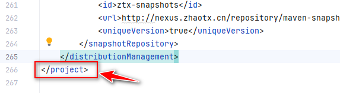

## maven 配置使用

### 说明

在复恒科技在项目中的使用

```xml
<build>
		<plugins>
			<plugin>
				<groupId>org.apache.maven.plugins</groupId>
				<artifactId>maven-compiler-plugin</artifactId>
				<configuration>
					<source>${java.version}</source>
					<target>${java.version}</target>
				</configuration>
			</plugin>

			<plugin>
				<artifactId>maven-source-plugin</artifactId>
				<configuration>
					<attach>true</attach>
				</configuration>
				<executions>
					<execution>
						<phase>compile</phase>
						<goals>
							<goal>jar</goal>
						</goals>
					</execution>
				</executions>
			</plugin>

		</plugins>
	</build>


	<!-- 存储库配置 -->
	<repositories>
		<repository>
			<id>ztx</id>
			<name>ztx-nexus</name>
			<url>http://nexus.zhaotx.cn/repository/maven-public/</url>
			<releases>
				<enabled>true</enabled>
			</releases>
			<snapshots>
				<enabled>true</enabled>
				<updatePolicy>always</updatePolicy>
			</snapshots>
		</repository>
	</repositories>

	<!-- 存储库发布配置 -->
	<distributionManagement>
		<repository>
			<id>ztx-releases</id>
			<url>http://nexus.zhaotx.cn/repository/maven-releases/</url>
		</repository>
		<snapshotRepository>
			<id>ztx-snapshots</id>
			<url>http://nexus.zhaotx.cn/repository/maven-snapshots/</url>
			<uniqueVersion>true</uniqueVersion>
		</snapshotRepository>
	</distributionManagement>
```

配置在project 

```
<project>

</project>
```





