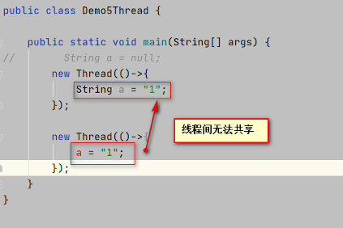

资料来源：

[线程安全问题的解决方案有哪些？](https://www.toutiao.com/article/7083486131035439648/?log_from=4c86ac765363_1650863495154)

## 线程安全

### 栈封闭

局部变量的固有属性之一就是封闭在线程中。

它们位于执行线程的栈中，其他线程无法访问这个栈




进行修改后， 创建个更大作用域变量，就可以共享了

~~~~java
public class Demo5Thread {
    static String a = null;
    public static void main(String[] args) {
        new Thread(()->{
            a = "1";
        });
        new Thread(()->{
            a = "1";
        });
    }
}
~~~~

### 线程封闭

多线程访问共享可变数据时，涉及到线程间数据同步的问题

> 并不是所有时候，都要用到共享数据，若数据都被封闭在各自的线程之中，就不需要同步，
>
> 这种通过将数据封闭在线程中而避免使用同步的技术称为线程封闭。 

```
public class DemoThreadLocal {

    public static ThreadLocal<String> value = new ThreadLocal<>();
    public static void main(String[] args) throws InterruptedException {
        new Thread(()-> {
            value.set("11111");
            try {
                Thread.sleep(1000L);
            } catch (InterruptedException e) {
                e.printStackTrace();
            }
            System.out.println("1:" + value.get());
        }).start();

        new Thread(()-> {
            value.set("2222");
            try {
                Thread.sleep(1000L);
            } catch (InterruptedException e) {
                e.printStackTrace();
            }
            System.out.println("2:" +value.get());
        }).start();
        System.out.println(value.get());
        Thread.currentThread().join();
    }
}
```

用法：` ThreadLocal var = new ThreadLocal();`

会自动在每一个线程上创建一个T的副本，副本之间彼此独立，互不影响。

可以用ThreadLocal存储一些参数，以便在线程中多个方法中使用，用来代替方法传参的做法

简单来说， 线程间不共享数据

## 案例分析

线程安全是指某个方法或某段代码，在多线程中能够正确的执行，不会出现数据不一致或数据污染的情况，我们把这样的程序称之为线程安全的，反之则为非线程安全的。在 Java 中，解决线程安全问题有以下 3 种手段：

1.使用线程安全类，比如 AtomicInteger。

2.加锁排队执行

- 使用 synchronized 加锁。
- 使用 ReentrantLock 加锁。

3.使用线程本地变量 ThreadLocal。

接下来我们逐个来看它们的实现。

### 案例

创建一个接口Counter，实现功能是计数

```java

import java.util.concurrent.atomic.AtomicInteger;

public class CounterDemo {

    public static void main(String[] args) throws InterruptedException {
        final Counter ct = new UnSafeCounter();
        for (int i = 0; i < 6; i++) {
            new Thread(() -> {
                for (int j = 0; j < 10000; j++) {
                    ct.add();
                }
                System.out.println("start...." + Thread.currentThread().getName());
            }).start();
        }

        Thread.sleep(2_000L);
        System.out.println(ct.getValues());
    }
}
interface Counter {
    void add();
    int getValues();
}

class UnSafeCounter implements Counter {
    volatile int i;
    @Override
    public void add() {
        i++;
    }
    @Override
    public int getValues() {
        return i;
    }
}
/**
 * 同步锁
 * @author liuwei
 *
 */
class SyncCounter extends UnSafeCounter {
    @Override
    public synchronized void add() {
        i++;
    }
}
/**
 * 原子锁操作
 * @author liuwei
 *
 */
class AtomicCounter implements Counter {
    AtomicInteger at = new AtomicInteger();
    @Override
    public void add() {
        at.getAndIncrement();
    }
    @Override
    public int getValues() {
        return at.get();
    }
}
```

### 现象分析

运行结果是:


执行自增总共1000*6次，结果应该是60000。而真实结果确实只有2万多。这就存在问题

通过javac命令`javac CounterDemo.java `生成字节码


代码分析

~~~~powershell
javap -v -p CounterDemo.class
~~~~


**i++操作**的解析结果


可以看出i++，其实执行了多次操作。

如果把i++编程单元操作，可以使用CAS

### cas

AtomicInteger 是线程安全的类，使用它可以将 ++ 操作和 -- 操作，变成一个原子性操作，这样就能解决非线程安全的问题了，如下代码所示：


CAS存在的问题

>1. 仅针对单个变量的操作，不能用于多个变量来实现原子操作。
>2. 循环+CAS，白旋的实现让所有线程都处于高频运行，争抢cpu执行时间的状态。如果操作长
>  时间不成功，会带来很大的CPU资源消耗。
>3. ABA问题。（无法体现出数据的变动）

### 锁

!> 后面专门介绍

Synchronized

- 优点： 1、使用简单，语义清晰，哪里需要点哪里。
  2、由JVM提供， 提供了多种优化方案(锁粗化、锁消除、偏向锁、轻量级锁)
  3、锁的释放由虚拟机来完成，不用人工干预，也降低了死锁的可能性
- 缺点：无法实现一些锁的高级功能如：公平锁、中断锁、超时锁、读写锁、共享锁等

Lock
- 优点： 1、所有synchronized的缺点 2、可以实现更多的功能，让synchronized缺点更多
- 缺点：需手动释放锁unlock，新手使用不当可能造成死锁

结论 synchronized 是卡片机， lock 是单反

卡片机： 傻瓜相机，使用简单
单反：专业，经过调试效果好