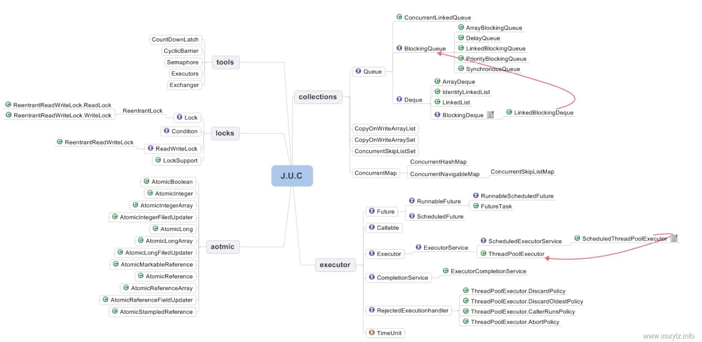

资料来源：
[额！Java中用户线程和守护线程区别这么大？](https://www.toutiao.com/article/6958988349147251231/?log_from=937ecf28f4ec_1650431881084) <br/>
[面试突击21：有哪些创建线程的方法？推荐使用哪种？](https://www.toutiao.com/article/7062970672842129958/)<br/>
[Java并发编程：JUC之线程池的使用](https://www.jianshu.com/p/bc06acb9eff8)<br/>
## juc



主要包含：

- Locks：锁包
- Tools：工具类
- Collections：并发集合
- Executor： 线程池
- Atomic ：原子类

## 多线程状态

- 线程的六种状态
  在jdk中代码<br/>
  
  ​

~~~~Java
public enum State {
NEW,
RUNNABLE,
BLOCKED,
WAITING,
TIMED_WAITING,
TERMINATED;
}
~~~~

- 6个状态定义： java.lang.Thread.State


> 1. New：尚未启动的线程的线程状态。
>
>
> 2. Runnable：可运行线程的线程状态，等待CPU调度。
> 3. Blocked：线程阻塞等待监视器锁定的线程状态。
>
> 处于synchronized同步代码块或方法中被阻塞。
>
> 4. Waiting：线程等待的线程状态。
>
> 不带timeout参数的方式调用Object.wait、 Thread.join、 LockSupport.park
>
> 5. Timed Waiting：具有指定等待时间的等待线程的线程状态。下列带超时的方式：
>
> Thread.sleep、 Object.wait、 Thread.join、 LockSupport.parkNanos、 LockSupport.parkUntil
>
> 6. Terminated：终止线程的线程状态。线程正常完成执行或者出现异常


~~~~java
import org.junit.Test;

/**
 * @program: liuwei
 * @description:
 * @author: liuwei
 * @create: 2021-03-02 14:53
 **/
public class ThreadState {
    @Test
    public  void test1() throws Exception{
        // 第一种状态 新建 -> 运行 -> 终止
        Thread thread1 = new Thread(() -> {
            System.out.println("子线程发来贺电。。。");
        });

        System.out.println("1、调用start之前，thread1的状态：" + thread1.getState().toString());   // NEW
        Thread.sleep(2000L);
        thread1.start();
        System.out.println("2、调用start之后，thread1的状态：" + thread1.getState().toString()); // RUNNABLE

        Thread.sleep(4000L);
        System.out.println("3、4s后，thread1的状态：" + thread1.getState().toString());  // TERMINATED
    }

    @Test
    public  void test2() throws Exception{
        System.out.println("########## 第二种状态 新建 -> 运行 ->  等待 ->  运行 ->  终止（sleep方式）##########");
        Thread thread2 = new Thread(() -> {
            try {
                Thread.sleep(5000L);
                System.out.println("3.sleep结束，" + Thread.currentThread().getName() + "当前的状态：" + Thread.currentThread().getState());
            } catch (InterruptedException e) {
                e.printStackTrace();
            }
        });
        thread2.start();
        System.out.println("1、调用start 后， thread2状态" + thread2.getState().toString());

        Thread.sleep(2000L);
        System.out.println("等待 2 秒后， thread2状态：" + thread2.getState().toString());
    }

    @Test
    public void test3() throws Exception{
        System.out.println("########## 第二种状态 新建 -> 运行 ->  阻塞 ->  运行 ->  终止（sleep方式）##########\"");

        Thread thread3 = new Thread(() -> {
            System.out.println("2、抢占之前， thread3状态：" + Thread.currentThread().getState().toString());
            synchronized (this.getClass()){
                System.out.println("3、拿到了锁，可以继续执行， thread3的状态：" + Thread.currentThread().getState().toString());
            }
        });

        synchronized (this.getClass()){
            System.out.println("1. 主线程拿到锁， 启动 thread3");
            thread3.start();
            Thread.sleep(5000L);
            System.out.println("3、 threa3的状态：" + thread3.getState().toString());
            Thread.sleep(5000L);
        }
        System.out.println("主程序 释放锁");
    }
}
~~~~


## 创建一个线程

在 Java 中，线程的创建方法有 7 种，分为以下 3 大类：

1. 继承 Thread 类的方式，它有 2 种实现方法。
2. 实现 Runnable 接口的方式，它有 3 种实现方法。
3. 实现 Callable 接口的方式，它有 2 种实现方法。

### 继承Thread类

继承 Thread 类并重写 run 方法，是最早期创建线程的方法，它的实现方法有以下两种：

1. 创建一个普通的类，继承 Thread 类，并重写 run 方法。
2. 使用匿名内部类的方式继承并重写 run 方法。

**普通类继承Thread**

创建一个普通类，继承 Thread 并重写 run 方法，其中 run 方法中的代码是线程具体要执行的业务代码，实现如下：

**代码**

```java
class MyThread extends Thread{

    @Override
    public void run(){
        System.out.println("我是一个新的线程");
    }
}
```

测试方法

```java
@Test
public void test02(){
    MyThread t1 = new MyThread();
    t1.start();
}
```

**缺点**

继承 Thread 类的实现方法有一个明显的缺点，Java 语言是单继承的，所以如果继承了 Thread 类，那就不能再继承其他类了。

### 实现Runnable接口

在 Java 语言中，虽然不能多继承，但可以实现多个接口。接下来是实现 Runnable 接口的 3 种方法

> 1. 创建一个普通类实现 Runnable 接口，并重写 run 方法。
> 2. 使用匿名方式创建 Runnable 实现类，并重写 run 方法。
> 3. 使用 Lambda 方式创建匿名 Runnable 实现类（JDK 8+）。

**实现runable接口**

```
class MyRunner implements Runnable{
    @Override
    public void run() {
        System.out.println("我是一个新的线程");
    }
}
```

测试类

```
@Test
public void test03(){
    Runnable runner = new MyRunner();
    new Thread(runner).start();
}
```

**匿名内部类**

```
@Test
public void test04(){
    new Thread(new Runnable() {
        @Override
        public void run() {
            System.out.println("我是一个新的线程");
        }
    }).start();
}
```

**Lambda方式**

Runable只有一个接口，可以使用lambad表达式的写法


测试类

```
@Test
public void test05() {
    new Thread(() -> {
        System.out.println("我是一个新的线程");
    }).start();
}
```

**如果是 JDK 1.8 以上的程序，在不要求获得线程执行结果的情况下，推荐使用 Lambda 的方式来创建线程，因为它的写法足够简洁**

### 使用Callable接口

**JDK 1.5 中推出的 Callable 接口，解决了之前不能获得线程执行结果的尴尬**，

它的实现方法有以下两种：

> 1. 创建一个普通类实现 Callable 接口，并重写 call 方法。
> 2. 使用匿名内部类创建 Callable 的实现类，并重写 call 方法

**普通类实现Callable**

```
class MyCallable implements Callable<Integer>{
    @Override
    public Integer call() throws Exception {
        return 0;
    }
}
```

测试方法

```
@Test
public void test06() throws ExecutionException, InterruptedException {
    // 创建 Callable 普通类
    MyCallable callable = new MyCallable();
    // 使用 FutureTask 用于获取线程执行结果
    FutureTask<Integer> futureTask = new FutureTask<>(callable);
    // 创建线程
    Thread thread = new Thread(futureTask);
    // 启动线程
    thread.start();
    // 得到线程执行的结果
    int result = futureTask.get();
    System.out.println(result);
}
```

上代码使用 FutureTask + Callable 的方式获取线程的执行结果，它可以接受任何类型的返回值，我们只需要在创建 Callable 实现类的时候，定义返回的数据类型即可。

**匿名Callable实现类**

```
@Test
public void test07() throws ExecutionException, InterruptedException {
    FutureTask<Integer> futureTask = new FutureTask<>(new Callable<Integer>() {
        @Override
        public Integer call() throws Exception {
            // 业务代码...
            return 0;
        }
    });
    // 创建线程
    Thread thread = new Thread(futureTask);
        // 启动线程
    thread.start();
    // 得到线程执行的结果
    int result = futureTask.get();
    System.out.println(result);
}
```

**总结**

>创建线程有 3 大类实现方式、7 种实现方法，如果是 JDK 1.8 以上版本，在不需要获得线程执行结果的情况下，推荐使用 Lambda 方式来创建线程，因为它的写法足够简洁；如果想要获取线程执行结果，可使用 FutureTask + Callable 的方式来实现。

## 线程的停止

### 自定义中断标识符

自定义中断标识符就是在程序中定义一个变量来决定线程是否要中断执行，具体实现代码如下：

```
public class InterruptFlag {
    // 自定义的中断标识符
    private static volatile boolean isInterrupt = false;

    public static void main(String[] args) throws InterruptedException {
        // 创建可中断的线程实例
        Thread thread = new Thread(() -> {
            while (!isInterrupt) { // 如果 isInterrupt=true 则停止线程
                System.out.println("thread 执行步骤1：线程即将进入休眠状态");
                try {
                    // 休眠 1s
                    Thread.sleep(1000);
                } catch (InterruptedException e) {
                    e.printStackTrace();
                }
                System.out.println("thread 执行步骤2：线程执行了任务");
            }
        });
        thread.start(); // 启动线程

        // 休眠 100ms，等待 thread 线程运行起来
        Thread.sleep(100);
        System.out.println("主线程：试图终止线程 thread");
        // 修改中断标识符，中断线程
        isInterrupt = true;
    }
}
```

**自定义中断标识符的问题在于：线程中断的不够及时。因为线程在执行过程中，无法调用 while(!isInterrupt) 来判断线程是否为终止状态，它只能在下一轮运行时判断是否要终止当前线程，所以它中断线程不够及时**


### 为什么不推荐使用stop()

想停止一个线程，最先想到的stop方法，在Thread提供了stop方法


但是可以看到stop方法，已经过时了。不建议使用

?> 为什么不建议使用？

```java
public class StopThreadDemo {

    @Test
    public void test01() throws Exception{
        MyThread myThread = new MyThread();
        myThread.start();

        Thread.sleep(1000L * 1);
        myThread.stop();

        while (myThread.isAlive()){}  // 等待线程结束
        myThread.print();
    }

    class MyThread extends Thread{

        private int i = 0;
        private int j = 0;

        @Override
        public void run() {
            synchronized (this) {
                i++;
                // 休眠2s
                try {
                    Thread.sleep(1000L * 2);
                } catch (InterruptedException e) {
                    e.printStackTrace();
                }
                j++;
            }
        }

        public void print(){
            System.out.println("i=" + i + " ,j=" + j);
        }

    }
}
```

下面的是运行的结果


从代码中看到使用synchoronized同步锁，希望i和j 是单元操作。但是运行的结果是i++ 执行了，但是j++ 没有执行。导致同步锁失效

### interrupt中断线程(推荐)

使用 interrupt 方法可以给执行任务的线程，发送一个中断线程的指令，它并不直接中断线程，而是发送一个中断线程的信号，把是否正在中断线程的主动权交给代码编写者。相比于自定义中断标识符而然，它能更及时的接收到中断指令，如下代码所示：


注意：

> 如果目标线程在调用Object class的wait()、 wait(long)或wait(long, int)方法、 join()、
>
> join(long, int)、join(long, int)、 sleep(long, int)或sleep(long,int)方法时被阻塞。
>
> 此时线程被调用interrupt方法后， 该线程的中断状态将被清除，抛出InterruptedException
>
> 异常

代码演示

```java
public class ThreadInterruptedDemo {
    @Test
    public void test01() throws Exception {
        Thread one = new Thread(() -> {
            System.out.println("新开始了一个线程");
            try {
                Thread.sleep(1000L * 10);
            } catch (InterruptedException e) {
                System.err.println("程序出现异常！");
                e.printStackTrace();
            }
            System.out.println("执行完成");
        });
        one.start();

        Thread.sleep(1000L * 1);
        try {
            one.interrupt();
        }catch (Exception e){
            System.out.println(e.getMessage());
        }
    }
}
```

当运行中调用了`interrupt()`方法，此时Thread执行异常处理的内容

结果如下


从上述结果可以看出，**线程在接收到中断指令之后，立即中断了线程，相比于上一种自定义中断标识符的方法来说，它能更及时的响应中断线程指令**


## 用户线程和守护线程

用户线程和守护线程，默认情况下我们创建的线程或线程池都是用户线程，**守护线程是为用户线程服务的，当一个程序中的所有用户线程都执行完成之后程序就会结束运行，程序结束运行时不会管守护线程是否正在运行**，由此我们可以看出守护线程在 Java 体系中权重是比较低的，这就是守护线程和用户线程的区别。

### 守护线程的介绍

线程分为两类：用户线程和守护线程，默认情况下我们创建的线程或线程池都是用户线程，所以用户线程也被称之为普通线程。

想要查看线程到底是用户线程还是守护线程，可以通过 Thread.isDaemon() 方法来判断，如果返回的结果是 true 则为守护线程，反之则为用户线程。

**守护线程（Daemon Thread）也被称之为后台线程或服务线程，守护线程是为用户线程服务的，当程序中的用户线程全部执行结束之后，守护线程也会跟随结束。**

守护线程的角色就像“服务员”，而用户线程的角色就像“顾客”，当“顾客”全部走了之后（全部执行结束），那“服务员”（守护线程）也就没有了存在的意义，所以当一个程序中的全部用户线程都结束执行之后，那么无论守护线程是否还在工作都会随着用户线程一块结束，整个程序也会随之结束运行。

### 验证守护/用户线程

可以通过 Thread.isDaemon() 方法来判断是否为守护线程

**main线程是用户线程**

```
public class DaemonDemo {

    // 运行结果false
    public static void main(String[] args) {
        boolean daemon = Thread.currentThread().isDaemon();
        System.out.println(daemon);
        System.out.println(Thread.currentThread().getName());
    }

}
```

运行结果


main线程也是用户线程

**新建线程**

```
// 运行结果false
@Test
public void test01() throws InterruptedException {
    new Thread(()->{
        boolean daemon = Thread.currentThread().isDaemon();
        System.out.println(daemon);
        System.out.println(Thread.currentThread().getName());
    }).start();

    Thread.sleep(1000L);
}
```

运行结果


新建的线程默认就是用户线程

### 设置守护线程

当不执行`thread.setDaemon(true);`这行代码时候，说明先创建的这个线程是用户线程

```
    public static void main(String[] args) {
        Thread thread = new Thread(() -> {
            for (int i = 1; i <= 10; i++) {
                // 打印 i 信息
                System.out.println("i:" + i);
                try {
                    // 休眠 100 毫秒
                    Thread.sleep(100);
                } catch (InterruptedException e) {
                    e.printStackTrace();
                }
            }
        });
        // 设置为守护线程
//        thread.setDaemon(true);
        // 启动线程
        thread.start();
    }
```

守护线程的设置 setDaemon(true) 必须要放在线程的 start() 之前，否则程序会报错。也就是说**在运行线程之前，一定要先确定线程的类型，并且线程运行之后是不允许修改线程的类型的**

运行结果：


**当一个程序中的所有用户线程都执行完成之后程序就会结束运行**

如果设置成守护线程


**程序结束运行时不会管守护线程是否正在运行**由此我们可以看出守护线程在 Java 体系中权重是比较低的

总结：在 Java 语言中线程分为两类：用户线程和守护线程，默认情况下我们创建的线程或线程池都是用户线程，**守护线程是为用户线程服务的，当一个程序中的所有用户线程都执行完成之后程序就会结束运行，程序结束运行时不会管守护线程是否正在运行**，由此我们可以看出守护线程在 Java 体系中权重是比较低的，这就是守护线程和用户线程的区别。