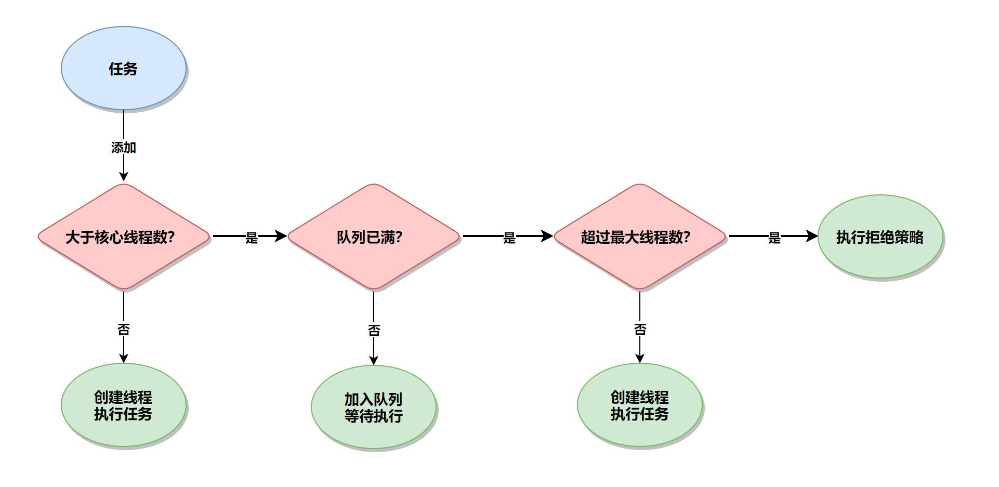
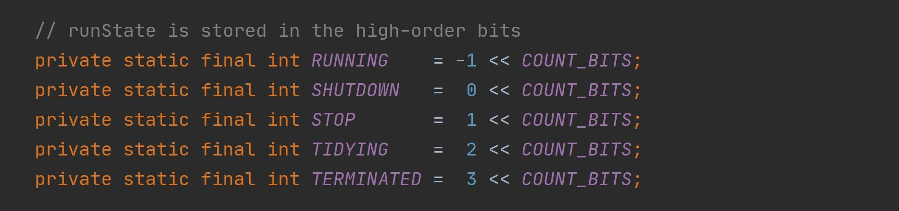
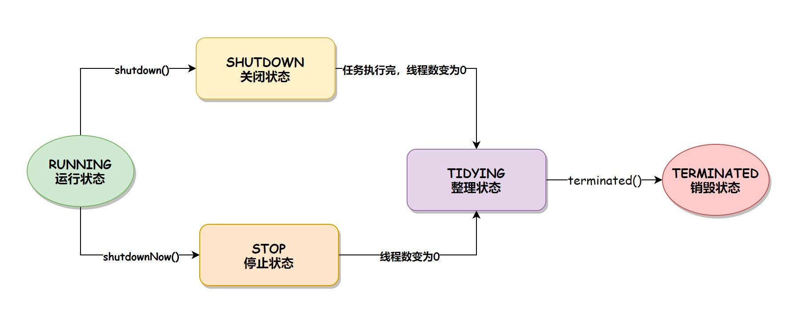
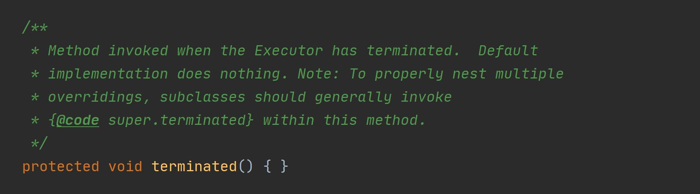

资料来源：<br/>
[线程池有哪些状态？状态是如何转换的？](https://www.toutiao.com/article/7078091994135822886/?log_from=422a2684439c8_1650360377193)<br/>
[为什么创建线程池一定要用ThreadPoolExecutor？](https://www.toutiao.com/article/7077357206789800483/?log_from=38ac459dd131e_1650417911238)<br/>
[面试突击30：线程池是如何执行的？拒绝策略有哪些？](https://www.toutiao.com/article/7074754905214386719/)<br/>

## 多线程原理

**Java线程是不是越多越好?**

1. 线程不仅java 中一个对象，每个线程都有自己的工作内存
  线程的创建、销毁需要时间，消耗性能
  线程过多，会占用很多内存
2. 操作系统需要频繁的切换线程上下文，影响性能
3. 如果创建+ 销毁时间 > 执行时间，就很不合算

线程池的推出，就是为了方便的控制线程数量

**线程池原理：**

1、 **线程池管理器：** 用于创建并管理线程池， 包括创建线程池，销毁线程池， 添加新任务；

2、 **工作线程：** 线程池中线程， 可以循环的执行任务， 在没有任务时处于等待状态；

3、**任务接口：** 每个任务必须实现的接口， 以供工作线程调度任务的执行，它主要规定了任务的

入口， 任务执行完后的收尾工作， 任务的执行状态等；

4、**任务队列：** 用于存放没有处理的任务。 提供一种缓冲机制。


线程池 – 类的层次结构


**ExecutorService  接口**


**ScheduledExecutorService 接口**


**执行过程**

1、是否达到核心线程数量？ 没达到，创建一个工作线程来执行任务。

2、工作队列是否已满？ 没满，则将新提交的任务存储在工作队列里。

3、是否达到线程池最大数量？ 没达到，则创建一个新的工作线程来执行任务。

4、最后， 执行拒绝策略来处理这个任务


### 如何确定合适数量的线程


**计算型任务：** cpu数量的1-2倍

**IO型任务：** 相对比计算型任务，需多一些线程， 要根据具体的IO阻塞时长进行考量决定。

也可考虑根据需要在一个最小数量和最大数量间自动增减线程数。

如tomcat中默认的最大线程数为：200

### 线程池执行流程

想要真正的了解线程池的执行流程，就得先从线程池的执行方法 execute() 说起，execute() 实现源码如下：

?> 下面是源码基础上增加了注释

~~~~java
public void execute(Runnable command) {
    if (command == null)
        throw new NullPointerException();
    int c = ctl.get();
    // 当前工作的线程数小于核心线程数
    if (workerCountOf(c) < corePoolSize) {
        // 创建新的线程执行此任务
        if (addWorker(command, true))
            return;
        c = ctl.get();
    }
    // 检查线程池是否处于运行状态，如果是则把任务添加到队列
    if (isRunning(c) && workQueue.offer(command)) {
        int recheck = ctl.get();
        // 再次检线程池是否处于运行状态，防止在第一次校验通过后线程池关闭
        // 如果是非运行状态，则将刚加入队列的任务移除
        if (! isRunning(recheck) && remove(command))
            reject(command);
        // 如果线程池的线程数为 0 时（当 corePoolSize 设置为 0 时会发生）
        else if (workerCountOf(recheck) == 0)
            addWorker(null, false); // 新建线程执行任务
    }
    // 核心线程都在忙且队列都已爆满，尝试新启动一个线程执行失败
    else if (!addWorker(command, false)) 
        // 执行拒绝策略
        reject(command);
}
~~~~

从上述源码我们可以看出，当任务来了之后，**线程池的执行流程是：先判断当前线程数是否大于核心线程数？如果结果为 false，则新建线程并执行任务；如果结果为 true，则判断任务队列是否已满？如果结果为 false，则把任务添加到任务队列中等待线程执行，否则则判断当前线程数量是否超过最大线程数？如果结果为 false，则新建线程执行此任务，否则将执行线程池的拒绝策略**，如下图所示：



### 手写线程池

线程池的简单实现

```
import java.util.ArrayList;
import java.util.Collections;
import java.util.List;
import java.util.concurrent.BlockingQueue;
import java.util.concurrent.LinkedBlockingDeque;

public class FixedSizeThreadPool {
    //思考：需要做哪些准备工作

    //1、需要一个任务仓库
    private BlockingQueue<Runnable> blockingQueue;

    //2、 集合容器，存放工作线程
    private List<Thread> workers;

    //3、普通线程要执行多个task，咱们需要封装一下
    public static class Worker extends Thread{

        private FixedSizeThreadPool pool;
        public Worker(FixedSizeThreadPool pool){
            this.pool = pool;
        }

        @Override
        public void run() {
            while(this.pool.isWorking || this.pool.blockingQueue.size() > 0){
                Runnable task = null;

                try {
                    //如果没有任务，就阻塞等待任务
                    if (this.pool.isWorking)
                        task = this.pool.blockingQueue.take();
                    else
                        task = this.pool.blockingQueue.poll();
                } catch (InterruptedException e) {
                    e.printStackTrace();
                }

                if (task != null){
                    task.run();
                }
            }
        }
    }


    //4 初始化线程池
    public FixedSizeThreadPool(int poolSize, int queueSize){
        if (poolSize<=0 || queueSize<=0){
            throw new IllegalArgumentException("非法参数");
        }
        this.blockingQueue = new LinkedBlockingDeque<>(queueSize);
        this.workers = Collections.synchronizedList(new ArrayList<>());
        for (int i=0; i<poolSize; i++){
            Worker worker = new Worker(this);   //实例化Worker对象，实际上是一个Thread对象
            worker.start();         //启动worker对象，实际上就是启动一个线程
            workers.add(worker);    //讲worker加到workers集合中，方便管理
        }
    }

    // 对外提供提交任务的接口 非阻塞
    public boolean submit(Runnable task){
        if (isWorking){
            return this.blockingQueue.offer(task);
        }else{
            return false;
        }
    }
    // 对外提供提交任务的接口 阻塞
    public void execute(Runnable task){
        try {
            if (isWorking) this.blockingQueue.put(task);
        } catch (InterruptedException e) {
            e.printStackTrace();
        }
    }


    //关闭线程池
    //a. 禁止往队列提交任务
    //b. 等待仓库中的任务执行
    //c. 关闭的时候，再去那任务就不用阻塞，因为不会有新任务来了
    //d. 关闭的时候，阻塞的线程，就要强行中断
    private volatile boolean isWorking = true;
    public void shutdown(){
        this.isWorking = false;
        for (Thread thread: workers){
            if (thread.getState().equals( Thread.State.WAITING) ||
                    thread.getState().equals( Thread.State.BLOCKED)){
                thread.interrupt();
            }
        }
    }
}

```

不断从queue 中读取数据，当没有数据的时候，阻塞等待

Queue 有数据的时候，获取queue，执行这个线程


##  线程池有哪些状态

### 状态

在 Java 中，线程池的状态和线程的状态是完全不同的，线程有 6 种状态：NEW：初始化状态、RUNNABLE：可运行/运行状态、BLOCKED：阻塞状态、WAITING：无时限等待状态、TIMED_WAITING：有时限等待状态和 TERMINATED：终止状态。而线程池的状态有以下 5 种：

>1. RUNNING：运行状态，线程池创建好之后就会进入此状态，如果不手动调用关闭方法，那么线程池在整个程序运行期间都是此状态。
>2. SHUTDOWN：关闭状态，不再接受新任务提交，但是会将已保存在任务队列中的任务处理完。
>3. STOP：停止状态，不再接受新任务提交，并且会中断当前正在执行的任务、放弃任务队列中已有的任务。
>4. TIDYING：整理状态，所有的任务都执行完毕后（也包括任务队列中的任务执行完），当前线程池中的活动线程数降为 0 时的状态。到此状态之后，会调用线程池的 terminated() 方法。
>5. TERMINATED：销毁状态，当执行完线程池的 terminated() 方法之后就会变为此状态。

这 5 种状态可以在 ThreadPoolExecutor 源码中找到，如下图所示：



### 状态的转移

线程池的状态转移有两条路径：

>1. 当调用 shutdown() 方法时，线程池的状态会从 RUNNING 到 SHUTDOWN，再到 TIDYING，最后到 TERMENATED 销毁状态。
>2. 当调用 shutdownNow() 方法时，线程池的状态会从 RUNNING 到 STOP，再到 TIDYING，最后到 TERMENATED 销毁状态。

线程状态转换的流程如下图所示：



### terminated

线程池中的 terminated() 方法，也就是线程池从 TIDYING 转换到 TERMINATED 状态时调用的方法，默认是空的，它的源码如下：



我们可以在创建线程池的时候重写 terminated() 方法，具体实现代码如下：

```
import java.util.concurrent.LinkedBlockingQueue;
import java.util.concurrent.ThreadPoolExecutor;
import java.util.concurrent.TimeUnit;

public class ThreadPoolStateTransition {
    public static void main(String[] args) throws InterruptedException {
        // 创建线程池
        ThreadPoolExecutor threadPool = new ThreadPoolExecutor(10, 10, 0L,
                TimeUnit.SECONDS, new LinkedBlockingQueue<>(100)) {
            @Override
            protected void terminated() {
                super.terminated();
                System.out.println("执行 terminated() 方法");
            }
        };
        // 关闭线程池
        threadPool.shutdown();
        // 等待线程池执行完再退出
        while (!threadPool.awaitTermination(1, TimeUnit.SECONDS)) {
            System.out.println("线程池正在运行中");
        }
    }
}
```

**总结**

线程池的状态总共有 5 种：

> RUNNING：运行状态
> SHUTDOWN：关闭状态
> STOP：停止状态
> TIDYING：整理状态
> TERMINATED：销毁状态。

默认情况下，如果不调用关闭方法，线程池会一直处于 RUNNING 状态，而线程池状态的转移有两个路径：当调用 shutdown() 方法时，线程池的状态会从 RUNNING 到 SHUTDOWN，再到 TIDYING，最后到 TERMENATED 销毁状态；当调用 shutdownNow() 方法时，线程池的状态会从 RUNNING 到 STOP，再到 TIDYING，最后到 TERMENATED 销毁状态。