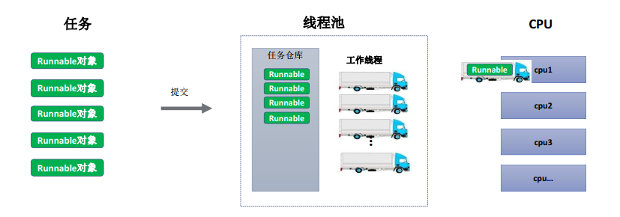
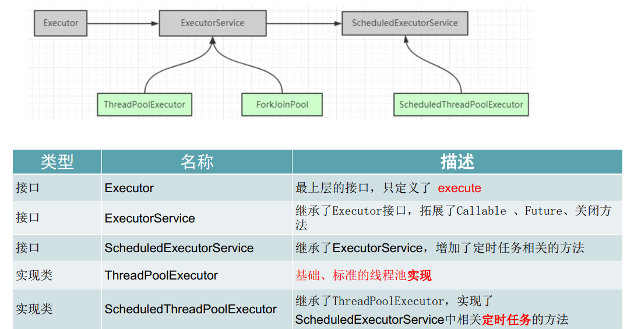
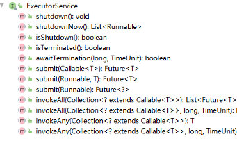
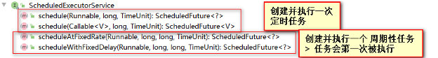
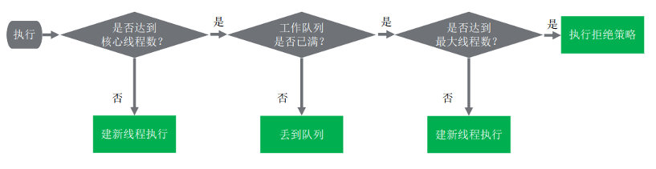
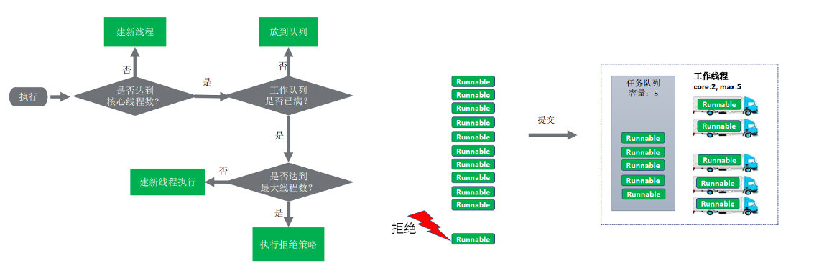

资料来源：

[线程池有哪些状态？状态是如何转换的？](https://www.toutiao.com/article/7078091994135822886/?log_from=422a2684439c8_1650360377193)

[为什么创建线程池一定要用ThreadPoolExecutor？](https://www.toutiao.com/article/7077357206789800483/?log_from=38ac459dd131e_1650417911238)

## 多线程原理

**Java线程是不是越多越好?**

1. 线程不仅java 中一个对象，每个线程都有自己的工作内存
  线程的创建、销毁需要时间，消耗性能
  线程过多，会占用很多内存
2. 操作系统需要频繁的切换线程上下文，影响性能
3. 如果创建+ 销毁时间 > 执行时间，就很不合算

线程池的推出，就是为了方便的控制线程数量

**线程池原理：**

1、 **线程池管理器：** 用于创建并管理线程池， 包括创建线程池，销毁线程池， 添加新任务；

2、 **工作线程：** 线程池中线程， 可以循环的执行任务， 在没有任务时处于等待状态；

3、**任务接口：** 每个任务必须实现的接口， 以供工作线程调度任务的执行，它主要规定了任务的

入口， 任务执行完后的收尾工作， 任务的执行状态等；

4、**任务队列：** 用于存放没有处理的任务。 提供一种缓冲机制。



线程池 – 类的层次结构



**ExecutorService  接口**




**ScheduledExecutorService 接口**



**执行过程**

1、是否达到核心线程数量？ 没达到，创建一个工作线程来执行任务。

2、工作队列是否已满？ 没满，则将新提交的任务存储在工作队列里。

3、是否达到线程池最大数量？ 没达到，则创建一个新的工作线程来执行任务。

4、最后， 执行拒绝策略来处理这个任务



### 如何确定合适数量的线程


**计算型任务：** cpu数量的1-2倍

**IO型任务：** 相对比计算型任务，需多一些线程， 要根据具体的IO阻塞时长进行考量决定。

也可考虑根据需要在一个最小数量和最大数量间自动增减线程数。


如tomcat中默认的最大线程数为：200

### 手写线程池

线程池的简单实现

```
import java.util.ArrayList;
import java.util.Collections;
import java.util.List;
import java.util.concurrent.BlockingQueue;
import java.util.concurrent.LinkedBlockingDeque;

public class FixedSizeThreadPool {
    //思考：需要做哪些准备工作

    //1、需要一个任务仓库
    private BlockingQueue<Runnable> blockingQueue;

    //2、 集合容器，存放工作线程
    private List<Thread> workers;

    //3、普通线程要执行多个task，咱们需要封装一下
    public static class Worker extends Thread{

        private FixedSizeThreadPool pool;
        public Worker(FixedSizeThreadPool pool){
            this.pool = pool;
        }

        @Override
        public void run() {
            while(this.pool.isWorking || this.pool.blockingQueue.size() > 0){
                Runnable task = null;

                try {
                    //如果没有任务，就阻塞等待任务
                    if (this.pool.isWorking)
                        task = this.pool.blockingQueue.take();
                    else
                        task = this.pool.blockingQueue.poll();
                } catch (InterruptedException e) {
                    e.printStackTrace();
                }

                if (task != null){
                    task.run();
                }
            }
        }
    }


    //4 初始化线程池
    public FixedSizeThreadPool(int poolSize, int queueSize){
        if (poolSize<=0 || queueSize<=0){
            throw new IllegalArgumentException("非法参数");
        }
        this.blockingQueue = new LinkedBlockingDeque<>(queueSize);
        this.workers = Collections.synchronizedList(new ArrayList<>());
        for (int i=0; i<poolSize; i++){
            Worker worker = new Worker(this);   //实例化Worker对象，实际上是一个Thread对象
            worker.start();         //启动worker对象，实际上就是启动一个线程
            workers.add(worker);    //讲worker加到workers集合中，方便管理
        }
    }

    // 对外提供提交任务的接口 非阻塞
    public boolean submit(Runnable task){
        if (isWorking){
            return this.blockingQueue.offer(task);
        }else{
            return false;
        }
    }
    // 对外提供提交任务的接口 阻塞
    public void execute(Runnable task){
        try {
            if (isWorking) this.blockingQueue.put(task);
        } catch (InterruptedException e) {
            e.printStackTrace();
        }
    }


    //关闭线程池
    //a. 禁止往队列提交任务
    //b. 等待仓库中的任务执行
    //c. 关闭的时候，再去那任务就不用阻塞，因为不会有新任务来了
    //d. 关闭的时候，阻塞的线程，就要强行中断
    private volatile boolean isWorking = true;
    public void shutdown(){
        this.isWorking = false;
        for (Thread thread: workers){
            if (thread.getState().equals( Thread.State.WAITING) ||
                    thread.getState().equals( Thread.State.BLOCKED)){
                thread.interrupt();
            }
        }
    }
}

```

不断从queue 中读取数据，当没有数据的时候，阻塞等待

Queue 有数据的时候，获取queue，执行这个线程



##  线程池有哪些状态

。。。...需要补充完整

https://www.toutiao.com/article/7078091994135822886/?log_from=422a2684439c8_1650360377193


## 为什么创建线程池一定要用ThreadPoolExecutor

https://www.toutiao.com/article/7077357206789800483/?log_from=38ac459dd131e_1650417911238