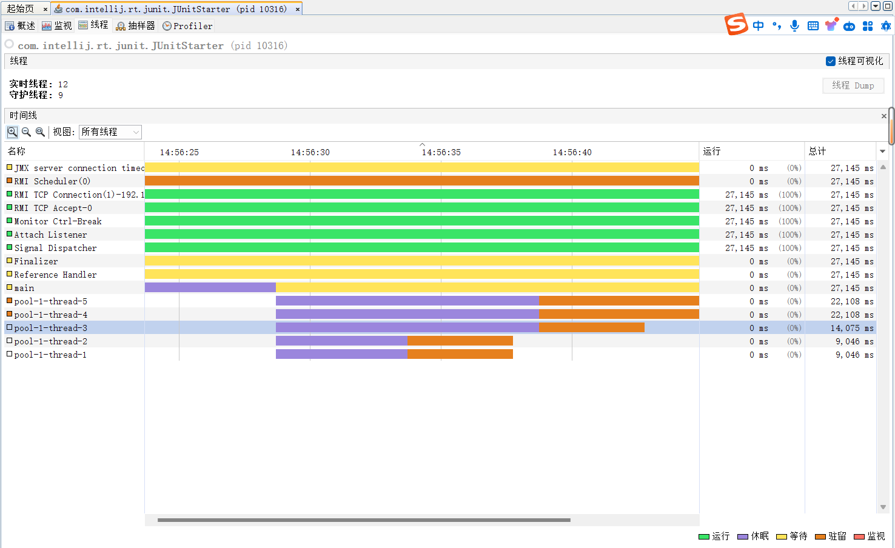

资料来源：自己理解总结


## 线程池的实际使用

### 线程池的执行过程

> 线程池中添加**任务**，会交给核心线程执行
>
> 线程的数量大于核心线程数，放到queue中缓存
>
> 继续增加任务，交给最大线程数
>
> 继续添加任务，执行拒绝策略

验证他的执行过程

### DiscardOldestPolicy

```java
import lombok.SneakyThrows;
import org.junit.Test;

import java.util.concurrent.*;

public class ThreadPoolDemo {

    ExecutorService threadPool = new ThreadPoolExecutor(2, 5,
            4,
            TimeUnit.SECONDS,
            new LinkedBlockingQueue<>(3),
            Executors.defaultThreadFactory(),
            new ThreadPoolExecutor.DiscardOldestPolicy()  
    );


    @SneakyThrows
    @Test
    public void test01(){
        Thread.sleep(1000L * 10);
        System.out.println("开始执行");
        for (int i = 0; i < 10; i++) {
            String iStr = new Integer(i).toString();
            MyThread t = new MyThread(iStr);
            threadPool.submit(t);
        }

        Thread.currentThread().join();

    }

    class MyThread extends Thread{

        private String threadName;
        public MyThread(String threadName) {
            this.threadName = threadName;
            this.setName(threadName);
        }

        @SneakyThrows
        @Override
        public void run(){
            System.out.println(threadName + "：开始执行");
            Thread.sleep(1000L * 5);
            System.out.println(threadName + "：执行结束");
        }

    }
}
```

日志打印

```shell
开始执行
1：开始执行
0：开始执行
5：开始执行
7：开始执行
6：开始执行
7：执行结束
6：执行结束
5：执行结束
0：执行结束
8：开始执行
4：开始执行
9：开始执行
1：执行结束
8：执行结束
9：执行结束
4：执行结束
```

执行过程，向线程池中增加了threadName的值1-10的任务。核心线程数是2个，queue 队列是3，最大线程数是5，超时时间是4秒。拒绝策略是`忽略最早的任务`



可以看出，任务0和1，直接交给核心线程去执行2，3，4缓存到queue中。5，6，7交给最大线程执行。

8，9任务加入的时候，忽略最早的，也就是2和3被挤出。没有执行执行4，8，9。这个时候，只有3个线程运行，其他两个线程没有任务，过了4秒以后，就执行回收

### DiscardPolicy

线程的执行结果是相同的，唯一的不同是。最后加入的8和9不会被执行

### AbortPolicy

直接抛出异常，无法执行

### CallerRunsPolicy


交给主线程执行

> 可以看出，任务0和1，直接交给核心线程去执行2，3，4缓存到queue中。5，6，7交给最大线程执行。
>
> 8，9任务加入，只能有一个交给主线程执行，9就等待。0,1,5，6，7执行结束后。线程池中有5个线程，这5个线程有4个任务（2，3，4），进行执行。主线程空闲了。有一个线程超时后进行回收。4个任务执行完成后，超时进行回收，只保留2个线程