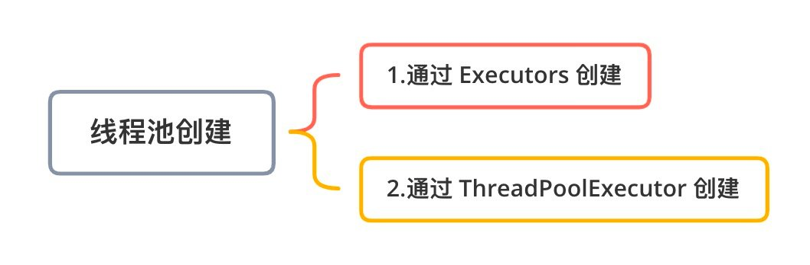
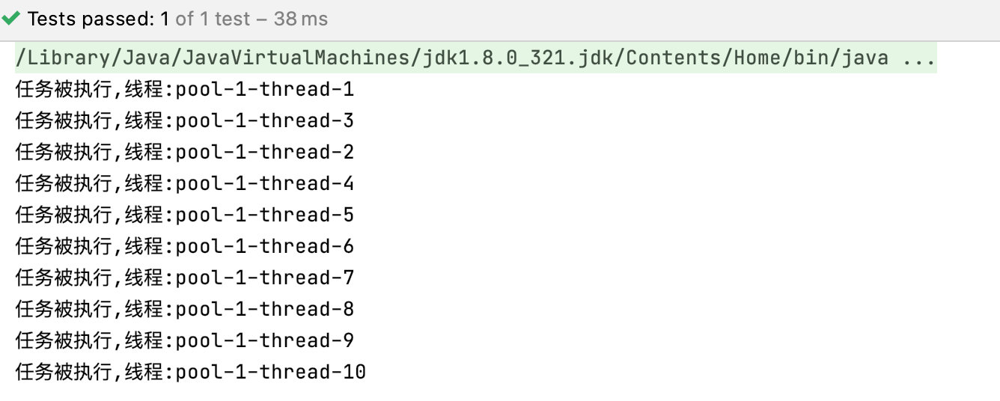
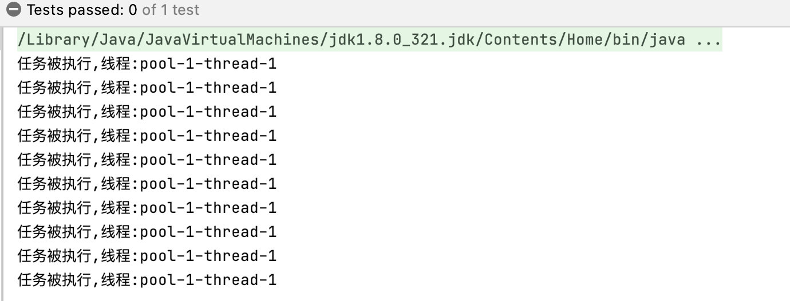
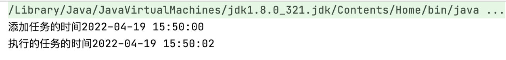
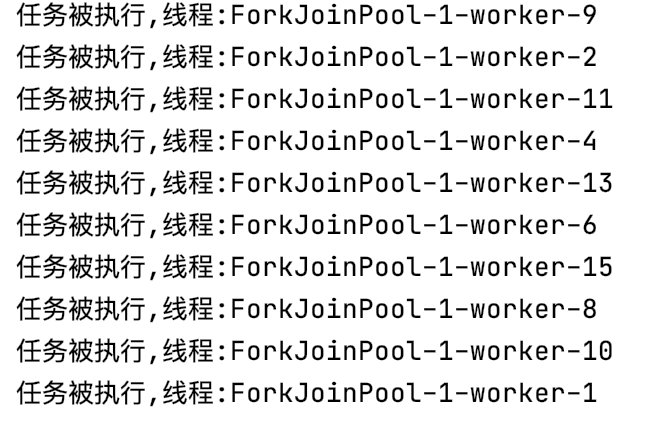

### 概述

在 Java 语言中，并发编程都是通过创建线程池来实现的，而线程池的创建方式也有很多种，每种线程池的创建方式都对应了不同的使用场景，总体来说线程池的创建可以分为以下两类：

- 通过 ThreadPoolExecutor 手动创建线程池。
- 通过 Executors 执行器自动创建线程池。




而以上两类创建线程池的方式，又有 7 种具体实现方法，这 7 种实现方法分别是：

1. Executors.newFixedThreadPool：创建一个固定大小的线程池，可控制并发的线程数，超出的线程会在队列中等待。
2. Executors.newCachedThreadPool：创建一个可缓存的线程池，若线程数超过处理所需，缓存一段时间后会回收，若线程数不够，则新建线程。
3. Executors.newSingleThreadExecutor：创建单个线程数的线程池，它可以保证先进先出的执行顺序。
4. Executors.newScheduledThreadPool：创建一个可以执行延迟任务的线程池。
5. Executors.newSingleThreadScheduledExecutor：创建一个单线程的可以执行延迟任务的线程池。
6. Executors.newWorkStealingPool：创建一个抢占式执行的线程池（任务执行顺序不确定）【JDK 1.8 添加】。
7. ThreadPoolExecutor：手动创建线程池的方式，它创建时最多可以设置 7 个参数。

接下来我们分别来看这 7 种线程池的具体使用。

### 1.newFixedThreadPool

创建一个固定大小的线程池，可控制并发线程数。

使用 FixedThreadPool 创建 2 个固定大小的线程池，具体实现代码如下：

```java
@Test
public void test01(){
    // 创建2个线程的线程池
    ExecutorService threadPool = Executors.newFixedThreadPool(2);

    Runnable runnable = new Runnable() {
        @Override
        public void run() {
            System.out.println("任务被执行,线程:" + Thread.currentThread().getName());
        }
    };

    threadPool.submit(runnable);// 执行方式 1:submit
    threadPool.execute(runnable);// 执行方式 2:execute
    threadPool.execute(runnable);
    threadPool.execute(runnable);
}
```

**运行结果**


**使用lambda表达式写法**

```java
@Test
public void test02(){
    // 创建2个线程的线程池
    ExecutorService threadPool = Executors.newFixedThreadPool(2);
    for (int i = 0; i < 4; i++) {
        threadPool.execute(()->{
            System.out.println("任务被执行,线程:" + Thread.currentThread().getName());
        });
    }
}
```

进行方法抽取

```Java
/**
 * 测试线程池的执行方法
 * @param threadPool 线程池
 */
public void exec(ExecutorService threadPool){
    for (int i = 0; i < 10; i++) {
        threadPool.execute(
                () -> {
                    System.out.println("任务被执行,线程:" + Thread.currentThread().getName());
                    try {
                        Thread.sleep(1000L);
                    } catch (InterruptedException e) {
                        e.printStackTrace();
                    }
                }
        );
    }
}
```

### 2.CachedThreadPool

创建一个可缓存的线程池，若线程数超过任务所需，那么多余的线程会被缓存一段时间后才被回收，若线程数不够，则会新建线程。

CachedThreadPool 使用示例如下：

```java
    @Test
    public void test03() throws InterruptedException {
        ExecutorService threadPool = Executors.newCachedThreadPool();
        exec10(threadPool);

        Thread.currentThread().join();   // 防止线程结束
    }
```

运行的结果



从上述结果可以看出，线程池创建了 10 个线程来执行相应的任务。

**使用的场景**

CachedThreadPool 是根据短时间的任务量来决定创建的线程数量的，所以它适合短时间内有突发大量任务的处理场景。


### 3.SingleThreadExecutor

```
@Test
public void test04() throws InterruptedException {
    ExecutorService threadPool = Executors.newSingleThreadExecutor();
    exec10(threadPool);

    Thread.currentThread().join();   // 防止线程结束
}
```

运行结果


**单个线程的线程池有什么意义？**

单个线程的线程池相比于线程来说，它的优点有以下 2 个：

- 可以复用线程：即使是单个线程池，也可以复用线程。
- 提供了任务管理功能：单个线程池也拥有任务队列，在任务队列可以存储多个任务，这是线程无法实现的，并且当任务队列满了之后，可以执行拒绝策略，这些都是线程不具备的。

###  4.ScheduledThreadPool

创建一个可以执行延迟任务的线程池。

```
@Test
public void test05() throws InterruptedException {
    ScheduledExecutorService threadPool = Executors.newScheduledThreadPool(2);
    System.out.println("添加任务的时间" + DateUtil.formatDateTime(new Date()));  // hutool工具类

    // 创建个一个任务
    Runnable runnable = new Runnable() {
        @Override
        public void run() {
            System.out.println("执行的任务的时间" + DateUtil.formatDateTime(new Date()));
        }
    };

    // 设置2秒后执行
    threadPool.schedule(runnable, 2, TimeUnit.SECONDS);
    Thread.currentThread().join();  // 防止程序结束
}
```

执行结果



从上述结果可以看出，任务在 2 秒之后被执行了，实现了延迟 2s 再执行任务。

### 5.SingleThreadScheduledExecutor

创建一个单线程的可以执行延迟任务的线程池，此线程池可以看作是 ScheduledThreadPool 的单线程池版本。

```
@Test
public void test16() throws InterruptedException {
    // 创建线程池
    ScheduledExecutorService threadPool = Executors.newSingleThreadScheduledExecutor();
    // 添加定时执行任务(1s 后执行)
    System.out.println("添加任务,时间:" + new Date());
    threadPool.schedule(() -> {
        System.out.println("任务被执行,时间:" + new Date());
        try {
            TimeUnit.SECONDS.sleep(1);
        } catch (InterruptedException e) {
        }
    }, 1, TimeUnit.SECONDS);

    Thread.currentThread().join();
}
```

运行结果相同，不再介绍

### 6.newWorkStealingPool

创建一个抢占式执行的线程池（任务执行顺序不确定），此方法是 JDK 1.8 版本新增的，因此只有在 JDK 1.8 以上的程序中才能使用。

举例：

```
@Test
public void test06() throws InterruptedException {
    // 创建线程池
    ExecutorService threadPool = Executors.newWorkStealingPool();
    exec10(threadPool);

    Thread.currentThread().join();   // 防止线程结束
}
```

执行结果



从上述结果可以看出，任务的执行顺序是不确定的，因为它是抢占式执行的。


