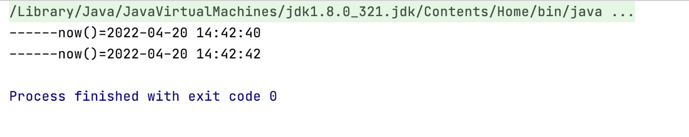

资料来源：

[线程休眠的方法有几种](https://www.toutiao.com/article/7087727266871968271/?log_from=61c74b5c7dce9_1650358439273)<br/>


## 线程休眠的五种方法

在 Java 中，让线程休眠的方法有很多，这些方法大致可以分为两类，一类是设置时间，在一段时间后自动唤醒，而另一个类是提供了一对休眠和唤醒的方法，在线程休眠之后，可以在任意时间对线程进行唤醒。

> PS：休眠是指让某个线程暂停执行（进入等待状态），唤醒指的是让某个暂停的线程继续执行

线程休眠的方法有以下 5 个：

1. Thread.sleep
2. TimeUnit
3. wait
4. Condition
5. LockSupport

其中 sleep 和 TimeUnit 是让线程休眠一段时间后自动唤醒，而 wait、Condition、LockSupport 提供了一对休眠和唤醒线程的方法，可以实现任意时刻唤醒某个线程。

### Thread.sleep

Thread.sleep 方法来自于 Thread 类，它是一个 native 本地方法，其实现源码如下：

```java
public static native void sleep(long millis) throws InterruptedException;
```

**Thread.sleep 方法需要传递一个 long 类型的毫秒数，表示 n 毫秒之后自动唤醒**，它的基础用法如下：

```java
    @Test
    public void test01() throws InterruptedException {
        System.out.println("------now()=" + DateUtil.now());
        Thread.sleep(1000L * 2);
        System.out.println("------now()=" + DateUtil.now());
    }
```

运行结果



### TimeUnit

sleep 方法因为要传递一个毫秒类型的参数，因此在设置大一点的时间时比较麻烦，比如设置 1 小时或 1 天时，此时我们就可以使用 TimeUnit 来替代 sleep 方法实现休眠。

**TimeUnit 的功能和 sleep 一样，让线程休眠 N 个单位时间之后自动唤醒**，它的基础用法如下：

```java
@Test
public void test02() throws InterruptedException {
    System.out.println("------now()=" + DateUtil.now());
    TimeUnit.SECONDS.sleep(2);
    System.out.println("------now()=" + DateUtil.now());
}
```

运行结果


查看源码：


它的底层是基于 Thread.sleep 方法实现的

### wait

wait/notify/notifyAll 都来自于 Object 类，其中：

- wait() / wait(long timeout)：表示让当前线程进入休眠状态。
- notify()：唤醒当前对象上的一个休眠线程。
- notifyAll()：唤醒当前对象上的所有休眠线程。

其中 wait() 方法表示让当前线程无限期等待下去，直到遇到 notify/notifyAll 方法时才会被唤醒，而 wait(long timeout) 表示接收一个 long 类型的超时时间，如果没有遇到 notify/notifyAll 会在 long 毫秒之后自动唤醒，如果遇到了 notify/notifyAll 方法会立即被唤醒。

```java
    @Test
    public void test03() throws InterruptedException {
        Object lock = new Object();
        new Thread(()->{
            synchronized (lock){
                System.out.println("------now()=" + DateUtil.now());
                try {
                    lock.wait();
                } catch (InterruptedException e) {
                    e.printStackTrace();
                }
                System.out.println("------now()=" + DateUtil.now());
            }
        }).start();

        Thread.sleep(1000L * 2);  // 模拟代码执行一段时间

        synchronized (lock){
            lock.notify(); // 唤醒当前对象上一个休眠线程
//            lock.notifyAll(); // 唤醒当前对象上所有休眠的线程
        }
    }
```

需要注意的是 wait/notify/notifyAll 在使用时必须要配合 synchronized 一起使用，否则程序执行会报错。

### Condition

Condition 作为 wait 的升级版，它提供的常用方法有以下几个：

- await()：让当前线程进入等待状态，直到被通知（signal）或者被中断时才会继续执行。
- awaitUninterruptibly()：让当前线程进入等待状态，直到被通知才会被唤醒，它对线程的中断通知不做响应。
- await(long time, TimeUnit unit)：在 await() 方法的基础上添加了超时时间，如果过了超时时间还没有遇到唤醒方法则会自动唤醒并恢复执行。
- awaitUntil(Date deadline)：让当前线程进入等待状态，如果没有遇到唤醒方法也会在设置的时间之后自动唤醒。
- signal()：唤醒一个等待在 Condition 上的线程。
- signalAll()：唤醒等待在 Condition 上所有的线程。

它的基本用法如下：

```java

import java.util.concurrent.locks.Condition;
import java.util.concurrent.locks.Lock;
import java.util.concurrent.locks.ReentrantLock;

@Test
public void test04() throws InterruptedException {
    // 创建锁
    final Lock lock = new ReentrantLock();
    // 创建 Condition
    final Condition condition = lock.newCondition();
    new Thread(() -> {
        System.out.println("------now()=" + DateUtil.now());
        lock.lock(); // 得到锁
        try {
            // 休眠线程
            condition.await();
        } catch (InterruptedException e) {
            e.printStackTrace();
        } finally {
            lock.unlock(); // 释放锁
        }
        System.out.println("------now()=" + DateUtil.now());
    }).start();

    Thread.sleep(2000);
    lock.lock(); // 得到锁
    try {
        condition.signal();  // 唤醒线程
    } finally {
        lock.unlock(); // 释放锁
    }
}
```

相比于 wait 方法，Condition 对象更加灵活，因为它可以在一把锁上定义多个 Condition 对象进行使用，如下代码所示：

```
 // 创建锁
final Lock lock = new ReentrantLock();
// 创建 Condition 1
final Condition condition = lock.newCondition();
// 创建 Condition 2
final Condition condition2 = lock.newCondition();
// ......
```

### LockSupport

LockSupport 是更加底层的操作线程休眠和唤醒的对象，它提供了两个常用的方法：

- LockSupport.park()：休眠当前线程。
- LockSupport.unpark(Thread thread)：唤醒一个指定的线程。

它的基础用法如下：

```
@Test
public void test05() throws InterruptedException {
    Thread thread = new Thread(() -> {
        System.out.println("------now()=" + DateUtil.now());
        LockSupport.park();     // 休眠线程
        System.out.println("------now()=" + DateUtil.now());
    });
    thread.start();

    Thread.sleep(2000);
    LockSupport.unpark(thread);   // 休眠线程
}
```

### 总结

Thread.sleep 和 TimeUnit 是让线程休眠并在一段时间后自动唤醒，而 wait、Condition、LockSupport 提供了休眠和唤醒线程的方法，其中 Condition 为 wait 方法的升级版，而 LockSupport 是更底层的让线程休眠和唤醒的方法，它可以实现唤醒某个指定的线程，这是其它方法所不具备的