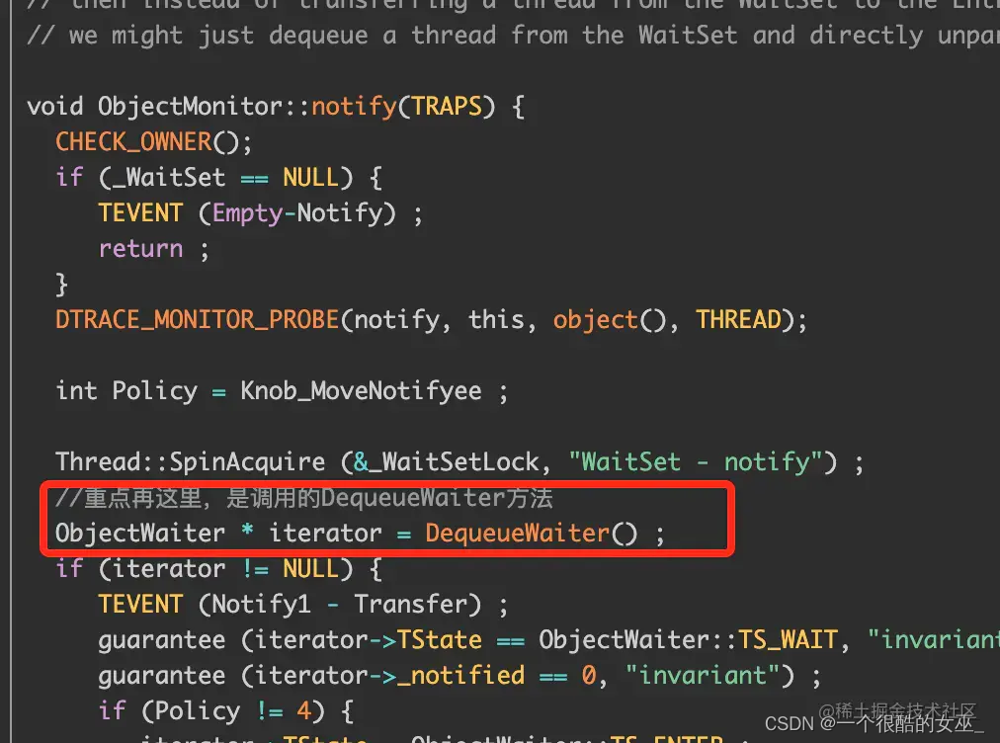
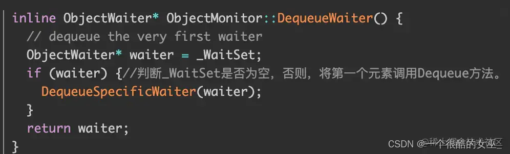

资料来源：<br/>
[多线程-线程通讯【线程的通知和唤醒wait()、notify()/notifyAll()】](https://blog.csdn.net/weixin_48271092/article/details/124308674)<br/>
[【LockSupport】线程的休眠和指定唤醒](https://blog.csdn.net/weixin_48271092/article/details/124315238?spm=1001.2101.3001.6650.1&utm_medium=distribute.pc_relevant.none-task-blog-2%7Edefault%7ECTRLIST%7ERate-1-124315238-blog-102819451.235%5Ev36%5Epc_relevant_default_base3&depth_1-utm_source=distribute.pc_relevant.none-task-blog-2%7Edefault%7ECTRLIST%7ERate-1-124315238-blog-102819451.235%5Ev36%5Epc_relevant_default_base3&utm_relevant_index=2)<br/>


## wait()、notify()/notifyAll()

**介绍**

由于多个线程之间是抢占执行的，因此线程之间执行的先后顺序难以预知，但我们在实际的开发过程中，我们希望能够合理的协调多个线程之间的执行先后顺序。
这就引出了完成这个协调工作的三个方法：

> wait()/wait(long timeout):让当前线程进入等待状态。<br/>
> notify():唤醒在当前对象上等待的一个线程<br/>
> notifyAll():唤醒在当前对象上等待的所有线程。<br/>

### wait()方法的使用

**wait()执行流程：**

> 使当前线程进入休眠状态（将线程放入等待队列中）<br/>
> 释放当前的锁<br/>
> 满足一定条件时被唤醒，重新尝试获取这个锁<br/>
> wait要搭配synchronized来使用，如果没有配合synchronized使用wait会直接抛出异常。<br/>

**wait()结束等待的条件：**

> 其他线程调用该对象的notify方法。<br/>
> wait(long timeout)等待超时。<br/>
> 其他线程调用该等待线程的interrupted方法，导致wait抛出InterruptedException异常。<br/>


**使用案例**<br/>
```java
   @lombok.SneakyThrows
    @Test
    public void test01(){
        Object lock=new Object();
        Thread t1=new Thread(()->{
            System.out.println("线程1开始执行");
            try {
                synchronized (lock) {
                    System.out.println("线程1调用wait方法...");
                    //无限期等待
//                    lock.wait();

                    // 等待时间
                    lock.wait(1000L);
                }
            } catch (InterruptedException e) {
                e.printStackTrace();
            }
            System.out.println("线程1执行完毕");
        },"线程1");
        t1.start();

        Thread.sleep(10*1000L);
    }
```

- 无限等待运行结果

```java

线程1开始执行
线程1调用wait方法...

Process finished with exit code 0
```

这样线程就会一直等待下去，所以我们需要用到唤醒方法notify()。

- 我们来看具体的代码执行效果：

  ```
  线程1开始执行
  线程1调用wait方法...
  线程1执行完毕
  ```

  

- 共同点：

> 无论是有参还是无参的wait()方法，都可以使线程进入休眠状态。<br/>
> 无论是有参还是无参的wait()方法，都可以使用notify/notifyAll来进行唤醒。<br/>

- 不同点：

> wait(long timeout)当线程超过设置时间后，会自动恢复执行;wait()会无限等待。<br/>
> 使用无参的wait方法，线程会进行waiting状态；使用有参的wait方法会进入timeid_waiting状态。<br/>

### notify()方法的使用

- notify方法是唤醒等待的线程。

> 方法notify()也需要在同步方法或者同步块中调用，该方法是用来通知那些可能等待该对象的对象锁的其他线程，对其发出notify通知，并使他们重新获取该对象的对象锁。<br/>
> 在notify()方法后，当前线程并不会立刻释放该对象锁，而是等到执行notify()方法的线程将程序执行完，也就是退出同步代码块之后才会释放该锁。

- 从上面代码的执行结果来看，可以说明我们上面提到的几个问题：

> ①notify是可以唤醒等待当前对象的对象锁一个线程 
>
> ②在唤醒其他线程之后，并不会立刻释放锁，而是等待这个唤醒线程中的程序执行完之后才释放锁。

### notify & notifyAll()

使用notifyAll()可以一次唤醒所有等待线程

```java
    @lombok.SneakyThrows
    @Test
    public void test02() {
        Object lock = new Object();
        Object lock2 = new Object();

        Thread t1 = new Thread(() -> {
            System.out.println("线程1开始执行");
            try {
                synchronized (lock) {
                    System.out.println("线程1调用wait方法...");
                    //无限期等待
                    lock.wait();
                }
            } catch (InterruptedException e) {
                e.printStackTrace();
            }
            System.out.println("线程1执行完毕");
        }, "线程1");
        t1.start();


        Thread t2 = new Thread(() -> {
            System.out.println("线程2开始执行");
            try {
                synchronized (lock) {
                    System.out.println("线程2调用wait方法...");
                    //无限期等待
                    lock.wait();
                }
            } catch (InterruptedException e) {
                e.printStackTrace();
            }
            System.out.println("线程2执行完毕");
        }, "线程2");
        t2.start();

        Thread t3 = new Thread(() -> {
            System.out.println("线程3开始执行");
            try {
                synchronized (lock) {
                    System.out.println("线程3调用wait方法...");
                    //无限期等待
                    lock.wait();
                }
            } catch (InterruptedException e) {
                e.printStackTrace();
            }
            System.out.println("线程3执行完毕");
        }, "线程3");
        t3.start();

        Thread t4 = new Thread(() -> {
            try {
                Thread.sleep(1000);
            } catch (InterruptedException e) {
                e.printStackTrace();
            }
            System.out.println("线程4：开始执行，唤醒线程");
            synchronized (lock) {

//                lock.notify();
                //发出唤醒通知 全部
                lock.notifyAll();
                System.out.println("线程4：执行唤醒操作");
                try {
                    Thread.sleep(1000);
                } catch (InterruptedException e) {
                    e.printStackTrace();
                }
                System.out.println("线程4：执行完成");
            }
        }, "线程4");
        t4.start();

        Thread.sleep(10*1000L);
    }

```

因此我们需要配合synchronized使用，Java这样设计是为了防止多线程并发执行时，程序执行混乱问题。所以java引入了锁来防止混乱问题。

### 注意

>  wait和notify如果不配合synchronized使用，在程序运行时就会报IllegalMonitorStateException非法的监视器状态异常，而且notify也不能实现程序的唤醒功能了。


notify的唤醒并不是随机的，而是从等待队列中获取第一个元素进行出队，也就是顺序唤醒的。

最主流的就是官方的JVM，也就是HotSpot虚拟机。他的源码实现在ObjectMonitor.cpp 中，具体源码如下：



`DequeueWaiter` 方法实现的源码如下：



所以这也就验证了我们上面所说的，notify的唤醒并不是随机的，而是在——waitSet中获取第一个元素进行出队唤醒。

## LockSupport

除了上篇文章中讲的，使用LockSupport也可以使线程休眠和唤醒。
主要包含两个常用方法：

- LockSupport.park():使线程进入休眠状态
- LockSupport.unpark(线程对象):指定唤醒某个线程

下面我们来看一下，这两个方法的基础使用：

### 基础使用

```java

import java.util.concurrent.locks.LockSupport;

public class LockSupport1 {
    public static void main(String[] args) throws InterruptedException {
        //线程1：LockSupport 休眠 park
        Thread t1=new Thread(()->{
            System.out.println("线程1：开始执行");
            LockSupport.park();
            System.out.println("线程1：结束执行");
        },"线程1");
        t1.start();

        Thread t2=new Thread(()->{
            System.out.println("线程2：开始执行");
            LockSupport.park();
            System.out.println("线程2：结束执行");
        },"线程2");
        t2.start();

        Thread t3=new Thread(()->{
            System.out.println("线程3：开始执行");
            LockSupport.park();
            System.out.println("线程3：结束执行");
        },"线程3");
        t3.start();

       Thread.sleep(1000);
        LockSupport.unpark(t1);

        Thread.sleep(1000);
        LockSupport.unpark(t2);

        Thread.sleep(1000);
        LockSupport.unpark(t3);
    }
}
```

执行结果

> 线程1：开始执行
> 线程2：开始执行
> 线程3：开始执行
> 线程1：结束执行
> 线程2：结束执行
> 线程3：结束执行

### LockSupport.parkUntil(long)


```java
import java.time.LocalDateTime;
import java.util.concurrent.locks.LockSupport;

public class LockSupport2 {
    public static void main(String[] args) {
        Thread t1=new Thread(()->{
            System.out.println("线程1：开始执行 |"+ LocalDateTime.now());
            LockSupport.parkUntil(System.currentTimeMillis()+1000);
            System.out.println("线程1：结束执行 |"+LocalDateTime.now());
        });
        t1.start();
    }
}
```

与wait(long timeout)类似，它并不会限等待，而是他的等待最大时间就是设置的参数。

```
线程1：开始执行 |2023-07-26T16:27:02.100
线程1：结束执行 |2023-07-26T16:27:03.109
```

### LockSupport和Interrupt

LockSupport不会直接抛出异常，但是也可以监听到Interrupt的通知，结束执行。

```java
public class LockSupport3 {
    public static void main(String[] args) throws InterruptedException {
        Thread t1=new Thread(()->{
            Thread current = Thread.currentThread();
            System.out.println("线程终止状态：" + current.isInterrupted()+" " + LocalDateTime.now());
            LockSupport.park();
            System.out.println("线程终止状态：" + current.isInterrupted()+" " + LocalDateTime.now());
        });
        t1.start();
        Thread.sleep(1000);
        System.out.println("终止线程");
        t1.interrupt();
    }
}
```

- LockSupport不需要加锁使用，而wait需要；
-  LockSupport可以指定一个线程进行唤醒，而notify不行；
-  LockSupport不会直接排除Interrupt异常，而wait会；
-  LockSupport的unpark()方法可以先于park()调用，不需要担心线程间的执行先后顺序。
以上就是LockSupport的相关知识了
