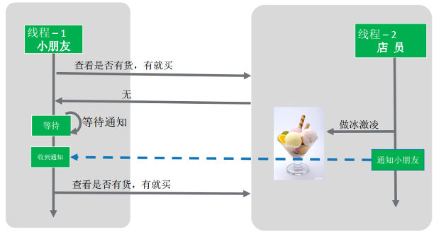

## 线程协助

JDK 提供的线程协作API 例如 suspend/ resume 、 wait/ notify 、 park / unpark 

示例： 小朋友去买冰激凌，没有冰激凌，就等着。店员发现没有冰激凌，就做了一个，通知小朋友。

### 介绍



场景介绍：

> 1.小朋友想买冰淇淋，如果有货，可以直接购买
>
> 2.如果没有，需要一直等待。当店员通知小朋友有货的时候
>
> 3.小朋友购买冰淇淋

### suspend/resume

代码举例

```java
public class ThreadNotify1 {
    Integer iceCream;

   @Test
    public void test01() throws InterruptedException {
        Thread thread = new Thread(() -> {
            if (iceCream == null) {
                System.out.println("没有冰淇淋，小朋友不开心");
                Thread.currentThread().suspend();   // 线程进行等待
            }
            System.out.println("小朋友买到冰淇淋，开心的回家了");
        });
        thread.start();

        // 线程等待
        Thread.sleep(3000L);
        iceCream = 1;
        thread.resume();
        System.out.println("通知小朋友");

        Thread.sleep(3000L);   // 防止线程结束
        System.out.println("system exit");
    }
}

```

suspend()使得线程进入阻塞状态，并且不会自动恢复，必须其对应的 resume() 被调用，才能使得线程重新进入可执行状态。


在jdk源码中，明显写着废弃

在之前的代码增加锁相关的操作，此时就会死锁


运行的结果


程序一直卡死在这里了

### wait/notify(notifyall)

代码实现

```
public class ThreadNotify3 {
    public static Integer iceCream;

    public static void main(String[] args) throws Exception {
        Object lock = new Object();

//        lock.notifyAll();
        // 开启小朋友的线程
        ChildThread cThread = new ChildThread(lock);
        cThread.start();

        // 开启工人的线程
        WorkerThread wThread = new WorkerThread(lock);
        Thread.sleep(3000L);
        wThread.start();
    }
}

class ChildThread extends Thread{
    private Object lock;

    public ChildThread(Object lock) {
        super();
        this.lock = lock;
    }

    @Override
    public void run() {
        if(ThreadNotify3.iceCream == null) {
            System.out.println("没有冰淇淋，小朋友不开心");
            synchronized (lock) {
                try {
                    lock.wait();
                } catch (InterruptedException e) {
                    e.printStackTrace();
                }
            }
            System.out.println("小朋友买到冰淇淋，开心的回家了");
        }
    }
}

class WorkerThread extends Thread{
    private Object lock;
    public WorkerThread(Object lock) {
        super();
        this.lock = lock;
    }

    public void run() {
        synchronized (lock) {
            System.out.println("通知小朋友");
            lock.notifyAll();
        }
    }
}

```
注意:
> 1、虽然会wait自动解锁，但是对顺序有要求， 如果在notify被调用之后，才开始wait方法的调用，线程会永远处于WAITING状态。
> 2、 这些方法只能由同一对象锁的持有者线程调用，也就是写在同步块里面，否则会抛出IllegalMonitorStateException异常。

调用notify时候，会进行释放锁操作

### park/unpark

代码

```
public class ThreadNotify4 {
    public  Integer iceCream;

    @Test
    public void test01() throws Exception{
        Object lock = new Object();
        Thread childThread = new Thread(()->{
            synchronized (lock) {
                if(iceCream == null) {
                    System.out.println("没有冰淇淋，小朋友不开心");
                    LockSupport.park();
                }
                System.out.println("小朋友买到冰淇淋开心的回家了");
            }
        });
        childThread.start();

        Thread.sleep(3000L);
        LockSupport.unpark(childThread);
        System.out.println("通知小朋友");
    }
}
```


线程调用park则等待“许可” ， unpark方法为指定线程提供“许可(permit)”。

注意：

> 1.调用unpark之后，再调用park，线程会直接运行
>  2.提前调用的unpark不叠加，连续多次调用unpark后，第一次调用park后会拿到“许可”直接运行，后续调用会进入等待。

### 总结

比如supend(A操作)有锁的操作，执行resume(B操作)有锁的操作。（方式一）先执行A在执行B会出现死锁，（方式二）先执行B。也会出现死锁

其他的操作，如下表

|      写作方式      | 死锁方式2（先唤醒，再挂起） | 死锁方式一（锁） | 备注                 |
| :------------: | :------------: | :------: | ------------------ |
| suspend/resume |       死锁       |    死锁    | 弃用                 |
|  wait/notify   |       死锁       |   不死锁    | 只用于synchronized关键字 |
|  park/unpark   |      不死锁       |    死锁    |                    |

