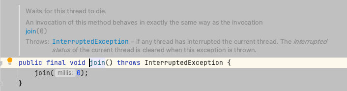

当执行多线程的时候，如果主线程运行结束，子线程还在还没有运行结束，子线程无法继续进行。此时需要阻止主线程结束

### 案例分析

子线程代码

```java
   // 执行子线程
    private Thread doChild(){
        Thread thread = new Thread(
                () -> {
                    try {
                        System.out.println("----------start");
                        System.out.println();
                        Thread.sleep(1000L * 10);
                        System.out.println("----------end");
                    } catch (InterruptedException e) {
                        e.printStackTrace();
                    }
                }
        );
        thread.start();
        return thread;
    }
```

主线程测试类

```java
@Test
public void test01(){
    doChild();
    System.out.println("执行结束了");
}
```

运行结果


从运行结果上看出，没有执行子线程的运行结束程序。

### 等待子线程结束

如果主线程没有执行完成，可以实现子线程运行结束

```java
    @Test
    public void test02(){
        Thread thread = doChild();
        System.out.println("执行结束了");
        while (thread.isAlive());   // 阻塞在这里
    }
```

### 线程休眠

通过使用线程休眠的方式，[线程的休眠的方法](java/并发编程/04线程休眠的5中方法.md)有很多种，此处只列出其中一种


```java
    @Test
    public void test03() throws InterruptedException {
        doChild();
        Thread.sleep(1000L * 20);
        System.out.println("执行结束了");
    }
```

子线程需要10秒执行完成，此处休眠20秒保证子线程的执行完成

### 线程join

```java
@Test
public void test27() throws InterruptedException {
    new Thread(
            () -> {
                try {
                    System.out.println("----------start");
                    System.out.println();
                    Thread.sleep(1000L * 10);
                    System.out.println("----------end");
                } catch (InterruptedException e) {
                    e.printStackTrace();
                }
            }
    ).start();

   Thread.currentThread().join();
}
```

从源码的注释可以看到，调用这个方法后，线程会一直阻塞在这里。直到程序结束



### CountDownLatch

通过contdownlatch框架，如果线程中没有执行countDown，程序会一直等待执行这个方法。

```java
@Test
public void test37() throws InterruptedException {
    CountDownLatch latch = new CountDownLatch(1);
    new Thread(
            () -> {
                try {
                    System.out.println("----------start");
                    System.out.println();
                    Thread.sleep(1000L * 10);
                    System.out.println("----------end");
                    latch.countDown();     // 如果不执行countDown方法，线程会一直阻塞
                } catch (InterruptedException e) {
                    e.printStackTrace();
                }
            }
    ).start();

    latch.await();
}
```
