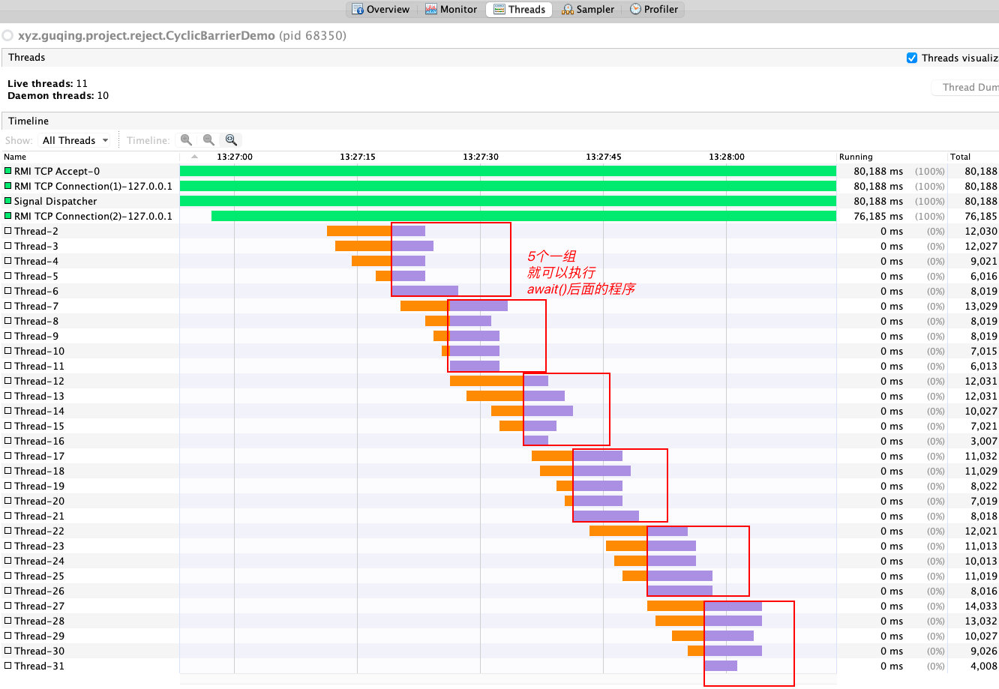

资料来源:<br/>
[CountDownLatch：别浪，等人齐再团](https://www.toutiao.com/article/6945655940335059489/?log_from=1fe6a9abeacb5_1650432031427) <br/>
[CyclicBarrier：人齐了，老司机就可以发车了](https://www.toutiao.com/article/6948963911949484556/?log_from=ba48146da0694_1650432109441) <br/>
[Semaphore自白：限流器用我就对了](https://www.toutiao.com/article/6953417246953800200/?log_from=0e26b35710b8d_1650432147091) <br/>
[java并发编程（十九）Semaphore、CountdownLatch和CyclicBarrier你都玩过吗？](https://www.jianshu.com/p/316e4b513fce)<br/>
[JAVA多线程--信号量(Semaphore)](https://my.oschina.net/cloudcoder/blog/362974)<br/>


## 多线程分析工具VisualVM

window版本JDK中自带的工具，而mac版本需要安装

下载地址：https://visualvm.github.io/index.html


下载完成以后，需要进行配置安装


配置文件jd路径


## countDownLatch

**实现原理**

CountDownLatch 中 count down 是倒数的意思，latch 则是门闩的含义。整体含义可以理解为倒数的门栓，似乎有点“321，芝麻开门”的感觉，CountDownLatch 的作用也正是如此。

**CountDownLatch 在创建的时候需要传入一个整数，在这个整数“倒数”到 0 之前，主线程需要一直挂起等待，直到其他的线程都执行之后，主线才能继续执行。**

**执行流程**

CountDownLatch 的实现是在其内部创建并维护了一个 volatile 类型的整数计数器，当调用 countDown() 方法时，会尝试将整数计数器 -1，当调用 wait() 方法时，当前线程就会判断整数计数器是否为 0，如果为 0，则继续往下执行，如果不为 0，则使当前线程进入等待状态，直到某个线程将计数器设置为 0，才会唤醒在 await() 方法中等待的线程继续执行。

CountDownLatch是基于AQS的阻塞工具，阻塞一个或者多个线程，直到所有的线程都执行完成。

**常用的方法**

~~~~java
// 线程被挂起直到 count 值为 0 才继续执行
public void await() throws InterruptedException { };   

// 和 await() 类似，只不过等待一定的时间后 count 值还没变为 0 的话就会继续执行
public boolean await(long timeout, TimeUnit unit) throws InterruptedException { };  

// 将 count 值减 1
public void countDown() { }; 
~~~~

**使用案例**

```java
import cn.hutool.core.date.DateUtil;
import cn.hutool.core.util.RandomUtil;

import java.util.concurrent.CountDownLatch;
import java.util.concurrent.ExecutorService;
import java.util.concurrent.Executors;
import java.util.concurrent.TimeUnit;

public class CountLatchDemo {

    public static void main(String[] args) throws InterruptedException {
        TimeUnit.SECONDS.sleep(20);

        // 创建一个线程池，用来执行线程
        ExecutorService threadPool = Executors.newFixedThreadPool(5);
        // 只能5个线程同时执行
        CountDownLatch latch = new CountDownLatch(5);

        // 创建5个线程
        for (int i = 0; i < 5; i++) {
            final int NO = i;
            Runnable runnable = new Runnable() {
                @Override
                public void run() {
                    try {
                        System.out.println("Accessing: " + NO);

                        Long r2 = (long) RandomUtil.randomInt(3000, 8000);
                        Thread.sleep(r2);
                        System.out.println("Finish: " + NO);
                        latch.countDown();
                    } catch (Exception e) {
                        e.printStackTrace();
                    }
                }
            };
            Long r1 = (long) RandomUtil.randomInt(0, 3000);
            Thread.sleep(r1);   // 随机休眠0-3秒
            threadPool.execute(runnable);  // 随机0-3秒，每个线程的开始执行的时间不同。
        }

        latch.await();
        System.out.println("所有线程都执行完成！" + DateUtil.now());
        Thread.sleep(1000L * 10);
        System.out.println("休眠结束：" + DateUtil.now());
        threadPool.shutdown();
    }
}
```

执行的结果：

 

线程的时序图


countdownLatch：常被称作`门栓`, 用来进行线程的同步协作，等待所有线程到达后，在执行后续操作。

通过构造方法指定线程数量，

> 主线程使用`await()`进行等待线程到达
>
> 工作线程使用`countDown()`进行报到，也就是让计数减一。

##  CyclicBarrier栅栏

CyclicBarrier 作用是让一组线程相互等待，当达到一个共同点时，所有之前等待的线程再继续执行，且 CyclicBarrier 功能可重复使用。<br/>


程序代码

```java
import cn.hutool.core.date.DateUtil;
import cn.hutool.core.util.RandomUtil;

import java.util.concurrent.*;

public class CyclicBarrierDemo {

    public static void main(String[] args) throws Exception {
        TimeUnit.SECONDS.sleep(20);

        // 只能5个线程同时执行
        CyclicBarrier cyclicBarrier = new CyclicBarrier(5);

        // 创建30个线程
        for (int i = 0; i < 30; i++) {
            final int NO = i;
            Runnable runnable = new Runnable() {
                @Override
                public void run() {
                    try {
                        cyclicBarrier.await();
                        System.out.println("Accessing: " + NO);

                        Long r2 = (long) RandomUtil.randomInt(3000, 8000);
                        Thread.sleep(r2);
                        System.out.println("Finish: " + NO);

                    } catch (Exception e) {
                        e.printStackTrace();
                    }
                }
            };
            Long r1 = (long) RandomUtil.randomInt(0, 3000);
            Thread.sleep(r1);   // 随机休眠0-3秒
           new Thread(runnable).start();
        }

        System.out.println("所有线程都执行完成！" + DateUtil.now());
        Thread.sleep(1000L * 10);
        System.out.println("休眠结束：" + DateUtil.now());

        Thread.currentThread().join();
    }
}
```

此处的代码，没有采用线程池。使用线程池，如果有空闲的线程，线程池会复用之前的线程。观察线程效果不够直观，我采用每次创建新的线程的方式。

!> 到达5个就可以执行



**实现原理**

我们先来看下 CyclicBarrier 的类图：


由上图可知 CyclicBarrier 是基于独占锁 ReentrantLock 实现的，其底层也是基于 AQS 的。

在 CyclicBarrier 类的内部有一个计数器 count，当 count 不为 0 时，每个线程在到达屏障点会先调用 await 方法将自己阻塞，此时计数器会减 1，直到计数器减为 0 的时候，所有因调用 await 方法而被阻塞的线程就会被唤醒继续执行。当 count 计数器变成 0 之后，就会进入下一轮阻塞，此时 parties（parties 是在 new CyclicBarrier(parties) 时设置的值）会将它的值赋值给 count 从而实现复用。


## Semaphore信号量

​        信号量(Semaphore)，有时被称为信号灯，是在多线程环境下使用的一种设施, 它负责协调各个线程, 以保证它们能够正确、合理的使用公共资源。

​        一个计数信号量。从概念上讲，信号量维护了一个许可集。如有必要，在许可可用前会阻塞每一个 acquire()，然后再获取该许可。每个 release() 添加一个许可，从而可能释放一个正在阻塞的获取者。但是，不使用实际的许可对象，Semaphore 只对可用许可的号码进行计数，并采取相应的行动。拿到信号量的线程可以进入代码，否则就等待。通过acquire()和release()获取和释放访问许可。

```java
public class SemaphoreDemo {

    // https://my.oschina.net/cloudcoder/blog/362974
    public static void main(String[] args) {
        // 线程池
        ExecutorService exec = Executors.newCachedThreadPool();
        // 只能4个线程同时访问
        final Semaphore semp = new Semaphore(4);
        // 模拟30个客户端访问
        for (int index = 0; index < 30; index++) {
            final int NO = index;
            Runnable run = new Runnable() {
                public void run() {
                    try {
                        // 获取许可
                        semp.acquire();
                        System.out.println("Accessing: " + NO);
                        Thread.sleep((long) (Math.random() * 1000) + 5000); // 休眠的是 5-6 秒之间的随机数
                        // 访问完后，释放
                        semp.release();
                        //availablePermits()指的是当前信号灯库中有多少个可以被使用
                        System.out.println("-----------------" + semp.availablePermits());
                    } catch (InterruptedException e) {
                        e.printStackTrace();
                    }
                }
            };
            exec.execute(run);
        }
        // 退出线程池
        exec.shutdown();
    }
}
```

上面的代码的可以看出，线程执行的代码是休眠，只要观察线程池的紫色的部分

红色竖线表示每个时间点，可以看出，最多只有四个和紫色的重叠

!> 每个时间点最多有4个线程在执行中


如果 信号量(Semaphore)最多四个，也就说四个线程可以获取许可，当有线程释放许可后，其他线程，才可以拿到许可，只要拿到许可后。才能执行

> acquire()获取许可
> release() 释放

案例分析：

>   Semaphore实现的功能就类似厕所有5个坑，假如有10个人要上厕所，那么同时只能有多少个人去上厕所呢？同时只能有5个人能够占用，当5个人中 的任何一个人让开后，其中等待的另外5个人中又有一个人可以占用了。另外等待的5个人中可以是随机获得优先机会，也可以是按照先来后到的顺序获得机会，这取决于构造Semaphore对象时传入的参数选项。单个信号量的Semaphore对象可以实现互斥锁的功能，并且可以是由一个线程获得了“锁”，再由另一个线程释放“锁”，这可应用于死锁恢复的一些场合。


