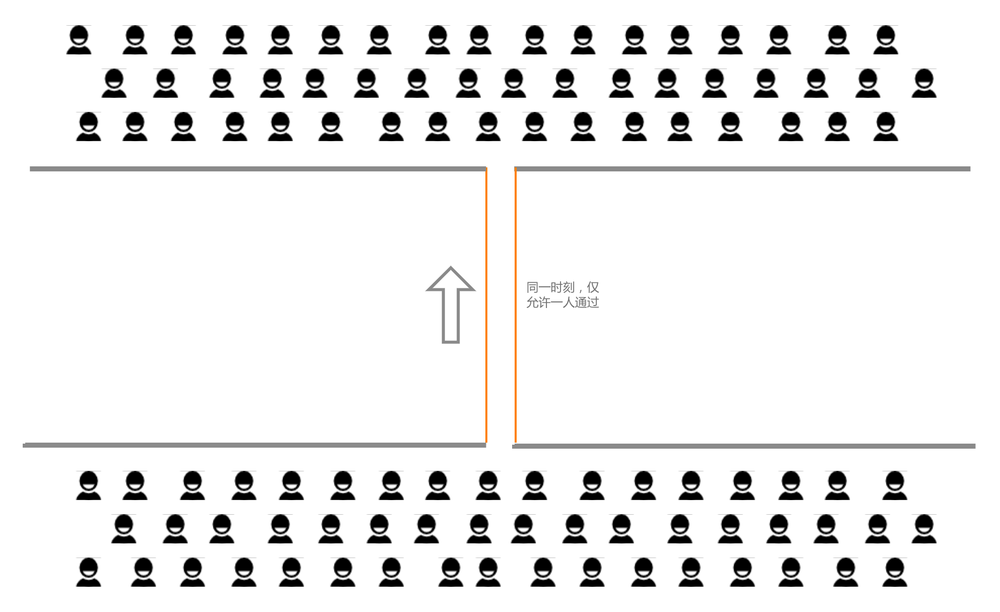
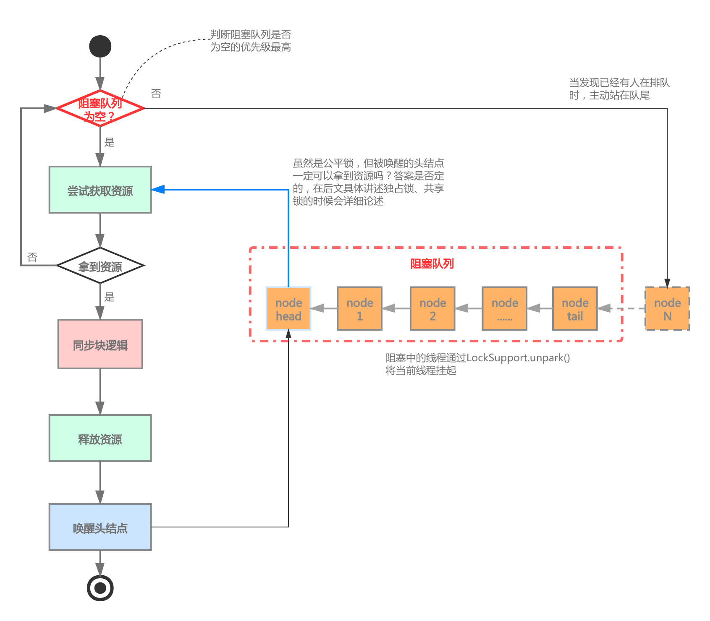
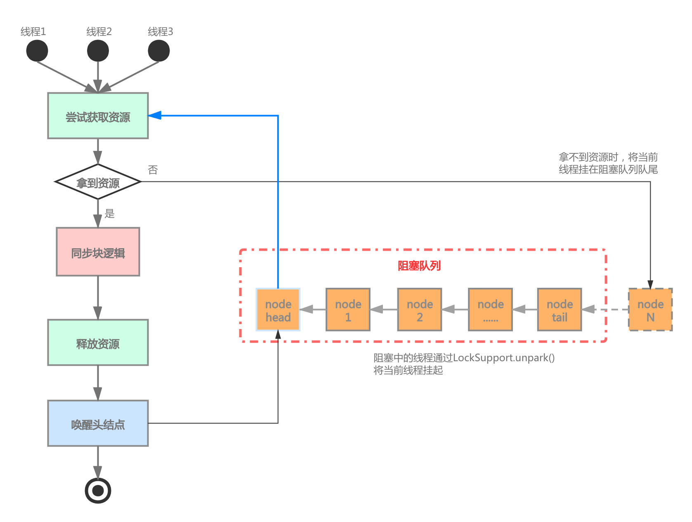
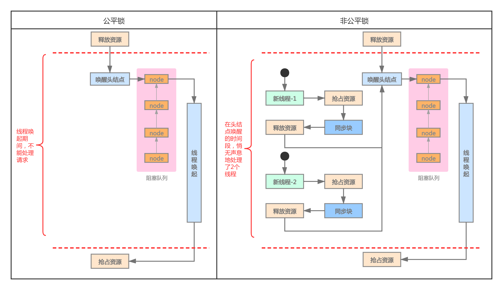
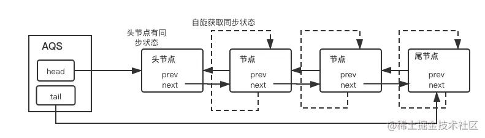
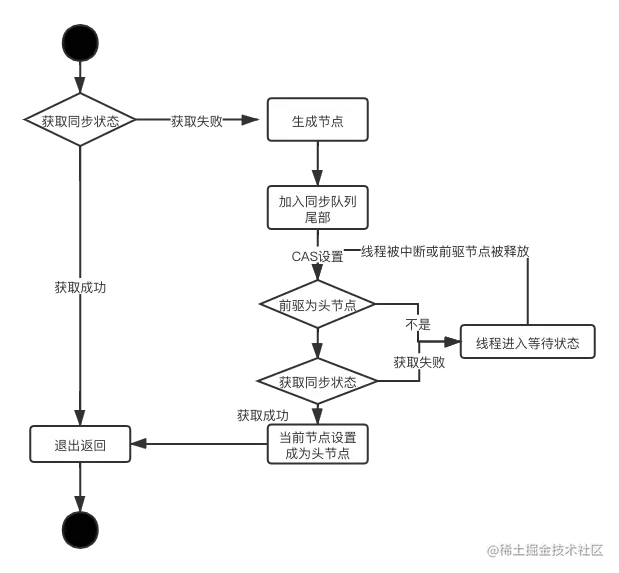

资料来源:<br/>
[AQS 详细介绍](https://zhuanlan.zhihu.com/p/378219920)<br/>
[JUC源码分析—AQS (基于java11)](https://www.jianshu.com/p/a8d27ba5db49)<br/>
[五千字详细讲解并发编程的AQS.md](https://github.com/yehongzhi/learningSummary/blob/master/%E5%B9%B6%E5%8F%91%E7%BC%96%E7%A8%8B%E7%9A%84%E8%89%BA%E6%9C%AF/%E4%BA%94%E5%8D%83%E5%AD%97%E8%AF%A6%E7%BB%86%E8%AE%B2%E8%A7%A3%E5%B9%B6%E5%8F%91%E7%BC%96%E7%A8%8B%E7%9A%84AQS.md)<br/>
[JUC并发编程02——AQS源码剖析](https://www.toutiao.com/article/7175332221471965730/?app=news_article&timestamp=1670687164&use_new_style=1&req_id=202212102346042AF7C96DBF45344B976F&group_id=7175332221471965730&share_token=B1DED9F3-448E-409D-9A39-FD070E92CEE8&tt_from=weixin&utm_source=weixin&utm_medium=toutiao_ios&utm_campaign=client_share&wxshare_count=1&source=m_redirect)<br/>
[深入理解Java并发框架AQS系列（二）：AQS框架简介及锁概念](https://www.cnblogs.com/xijiu/p/14522224.html)


## 各种锁

相信大家经常会被各种各样锁的定义搞乱，叫法儿也五花八门，为了后续行文的方便，此章我们把一些锁概念阐述一下

### 2.1、独占锁



独占锁，顾名思义，即在同一时刻，仅允许一个线程执行同步块代码。好比一伙儿人想要过河，但只有一根独木桥，且只能承受一人的重量

JDK支持的典型独占锁：`ReentrantLock`、`ReentrantReadWriteLock`

### 2.2、共享锁


共享锁其实是相对独占锁而言的，涉及到共享锁就要聊到并发度，即同一时刻最多允许同时执行线程的数量。上图所述的并发度为3，即在同一时刻，最多可有3个人在同时过河。

但共享锁的并发度也可以设置为1，此时它可以看作是独占锁

JDK支持的典型独占锁：`Semaphore`、`CountDownLatch`

### 2.3、公平锁



虽然叫做公平锁，但我们知道任何事情都是相对的，此处也不例外，我们也只能做到相对公平，后文会涉及，此处不再赘述

线程在进入时，首先要检查阻塞队列中是否为空，如果发现已有线程在排队，那么主动添加至队尾并等待被逐一唤起；如果发现阻塞队列为空，才会尝试去获取资源。公平锁相对非公平锁效率较低，通常来讲，加锁时间越短，表现越明显

### 2.4、非公平锁



任何一个刚进入的线程，都会尝试去获取资源，释放资源后，还会通知头节点去尝试获取资源，这样可能导致饥饿发生，即某一个阻塞队列中的线程一直得不到调度。

那为什么我们会说，非公平锁的效率要高于公平锁呢？假设一个独占锁，阻塞队列中已经有10个线程在排队，线程A抢到资源并执行完毕后，去唤醒头结点head，head线程唤醒需要时间，head唤醒后才尝试去获取资源，而在整个过程中，没有线程在执行加锁代码


因为线程唤起需要引发用户态及内核态的切换，故是一个相对比较耗时的操作。

我们再举一个不恰当的例子：行政部在操场上为同学们办理业务，因为天气炎热，故让排队的同学在场边一个凉亭等待，凉亭距离业务点约300米，且无法直接看到业务点，需要等待上一个办理完毕的同学来通知。假定平均办理一个业务耗时约30秒

- 公平锁：所有新来办理业务的同学都被告知去排队，上一个办理完业务的同学需要去300米外通知下一个同学，来回600米的路程（线程唤醒）预估耗时2分钟，在这2分钟里，因为没有同学过来办理业务，业务点处于等待状态

- 非公平锁：新来办理业务的同学首先看一下业务点是否有人正在在办理，如果有人正在办理，那么主动进入排队，如果办理点空闲，那么直接开始办理业务。明显非公平锁更高效，队首的同学接到通知，过来办理的时间片内，业务点可能已经处理了2个同学的业务

AQS框架是支持公平、非公平两种模式的，使用者可以根据自身的情况做选择，而Java中的内置锁`synchronized`是非公平锁

### 2.5、可重入锁

即某个线程获取到锁后、在释放锁之前，再次尝试获取锁，能成功获取到，不会出现死锁，便是可重入锁；需要注意的是，加锁次数需要跟释放次数一样

`synchronized`、`ReentrantLock`均为可重入锁

### 2.6、偏向锁 / 轻量级锁 / 重量级锁

之所以将这三个锁放在一起论述，是因为它们都是`synchronized`引入的概念，为了描述流畅，我们把它们放在一起

- **偏向锁：**JVM设计者发现，在大多数场景中，在同一时刻争抢`synchronized`锁只有一个线程，而且总是被这一个线程反复加锁、解锁；故引入偏向锁，且向对象头的`MarkWord`部分中， 标记上线程id，值得一提的是，在线程加锁结束后，并没有解锁的动作，这样带来的好处首先是少了一次CAS操作，其次当这个线程再次尝试加锁时，仅仅比较`MarkWord`部分中的线程id与当前线程的id是否一致，如果一致则加锁成功。偏向锁因此而得名，它偏向于占有它的线程，对其非常友好。当上一个线程释放锁后，如果有另一个线程尝试加锁，偏向锁会重新偏向新的线程。而当一个线程正占有锁，又有一个新的线程试图加锁时，便进入了轻量级锁
- **轻量级锁：**所谓轻量级锁，是针对重量级锁而言的，这个阶段也有人叫自旋锁。其本质就是不会马上挂起线程，而是反复重试10（可使用参数-XX:PreBlockSpin来修改）次。因为线程挂起、唤醒也是相当耗时的，在锁并发不高、加锁时间短时，采用自旋可以得到更好的效果，具体可以参考1.2章的测试用例
- **重量级锁：**线程挂起并进入阻塞队列，等待被唤醒

这3层锁是逐级膨胀的，且过程不可回逆，即某个锁一旦进入重量级锁，便不可回退至轻量级锁或偏向锁。虽然`synchronized`不是本文的重点，但既然提起来了，我们可以把其特性简单罗列一下

## AQS介绍

`AQS` 的全称为（`AbstractQueuedSynchronizer`），这个类在` java.util.concurrent.locks` 包下面。

谈到并发编程，不得不说`AQS(AbstractQueuedSynchronizer)`，这可谓是`Doug Lea`老爷子的大作之一。`AQS`即是抽象队列同步器，是用来构建`Lock`锁和同步组件的基础框架，很多我们熟知的锁和同步组件都是基于`AQS`构建，比如`ReentrantLock`、`ReentrantReadWriteLock`、`CountDownLatch`、`Semaphore`。


实际上AQS是一个抽象类，我们不妨先看一下源码：

```java
public abstract class AbstractQueuedSynchronizer extends AbstractOwnableSynchronizer implements java.io.Serializable {
	//头结点
    private transient volatile Node head;
    //尾节点
    private transient volatile Node tail;
    //共享状态
    private volatile int state;
    
    //内部类，构建链表的Node节点
	static final class Node {
        volatile Node prev;
        volatile Node next;
        volatile Thread thread;
    }
}
//AbstractQueuedSynchronizer的父类
public abstract class AbstractOwnableSynchronizer implements java.io.Serializable {
    //占用锁的线程
    private transient Thread exclusiveOwnerThread;
}
```



**AQS 核心思想是，如果被请求的共享资源空闲，则将当前请求资源的线程设置为有效的工作线程，并且将共享资源设置为锁定状态。如果被请求的共享资源被占用，那么就需要一套线程阻塞等待以及被唤醒 时锁分配的机制，这个机制 AQS 是用 CLH 队列锁实现的，即将暂时获取不到锁的线程加入到队列中。**


由源码可以看出AQS是有以下几个部分组成的：



### state共享变量

AQS中里一个很重要的字段state，表示同步状态，是由`volatile`修饰的，用于展示当前临界资源的获锁情况。通过getState()，setState()，compareAndSetState()三个方法进行维护。

```java
private volatile int state;

protected final int getState() {
    return state;
}
protected final void setState(int newState) {
    state = newState;
}
//CAS操作
protected final boolean compareAndSetState(int expect, int update) {
    return unsafe.compareAndSwapInt(this, stateOffset, expect, update);
}
```

关于state的几个要点：

- 使用volatile修饰，保证多线程间的可见性。
- getState()、setState()、compareAndSetState()使用final修饰，限制子类不能对其重写。
- compareAndSetState()采用乐观锁思想的CAS算法，保证原子性操作。

### CLH队列

AQS里另一个重要的概念就是CLH队列，它是一个双向链表队列，其内部由head和tail分别记录头结点和尾结点，队列的元素类型是Node。


简单讲一下这个队列的作用，就是当一个线程获取同步状态(state)失败时，AQS会将此线程以及等待的状态等信息封装成Node加入到队列中，同时阻塞该线程，等待后续的被唤醒。

队列的元素就是一个个的Node节点，下面讲一下Node节点的组成：

```java
static final class Node {
	//共享模式下的等待标记
    static final Node SHARED = new Node();
	//独占模式下的等待标记
    static final Node EXCLUSIVE = null;
    //表示当前节点的线程因为超时或者中断被取消
    static final int CANCELLED =  1;
	//表示当前节点的后续节点的线程需要运行，也就是通过unpark操作
    static final int SIGNAL    = -1;
	//表示当前节点在condition队列中
    static final int CONDITION = -2;
	//共享模式下起作用，表示后续的节点会传播唤醒的操作
    static final int PROPAGATE = -3;
	//状态，包括上面的四种状态值，初始值为0，一般是节点的初始状态
    volatile int waitStatus;
	//上一个节点的引用
    volatile Node prev;
	//下一个节点的引用
    volatile Node next;
	//保存在当前节点的线程引用
    volatile Thread thread;
	//condition队列的后续节点
    Node nextWaiter;
}
```

### exclusiveOwnerThread

AQS通过继承`AbstractOwnableSynchronizer`类，拥有的属性。表示独占模式下同步器的持有者。

## AQS的实现原理

AQS有两种模式，分别是独占式和共享式。


### 独占式

同一时刻仅有一个线程持有同步状态，也就是其他线程只有在占有的线程释放后才能竞争，比如**ReentrantLock**。下面从源码切入，梳理独占式的实现思路。


首先看acquire()方法，这是AQS在独占模式下获取同步状态的方法。

```java
public final void acquire(int arg) {
    if (!tryAcquire(arg) &&
        acquireQueued(addWaiter(Node.EXCLUSIVE), arg))
        selfInterrupt();
}
```

先讲这个方法的总体思路：

- tryAcquire()尝试直接去获取资源，如果成功则直接返回。
- 如果失败则调用addWaiter()方法把当前线程包装成Node(状态为EXCLUSIVE，标记为独占模式)插入到CLH队列末尾。
- 然后acquireQueued()方法使线程阻塞在等待队列中获取资源，一直获取到资源后才返回，如果在整个等待过程中被中断过，则返回true，否则返回false。
- 线程在等待过程中被中断过，它是不响应的。只是获取资源后才再进行自我中断selfInterrupt()，将中断补上。

我们展开来分析，看tryAcquire()方法，尝试获取资源，成功返回true，失败返回false。

```java
//直接抛出异常，这是由子类进行实现的方法，体现了模板模式的思想
protected boolean tryAcquire(int arg) {
    throw new UnsupportedOperationException();
}
```

为什么没有具体实现呢，其实这是模板模式的思想。这个方法是尝试获取资源，但是获取资源的方式有很多种实现，比如**公平锁有公平锁的获取方式，非公平锁有非公平锁的获取方式**(后面会讲，别急)。所以这里是一个没有具体实现的方法，需要由子类去实现。

接着看addWaiter()方法，这个方法的作用是把当前线程包装成Node添加到队列中。

```java
private Node addWaiter(Node mode) {
    //把当前线程包装成Node节点
    Node node = new Node(Thread.currentThread(), mode);
    //获取到尾结点
    Node pred = tail;
    //判断尾结点是否为null，如果不为空，那就证明队列已经初始化了
    if (pred != null) {
        //已经初始化了，就直接把Node节点添加到队列的末尾
        node.prev = pred;
        if (compareAndSetTail(pred, node)) {
            pred.next = node;
            //返回包含当前线程的节点Node
            return node;
        }
    }
    //如果队列没有初始化，那就调用enq()方法
    enq(node);
    return node;
}
```

接着我们看enq()方法，就是一个自旋的操作，把传进来的node添加到队列最后，如果队列没有初始化则进行初始化。

```java
private Node enq(final Node node) {
    //自旋操作，也就是死循环，只有加入队列成功才会return
    for (;;) {
        //把尾结点赋值给t
        Node t = tail;
        //如果为空，证明没有初始化，进行初始化
        if (t == null) { // Must initialize
            //创建一个空的Node节点，并且设置为头结点
            if (compareAndSetHead(new Node()))
                //然后把头结点赋值给尾结点
                tail = head;
        } else {
            //如果是第一次循环为空，就已经创建了一个一个Node，那么第二次循环就不会为空了
            //如果尾结点不为空，就把传进来的node节点的前驱节点指向尾结点
            node.prev = t;
            //cas原子性操作，把传进来的node节点设置为尾结点
            if (compareAndSetTail(t, node)) {
                //把原来的尾结点的后驱节点指向传进来的node节点
                t.next = node;
                return t;
            }
        }
    }
}
```

接着我们再把思路跳回去顶层的方法，看acquireQueued()方法。

```java
//在队列中的节点node通过acquireQueued()方法获取资源，忽略中断。
final boolean acquireQueued(final Node node, int arg) {
    boolean failed = true;
    try {
        boolean interrupted = false;
        //自旋的操作，一个死循环
        for (;;) {
            //获取传进来的node节点的前驱节点，赋值给p
            final Node p = node.predecessor();
            //如果p是头结点，node节点就是第二个节点，则再次去尝试获取资源
            if (p == head && tryAcquire(arg)) {
                //tryAcquire(arg)获取资源成功的话，则把node节点设置为头结点
                setHead(node);
                //把原来的头结点p的后驱节点设置为null，等待GC垃圾回收
                p.next = null; // help GC
                failed = false;
                return interrupted;
            }
            //如果p不是头结点，或者tryAcquire()获取资源失败，判断是否可以被park，也就是把线程阻塞起来
            if (shouldParkAfterFailedAcquire(p, node) &&
                parkAndCheckInterrupt())//&&前面如果返回true，将当前线程阻塞并检查是否被中断
                //如果阻塞过程中被中断，则置interrupted标志位为true。
                interrupted = true;
        }
    } finally {
        if (failed)
            cancelAcquire(node);
    }
}
```

最后是selfInterrupt()方法，自我中断。

```java
static void selfInterrupt() {
    Thread.currentThread().interrupt();
}
```

过程记不住没关系，下面画张图来总结一下，其实很简单。

### 共享式

即共享资源可以被多个线程同时占有，直到共享资源被占用完毕。比如ReadWriteLock和CountdownLatch。下面我们从源码去分析其实现原理。

首先还是看最顶层的acquireShared()方法。

```java
public final void acquireShared(int arg) {
    if (tryAcquireShared(arg) < 0)
        doAcquireShared(arg);
}
```

这段代码很简单，首先调用tryAcquireShared()方法，tryAcquireShared返回是一个int数值，当返回值大于等于0的时候，说明获得成功获取锁，方法结束，否则返回负数，表示获取同步状态失败，执行doAcquireShared方法。

tryAcquireShared()方法是一个模板方法由子类去重写，意思是需要如何获取同步资源由实现类去定义，AQS只是一个框架。

那么就看如果获取资源失败，执行的doAcquireShared()方法。

```java
private void doAcquireShared(int arg) {
    //调用addWaiter()方法，把当前线程包装成Node，标志为共享式，插入到队列中
    final Node node = addWaiter(Node.SHARED);
    boolean failed = true;
    try {
        boolean interrupted = false;
        for (;;) {
            //获取当前节点node的前驱节点
            final Node p = node.predecessor();
            //前驱节点是否是头结点
            if (p == head) {
                //如果前驱节点是头结点，则调用tryAcquireShared()获取同步资源
                int r = tryAcquireShared(arg);
                //r>=0表示获取同步资源成功，只有获取成功，才会执行到return退出for循环
                if (r >= 0) {
                    //设置node为头结点
                    setHeadAndPropagate(node, r);
                    p.next = null; // help GC
                    if (interrupted)
                        selfInterrupt();
                    failed = false;
                    return;
                }
            }
            //判断是否可以被park，跟独占式的逻辑一样返回true，则进行park操作，阻塞线程
            if (shouldParkAfterFailedAcquire(p, node) &&
                parkAndCheckInterrupt())
                interrupted = true;
        }
    } finally {
        if (failed)
            cancelAcquire(node);
    }
}
```

这段逻辑基本上跟独占式的逻辑差不多，不同的地方在于入队的Node是标志为SHARED共享式的，获取同步资源的方式是tryAcquireShared()方法。

## AQS的模板模式

模板模式在AQS中的应用可谓是一大精髓，在上文中有提到的tryAcquireShared()和tryAcquire()都是很重要的模板方法。一般使用AQS往往都是使用一个内部类继承AQS，然后重写相应的模板方法。

AQS已经把一些常用的，比如入队，出队，CAS操作等等构建了一个框架，使用者只需要实现获取资源，释放资源的，因为很多锁，还有同步器，其实就是获取资源和释放资源的方式有比较大的区别。

那么我们看一下模板方法有哪些。

### tryAcquire()

tryAcquire()方法，独占式获取同步资源，返回true表示获取同步资源成功，false表示获取失败。

```java
protected boolean tryAcquire(int arg) {
    throw new UnsupportedOperationException();
}
```

###  tryRelease()

tryRelease()方法，独占式使用，tryRelease()的返回值来判断该线程是否已经完成释放资源，子类来决定是否能成功释放锁。

```java
protected boolean tryRelease(int arg) {
    throw new UnsupportedOperationException();
}
```

### tryAcquireShared()

tryAcquireShared()方法，共享式获取同步资源，返回大于等于0表示获取资源成功，返回小于0表示失败。

```java
protected int tryAcquireShared(int arg) {
    throw new UnsupportedOperationException();
}
```

### tryReleaseShared()

tryReleaseShared()方法，共享式尝试释放资源，如果释放后允许唤醒后续等待结点返回true，否则返回false。

```java
protected boolean tryReleaseShared(int arg) {
	throw new UnsupportedOperationException();
}
```

###  isHeldExclusively()

isHeldExclusively()方法，该线程是否正在独占资源。只有用到condition才需要去实现它。

```java
protected boolean isHeldExclusively() {
    throw new UnsupportedOperationException();
}
```

下一篇[10_02ReentrantLock原理](java/并发编程/10_02ReentrantLock原理.md)，AQS应用