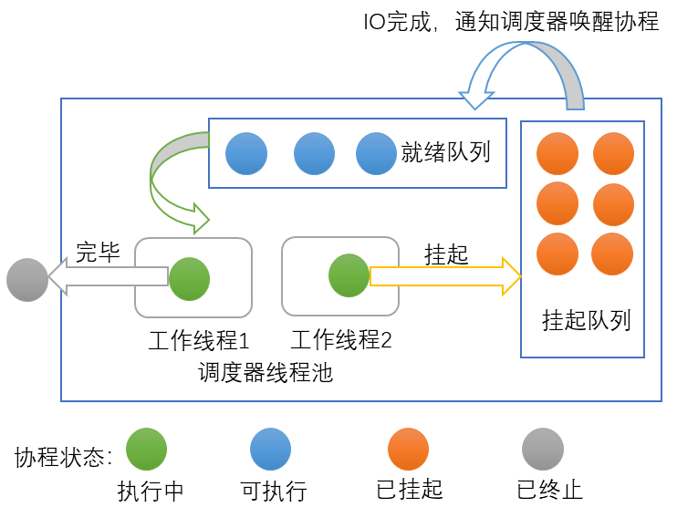
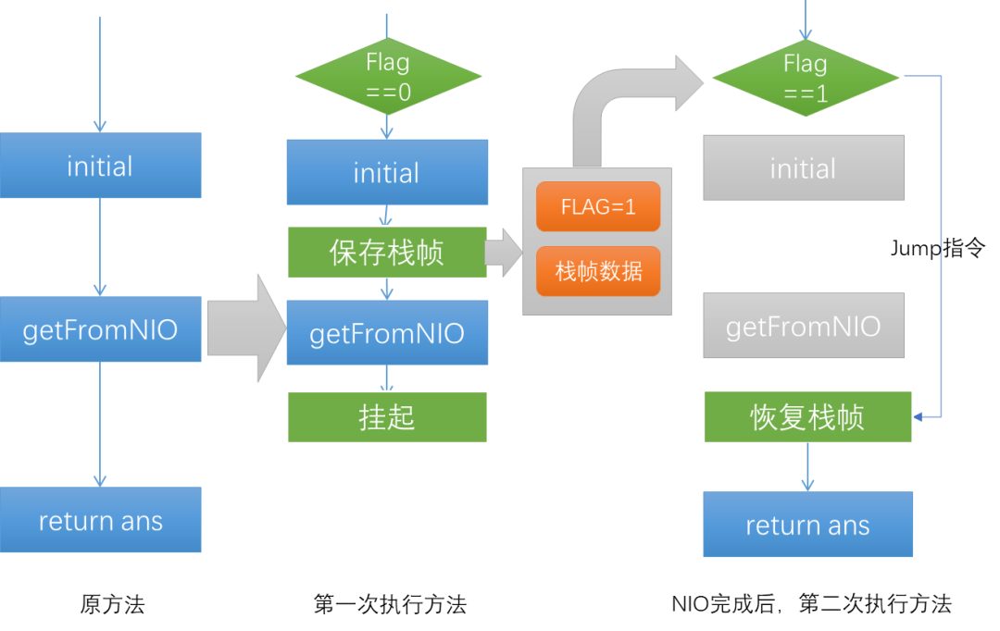
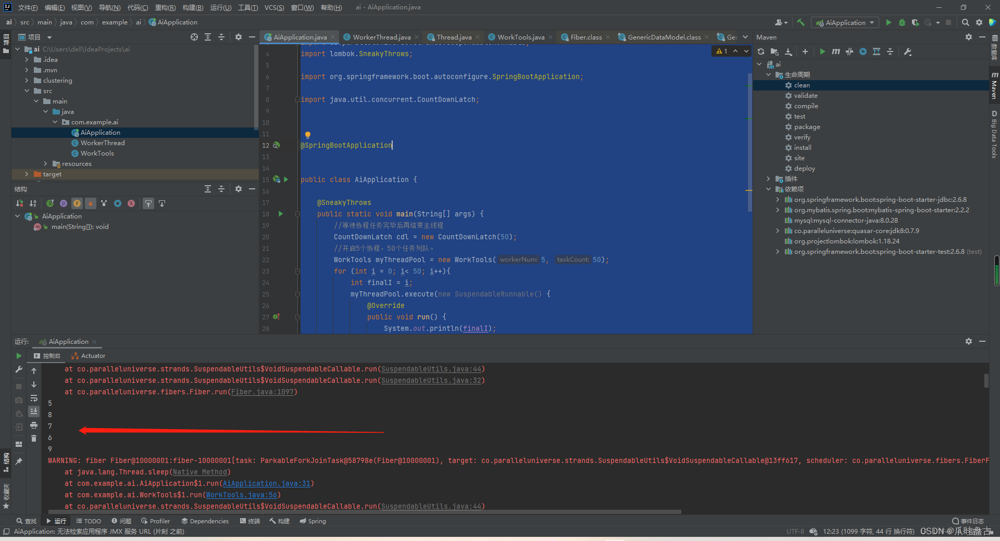
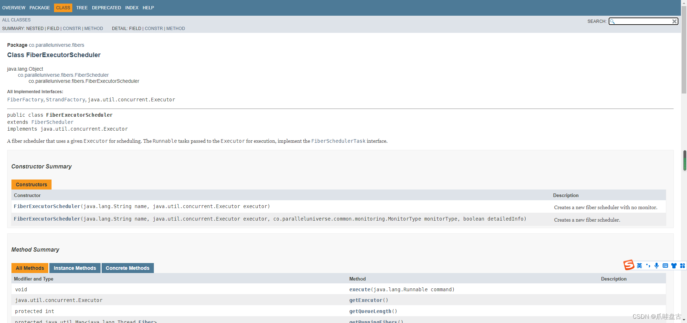
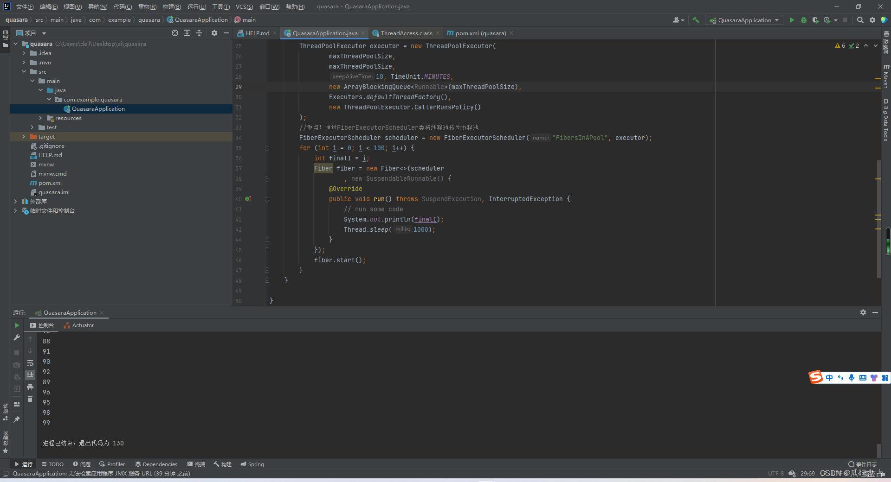
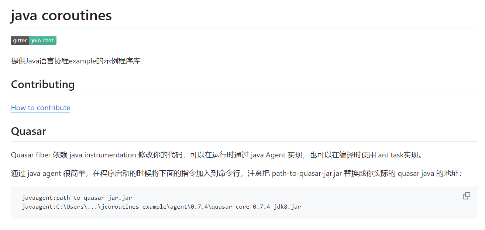
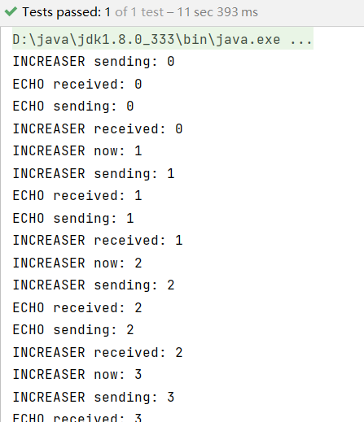

资料来源：<br/>
[干货 | 携程基于Quasar协程的NIO实践](https://blog.csdn.net/ctrip_tech/article/details/108138106)<br/>
[java基于quasar实现协程池](https://blog.csdn.net/weixin_47723549/article/details/125377215)<br/>
[java基于quasar实现协程池【后篇】](https://blog.csdn.net/weixin_47723549/article/details/125534140)

## 协程

### 介绍

IO密集型系统在高并发场景下，会有大量线程处于阻塞状态，性能低下，JAVA上成熟的非阻塞IO（NIO）技术可解决该问题。目前Java项目对接NIO的方式主要依靠回调，代码复杂度高，降低了代码可读性与可维护性。近年来Golang、Kotlin等语言的协程（Coroutine）能达到高性能与可读性的兼顾。

本文利用开源的Quasar框架提供的协程对系统进行NIO改造，解决以下两个问题：

1）提升单机任务的吞吐量，保证业务请求突增时系统的可伸缩性。

2）使用更轻量的协程同步等待IO，替代处理NIO常用的异步回调。

### 概念

协程是一种进程自身来调度任务的调度模式。协程与线程不同之处在于，线程由内核调度，而协程的调度是进程自身完成的。协程只是一种抽象，最终的执行者是线程，每个线程只能同时执行一个协程，但大量的协程可以只拥有少量几个线程执行者，协程的调度器负责决定当前线程在执行那个协程，其余协程处于休眠并被调度器保存在内存中。

和线程类似，协程挂起时需要记录栈信息，以及方法执行的位置，这些信息会被协程调度器保存。协程从挂起到重新被执行不需要执行重量级的内核调用，而是直接将状态信息还原到执行线程的栈，高并发场景下，协程极大地避免了切换线程的开销。下图展示了协程调度器内部任务的流转。



协程中调用的方法是可以挂起的。不同于线程的阻塞会使线程休眠，协程在等待异步任务的结果时，会通知调度器将自己放入挂起队列，释放占用的线程以处理其他的协程。异步任务完毕后，通过回调将异步结果告知协程，并通知调度器将协程重新加入就绪队列执行。

### Quasar任务调度原理

Quasar（https://github.com/puniverse/quasar）是一个开源的Java协程框架，通过利用Java instrument技术对字节码进行修改，使方法挂起前后可以保存和恢复JVM栈帧，方法内部已执行到的字节码位置也通过增加状态机的方式记录，在下次恢复执行可直接跳转至最新位置。以如下方法为例，该方法分为两步，第一步为initial初始化，第二部为通过NIO获取网络响应。

```java
public String instrumentDemo(){
    initial();
    String ans = getFromNIO();
    return ans;
}
```



Quasar会在initial前增加一个flag字段，表明当前方法执行的位置。第一次执行方法时，检查到flag为0，修改flag为1并继续往下执行initial方法。执行getFromNIO方法前插入字节码指令将栈帧中的数据全部保存在一个Quasar自定义的栈结构中，在执行getFromNIO后，挂起协程，让出线程资源。直至NIO异步完成后，协程调度器将第二次执行该方法，检测到flag为1，将会调用jump指令跳转到returnans语句前，并将保存的栈结构还原到当前栈中，最后调用人return ans语句，方法执行完毕。在项目中添加Quasar依赖后，可以使用Fiber类新建协程。建立的方法与线程类似。

```javascript
new Fiber(()->{
    //方法体
}).start();
```

### 废话不多说，直接上代码：

导入包：

```xml
        <dependency>
            <groupId>co.paralleluniverse</groupId>
            <artifactId>quasar-core</artifactId>
            <version>0.7.9</version>
            <classifier>jdk8</classifier>
        </dependency>
```

```java
package com.example.ai;
 
import co.paralleluniverse.fibers.Fiber;
import co.paralleluniverse.fibers.SuspendExecution;
import co.paralleluniverse.strands.SuspendableRunnable;
 
import java.util.concurrent.ArrayBlockingQueue;
 
 
public class WorkTools {
    //协程池中默认协程的个数为5
    private static int WORK_NUM = 5;
    //队列默认任务为100
    private static int TASK_COUNT = 100;
 
    //工做协程数组
    private Fiber[] workThreads;
    //等待队列
    private final ArrayBlockingQueue<SuspendableRunnable> taskQueue;
 
    //用户在构造这个协程池时，但愿启动的协程数
    private final int workerNum;
 
 
    //构造方法：建立具备默认协程个数的协程池
    public WorkTools() {
        this(WORK_NUM,TASK_COUNT);
    }
 
    //建立协程池,workNum为协程池中工做协程的个数
    public WorkTools(int workerNum, int taskCount) {
        if (workerNum <= 0) {
            workerNum = WORK_NUM;
        }
        if (taskCount <= 0) {
            taskCount = TASK_COUNT;
        }
        this.workerNum = workerNum;
        taskQueue = new ArrayBlockingQueue(taskCount);
        workThreads = new Fiber[workerNum];
        for (int i = 0; i < workerNum; i++) {
            int finalI = i;
            workThreads[i] = new Fiber<>(new SuspendableRunnable() {
                @Override
                public void run() throws SuspendExecution, InterruptedException {
                    SuspendableRunnable runnable = null;
                    while (true){
                        try{
                            //取任务，没有则阻塞。
                            runnable = taskQueue.take();
                        }catch (Exception e){
                            System.out.println(e.getMessage());
                        }
                        //存在任务则运行。
                        if(runnable != null){
                            runnable.run();
                        }
 
                        runnable = null;
                    }
                }
            });  //new一个工做协程
 
            workThreads[i].start();  //启动工做协程
 
        }
 
        Runtime.getRuntime().availableProcessors();
    }
    //执行任务，其实就是把任务加入任务队列，何时执行由协程池管理器决定
    public void execute(SuspendableRunnable task) {
        try {
            taskQueue.put(task);   //put:阻塞接口的插入
        } catch (Exception e) {
            // TODO: handle exception
            System.out.println("阻塞");
        }
    }
    //销毁协程池,该方法保证全部任务都完成的状况下才销毁全部协程，不然等待任务完成再销毁
    public void destory() {
        //工做协程中止工做，且置为null
        System.out.println("ready close thread...");
        for (int i = 0; i < workerNum; i++) {
 
            workThreads[i] = null; //help gc
        }
        taskQueue.clear();  //清空等待队列
    }
    //覆盖toString方法，返回协程信息：工做协程个数和已完成任务个数
    @Override
    public String toString() {
        return "WorkThread number:" + workerNum + " ==分割线== wait task number:" + taskQueue.size();
    }
}

```

测试代码：

```java
package com.example.ai;
 
import co.paralleluniverse.strands.SuspendableRunnable;
import lombok.SneakyThrows;
 
import org.springframework.boot.autoconfigure.SpringBootApplication;
 
import java.util.concurrent.CountDownLatch;
 
 
 
@SpringBootApplication
 
 
public class AiApplication {
 
    @SneakyThrows
    public static void main(String[] args) {
        //等待协程任务完毕后再结束主线程
        CountDownLatch cdl = new CountDownLatch(50);
        //开启5个协程，50个任务列队。
        WorkTools myThreadPool = new WorkTools(5, 50);
        for (int i = 0; i< 50; i++){
            int finalI = i;
            myThreadPool.execute(new SuspendableRunnable() {
                @Override
                public void run() {
                    System.out.println(finalI);
                    try {
                        //延迟1秒
                        Thread.sleep(1000);
                        cdl.countDown();
                    } catch (InterruptedException e) {
                        System.out.println("阻塞中");
                    }
                }
            });
 
        }
        //阻塞
        cdl.await();
    }
 
}
```



### quasar协程池

**quasar纤程文档**：[FiberExecutorScheduler (Quasar 0.8.0)](http://docs.paralleluniverse.co/quasar/javadoc/co/paralleluniverse/fibers/FiberExecutorScheduler.html)



在该文档中我发现了FiberExecutorScheduler类，这个类将是本文阐述quasar协程池的正确打开方式！【全是泪】

分析经历：我一直对Quasar及其轻质纤维替代Threads感到好奇。那么quasar本身是否有自己的纤程池呢？于是看是翻阅文档，找吧挨个看吧！


**每个光纤调度器调度的光纤，当您创建不带调度器的光纤时，将创建一个FiberForkJoinScheduler并将其分配给该光纤。**

简而言之，如果要管理线程池中的光纤，请使用**FiberExecutorScheduler**：
Quasar关于调度光纤的文档

```java
        //线程池任务数量
        int maxThreadPoolSize = 10;
        ThreadPoolExecutor executor = new ThreadPoolExecutor(
                maxThreadPoolSize,
                maxThreadPoolSize,
                10, TimeUnit.MINUTES,
                new ArrayBlockingQueue<Runnable>(maxThreadPoolSize),
                Executors.defaultThreadFactory(),
                new ThreadPoolExecutor.CallerRunsPolicy()
        );
        //重点！通过FiberExecutorScheduler类将线程池传为协程池
        FiberExecutorScheduler scheduler = new FiberExecutorScheduler("FibersInAPool", executor);
        for (int i = 0; i < 100; i++) {
            int finalI = i;
            Fiber fiber = new Fiber<>(scheduler
                    , new SuspendableRunnable() {
                @Override
                public void run() throws SuspendExecution, InterruptedException {
                    // run some code
                    System.out.println(finalI);
                    Thread.sleep(1000);
                }
            });
            fiber.start();
        }
```

这个操作看着可能会很奇怪，一个纤程池干嘛要利用线程池来加载使用？这可能与java底层本身不支持协程有关吧【猜】，不过通过这种形式也有好处就是可以直接通过开始的线程池的一些功能。方便了使用习惯（无非就是创建个线程池通过FiberExecutorScheduler来改为协程池进行协程操作），这样对于springboot的bean也会更友好的实现了吧！毕竟是通过线程池创建bean！



**不会出现阻塞警告了**

 

 光纤非常便宜，因此您根本不需要池(及其异步作业调度模型)：只需启动光纤，并在每次需要新的顺序进程与其他进程同时运行时让其运行常规顺序代码即可。

当然它也支持类似go的管道【看文档】，可以自行开发你的业务逻辑。

```java
package testgrp;
 
import java.util.concurrent.ExecutionException;
 
import co.paralleluniverse.strands.SuspendableCallable;
import co.paralleluniverse.strands.SuspendableRunnable;
import co.paralleluniverse.strands.channels.Channels;
import co.paralleluniverse.strands.channels.IntChannel;
 
import co.paralleluniverse.fibers.Fiber;
import co.paralleluniverse.fibers.SuspendExecution;
 
/**
 * Increasing-Echo Quasar Example
 *
 * @author circlespainter
 */
public class QuasarIncreasingEchoApp {
    static public Integer doAll() throws ExecutionException, InterruptedException {
        final IntChannel increasingToEcho = Channels.newIntChannel(0); // Synchronizing channel (buffer = 0)
        final IntChannel echoToIncreasing = Channels.newIntChannel(0); // Synchronizing channel (buffer = 0)
 
        Fiber<Integer> increasing = new Fiber<>("INCREASER", new SuspendableCallable<Integer>() { @Override public Integer run() throws SuspendExecution, InterruptedException {
            // The following is enough to test instrumentation of synchronizing methods
            // synchronized(new Object()) {}
 
            int curr = 0;
            for (int i = 0; i < 10 ; i++) {
                Fiber.sleep(10);
                System.out.println("INCREASER sending: " + curr);
                increasingToEcho.send(curr);
                curr = echoToIncreasing.receive();
                System.out.println("INCREASER received: " + curr);
                curr++;
                System.out.println("INCREASER now: " + curr);
            }
            System.out.println("INCREASER closing channel and exiting");
            increasingToEcho.close();
            return curr;
        } }).start();
 
        Fiber<Void> echo = new Fiber<Void>("ECHO", new SuspendableRunnable() { @Override public void run() throws SuspendExecution, InterruptedException {
            Integer curr;
            while (true) {
                Fiber.sleep(1000);
                curr = increasingToEcho.receive();
                System.out.println("ECHO received: " + curr);
 
                if (curr != null) {
                    System.out.println("ECHO sending: " + curr);
                    echoToIncreasing.send(curr);
                } else {
                    System.out.println("ECHO detected closed channel, closing and exiting");
                    echoToIncreasing.close();
                    return;
                }
            }
        } }).start();
 
        try {
            increasing.join();
            echo.join();
        } catch (ExecutionException e) {
            e.printStackTrace();
        } catch (InterruptedException e) {
            e.printStackTrace();
        }
 
        return increasing.get();
    }
 
    static public void main(String[] args) throws ExecutionException, InterruptedException {
        doAll();
    }
}
```

我们大java真是无所不能，通过这次实践也是让我倍感骄傲！以后谁也别说什么java不支持协程了~

**注意：**

这里的代码是无法直接运行的。我在网上找了很久,这类的代码很少。终于在[github上找到了代码](https://github.com/reactivegroup/jcoroutines-example/blob/e6de9bd6eac506e099717afed8a60a0027f008da/README.md)



配置方法


