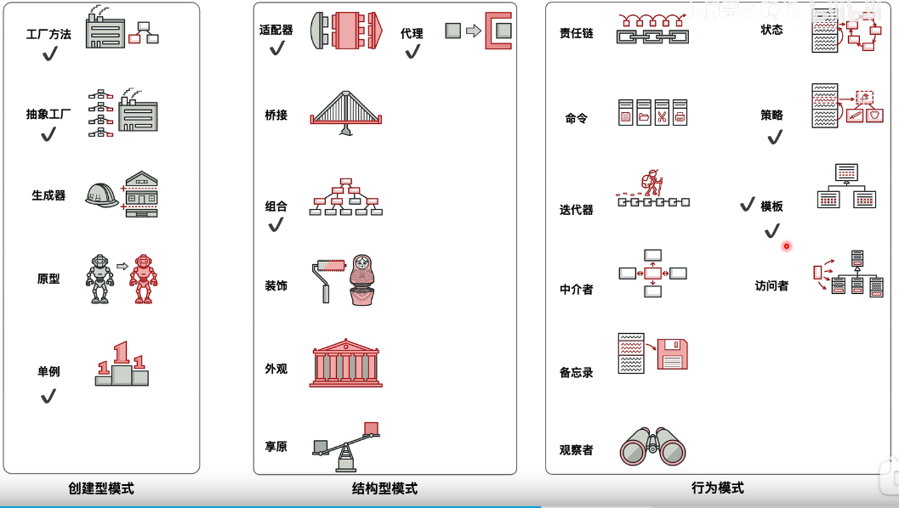

资料来源： 
[归斯君的博客](https://www.cnblogs.com/EthanWong/)

## 设计模式
#### 设计模式分为三大类：

创建型模式，共五种：工厂方法模式、抽象工厂模式、单例模式、建造者模式、原型模式 
结构型模式，共七种：适配器模式、装饰者模式、代理模式、外观模式、桥接模式、组合模式、享元模式。 
行为型模式，共十一种：策略模式、模板方法模式、观察者模式、迭代子模式、责任链模式、命令模式、备忘录模式、状态模式、访问者模式、中介者模式、解释器模式。 
其实还有两类：并发型模式和线程池模式。 

 

#### 设计模式的六大原则：

#### 总原则－开闭原则

对扩展开放，对修改封闭。在程序需要进行拓展的时候，不能去修改原有的代码，而是要扩展原有代码，实现一个热插拔的效果。所以一句话概括就是：为了使程序的扩展性好，易于维护和升级。 
想要达到这样的效果，我们需要使用接口和抽象类等，后面的具体设计中我们会提到这点。

**1、单一职责原则**

不要存在多于一个导致类变更的原因，也就是说每个类应该实现单一的职责，否则就应该把类拆分。

**2、里氏替换原则（Liskov Substitution Principle）**

任何基类可以出现的地方，子类一定可以出现。里氏替换原则是继承复用的基石，只有当衍生类可以替换基类，软件单位的功能不受到影响时，基类才能真正被复用，而衍生类也能够在基类的基础上增加新的行为。

里氏代换原则是对“开-闭”原则的补充。实现“开闭”原则的关键步骤就是抽象化。而基类与子类的继承关系就是抽象化的具体实现，所以里氏代换原则是对实现抽象化的具体步骤的规范。里氏替换原则中，子类对父类的方法尽量不要重写和重载。因为父类代表了定义好的结构，通过这个规范的接口与外界交互，子类不应该随便破坏它。

**3、依赖倒转原则（Dependence Inversion Principle）**

面向接口编程，依赖于抽象而不依赖于具体。写代码时用到具体类时，不与具体类交互，而与具体类的上层接口交互。

**4、接口隔离原则（Interface Segregation Principle）**

每个接口中不存在子类用不到却必须实现的方法，如果不然，就要将接口拆分。使用多个隔离的接口，比使用单个接口（多个接口方法集合到一个的接口）要好。

**5、迪米特法则（最少知道原则）（Demeter Principle）**

一个类对自己依赖的类知道的越少越好。无论被依赖的类多么复杂，都应该将逻辑封装在方法的内部，通过public方法提供给外部。这样当被依赖的类变化时，才能最小的影响该类。

最少知道原则的另一个表达方式是：只与直接的朋友通信。类之间只要有耦合关系，就叫朋友关系。耦合分为依赖、关联、聚合、组合等。我们称出现为成员变量、方法参数、方法返回值中的类为直接朋友。局部变量、临时变量则不是直接的朋友。我们要求陌生的类不要作为局部变量出现在类中。

**6、合成复用原则（Composite Reuse Principle）**

尽量首先使用合成/聚合的方式，而不是使用继承。

之前已经陆续整理了9种设计模式，链接如下，接下来一段时间陆续把剩余的过一遍，整理出来，理解设计模式还是很重要的。

创建型模式：工厂方法模式、抽象工厂模式、单例模式、建造者模式、原型模式

结构型模式：适配器模式、装饰者模式、代理模式、外观模式、桥接模式、组合模式、享元模式

行为型模式：策略模式、模板方法模式、观察者模式、迭代子模式、责任链模式、命令模式、备忘录模式、状态模式、访问者模式、中介者模式、解释器模式

还有两类：并发型模式和线程池模式。
> ———————————————— 
版权声明：本文为CSDN博主「炸斯特」的原创文章，遵循CC 4.0 BY-SA版权协议，转载请附上原文出处链接及本声明。
原文链接：https://blog.csdn.net/jason0539/article/details/44956775

Stone_直截了当 
https://www.jianshu.com/u/7ca2156a092c

## 类型介绍

### [一、创建型模式（Creational Pattern）](https://www.cnblogs.com/EthanWong/p/16139205.html#一创建型模式creational-pattern)

创建型关注的是**对象的创建过程**，描述的是如**何将对象的创建和使用分离**，对用户隐藏类的实例的创建细节。从而降低系统的耦合度，让设计方案更易于修改和扩展。

GOF设计模式中，创建型模式包含五种模式，主要有工厂方法模式、抽象工厂模式、单例模式、原型模式和建造者模式。我在整理时加上了简单工厂模式。

具体六种设计模式如下：

1. [**设计模式学习笔记（二）工厂模式、模板模式和策略模式介绍以及混合使用**](https://www.cnblogs.com/EthanWong/p/16045901.html)
2. [**设计模式学习笔记（三）简单工厂、工厂方法和抽象工厂之间的区别**](https://www.cnblogs.com/EthanWong/p/16051333.html)
3. [**设计模式学习笔记（四）单例模式的实现方式和使用场景**](https://www.cnblogs.com/EthanWong/p/16059987.html)
4. [**设计模式学习笔记（五）建造者模式和其他对象创建方式的区别**](https://www.cnblogs.com/EthanWong/p/16061499.html)
5. [**设计模式学习笔记（六）原型模式以及深浅拷贝的区别**](https://www.cnblogs.com/EthanWong/p/16064223.html)

### 二、[结构型模式（Structural Pattern）](https://www.cnblogs.com/EthanWong/p/16139205.html#二结构型模式structural-pattern)

结构型关注的是**如何将类或对象结合在一起形成更大的结构**。不同的结构型模式从不同的角度来进行组合。它们尽可能满足各种面向对象设计原则的同时为类或对象的组合提供一系列解决方案。

GOF设计模式中，结构性模式包含七种模式，主要有适配器模式（Adapter Pattern）、桥接模式（Bridge Pattern）、组合模式（Composite Pattern）、装饰模式（Decorator Pattern）、外观模式（Façade Pattern）、享元模式（Flyweight Pattern）和代理模式（Proxy Pattern）。具体介绍如下：

1. [**设计模式学习笔记（七）代理模式以及动态代理的实现**](https://www.cnblogs.com/EthanWong/p/16067185.html)
2. [**设计模式学习笔记（八）适配器模式介绍及其应用**](https://www.cnblogs.com/EthanWong/p/16074455.html)
3. [**设计模式学习笔记（九）桥接模式及其应用**](https://www.cnblogs.com/EthanWong/p/16079803.html)
4. [**设计模式学习笔记（十）装饰器模式及其应用**](https://www.cnblogs.com/EthanWong/p/16084623.html)
5. [**设计模式学习笔记（十一）外观模式及其应用场景**](https://www.cnblogs.com/EthanWong/p/16089698.html)
6. [**设计模式学习笔记（十二）享元模式及其在String、Java 包装类中的应用**](https://www.cnblogs.com/EthanWong/p/16094850.html)
7. [**设计模式学习笔记（十三）组合模式及其在树形结构中的应用**](https://www.cnblogs.com/EthanWong/p/16096090.html)

### 三、[行为型模式（Behavioral Pattern）](https://www.cnblogs.com/EthanWong/p/16139205.html#三行为型模式behavioral-pattern)

行为型模式关注的是系统中对象之间的交互，描述程序在运行时复杂的流程控制，即**多个类或对象之间如何协作完成单个对象无法单独完成的任务**。

行为型模式分为类行为模式和对象行为模式

- **类行为模式**：采用集成机制来在类间分派行为
- **对象行为模式**：采用组合或聚合在对象间分配行为

GOF设计模式中主要有11种，分别是模板方法模式（Template Method Pattern）、策略模式（Strategy Pattern）、命令模式（Command Pattern）、职责链模式（Chain of Responsibility Pattern）、状态模式（State Pattern）、观察者模式（Observer Pattern）、中介者模式（Mediator Pattern）、迭代器模式（Iterator Pattern）、访问者模式（Visitor Pattern）、备忘录模式（Memento Pattern）和解释器模式（Interpreter Pattern）。具体内容如下

1. [**设计模式学习笔记（二）工厂模式、模板模式和策略模式介绍以及混合使用**](https://www.cnblogs.com/EthanWong/p/16045901.html)
2. [**设计模式学习笔记（十四）责任链模式实现及在Filter中的应用**](https://www.cnblogs.com/EthanWong/p/16101006.html)
3. [**设计模式学习笔记（十五）命令模式及在Spring JdbcTemplate 中的实现**](https://www.cnblogs.com/EthanWong/p/16104549.html)
4. [**设计模式学习笔记（十六）迭代器模式及其在Java 容器中的应用**](https://www.cnblogs.com/EthanWong/p/16109790.html)
5. [**设计模式学习笔记（十七）中介者模式及其应用场景**](https://www.cnblogs.com/EthanWong/p/16114898.html)
6. [**设计模式学习笔记（十八）备忘录模式及其实现**](https://www.cnblogs.com/EthanWong/p/16120243.html)
7. [**设计模式学习笔记（十九）观察者模式及应用场景**](https://www.cnblogs.com/EthanWong/p/16121385.html)
8. [**设计模式学习笔记（二十）状态模式及其实现**](https://www.cnblogs.com/EthanWong/p/16127258.html)
9. [**设计模式学习笔记（二十一）访问者模式及其实现**](https://www.cnblogs.com/EthanWong/p/16129687.html)
10. [**设计模式学习笔记（二十二）解释器模式及其实现**](https://www.cnblogs.com/EthanWong/p/16135855.html)