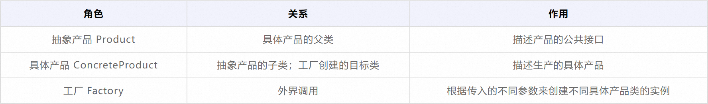
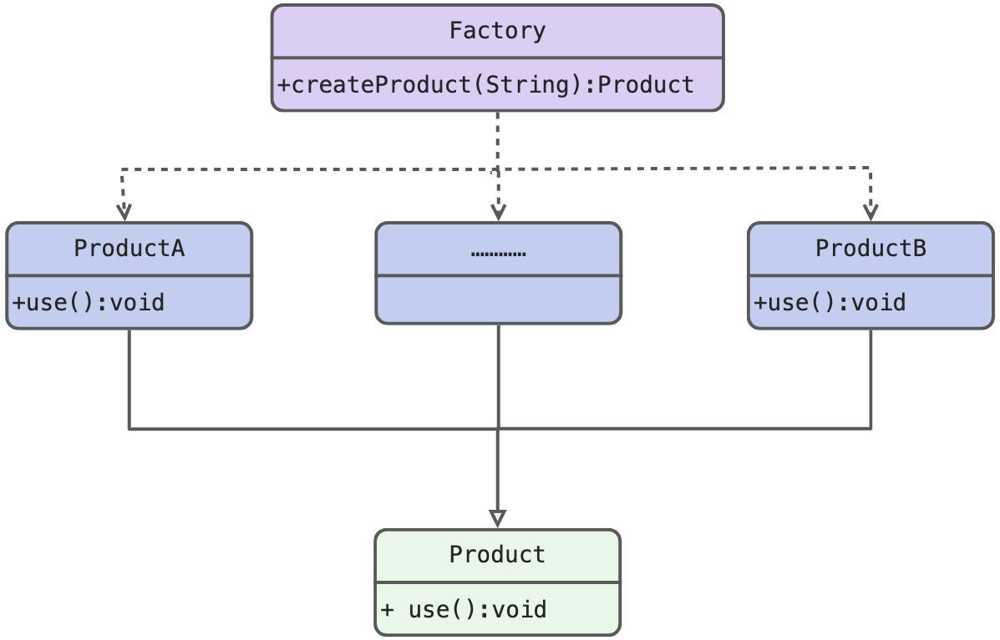
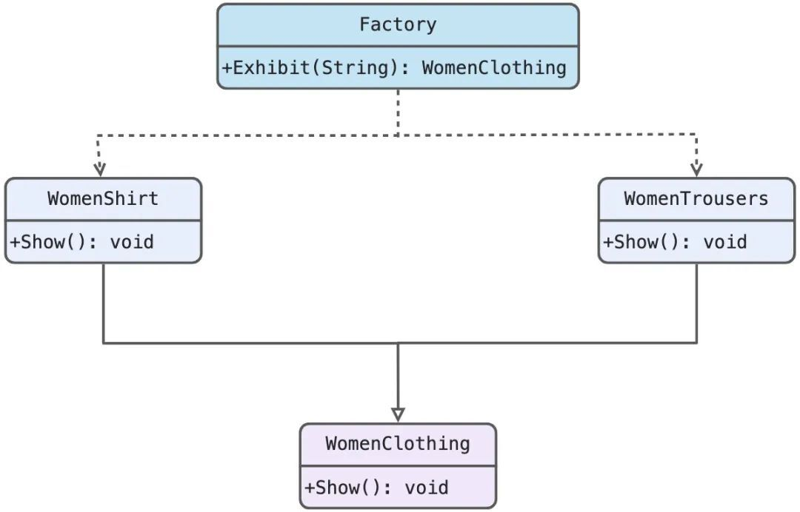

资料来源：<br/>
[设计模式详解之工厂模式](https://blog.csdn.net/AlibabaTech1024/article/details/130867147)

### 工厂模式

顾名思义，简单工厂模式是最简单的一种工厂模式，它定义了一个负责生产对象的工厂类，使用者可以根据不同参数来创建并返回不同子类，这些子类都共用一个接口（即父类）。

结构
简单工厂模式包含三种类，分别是抽象产品类、具体产品类、工厂类，下面分别对各类及它们之间的关系作进一步说明。





#### 使用


有了上述的基本概念，我们将简单工厂模式的使用步骤概括为：

- step1：创建抽象产品类，并为具体产品定义好一个接口；
- step2：创建具体产品类，其通过接口来继承抽象产品类，同时也要定义计划生产的每一个具体产品；
- step3：创建工厂类，其创建的静态方法可以对传入的不同参数做出响应；
- step4：外界使用者就能调用工厂类的静态方法了，通过传入不同参数来创建不同具体产品类的实例。

下面以淘宝服装店铺的商品展示销售进行阐释，比如一个衬衫专卖店需要在淘宝上展示旗下商品，我们可以把所有衬衫都分别单独定义一个类，这样就可以随意添加或修改某一个新的衬衫类型，并使用Fcatory类来判断要创建哪一个衬衫类型的对象，即：先声明一个父类对象的变量，再根据用户输入的参数判断新建什么具体的衬衫类型对象。

#### **代码实现**

```csharp
//step1:创建抽象产品类，定义具体产品的公共接口
public abstract class Shirt{
    public abstract void Show();
}
​
//step2:创建具体产品类（继承抽象产品类），定义生产的具体产品
//具体产品类A，女款衬衫
public class WomenShirt extends Shirt{
    @Override
    public void Show(){
        System.out.println("展示女款衬衫");
    }
}
//具体产品类B，男款
public class MenShirt extends Shirt{
    @Overside
    public void Show(){
        System.out.println("展示男款衬衫")；
        }
}

//step3:创建工厂类，通过静态方法处理不同传入参数，从而创建不同具体产品类的实例
public class Factory{
    public static Shirt Exhibit(String ShirtName){
        switch(ShirtName){
            case "女款衬衫":
                return new WomenShirt();
            case "男款衬衫":
                return new MenShirt();
            default:
                return null;
        }
    }
}

//step4:外界调用工厂类的静态方法，传入不同参数创建不同具体产品类的实例
public class SimpleFactoryPattern{
    public static void main(String[] args){
        Factory exhibitFactory = new Factory();
        //用户搜索女款衬衫
        try{
            //调用工厂类的静态方法，传入参数并创建实例
            exhibitFactory.Exhibit("女款衬衫").Show();
        }catch(NullPointerException e){
            System.out.println("没有找到商品");
        }
        //用户搜索男款裤子
        try{
            exhibitFactory.Exhibit("男款裤子").Show();
        }catch(NullPointerException e){
            System.out.println("没有找到商品");
        }
        //用户搜索男款衬衫
        try{
            exhibitFactory.Exhibit("男款衬衫").Show();
        }catch(NullPointerException e){
            System.out.println("没有找到商品");
        }
    }
}
```

**结果输出**

```undefined
展示女款衬衫
没有找到商品
展示男款衬衫
```

**UML图**



#### 优缺点

**优点**

1）将对象的使用和创建过程分离开，实现解藕。客户端不需要关注对象是谁创建的、怎么创建的，只要通过工厂中的静态方法就可以直接获取其需要的对象。<br/>
2）将初始化实例的工作放到工厂里执行，代码易维护， 更符合面向对象的原则，做到面向接口编程，而不是面向实现编程。<br/>

**缺点**

1）工厂类中需要选择创建具体某个对象，所以一旦添加新产品则必须要对工厂中的选择逻辑进行修改，导致工厂逻辑过于复杂，违背开闭原则。<br/>
2）工厂类集合了所有实例（具体产品）的创建逻辑，一旦这个工厂不能正常工作，整个系统都会受到影响。<br/>
3）静态方法不能被继承和重写，会造成工厂角色无法形成基于继承的等级结构。<br/>

**适用场景**
具体产品类较少时，使用简单工厂模式可以实现生产者与消费者的分离，而且也不会在工厂类中设定太复杂的判断逻辑。<br/>
使用者只知道传入工厂类的参数，不关心如何创建对象的逻辑时。<br/>
