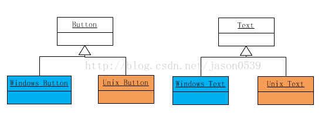
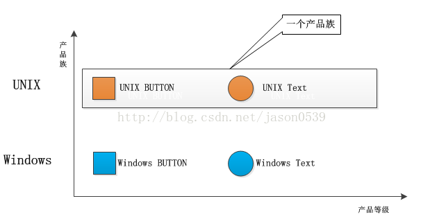
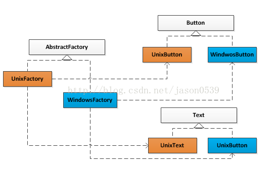

资料来源：<br/>
[JAVA设计模式之抽象工厂模式](https://blog.csdn.net/jason0539/article/details/44976775)

## JAVA设计模式之抽象工厂模式

#### 例子背景：

随着客户的要求越来越高，宝马车需要不同配置的空调和发动机等配件。于是这个工厂开始生产空调和发动机，用来组装汽车。这时候工厂有两个系列的产品:空调和发动机。 宝马320系列配置A型号空调和A型号发动机，宝马230系列配置B型号空调和B型号发动机。

**概念：**
   抽象工厂模式是工厂方法模式的升级版本，他用来创建一组相关或者相互依赖的对象。比如宝马320系列使用空调型号A和发动机型号A，而宝马230系列使用空调型号B和发动机型号B，那么使用抽象工厂模式，在为320系列生产相关配件时，就无需制定配件的型号，它会自动根据车型生产对应的配件型号A。

针对百度百科上对于抽象工厂模式的简介，结合本例如下：

当每个抽象产品都有多于一个的具体子类的时候（空调有型号A和B两种，发动机也有型号A和B两种），工厂角色怎么知道实例化哪一个子类呢？比如每个抽象产品角色都有两个具体产品（产品空调有两个具体产品空调A和空调B）。抽象工厂模式提供两个具体工厂角色（宝马320系列工厂和宝马230系列工厂），分别对应于这两个具体产品角色，每一个具体工厂角色只负责某一个产品角色的实例化。每一个具体工厂类只负责创建抽象产品的某一个具体子类的实例。


### 抽象工厂模式代码

产品类： 

```java
//发动机以及型号  
public interface Engine {  
 
}  
public class EngineA extends Engine{  
    public EngineA(){  
        System.out.println("制造-->EngineA");  
    }  
}  
public class EngineBextends Engine{  
    public EngineB(){  
        System.out.println("制造-->EngineB");  
    }  
}  
 
//空调以及型号  
public interface Aircondition {  
 
}  
public class AirconditionA extends Aircondition{  
    public AirconditionA(){  
        System.out.println("制造-->AirconditionA");  
    }  
}  
public class AirconditionB extends Aircondition{  
    public AirconditionB(){  
        System.out.println("制造-->AirconditionB");  
    }  
} 
```

创建工厂类：

```java
//创建工厂的接口  
public interface AbstractFactory {  
    //制造发动机
    public Engine createEngine();
    //制造空调 
    public Aircondition createAircondition(); 
}  
 
 
//为宝马320系列生产配件  
public class FactoryBMW320 implements AbstractFactory{  
      
    @Override  
    public Engine createEngine() {    
        return new EngineA();  
    }  
    @Override  
    public Aircondition createAircondition() {  
        return new AirconditionA();  
    }  
}  
//宝马523系列
public class FactoryBMW523 implements AbstractFactory {  
  
     @Override  
    public Engine createEngine() {    
        return new EngineB();  
    }  
    @Override  
    public Aircondition createAircondition() {  
        return new AirconditionB();  
    }  
 
} 
```

客户:

```java
public class Customer {  
    public static void main(String[] args){  
        //生产宝马320系列配件
        FactoryBMW320 factoryBMW320 = new FactoryBMW320();  
        factoryBMW320.createEngine();
        factoryBMW320.createAircondition();
          
        //生产宝马523系列配件  
        FactoryBMW523 factoryBMW523 = new FactoryBMW523();  
        factoryBMW320.createEngine();
        factoryBMW320.createAircondition();
    }  
}
```

关于抽象工厂模式与工厂方法模式的区别，这里就不说了，感觉多看几遍例子就能理解，还有很多提到的产品族、等级结构等概念，说了反而更难理解。

### 抽象工厂模式的起源

下面引用一段[抽象工厂模式](http://www.cnblogs.com/java-my-life/archive/2012/03/28/2418836.html)的起源：

抽象工厂模式的起源或者最早的应用，是用于创建分属于不同操作系统的视窗构建。比如：命令按键（Button）与文字框（Text)都是视窗构建，在UNIX操作系统的视窗环境和Windows操作系统的视窗环境中，这两个构建有不同的本地实现，它们的细节有所不同。
在每一个操作系统中，都有一个视窗构建组成的构建家族。在这里就是Button和Text组成的产品族。而每一个视窗构件都构成自己的等级结构，由一个抽象角色给出抽象的功能描述，而由具体子类给出不同操作系统下的具体实现。



可以发现在上面的产品类图中，有两个产品的等级结构，分别是Button等级结构和Text等级结构。同时有两个产品族，也就是UNIX产品族和Windows产品族。UNIX产品族由UNIX Button和UNIX Text产品构成；而Windows产品族由Windows Button和Windows Text产品构成。



系统对产品对象的创建需求由一个工程的等级结构满足，其中有两个具体工程角色，即UnixFactory和WindowsFactory。UnixFactory对象负责创建Unix产品族中的产品，而WindowsFactory对象负责创建Windows产品族中的产品。这就是抽象工厂模式的应用，抽象工厂模式的解决方案如下图：



显然，一个系统只能够在某一个操作系统的视窗环境下运行，而不能同时在不同的操作系统上运行。所以，系统实际上只能消费属于同一个产品族的产品。
在现代的应用中，抽象工厂模式的使用范围已经大大扩大了，不再要求系统只能消费某一个产品族了。

### 总结：

无论是简单工厂模式，工厂方法模式，还是抽象工厂模式，他们都属于工厂模式，在形式和特点上也是极为相似的，他们的最终目的都是为了解耦。在使用时，我们不必去在意这个模式到底工厂方法模式还是抽象工厂模式，因为他们之间的演变常常是令人琢磨不透的。经常你会发现，明明使用的工厂方法模式，当新需求来临，稍加修改，加入了一个新方法后，由于类中的产品构成了不同等级结构中的产品族，它就变成抽象工厂模式了；而对于抽象工厂模式，当减少一个方法使的提供的产品不再构成产品族之后，它就演变成了工厂方法模式。
所以，在使用工厂模式时，只需要关心降低耦合度的目的是否达到了。