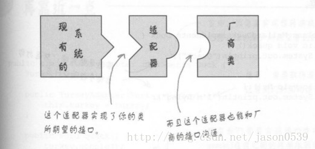
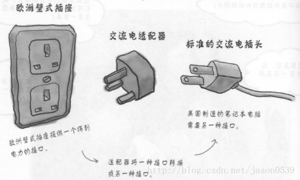
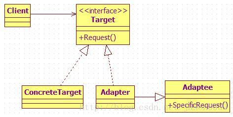
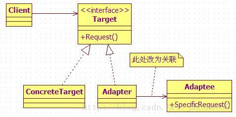

资料来源：<br/>
[JAVA设计模式初探之适配器模式](https://blog.csdn.net/jason0539/article/details/22468457)

## 适配器模式

1. 概述

将一个类的接口转换成客户希望的另外一个接口。Adapter模式使得原本由于接口不兼容而不能一起工作的那些类可以在一起工作。

2. 解决的问题

即Adapter模式使得原本由于接口不兼容而不能一起工作的那些类可以在一起工作。

下面是两个非常形象的例子





3. 模式中的角色

　　3.1 目标接口（Target）：客户所期待的接口。目标可以是具体的或抽象的类，也可以是接口。

　　3.2 需要适配的类（Adaptee）：需要适配的类或适配者类。

　　3.3 适配器（Adapter）：通过包装一个需要适配的对象，把原接口转换成目标接口。　　

4. 实现方式

　　（1）类的[适配器模式](https://so.csdn.net/so/search?q=适配器模式&spm=1001.2101.3001.7020)（采用继承实现）

　　（2）对象适配器（采用对象组合方式实现）

适配器模式的类图



一。类的适配器模式

```java
// 已存在的、具有特殊功能、但不符合我们既有的标准接口的类
class Adaptee {
	public void specificRequest() {
		System.out.println("被适配类具有 特殊功能...");
	}
}
 
// 目标接口，或称为标准接口
interface Target {
	public void request();
}
 
// 具体目标类，只提供普通功能
class ConcreteTarget implements Target {
	public void request() {
		System.out.println("普通类 具有 普通功能...");
	}
}
 
// 适配器类，继承了被适配类，同时实现标准接口
class Adapter extends Adaptee implements Target{
	public void request() {
		super.specificRequest();
	}
}
 
// 测试类public class Client {
	public static void main(String[] args) {
		// 使用普通功能类
		Target concreteTarget = new ConcreteTarget();
		concreteTarget.request();
		
		// 使用特殊功能类，即适配类
		Target adapter = new Adapter();
		adapter.request();
	}
}
```

测试结果：

```java
普通类 具有 普通功能...
被适配类具有 特殊功能...
```

上面这种实现的适配器称为类适配器，因为 Adapter 类既继承了 Adaptee （被适配类），也实现了 Target 接口（因为 Java 不支持多继承，所以这样来实现），在 Client 类中我们可以根据需要选择并创建任一种符合需求的子类，来实现具体功能。另外一种适配器模式是对象适配器，它不是使用多继承或继承再实现的方式，而是使用直接关联，或者称为委托的方式，类图如下：




代码如下：

```java
// 适配器类，直接关联被适配类，同时实现标准接口
class Adapter implements Target{
	// 直接关联被适配类
	private Adaptee adaptee;
	
	// 可以通过构造函数传入具体需要适配的被适配类对象
	public Adapter (Adaptee adaptee) {
		this.adaptee = adaptee;
	}
	
	public void request() {
		// 这里是使用委托的方式完成特殊功能
		this.adaptee.specificRequest();
	}
}
 
// 测试类
public class Client {
	public static void main(String[] args) {
		// 使用普通功能类
		Target concreteTarget = new ConcreteTarget();
		concreteTarget.request();
		
		// 使用特殊功能类，即适配类，
		// 需要先创建一个被适配类的对象作为参数
		Target adapter = new Adapter(new Adaptee());
		adapter.request();
	}
}
```

测试结果与上面的一致。从类图中我们也知道需要修改的只不过就是 Adapter 类的内部结构，即 Adapter 自身必须先拥有一个被适配类的对象，再把具体的特殊功能委托给这个对象来实现。使用对象适配器模式，可以使得 Adapter 类（适配类）根据传入的 Adaptee 对象达到适配多个不同被适配类的功能，当然，此时我们可以为多个被适配类提取出一个接口或抽象类。这样看起来的话，似乎对象适配器模式更加灵活一点。

5. 模式总结

　　5.1 优点

　　　　5.1.1 通过适配器，客户端可以调用同一接口，因而对客户端来说是透明的。这样做更简单、更直接、更紧凑。

　　　　5.1.2 复用了现存的类，解决了现存类和复用环境要求不一致的问题。

　　　　5.1.3 将目标类和适配者类解耦，通过引入一个适配器类重用现有的适配者类，而无需修改原有代码。

　　　　5.1.4 一个对象适配器可以把多个不同的适配者类适配到同一个目标，也就是说，同一个适配器可以把适配者类和它的子类都适配到目标接口。

　　5.2 缺点

　　　　对于对象适配器来说，更换适配器的实现过程比较复杂。

　　5.3 适用场景

　　　　5.3.1 系统需要使用现有的类，而这些类的接口不符合系统的接口。

　　　　5.3.2 想要建立一个可以重用的类，用于与一些彼此之间没有太大关联的一些类，包括一些可能在将来引进的类一起工作。

　　　　5.3.3 两个类所做的事情相同或相似，但是具有不同接口的时候。

　　　　5.3.4 旧的系统开发的类已经实现了一些功能，但是客户端却只能以另外接口的形式访问，但我们不希望手动更改原有类的时候。

　　　　5.3.5 使用第三方组件，组件接口定义和自己定义的不同，不希望修改自己的接口，但是要使用第三方组件接口的功能。

6. 适配器应用举例

　　6.1 使用过ADO.NET的开发人员应该都用过DataAdapter，它就是用作DataSet和数据源之间的适配器。DataAdapter通过映射Fill和Update来提供这一适配器。

　　6.2 手机电源适配器
